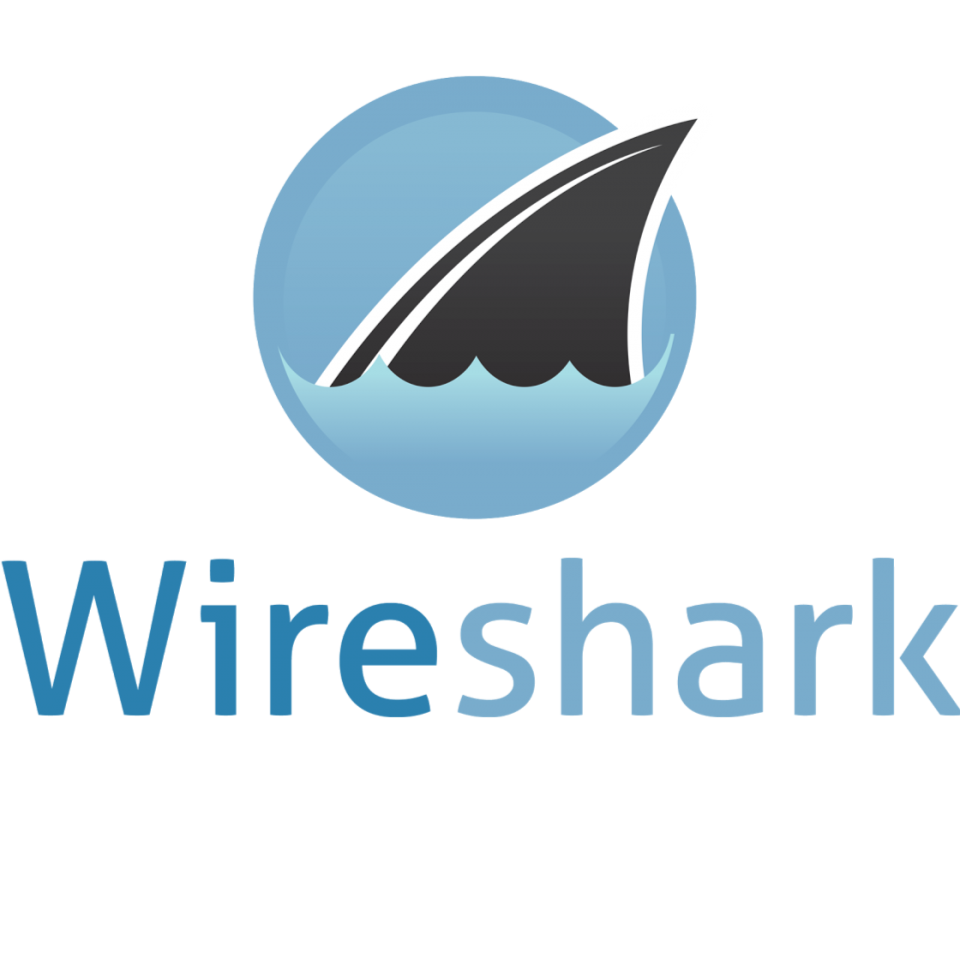
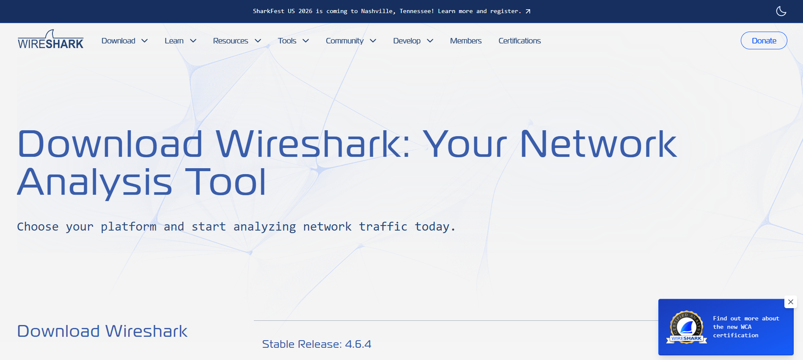
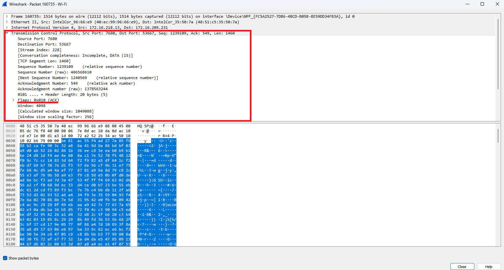

# Lab: Analyzing TCP and UDP Traffic with Wireshark

**Estimated time:** 30 minutes

---

## Learning Objectives

After completing this lab you'll be able to analyze TCP and UDP network traffic. You'll also be able to demonstrate the skills needed to install, configure, and use an open-source network analysis tool, Wireshark, to perform these tasks.

---

## Tools Needed

**Wireshark**, a no-charge open-source network analysis tool, installed on your computer.

**Note:** Wireshark is available for macOS as well as for Microsoft Windows. This lab uses the Windows version of this application.

---

## Instructions for Downloading and Installing Wireshark

Before you begin your network analysis lab tasks, you'll need to install and configure Wireshark on your local computer system.

### Downloading Wireshark

1. Visit the official Wireshark website: **https://www.wireshark.org/download.html**
2. Select the Windows installer (or appropriate version for your operating system) to download the latest stable version of Wireshark

![Wireshark download page]

### Installing Wireshark

1. Locate the installer on your machine
2. Click the installer and follow the on-screen instructions, accepting the default options
3. During the installation, you might be prompted to install **WinPcap** or **Npcap** (necessary for capturing network traffic). If so, choose **Yes** and complete the installation

**Important:** If running Wireshark in a virtual environment, do not reboot or restart the environment.

---

## Configuring Wireshark for Network Analysis

If Wireshark is not already running, right-click on the Wireshark icon and select **Run as Administrator**.

### Set Up Your Network Interfaces

1. Upon launching Wireshark, the application displays a list of available network interfaces including wireless and Ethernet networks
2. Select the interface you want to monitor. Typically, this interface will be your active network connection such as your wireless or Ethernet network

![Wireshark interface list]

### Configure Capture Filters (Optional)

Before starting a capture, you can set up filters to focus on specific traffic such as `tcp`, `udp`, or specific ports.

To add filters, locate the **Capture Filter** field on the main screen, or after starting the capture, you can enter filters in the **Display Filter** bar.

### Testing the Installation

1. Start a new capture by selecting your network interface and clicking the **blue shark fin icon** (Start Capture)
2. Open a web browser and visit any website to generate traffic
3. Stop the capture after a few seconds by clicking the **red square icon** (Stop Capture)
4. You should see the captured packets displayed in Wireshark, confirming that the installation is working correctly

![Wireshark capture window showing packets]

### Saving Your Capture (Optional)

After stopping the capture, you can save the capture file for later analysis by selecting **File > Save As...** and selecting a location on your system.

Now that you've installed and configured Wireshark, you're ready to begin the lab exercises!

---

## Exercise 1: Capture TCP Traffic

In this exercise, you will capture and analyze TCP traffic, focusing on the TCP three-way handshake and packet headers.

### Step 1: Start Wireshark as Administrator

1. Right-click the Wireshark icon
2. Select **Run as Administrator**
3. If prompted, confirm the administrator privileges

![Run as Administrator option]

### Step 2: Select Network Interface and Start Capture

1. From the list of available network interfaces, select your active network connection (Wi-Fi or Ethernet)
2. Click the **blue shark fin icon** (Start Capture) to begin capturing packets

![Start capture button]

### Step 3: Apply TCP Filter

1. In the **Display Filter** bar (above the packet list), type `tcp`
2. Press **Enter** to apply the filter

![TCP filter in display filter bar]

### Step 4: Generate TCP Traffic

1. Open a web browser (Chrome, Firefox, Edge, etc.)
2. Navigate to a website, such as: **https://www.ibm.com**
3. Allow the website to load completely

![IBM website loaded]

### Step 5: Stop the Capture

1. After the website has loaded, return to Wireshark
2. Click the **red square icon** (Stop Capture) to stop capturing packets

![Stop capture button]

### Step 6: Identify TCP Three-Way Handshake Packets

The **TCP three-way handshake** establishes a connection between client and server:

| Step        | Packet Type | Direction        | Description                            |
| :---------- | :---------- | :--------------- | :------------------------------------- |
| **1** | SYN         | Client → Server | Client requests connection             |
| **2** | SYN-ACK     | Server → Client | Server acknowledges and accepts        |
| **3** | ACK         | Client → Server | Client confirms connection established |

**How to find the handshake:**

1. Look at the **Info** column in the packet list
2. Find packets with:
   - `[SYN]` flag
   - `[SYN, ACK]` flags
   - `[ACK]` flag (after SYN,ACK)

![TCP three-way handshake packets]

### Step 7: Examine TCP Header Details

1. Select a packet with `[SYN]` flag (first packet of handshake)
2. Expand the **Transmission Control Protocol (TCP)** section in the packet details pane

**Examine the following TCP header fields:**

| Field                           | Location   | What to Look For                           |
| :------------------------------ | :--------- | :----------------------------------------- |
| **Source Port**           | TCP header | Typically a high random port (e.g., 54321) |
| **Destination Port**      | TCP header | Usually 80 (HTTP) or 443 (HTTPS)           |
| **Sequence Number**       | TCP header | Random number for first SYN                |
| **Acknowledgment Number** | TCP header | Present in ACK packets                     |
| **Flags**                 | TCP header | SYN, ACK, FIN, RST, etc.                   |

![TCP header details]

### Step 8: Take Screenshot

1. Take a screenshot showing:
   - The captured TCP packets (SYN, SYN-ACK, ACK)
   - The expanded TCP header showing sequence numbers and flags

Save the file as `Wireshark_TCP_Handshake.png`

---

## Exercise 2: Capture UDP Traffic

In this exercise, you will capture and analyze UDP traffic, which is connectionless and does not use a handshake.

### Step 1: Start a New Capture

1. Clear the previous capture by starting a new session
2. Click the **blue shark fin icon** to start a new capture
3. In the **Display Filter** bar, type `udp` and press **Enter**

![UDP filter applied]

### Step 2: Generate UDP Traffic

UDP traffic can be generated by:

| Activity                    | UDP Protocol | Typical Port |
| :-------------------------- | :----------- | :----------- |
| **DNS Lookup**        | DNS          | 53           |
| **Video Streaming**   | RTP, RTSP    | Various      |
| **Voice/Video Calls** | SIP, RTP     | Various      |
| **Network Time**      | NTP          | 123          |
| **DHCP**              | DHCP         | 67, 68       |

**To generate DNS traffic (common UDP):**

1. Open a web browser
2. Visit any website (this triggers DNS lookups)

**To generate more UDP traffic:**

1. Open Command Prompt (cmd)
2. Run: `nslookup google.com`
3. Run: `ping -n 1 google.com`

![Command prompt generating DNS traffic]

### Step 3: Stop the Capture

1. After generating traffic, stop the capture by clicking the **red square icon**

### Step 4: Analyze UDP Packets

Look for UDP packets in the packet list:

| Field                      | What to Look For                           |
| :------------------------- | :----------------------------------------- |
| **Protocol**         | UDP (instead of TCP)                       |
| **Source Port**      | Often high random port or 53 (DNS)         |
| **Destination Port** | 53 (DNS), 123 (NTP), 67/68 (DHCP)          |
| **Length**           | UDP packets are typically smaller than TCP |

![UDP packets in Wireshark]

### Step 5: Examine UDP Header Details

1. Select a UDP packet in the packet list
2. Expand the **User Datagram Protocol (UDP)** section in the packet details pane

**UDP header fields:**

| Field                      | Description                 |
| :------------------------- | :-------------------------- |
| **Source Port**      | Sending application port    |
| **Destination Port** | Receiving application port  |
| **Length**           | Length of UDP header + data |
| **Checksum**         | Error detection (optional)  |

**Key Difference from TCP:** UDP has **no sequence numbers, no acknowledgment numbers, and no flags** – reflecting its connectionless nature.

![UDP header details]

### Step 6: Compare TCP vs UDP

| Feature                    | TCP                              | UDP                  |
| :------------------------- | :------------------------------- | :------------------- |
| **Connection**       | Connection-oriented (handshake)  | Connectionless       |
| **Reliability**      | Reliable (ACKs, retransmissions) | Unreliable (no ACKs) |
| **Header Size**      | 20-60 bytes                      | 8 bytes              |
| **Sequence Numbers** | Yes                              | No                   |
| **Acknowledgment**   | Yes                              | No                   |
| **Flow Control**     | Yes                              | No                   |
| **Use Cases**        | Web, email, file transfer        | DNS, streaming, VoIP |

### Step 7: Take Screenshot

1. Take a screenshot showing:
   - Captured UDP packets
   - Expanded UDP header showing source/destination ports and length

Save the file as `Wireshark_UDP.png`

## Exercise 3: Analyze Specific Port Traffic

In this exercise, you will filter traffic by specific ports to focus on particular services.

### Step 1: Filter HTTP Traffic (Port 80)

1. Start a new capture
2. Visit an HTTP website (not HTTPS) – you can use: **http://neverssl.com** (a site designed for testing)
3. Apply display filter: `tcp.port == 80`

![HTTP filter applied]

### Step 2: Filter HTTPS Traffic (Port 443)

1. Start a new capture
2. Visit **https://www.ibm.com**
3. Apply display filter: `tcp.port == 443`

![HTTPS filter applied]

### Step 3: Filter DNS Traffic (Port 53)

1. Start a new capture
2. Generate DNS traffic with: `nslookup google.com`
3. Apply display filter: `udp.port == 53`

![DNS filter applied]

### Step 4: Filter by IP Address

To see traffic to/from a specific IP:

1. Find the IP address of a website (use ping or nslookup)
2. Apply filter: `ip.addr == 192.168.1.100` (replace with actual IP)

**Common IP filters:**

| Filter                      | Purpose                         |
| :-------------------------- | :------------------------------ |
| `ip.src == 192.168.1.100` | Traffic from specific source    |
| `ip.dst == 8.8.8.8`       | Traffic to specific destination |
| `ip.addr == 192.168.1.1`  | Traffic to/from IP              |

---

## Exercise 4: Capture and Analyze TCP Flags

In this exercise, you will examine TCP flags used for connection management.

### Step 1: Capture Complete Web Session

1. Start a new capture
2. Apply filter: `tcp`
3. Visit a website and let it load completely
4. Close the browser tab
5. Stop the capture

### Step 2: Identify Different TCP Flags

Look for packets with different flags:

| Flag              | Purpose          | How to Identify                         |
| :---------------- | :--------------- | :-------------------------------------- |
| **SYN**     | Start connection | Packet with `[SYN]` in Info column    |
| **SYN-ACK** | Acknowledge SYN  | Packet with `[SYN, ACK]`              |
| **ACK**     | Acknowledge data | Packet with `[ACK]`                   |
| **PSH**     | Push data        | Packet with `[PSH, ACK]`              |
| **FIN**     | Graceful close   | Packet with `[FIN, ACK]`              |
| **RST**     | Reset connection | Packet with `[RST]` or `[RST, ACK]` |

![TCP flags in Wireshark]

### Step 3: Examine TCP Stream

To follow the entire conversation:

1. Right-click on any packet in a TCP conversation
2. Select **Follow > TCP Stream**

![Follow TCP Stream option]

This shows the complete data exchange between client and server.

![TCP stream window]

### Step 4: Close the Stream Window

1. Click **Close** to return to the main Wireshark window

---

## Exercise 5: Save and Export Capture (Optional)

### Step 1: Save the Capture

1. Click **File > Save As...**
2. Choose a location (e.g., Desktop)
3. Name the file: `TCP_UDP_Capture.pcapng`
4. Click **Save**

### Step 2: Export as CSV (for analysis)

1. Click **File > Export Packet Dissections > As CSV...**
2. Choose location and save

---

## Lab Completion Checklist

| Task                                           | Completed |
| :--------------------------------------------- | :-------- |
| Installed Wireshark                            | ☐        |
| Launched Wireshark as Administrator            | ☐        |
| Selected network interface and started capture | ☐        |
| Applied TCP filter                             | ☐        |
| Generated TCP traffic by visiting a website    | ☐        |
| Identified TCP three-way handshake packets     | ☐        |
| Examined TCP header (sequence numbers, flags)  | ☐        |
| Took screenshot of TCP handshake               | ☐        |
| Started new capture and applied UDP filter     | ☐        |
| Generated UDP traffic (DNS, ping)              | ☐        |
| Identified UDP packets                         | ☐        |
| Examined UDP header (no sequence numbers)      | ☐        |
| Took screenshot of UDP packets                 | ☐        |
| Filtered by port (80, 443, 53)                 | ☐        |
| Identified TCP flags (SYN, ACK, FIN, etc.)     | ☐        |
| Followed TCP stream                            | ☐        |

---

## Screenshot Checklist

| Screenshot            | File Name                       | Description                               |
| :-------------------- | :------------------------------ | :---------------------------------------- |
| TCP Handshake         | `Wireshark_TCP_Handshake.png` | SYN, SYN-ACK, ACK packets with TCP header |
| UDP Traffic           | `Wireshark_UDP.png`           | UDP packets with UDP header details       |
| Optional: TCP Flags   | `Wireshark_TCP_Flags.png`     | Different TCP flags in session            |
| Optional: Port Filter | `Wireshark_Port_Filter.png`   | Filtered traffic by specific port         |

---

## Troubleshooting Tips

| Issue                                 | Solution                                                 |
| :------------------------------------ | :------------------------------------------------------- |
| **No network interfaces shown** | Run Wireshark as Administrator                           |
| **No packets captured**         | Ensure you selected correct interface; generate traffic  |
| **Cannot find TCP handshake**   | Filter `tcp` and look for first packets to destination |
| **No UDP traffic**              | Generate DNS traffic with `nslookup` or visit websites |
| **Captures stop unexpectedly**  | Check disk space; save capture file                      |
| **Too many packets**            | Use display filters to narrow down                       |

---

## Common Display Filters

| Filter                     | Purpose                          |
| :------------------------- | :------------------------------- |
| `tcp`                    | Show only TCP packets            |
| `udp`                    | Show only UDP packets            |
| `tcp.port == 443`        | Show HTTPS traffic only          |
| `udp.port == 53`         | Show DNS traffic only            |
| `ip.addr == 192.168.1.1` | Show traffic to/from specific IP |
| `tcp.flags.syn == 1`     | Show only SYN packets            |
| `tcp.flags.fin == 1`     | Show only FIN packets            |
| `tcp.flags.reset == 1`   | Show only RST packets            |

---

<video controls src="Analyzing TCP and UDP Traffic with Wireshark.mp4" title="Analyzing TCP and UDP Traffic with Wireshark"></video>

## Key Takeaways

| Concept                           | Description                                              |
| :-------------------------------- | :------------------------------------------------------- |
| **TCP Three-Way Handshake** | SYN → SYN-ACK → ACK establishes reliable connection    |
| **TCP Flags**               | SYN (start), ACK (acknowledge), FIN (close), RST (reset) |
| **UDP**                     | Connectionless, no handshake, no sequence numbers        |
| **TCP Header**              | Contains sequence numbers, acknowledgments, flags, ports |
| **UDP Header**              | Contains only source/destination ports, length, checksum |
| **Wireshark Filters**       | Narrow traffic by protocol, port, IP, or flags           |
| **Follow TCP Stream**       | View entire conversation between endpoints               |

---

## Summary

In this hands-on lab, you have:

| Activity                                                 | Completed |
| :------------------------------------------------------- | :-------- |
| Installed Wireshark                                      | ✓        |
| Launched Wireshark as Administrator                      | ✓        |
| Captured TCP traffic from web browsing                   | ✓        |
| Identified TCP three-way handshake (SYN, SYN-ACK, ACK)   | ✓        |
| Examined TCP header (sequence numbers, flags, ports)     | ✓        |
| Captured UDP traffic (DNS, NTP, etc.)                    | ✓        |
| Examined UDP header (ports, length, no sequence numbers) | ✓        |
| Applied display filters (tcp, udp, port filters)         | ✓        |
| Followed TCP stream to view conversation                 | ✓        |
| Compared TCP and UDP characteristics                     | ✓        |
| Saved capture file for later analysis                    | ✓        |

---

## Congratulations!

You have successfully completed the **Analyzing TCP and UDP Traffic with Wireshark** lab. You now know how to:

- Install and configure Wireshark
- Capture and filter TCP and UDP network traffic
- Identify the TCP three-way handshake
- Examine TCP and UDP header details
- Use display filters to focus on specific traffic
- Follow TCP streams to analyze conversations

These skills are essential for network troubleshooting, security analysis, and understanding fundamental networking protocols.
