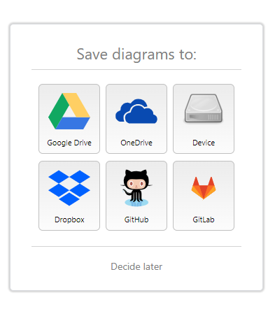

# Lab: Designing a Basic Network Structure

**Estimated time:** 30 minutes

---

## Learning Objective

This lab introduces you to designing a basic network structure for a small organization using the drawing tool (Draw.io). The focus will be on understanding and placing essential network hardware components like routers, switches, and user devices.

---

## Important Notices about This Lab

### About Lab Sessions

Lab sessions are **not persisted**. This means that every time you connect to this lab, a new environment is created for you. Any data or files you saved in a previous session are no longer available. To avoid losing your data, plan to complete these tasks in a single session.

### Materials Needed

- Internet browser
- Access to https://app.diagrams.net/ (Draw.io)
- Ability to save files to your local system or cloud storage

---

## Step 1: Introduction to Basic Network Hardware

Before designing your network, review the basic network components of a small organizational setup.

### Essential Network Components

| Component                         | Function                                                                                                                       | Icon                 |
| :-------------------------------- | :----------------------------------------------------------------------------------------------------------------------------- | :------------------- |
| **Router**                  | Connects the organization's network to the internet; routes traffic between networks; typically provides DHCP and NAT services | 🔵 Router icon       |
| **Switch**                  | Connects multiple devices within the local network; forwards data between devices on the same network                          | 🟢 Switch icon       |
| **User Devices**            | End-user equipment such as desktops, laptops, printers, and other network-connected devices                                    | 💻 PC/Laptop icon    |
| **Firewall** (Optional)     | Security device that filters incoming and outgoing traffic based on security rules                                             | 🔥 Firewall icon     |
| **Access Point** (Optional) | Provides wireless connectivity for Wi-Fi devices                                                                               | 📡 Access Point icon |

### Understanding the Network Hierarchy

```
Internet
   │
   ▼
┌─────────┐
│ Router  │  ←─ Connects to internet; provides gateway to local network
└─────────┘
   │
   ▼
┌─────────┐
│ Switch  │  ←─ Distributes network connectivity to devices
└─────────┘
   │
   ├──────────┬──────────┬──────────┐
   ▼          ▼          ▼          ▼
┌─────┐   ┌─────┐   ┌─────┐   ┌─────┐
│ PC  │   │ PC  │   │Laptop│  │Printer│
└─────┘   └─────┘   └─────┘   └─────┘
```

**Note:** The firewall and access point are optional components that may be included in more complex network designs.


---

## Step 2: Getting Started with Draw.io

### Task 1: Open Draw.io and Start a New Blank Diagram

#### Step 1: Open Draw.io

1. Open your web browser
2. Navigate to **https://app.diagrams.net/**
3. You will be prompted to select where to save your diagram

![Draw.io homepage with storage options]



**Storage options:**

- **Device** - Save to your local computer
- **Google Drive** - Save to your Google account
- **OneDrive** - Save to Microsoft OneDrive
- **GitHub** - Save to GitHub repository

For this lab, select **Device** to save locally.

#### Step 2: Create New Diagram

1. After selecting storage location, click **Create New Diagram**

![Create New Diagram button]


1. In the dialog that appears:

| Field              | Value                            |
| :----------------- | :------------------------------- |
| **Filename** | Basic Network Design             |
| **Template** | Blank Diagram (or Blank Drawing) |

3. Click **Create**

![Create New Diagram dialog]


#### Step 3: Familiarize Yourself with the Interface

The Draw.io interface consists of several key areas:

| Area                               | Description                                                      |
| :--------------------------------- | :--------------------------------------------------------------- |
| **Shape Library (Left)**     | Contains shapes organized by categories (General, Network, etc.) |
| **Drawing Canvas (Center)**  | Main workspace where you create your diagram                     |
| **Toolbar (Top)**            | Tools for formatting, adding shapes, text, and connectors        |
| **Properties Panel (Right)** | Formatting options for selected shapes                           |
| **Outline (Bottom Right)**   | Miniature view of entire diagram                                 |

![Draw.io interface overview]

#### Step 4: Locate Networking Shapes

1. In the left shape library, click the **+** icon or scroll through categories
2. Find and expand the **Network** category
3. You can also use the **Search Shape** bar at the top of the shape library

![Shape library with Network category]


---

## Step 3: Designing the Basic Network Layout

### Task 1: Add the Router

The router serves as the gateway connecting your organization's network to the internet.

#### Step 1: Find and Select the Router Shape

1. In the shape library, type **router** in the search bar
2. Or browse the **Network** category for router icons

![Searching for router shape]


Common router shape names:

- **Router**
- **Cloud** (representing internet)
- **Gateway**

#### Step 2: Add Router to Canvas

1. Click and drag the router shape to the drawing canvas
2. Place it near the **top** of the canvas (representing connection to internet)
3. Resize if necessary by clicking and dragging the corners

![Router placed on canvas]


#### Step 3: Label the Router

1. Double-click on the router shape
2. Type: **Router**
3. Press **Enter** to apply

![Router with label]

---

### Task 2: Add the Switch

The switch connects multiple devices within the local network.

#### Step 1: Find and Select the Switch Shape

1. Search for **switch** in the shape library
2. Common switch shape names:
   - **Switch**
   - **Network Switch**
   - **Ethernet Switch**

![Searching for switch shape]


#### Step 2: Add Switch to Canvas

1. Drag the switch shape below the router
2. Position it so there is space for connecting lines

![Switch placed below router]


#### Step 3: Label the Switch

1. Double-click on the switch
2. Type: **Switch**
3. Press **Enter**

---

### Task 3: Connect Router to Switch

Now, connect the router and switch to show network flow.

#### Step 1: Select Connector Tool

1. Click the **Connector** tool in the toolbar (looks like a line with an arrow)
2. Or select the **Line** shape from the **General** shape library

![Connector tool in toolbar]


#### Step 2: Draw the Connection

1. Click on the router
2. Drag to the switch
3. Release to create a connection line

![Router connected to switch]


#### Step 3: Format the Connection

1. Click on the connector line to select it
2. Use the properties panel on the right to adjust:
   - **Line color** - Usually black or blue
   - **Line thickness** - 1-2 px
   - **Line style** - Solid (or dashed for wireless)

---

### Task 4: Add User Devices

Add the devices that employees will use.

#### Step 1: Find PC/Laptop Shapes

1. Search for **computer** or **pc** in the shape library
2. Common shapes:
   - **PC** - Desktop computer
   - **Laptop** - Portable computer
   - **Printer** - Network printer

![Searching for computer shapes]


#### Step 2: Add Multiple Devices

Add the following devices below the switch:

| Device     | Quantity |
| :--------- | :------- |
| Desktop PC | 2-3      |
| Laptop     | 1        |
| Printer    | 1        |

**Tips:**

- To duplicate a shape: Select it, then press **Ctrl+D** (Cmd+D on Mac)
- Or copy (Ctrl+C) and paste (Ctrl+V)

![Multiple devices placed on canvas]


#### Step 3: Label Each Device

Label each device with a descriptive name:

| Device    | Label                     |
| :-------- | :------------------------ |
| Desktop 1 | **Accounting PC**   |
| Desktop 2 | **HR PC**           |
| Desktop 3 | **IT PC**           |
| Laptop    | **Sales Laptop**    |
| Printer   | **Network Printer** |

---

### Task 5: Connect Devices to Switch

Connect each device to the switch.

#### Step 1: Use Connector Tool

1. Select the **Connector** tool
2. Click on the switch
3. Drag to the first PC
4. Release

![Connecting PC to switch]

#### Step 2: Connect All Devices

Repeat for each device, connecting them all to the switch.

#### Step 3: Arrange Connectors

For a clean look:

- Position devices in a row below the switch
- Use straight lines for connections
- Avoid crossing lines where possible

![All devices connected to switch]


---

## Step 4: Enhanced Network Design (Optional)

For a more complete network design, consider adding additional components.

### Optional Components

| Component                             | Purpose                            | Placement                 |
| :------------------------------------ | :--------------------------------- | :------------------------ |
| **Firewall**                    | Security between router and switch | Between router and switch |
| **Wireless Access Point (WAP)** | Wi-Fi connectivity                 | Connected to switch       |
| **Server**                      | File, print, or application server | Connected to switch       |
| **Cloud/Internet**              | Representation of external network | Connected to router       |

### Adding a Firewall

1. Search for **firewall** in shape library
2. Place between router and switch
3. Connect: Router → Firewall → Switch

![Firewall added to design]

### Adding a Wireless Access Point

1. Search for **access point** or **wireless**
2. Place near the user devices
3. Connect to switch
4. Add dotted/dashed lines to represent wireless connections

![Wireless access point added]

### Adding a Server

1. Search for **server** in shape library
2. Place near the switch
3. Connect directly to switch

![Server added to design]

---

## Step 5: Format and Finalize

### Task 1: Add a Title

1. Click the **Text** tool in the toolbar (or press **T**)
2. Click at the top of the canvas
3. Type: **Basic Network Design - [Your Organization Name]**

![Title added to diagram]

### Task 2: Add a Legend (Optional)

1. Add a small text box with icons and labels explaining network symbols
2. Include:
   - Router icon with label
   - Switch icon with label
   - PC icon with label
   - Connector line with label (Ethernet)

### Task 3: Add Color Coding (Optional)

Use colors to differentiate device types:

| Device Type | Suggested Color |
| :---------- | :-------------- |
| Router      | Red outline     |
| Firewall    | Orange outline  |
| Switch      | Green outline   |
| Servers     | Purple outline  |
| End Devices | Blue outline    |
| Printer     | Gray outline    |

### Task 4: Check Connections

Ensure all connections are properly made:

- Router → (Firewall) → Switch
- Switch → Each PC, Laptop, Printer
- Switch → Wireless Access Point (if added)
- Switch → Server (if added)

---

## Step 6: Save and Export

### Task 1: Save Your Diagram

1. Click **File** → **Save** (or press **Ctrl+S**)
2. Ensure the filename is **Basic Network Design**
3. Click **Save**

### Task 2: Export as Image

1. Click **File** → **Export As** → **PNG** (or JPEG/PDF)
2. Adjust export settings:
   - **Zoom** - 100%
   - **Border** - 10px
   - **Transparent Background** - Optional
3. Click **Export**
4. Choose location to save the image
5. Save as: **Basic_Network_Design.png**

![Export options]

### Task 3: Take Screenshot for Lab Submission

If you need to submit screenshots for your lab:

1. Use Snipping Tool (Windows) or Screenshot tool (macOS)
2. Capture the entire diagram
3. Save as `Network_Design_Diagram.png`

---

## Example: Complete Basic Network Design

Here's what your completed diagram should resemble:

```
┌─────────────────────────────────────────────────────────────────┐
│                    Basic Network Design - Cyber Secure Inc.      │
├─────────────────────────────────────────────────────────────────┤
│                                                                  │
│                          ┌─────────┐                            │
│                          │  Router │                            │
│                          │ 192.168.1.1                         │
│                          └────┬────┘                            │
│                               │                                  │
│                          ┌────┴────┐                            │
│                          │ Firewall│                            │
│                          └────┬────┘                            │
│                               │                                  │
│                          ┌────┴────┐                            │
│                          │  Switch │                            │
│                          └────┬────┘                            │
│           ┌───────────────────┼───────────────────┬────────────┐│
│           │                   │                   │            ││
│      ┌────┴────┐         ┌────┴────┐        ┌────┴────┐   ┌───┴───┐    │
│      │Accounting│         │   HR   │        │   IT   │   │Printer│    │
│      │   PC    │         │   PC   │        │   PC   │   │       │    │
│      └─────────┘         └─────────┘        └─────────┘   └───────┘    │
│                                                                         │
│      ┌─────────┐         ┌─────────┐                                   │
│      │  Sales  │         │  File   │                                   │
│      │ Laptop  │         │ Server  │                                   │
│      └─────────┘         └─────────┘                                   │
│                                                                         │
└─────────────────────────────────────────────────────────────────────────┘
```
**Note:** This is a text representation. Your actual diagram will be a visual diagram created in Draw.io.


---

## Lab Completion Checklist

| Task                                            | Completed |
| :---------------------------------------------- | :-------- |
| Opened Draw.io and created new blank diagram    | ☐        |
| Located router shape and added to canvas        | ☐        |
| Located switch shape and added to canvas        | ☐        |
| Connected router to switch with connector line  | ☐        |
| Added user devices (PCs, laptop, printer)       | ☐        |
| Connected all devices to switch                 | ☐        |
| Labeled all components                          | ☐        |
| (Optional) Added firewall, access point, server | ☐        |
| Added title to diagram                          | ☐        |
| Saved the diagram                               | ☐        |
| Exported as PNG image                           | ☐        |
| Took screenshot for submission                  | ☐        |

---

## Troubleshooting Tips

| Issue                                          | Solution                                                                             |
| :--------------------------------------------- | :----------------------------------------------------------------------------------- |
| **Can't find router shape**              | Search for "router" or "gateway"; also available in "Network" category               |
| **Connector lines not staying attached** | Ensure you click and drag FROM the connection point (blue dots appear when hovering) |
| **Text not showing**                     | Double-click the shape to add text; use Text tool for independent labels             |
| **Can't find saved file**                | If you saved to Device, check your Downloads folder                                  |
| **Export not working**                   | Try taking a screenshot using Snipping Tool as backup                                |

---

## Summary

In this lab, you have:

| Activity                                                         | Completed |
| :--------------------------------------------------------------- | :-------- |
| Learned about basic network components (router, switch, devices) | ☐        |
| Opened Draw.io and created a new blank diagram                   | ☐        |
| Located and added router shape to canvas                         | ☐        |
| Located and added switch shape to canvas                         | ☐        |
| Connected router to switch using connector tool                  | ☐        |
| Added multiple user devices (PCs, laptop, printer)               | ☐        |
| Connected all devices to switch                                  | ☐        |
| Labeled all components appropriately                             | ☐        |
| Saved the diagram to local storage                               | ☐        |
| Exported the diagram as a PNG image                              | ☐        |

---

<video controls src="NetSim Pro Demo.mp4" title="NetSim Pro Demo"></video>

## Key Networking Concepts Learned

| Concept                         | Description                                                  |
| :------------------------------ | :----------------------------------------------------------- |
| **Router**                | Gateway between networks; connects local network to internet |
| **Switch**                | Central hub connecting devices within same network           |
| **Star Topology**         | Devices connect to central switch; common for small networks |
| **Network Hierarchy**     | Router → Switch → Devices                                  |
| **Visual Network Design** | Using diagrams to plan network infrastructure                |

---

## Additional Practice Ideas

1. Add a second switch and connect it to the first (larger network)
2. Create separate VLANs for different departments
3. Add a DMZ (Demilitarized Zone) for public-facing servers
4. Design a network with multiple office locations connected via VPN
5. Create a home network design with router, switch, and Wi-Fi access point

---

## Congratulations!

You have successfully completed the **Designing a Basic Network Structure** lab. You now know how to:

- Identify basic network hardware components
- Use Draw.io to create network diagrams
- Place and connect routers, switches, and end devices
- Label and format network diagrams
- Export diagrams for documentation

These skills are essential for network planning, documentation, and communication with IT teams.
