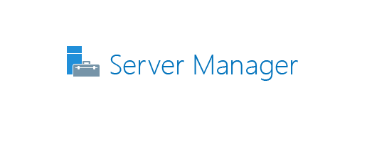
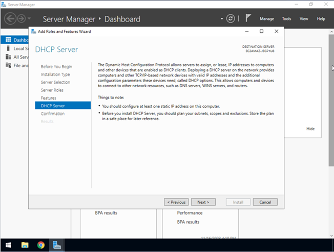

# Lab: Installing and Configuring DHCP

**Estimated time needed:** 20 minutes

---

## Lab Scenario

In this lab scenario, you are an IT administrator for a medium-sized company that uses a local area network (LAN). The company has recently expanded and added new computers to the network. Your task is to manage the IP addresses effectively. You have decided to use a **Dynamic Host Configuration Protocol (DHCP)**.

A DHCP server significantly simplifies IP management by dynamically assigning IP addresses to new computers on the network, ensuring no duplicates, and optimizing network usage. This automation will help save time, enhance network reliability and efficiency, and reduce the risk of human error in manual IP configuration.

---

## Learning Objectives

After completing this lab, you will be able to:

- Install the DHCP server role
- Add a scope of IPv4 addresses between 192.168.1.2 and 192.168.1.254
- Create an exclusion to ensure that the static IP addresses of your six printers are not distributed to other devices

---

## Important Notices about This Lab

### About Lab Sessions

Lab sessions are **not persisted**. This means that every time you connect to this lab, a new environment is created for you. Any data or files you saved in a previous session are no longer available. To avoid losing your data, plan to complete these tasks in a single session.

### About the Lab Instructions and Solutions

Microsoft Windows operating system features can vary based on the Windows edition. If completing these exercises on your machine, your navigation and solutions may differ from what's presented in this lab.

---

## Introduction to DHCP

**Dynamic Host Configuration Protocol (DHCP)** is a network management protocol used to automate the process of configuring devices on IP networks.

| DHCP Benefit                      | Description                                  |
| :-------------------------------- | :------------------------------------------- |
| **Automated IP assignment** | Devices receive IP addresses automatically   |
| **No duplicates**           | DHCP server ensures unique IP addresses      |
| **Centralized management**  | Manage all IP configurations from one server |
| **Reduced errors**          | Eliminates manual configuration mistakes     |
| **Efficient usage**         | IP addresses are leased and recycled         |

---

## Exercise 1: Installing and Configuring DHCP

In this exercise, you will install and configure the DHCP server role on Windows Server.

### Task A: Install DHCP Server Role

#### Step 1: Open Server Manager

1. Click the **Start** button to view the Start menu
2. Select **Server Manager** from the Start menu (or search for it)

![Start menu with Server Manager selected]

#### Step 2: Add Roles and Features

1. In Server Manager, click **Add roles and features** from the dashboard or from the **Manage** menu

![Add roles and features option]

#### Step 3: Begin the Wizard

1. The **Add Roles and Features Wizard** opens
2. Click **Next** on the Before You Begin page

![Add Roles and Features Wizard - Before You Begin]

#### Step 4: Select Installation Type

1. Select **Role-based or feature-based installation**
2. Click **Next**

![Installation type selection]

#### Step 5: Select Destination Server

1. Select a server from the server pool (or virtual hard disk where you want to install the roles)
2. In this instance, there is only one option
3. Ensure the server is selected and click **Next**

![Select destination server]

#### Step 6: Select DHCP Server Role

1. Check the box next to **DHCP Server**
2. Click **Next**

![Select DHCP Server role]

#### Step 7: Add Required Features

1. A dialog box appears asking to add required features for DHCP Server
2. Click **Add Features**

![Add Features dialog]

**Required features added automatically:**

- Remote Server Administration Tools
- DHCP Server Tools
- Other dependencies

#### Step 8: Handle Validation Results

You may receive a **Validation Results** error because you are working in an educational environment. If you were working on a server with a dedicated, static IP address, this error would not appear.

1. Select **Continue** to proceed

![Validation Results - Continue]

#### Step 9: Continue Wizard

1. Click **Next**

#### Step 10: Select Additional Features

1. Next you will be asked to verify additional features that should be installed on the DHCP server
2. We will keep the default **.NET Framework 4.7 Features** because this provides important security features
3. Click **Next**

![Select additional features]

#### Step 11: Confirm Installation

1. Click **Next** to proceed to the confirmation page
   

#### Step 12: Install

1. Confirm your installation selections
2. Click **Install**

![Confirm installation selections]

#### Step 13: Monitor Installation

1. It could take a few minutes for the installation to complete
2. Wait for the progress bar to complete

![Installation progress]

#### Step 14: Installation Complete

1. Upon completion, the status message will change to **Installation succeeded**
2. Click **Close**

![Installation succeeded]

#### Step 15: Verify DHCP Server in Dashboard

Now you can see the DHCP server listed under **Roles and Server Groups** in the Server Manager Dashboard

![DHCP server in dashboard]

#### Step 16: Complete DHCP Configuration

1. Click **DHCP** in Server Manager
2. Here you will see a status alert next to the DHCP server indicating that additional configuration is required
3. Click **Complete DHCP configuration**

![Complete DHCP configuration alert]

---

### Task B: Post-Installation DHCP Configuration

#### Step 17: Run DHCP Post-Installation Wizard

1. The **DHCP Post-Installation Configuration Wizard** opens
2. Click **Next**

![DHCP Post-Installation Wizard]

#### Step 18: Authorize DHCP Server

1. Select **Use the following user credentials**
2. By default, the current administrator credentials are used
3. Click **Commit** or **Next**

![Authorize DHCP server]

**Note:** In a domain environment, DHCP servers must be authorized in Active Directory. In a workgroup environment (like this lab), this step may be skipped.

#### Step 19: Completion

1. The wizard will show that configuration is complete
2. Click **Close**

![DHCP configuration complete]

---

### Task C: Create a DHCP Scope

Now that the DHCP server is installed, you will create a scope of IPv4 addresses.

#### Step 20: Open DHCP Management Console

1. In Server Manager, click **Tools** in the top right menu
2. Select **DHCP** from the dropdown menu

![Tools menu with DHCP selected]

#### Step 21: Expand DHCP Server

1. In the DHCP console, expand your server name
2. Right-click on **IPv4**
3. Select **New Scope**

![New Scope option]

#### Step 22: New Scope Wizard - Welcome

1. The **New Scope Wizard** opens
2. Click **Next**

#### Step 23: Scope Name

1. Enter a **Name** for the scope (e.g., `Company LAN Scope`)
2. Enter a **Description** (optional)
3. Click **Next**

![Scope name entry]

#### Step 24: IP Address Range

Configure the IP address range for your network:

| Field                      | Value                              |
| :------------------------- | :--------------------------------- |
| **Start IP address** | `192.168.1.2`                    |
| **End IP address**   | `192.168.1.254`                  |
| **Length**           | 24 (default)                       |
| **Subnet mask**      | `255.255.255.0` (auto-populates) |

1. Enter the start and end IP addresses
2. Click **Next**

![IP address range configuration]

#### Step 25: Add Exclusions

You need to create an exclusion for the six printers that have static IP addresses.

**Exclusion Range:**

| Field                      | Value             |
| :------------------------- | :---------------- |
| **Start IP Address** | `192.168.1.100` |
| **End IP Address**   | `192.168.1.105` |

**Note:** This assumes the six printers are using IP addresses 192.168.1.100 through 192.168.1.105.

1. In the **Add Exclusions** section:
   - Enter the **Start IP Address**: `192.168.1.100`
   - Enter the **End IP Address**: `192.168.1.105`
2. Click **Add** to add the exclusion range
3. The exclusion range appears in the **Excluded address range** list
4. Click **Next**

![Add exclusions]

**Alternative:** If your printers use different IP addresses, adjust the exclusion range accordingly (e.g., 192.168.1.200-192.168.1.205).

#### Step 26: Lease Duration

1. Set the **Lease duration**:
   - Default: `8 days`
   - For this lab, you can keep the default
2. Click **Next**

![Lease duration settings]

**Lease Duration Explained:**

- **Short lease** (hours) – Good for networks with many mobile devices
- **Long lease** (days/weeks) – Good for stable networks with mostly stationary devices

#### Step 27: Configure DHCP Options

1. Select **Yes, I want to configure these options now**
2. Click **Next**

![DHCP options selection]

#### Step 28: Router (Default Gateway)

1. Enter the **IP address** of your router/default gateway
   - For this lab, use: `192.168.1.1` (assuming this is your router)
2. Click **Add** to add the address to the list
3. Click **Next**

![Router configuration]

#### Step 29: Domain Name and DNS Servers

1. Enter the **Parent domain** (optional, e.g., `company.local`)
2. Enter the **IP address** of your DNS server(s):
   - You can use the DHCP server's IP address: `192.168.1.1` (or your actual DNS server)
3. Click **Add** to add the address
4. Click **Next**

![DNS configuration]

#### Step 30: WINS Servers

1. WINS (Windows Internet Name Service) is typically not needed
2. Click **Next** to skip this step

![WINS configuration]

#### Step 31: Activate Scope

1. Select **Yes, I want to activate this scope now**
2. Click **Next**

![Activate scope]

#### Step 32: Complete Scope Wizard

1. Click **Finish** to complete the New Scope Wizard

![Scope wizard complete]

---

### Task D: Verify DHCP Configuration

#### Step 33: View DHCP Scope

1. In the DHCP console, expand **IPv4**
2. You should see your new scope listed with:
   - **Address Pool** – Shows the range with exclusion
   - **Address Leases** – Currently empty (no devices assigned yet)
   - **Scope Options** – Shows configured options

![DHCP scope displayed]

#### Step 34: Verify Exclusion Range

1. Click on **Address Pool** under your scope
2. In the right pane, you should see:
   - The full IP address range
   - The exclusion range you created

![Address pool showing exclusion]

#### Step 35: Take Screenshots

Take screenshots of:

1. **DHCP Server installed** – Server Manager showing DHCP role
2. **DHCP Scope** – DHCP console showing the scope
3. **Exclusion Range** – Address pool showing the excluded addresses

Save the files as:

- `DHCP_Server_Installed.png`
- `DHCP_Scope.png`
- `DHCP_Exclusion.png`

---

## Exercise 2: Verify DHCP Functionality (Optional)

If you have a client computer on the same network, you can test DHCP functionality.

### Step 1: Configure Client for DHCP

1. On a client computer (Windows, macOS, Linux)
2. Ensure network adapter is set to **Obtain an IP address automatically**
3. Renew the IP address:
   - **Windows:** `ipconfig /release` then `ipconfig /renew`
   - **Linux/macOS:** `sudo dhclient`

### Step 2: View DHCP Leases

1. In the DHCP console, click **Address Leases** under your scope
2. You should see the client computer listed with its assigned IP address

![Address leases showing client]

### Step 3: Verify Exclusion Works

1. Ensure that no device received an IP address in the excluded range (192.168.1.100-105)
2. Those addresses are reserved for the printers

---

## DHCP Configuration Summary

| Configuration Item          | Value                                         |
| :-------------------------- | :-------------------------------------------- |
| **DHCP Server Role**  | Installed                                     |
| **Scope Name**        | Company LAN Scope                             |
| **IP Address Range**  | 192.168.1.2 – 192.168.1.254                  |
| **Subnet Mask**       | 255.255.255.0                                 |
| **Exclusion Range**   | 192.168.1.100 – 192.168.1.105 (for printers) |
| **Lease Duration**    | 8 days                                        |
| **Default Gateway**   | 192.168.1.1                                   |
| **Activation Status** | Active                                        |

---

## Troubleshooting Tips

| Issue                               | Solution                                                                         |
| :---------------------------------- | :------------------------------------------------------------------------------- |
| **DHCP server won't install** | Ensure you have administrative privileges; check Windows Server version          |
| **Validation Results error**  | This is normal in lab environment; click Continue                                |
| **Cannot create scope**       | Ensure DHCP server is authorized; restart DHCP service                           |
| **Clients not getting IPs**   | Check DHCP service is running; verify network connectivity; check firewall rules |
| **Exclusion not working**     | Verify correct IP range entered; ensure scope is activated                       |

---

## Key Takeaways

| Concept                   | Description                                                  |
| :------------------------ | :----------------------------------------------------------- |
| **DHCP**            | Automates IP address assignment to network devices           |
| **Scope**           | Range of IP addresses available for leasing                  |
| **Exclusion Range** | IP addresses reserved for static devices (printers, servers) |
| **Lease Duration**  | How long a device keeps its assigned IP                      |
| **Scope Options**   | Additional settings (gateway, DNS) provided to clients       |

---

## Summary

In this hands-on lab, you have:

| Activity                                                                  | Completed |
| :------------------------------------------------------------------------ | :-------- |
| Installed DHCP Server role using Server Manager                           | ☐        |
| Completed DHCP post-installation configuration                            | ☐        |
| Opened DHCP Management Console                                            | ☐        |
| Created a new DHCP scope                                                  | ☐        |
| Configured IP address range (192.168.1.2 – 192.168.1.254)                | ☐        |
| Created exclusion range for six printers (192.168.1.100 – 192.168.1.105) | ☐        |
| Configured lease duration                                                 | ☐        |
| Configured scope options (gateway, DNS)                                   | ☐        |
| Activated the scope                                                       | ☐        |
| Verified configuration in DHCP console                                    | ☐        |

---

## Congratulations!

You have successfully completed the **Installing and Configuring DHCP** lab. You now know how to:

- Install the DHCP Server role on Windows Server
- Complete post-installation DHCP configuration
- Create and configure a DHCP scope
- Set IP address ranges and exclusions
- Configure DHCP scope options (gateway, DNS)
- Activate and verify DHCP scope

These skills are essential for network administrators who need to manage IP addressing efficiently in growing networks.
