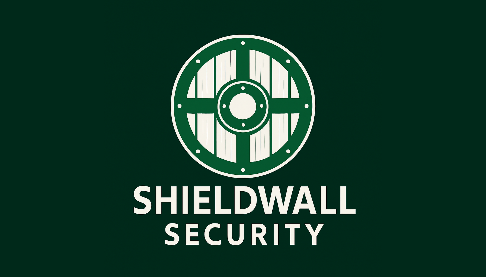

# Hands-on Lab: Emerging Trends in Ransomware

## Understanding RaaS, Extortionware, and AI-Powered Attacks

**Estimated time:** 45-60 minutes

---

## Project Scenario

You're a **Cyber Threat Intelligence Analyst** at **ShieldWall Security**, a cybersecurity firm that provides ransomware readiness assessments to mid-sized enterprises.

Your firm has seen a 300% increase in ransomware-related calls over the past year. The managing director has asked you to research emerging ransomware trends and prepare a briefing for clients. Specifically, leadership wants you to explain:

1. **Ransomware as a Service (RaaS)** - How it's democratizing cybercrime
2. **Extortionware** - Double and triple extortion tactics
3. **AI in Ransomware** - How attackers are leveraging artificial intelligence

Your analysis will be used to update client threat briefings and help organizations prioritize defensive investments.

---

## Learning Objectives

After completing this lab, you will be able to:

| # | Objective                                                                  |
| - | -------------------------------------------------------------------------- |
| 1 | Identify the fundamental characteristics of Ransomware as a Service (RaaS) |
| 2 | Distinguish between single, double, and triple extortion techniques        |
| 3 | Explain how AI is being used to enhance ransomware attacks                 |
| 4 | Assess how these trends have changed the ransomware threat landscape       |
| 5 | Develop defensive recommendations based on emerging trends                 |

---

## Prerequisites

| Requirement                                          | Status |
| :--------------------------------------------------- | :----- |
| **Understanding of basic ransomware concepts** | ☐     |
| **Critical thinking skills**                   | ☐     |
| **Ability to analyze threat trends**           | ☐     |

---

## Part 1: Ransomware as a Service (RaaS)

### What is RaaS?

Ransomware as a Service is a business model where experienced developers create and sell sophisticated ransomware tools to less skilled hackers (often called "affiliates").

```
┌─────────────────────────────────────────────────────────────────────────────┐
│                    RaaS BUSINESS MODEL                                       │
├─────────────────────────────────────────────────────────────────────────────┤
│                                                                              │
│   RaaS DEVELOPERS                    RaaS AFFILIATES                        │
│   (Skilled coders)                   (Less skilled hackers)                 │
│   ┌─────────────────┐                ┌─────────────────┐                    │
│   │ • Create malware │                │ • Purchase RaaS │                    │
│   │ • Maintain C2    │      ──►       │ • Launch attacks│                    │
│   │ • Handle payment │                │ • Keep 70-80%   │                    │
│   │   infrastructure │                │   of ransom     │                    │
│   │ • Keep 20-30%    │                └─────────────────┘                    │
│   └─────────────────┘                                                        │
│                                                                              │
│   REVENUE SPLIT:                                                            │
│   ┌─────────────────────────────────────────────────────────────────────┐   │
│   │                                                                       │   │
│   │   Affiliate (Hacker)              Developer (RaaS Operator)          │   │
│   │   ┌─────────────────────────────────┐ ┌─────────────────────────────┐ │   │
│   │   │          70-80%                 │ │         20-30%              │ │   │
│   │   └─────────────────────────────────┘ └─────────────────────────────┘ │   │
│   │                                                                       │   │
│   └─────────────────────────────────────────────────────────────────────┘   │
│                                                                              │
└─────────────────────────────────────────────────────────────────────────────┘
```

### Task 1.1: RaaS Knowledge Check

**Q1:** How has RaaS changed the barrier to entry for cybercriminals?

```
Your answer:
_________________________________________________________________________
_________________________________________________________________________
```

**Q2:** What percentage of ransom payments do RaaS affiliates typically keep?

```
Your answer:
_________________________________________________________________________
```

**Q3:** Why has RaaS made it more difficult for law enforcement to prosecute attackers?

```
Your answer:
_________________________________________________________________________
_________________________________________________________________________
```

**Q4:** How has RaaS affected the number of ransomware variants in circulation?

```
Your answer:
_________________________________________________________________________
_________________________________________________________________________
```

### Task 1.2: RaaS Impact Analysis

Complete the following table:

| Impact Area                          | How RaaS Has Changed the Landscape |
| :----------------------------------- | :--------------------------------- |
| **Number of attacks**          |                                    |
| **Technical skill required**   |                                    |
| **Variety of malware**         |                                    |
| **Law enforcement difficulty** |                                    |

---

## Part 2: Extortionware (Double and Triple Extortion)

### Understanding the Evolution

```
┌─────────────────────────────────────────────────────────────────────────────┐
│                    EVOLUTION OF EXTORTION                                    │
├─────────────────────────────────────────────────────────────────────────────┤
│                                                                              │
│   TRADITIONAL RANSOMWARE (Single Extortion)                                 │
│   ┌─────────────────────────────────────────────────────────────────────┐   │
│   │ Attack → Encrypt Data → Demand Ransom → (Possibly get data back)    │   │
│   │                                                                       │   │
│   │ Threat: Loss of data access                                          │   │
│   └─────────────────────────────────────────────────────────────────────┘   │
│                                    │                                        │
│                                    ▼                                        │
│   DOUBLE EXTORTION                                                          │
│   ┌─────────────────────────────────────────────────────────────────────┐   │
│   │ Attack → Encrypt Data + STEAL Data → Demand Ransom                  │   │
│   │           Threat: Publish stolen data                               │   │
│   │                                                                       │   │
│   │ Additional threat: Reputational damage, legal liability              │   │
│   └─────────────────────────────────────────────────────────────────────┘   │
│                                    │                                        │
│                                    ▼                                        │
│   TRIPLE EXTORTION                                                          │
│   ┌─────────────────────────────────────────────────────────────────────┐   │
│   │ Attack → Encrypt Data + STEAL Data + Target 3rd PARTIES             │   │
│   │           Threat: Contact customers, partners, regulators           │   │
│   │                                                                       │   │
│   │ Additional threat: Business relationship damage, supply chain risk   │   │
│   └─────────────────────────────────────────────────────────────────────┘   │
│                                                                              │
└─────────────────────────────────────────────────────────────────────────────┘
```

### Task 2.1: Extortionware Definitions

Match each term with its correct definition:

| Term                       | Definition                                                     |
| :------------------------- | :------------------------------------------------------------- |
| **Extortionware**    | A. Encrypts data AND steals data AND threatens third parties   |
| **Double Extortion** | B. Steals data and threatens to release it publicly            |
| **Triple Extortion** | C. Steals sensitive data and demands ransom to prevent release |

**Answers:**

- Extortionware: _______
- Double Extortion: _______
- Triple Extortion: _______

### Task 2.2: Extortionware Analysis

**Q5:** What types of data are at risk in an extortionware attack?

```
Your answer:
_________________________________________________________________________
_________________________________________________________________________
```

**Q6:** Why might victims pay the ransom even if they have working backups?

```
Your answer:
_________________________________________________________________________
_________________________________________________________________________
```

**Q7:** In triple extortion, who are the "third parties" that attackers threaten?

```
Your answer:
_________________________________________________________________________
_________________________________________________________________________
```

**Q8:** How does triple extortion create additional pressure beyond double extortion?

```
Your answer:
_________________________________________________________________________
_________________________________________________________________________
```

### Task 2.3: Impact Assessment

Complete the impact assessment for each extortion type:

| Impact                                 | Single Extortion | Double Extortion | Triple Extortion |
| :------------------------------------- | :--------------: | :--------------: | :--------------: |
| Data access loss                       |        ☐        |        ☐        |        ☐        |
| Data leak/public exposure              |        ☐        |        ☐        |        ☐        |
| Customer/partner relationships at risk |        ☐        |        ☐        |        ☐        |
| Regulatory fines possible              |        ☐        |        ☐        |        ☐        |
| Legal liability from third parties     |        ☐        |        ☐        |        ☐        |

---

## Part 3: AI in Ransomware Attacks

### How Attackers Use AI

```
┌─────────────────────────────────────────────────────────────────────────────┐
│                    AI-POWERED RANSOMWARE ATTACKS                            │
├─────────────────────────────────────────────────────────────────────────────┤
│                                                                              │
│   PHASE 1: RECONNAISSANCE                                                   │
│   ┌─────────────────────────────────────────────────────────────────────┐   │
│   │ AI Task: Analyze large datasets to identify high-value targets       │   │
│   │ Example: Scan LinkedIn, SEC filings, corporate websites              │   │
│   │ Output: List of organizations with high revenue and weak security    │   │
│   └─────────────────────────────────────────────────────────────────────┘   │
│                                    │                                        │
│                                    ▼                                        │
│   PHASE 2: INITIAL ACCESS                                                   │
│   ┌─────────────────────────────────────────────────────────────────────┐   │
│   │ AI Task: Generate convincing phishing emails                        │   │
│   │ Example: Personalized emails using harvested employee data          │   │
│   │ Output: Higher click rates, bypassed spam filters                   │   │
│   └─────────────────────────────────────────────────────────────────────┘   │
│                                    │                                        │
│                                    ▼                                        │
│   PHASE 3: VULNERABILITY IDENTIFICATION                                     │
│   ┌─────────────────────────────────────────────────────────────────────┐   │
│   │ AI Task: Identify system vulnerabilities faster than humans         │   │
│   │ Example: Automated scanning with ML-based exploitation prediction   │   │
│   │ Output: Faster, more accurate exploitation                          │   │
│   └─────────────────────────────────────────────────────────────────────┘   │
│                                    │                                        │
│                                    ▼                                        │
│   PHASE 4: RANSOMWARE DELIVERY                                              │
│   ┌─────────────────────────────────────────────────────────────────────┐   │
│   │ AI Task: Optimize ransomware deployment                             │   │
│   │ Example: Adaptive malware that changes based on defenses            │   │
│   │ Output: Evasion of traditional antivirus and EDR                    │   │
│   └─────────────────────────────────────────────────────────────────────┘   │
│                                                                              │
└─────────────────────────────────────────────────────────────────────────────┘
```

### Task 3.1: AI in Ransomware - Knowledge Check

**Q9:** How do attackers use AI during the reconnaissance phase?

```
Your answer:
_________________________________________________________________________
_________________________________________________________________________
```

**Q10:** How can AI make phishing emails more effective?

```
Your answer:
_________________________________________________________________________
_________________________________________________________________________
```

**Q11:** Why does AI make ransomware attacks harder to defend against?

```
Your answer:
_________________________________________________________________________
_________________________________________________________________________
```

### Task 3.2: AI vs Traditional Methods

Complete this comparison table:

| Attack Phase                     | Traditional Method | AI-Powered Method |
| :------------------------------- | :----------------- | :---------------- |
| **Target selection**       | Manual research    |                   |
| **Phishing emails**        | Generic templates  |                   |
| **Vulnerability scanning** | Signature-based    |                   |
| **Malware delivery**       | Static payload     |                   |

---

## Part 4: The Combined Threat Landscape

### How RaaS + Extortionware + AI Work Together

```
┌─────────────────────────────────────────────────────────────────────────────┐
│                    THE PERFECT STORM                                         │
├─────────────────────────────────────────────────────────────────────────────┤
│                                                                              │
│   RaaS lowers the barrier → More attackers                                  │
│                    │                                                         │
│                    ▼                                                         │
│   Extortionware increases pressure → Higher payment rates                   │
│                    │                                                         │
│                    ▼                                                         │
│   AI makes attacks more effective → Harder to defend                       │
│                    │                                                         │
│                    ▼                                                         │
│   RESULT: Ransomware is more profitable and widespread than ever           │
│                                                                              │
└─────────────────────────────────────────────────────────────────────────────┘
```

### Task 4.1: Combined Impact Analysis

**Q12:** How do RaaS and AI work together to increase the number of successful attacks?

```
Your answer:
_________________________________________________________________________
_________________________________________________________________________
```

**Q13:** How does extortionware make the ransomware business model more profitable?

```
Your answer:
_________________________________________________________________________
_________________________________________________________________________
```

**Q14:** Why is the combination of these trends particularly dangerous for organizations?

```
Your answer:
_________________________________________________________________________
_________________________________________________________________________
```

---

## Part 5: Defensive Recommendations

### Task 5.1: Matching Defenses to Threats

Match each emerging trend with appropriate defensive measures:

| Trend                           | Defensive Measure                                                     |
| :------------------------------ | :-------------------------------------------------------------------- |
| **RaaS**                  | A. Data classification, encryption, DLP, no unsanctioned data storage |
| **Double Extortion**      | B. AI-powered email security, user behavior analytics                 |
| **Triple Extortion**      | C. Offline backups, immutable storage, recovery testing               |
| **AI-Powered Phishing**   | D. Third-party risk assessments, incident communication plan          |
| **Ransomware Encryption** | E. Threat intelligence, sharing RaaS indicators with ISACs            |
| **Data Exfiltration**     | F. Regular backups AND data leak monitoring                           |

**Match your answers:**

- RaaS → _______
- Double Extortion → _______
- Triple Extortion → _______
- AI-Powered Phishing → _______
- Ransomware Encryption → _______
- Data Exfiltration → _______

### Task 5.2: Defensive Strategy Development

Based on the three emerging trends, develop a layered defense strategy:

```
┌─────────────────────────────────────────────────────────────────────────────┐
│                    DEFENSIVE STRATEGY                                        │
├─────────────────────────────────────────────────────────────────────────────┤
│                                                                              │
│   LAYER 1: PREVENTION (Stop initial access)                                 │
│   ┌─────────────────────────────────────────────────────────────────────┐   │
│   │ •                                                                     │   │
│   │ •                                                                     │   │
│   │ •                                                                     │   │
│   └─────────────────────────────────────────────────────────────────────┘   │
│                                                                              │
│   LAYER 2: DETECTION (Find attacks early)                                   │
│   ┌─────────────────────────────────────────────────────────────────────┐   │
│   │ •                                                                     │   │
│   │ •                                                                     │   │
│   │ •                                                                     │   │
│   └─────────────────────────────────────────────────────────────────────┘   │
│                                                                              │
│   LAYER 3: RESPONSE & RECOVERY (Minimize impact)                           │
│   ┌─────────────────────────────────────────────────────────────────────┐   │
│   │ •                                                                     │   │
│   │ •                                                                     │   │
│   │ •                                                                     │   │
│   └─────────────────────────────────────────────────────────────────────┘   │
│                                                                              │
│   LAYER 4: EXFILTRATION PROTECTION (Prevent data theft)                    │
│   ┌─────────────────────────────────────────────────────────────────────┐   │
│   │ •                                                                     │   │
│   │ •                                                                     │   │
│   │ •                                                                     │   │
│   └─────────────────────────────────────────────────────────────────────┘   │
│                                                                              │
└─────────────────────────────────────────────────────────────────────────────┘
```

---

## Part 6: Application Exercise

### Scenario A: Small Business Owner

You are advising a small business with 50 employees and a limited IT budget. They have heard about ransomware but think they're "too small to be targeted."

**Q15:** How would you explain RaaS to explain why size doesn't protect them?

```
Your answer:
_________________________________________________________________________
_________________________________________________________________________
```

**Q16:** What three (3) cost-effective defenses would you recommend as priorities?

```
Your answer:
_________________________________________________________________________
_________________________________________________________________________
_________________________________________________________________________
```

### Scenario B: Healthcare Organization

A regional hospital is concerned about patient data exposure. They have good backups but haven't considered data theft risks.

**Q17:** Why are double and triple extortion particularly dangerous for healthcare?

```
Your answer:
_________________________________________________________________________
_________________________________________________________________________
```

**Q18:** What additional controls should the hospital implement beyond backups?

```
Your answer:
_________________________________________________________________________
_________________________________________________________________________
_________________________________________________________________________
```

### Scenario C: Enterprise CISO

A large enterprise CISO says, "We have traditional email security and antivirus. We're covered."

**Q19:** How would you explain why AI-powered ransomware bypasses traditional defenses?

```
Your answer:
_________________________________________________________________________
_________________________________________________________________________
```

**Q20:** What advanced controls would you recommend to replace or augment traditional tools?

```
Your answer:
_________________________________________________________________________
_________________________________________________________________________
_________________________________________________________________________
```

---

## Part 7: Final Assessment Questions

| # | Question                                                                | Your Answer |
| - | ----------------------------------------------------------------------- | ----------- |
| 1 | What does RaaS stand for and how does it work?                          |             |
| 2 | What percentage of ransom do RaaS affiliates typically keep?            |             |
| 3 | How is double extortion different from traditional ransomware?          |             |
| 4 | What additional pressure does triple extortion create?                  |             |
| 5 | How do attackers use AI during the reconnaissance phase?                |             |
| 6 | Why has RaaS made law enforcement efforts more difficult?               |             |
| 7 | Why might organizations pay ransoms even with working backups?          |             |
| 8 | How do RaaS, extortionware, and AI combine to increase ransomware risk? |             |

---

## Lab Completion Checklist

| Task                                        | Completed |
| :------------------------------------------ | :-------: |
| **Part 1: RaaS**                      |    ☐    |
| Q1-Q4 answered                              |    ☐    |
| RaaS impact table completed                 |    ☐    |
| **Part 2: Extortionware**             |    ☐    |
| Definitions matched                         |    ☐    |
| Q5-Q8 answered                              |    ☐    |
| Impact assessment table completed           |    ☐    |
| **Part 3: AI in Ransomware**          |    ☐    |
| Q9-Q11 answered                             |    ☐    |
| AI vs Traditional table completed           |    ☐    |
| **Part 4: Combined Threats**          |    ☐    |
| Q12-Q14 answered                            |    ☐    |
| **Part 5: Defensive Recommendations** |    ☐    |
| Matching exercise completed                 |    ☐    |
| Defensive strategy developed                |    ☐    |
| **Part 6: Application Exercises**     |    ☐    |
| Small business scenario (Q15-Q16)           |    ☐    |
| Healthcare scenario (Q17-Q18)               |    ☐    |
| Enterprise scenario (Q19-Q20)               |    ☐    |
| **Part 7: Final Assessment**          |    ☐    |
| All 8 questions answered                    |    ☐    |

---

## Answer Key

### Part 1: RaaS Answers

**Q1:** RaaS lowers the barrier to entry, allowing less skilled hackers to launch sophisticated attacks by purchasing ransomware tools.

**Q2:** 70-80% of ransom payments.

**Q3:** Multiple layers of anonymity exist between developers (RaaS operators) and affiliates (hackers), making attribution difficult.

**Q4:** Multiple developers create their own versions with new features, increasing the number of variants security teams must defend against.

### Part 2: Extortionware Answers

**Definitions:**

- Extortionware: **B**
- Double Extortion: **A**
- Triple Extortion: **C**

**Q5:** Trade secrets, intellectual property, customer information, critical business data, PII, PHI, financial data.

**Q6:** Fear of data exposure/reputation damage, not just data access loss.

**Q7:** Customers, business partners, regulators, vendors, suppliers.

**Q8:** It threatens business relationships and creates liability from third parties, not just internal damage.

### Part 3: AI Answers

**Q9:** AI analyzes large datasets (social media, public records) to identify high-value targets with weak security.

**Q10:** AI generates personalized emails using harvested employee data, making them more convincing and harder to detect.

**Q11:** AI-powered attacks adapt in real-time, evade traditional signatures, and scale across thousands of targets.

### Part 4: Combined Threats

**Q12:** RaaS provides the tools; AI makes them more effective. More attackers with better tools = more successful attacks.

**Q13:** Extortionware adds data theft threat, which increases payment likelihood even when victims have backups.

**Q14:** These trends make attacks more frequent (RaaS), more damaging (extortionware), and harder to stop (AI).

---

## Key Takeaways

```
┌─────────────────────────────────────────────────────────────────────────────┐
│                    KEY TAKEAWAYS                                             │
├─────────────────────────────────────────────────────────────────────────────┤
│                                                                              │
│   RANSOMWARE AS A SERVICE (RaaS)                                            │
│   ┌─────────────────────────────────────────────────────────────────────┐   │
│   │ ✓ Lowers barrier to entry for cybercriminals                        │   │
│   │ ✓ Increases number of ransomware variants                           │   │
│   │ ✓ Complicates law enforcement attribution                           │   │
│   └─────────────────────────────────────────────────────────────────────┘   │
│                                                                              │
│   EXTORTIONWARE (Double & Triple Extortion)                                 │
│   ┌─────────────────────────────────────────────────────────────────────┐   │
│   │ ✓ Adds data theft to encryption                                      │   │
│   │ ✓ Creates reputation and compliance risks                           │   │
│   │ ✓ Involves third parties (customers, partners) in triple extortion  │   │
│   └─────────────────────────────────────────────────────────────────────┘   │
│                                                                              │
│   AI IN RANSOMWARE                                                          │
│   ┌─────────────────────────────────────────────────────────────────────┐   │
│   │ ✓ Automates target identification                                   │   │
│   │ ✓ Creates convincing personalized phishing                          │   │
│   │ ✓ Makes attacks harder to detect and defend against                 │   │
│   └─────────────────────────────────────────────────────────────────────┘   │
│                                                                              │
└─────────────────────────────────────────────────────────────────────────────┘
```

---

## Additional Resources

| Resource                  | URL                                                    |
| :------------------------ | :----------------------------------------------------- |
| CISA Ransomware Guide     | https://www.cisa.gov/ransomware                        |
| FBI IC3 Ransomware Report | https://www.ic3.gov                                    |
| Ransomware Task Force     | https://securityandtechnology.org/ransomwaretaskforce/ |
| No More Ransom Project    | https://www.nomoreransom.org                           |

---

## Congratulations!

You have successfully completed the **Emerging Trends in Ransomware Lab**. You now understand:

- How Ransomware as a Service (RaaS) has democratized cybercrime
- The evolution from single to double to triple extortion
- How attackers are leveraging AI to enhance ransomware attacks
- How these trends combine to create a more dangerous threat landscape
- Defensive strategies to protect against modern ransomware

These insights are essential for:

- Security professionals defending against ransomware
- Risk managers assessing organizational exposure
- Incident responders preparing for modern attacks
- Anyone responsible for organizational cyber resilience
