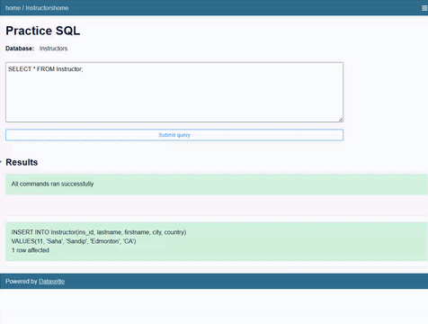

# Lab: INSERT, UPDATE, and DELETE — Data Manipulation with SQL

**Estimated time:** 20 minutes

---

## Learning Objectives

After completing this lab you'll be able to use three essential Data Manipulation Language (DML) statements to modify database content. You'll also be able to demonstrate the skills needed to use an open-source data exploration tool, Datasette, to perform these tasks.

| Objective | Description |
|:----------|:------------|
| **INSERT** | Insert new rows into a table |
| **UPDATE** | Update data in existing rows of the table |
| **DELETE** | Remove rows from a table |

---

## Concepts Covered

### INSERT Statement Syntax

```sql
INSERT INTO table_name (column1, column2, ...)
VALUES (value1, value2, ...);
```

### UPDATE Statement Syntax

```sql
UPDATE table_name
SET column1 = value1, column2 = value2, ...
WHERE condition;
```

### DELETE Statement Syntax

```sql
DELETE FROM table_name
WHERE condition;
```

---

## Tools Needed

**Datasette**, a no-charge open-source multi-tool for exploring and publishing data, accessible through your web browser.

**Database:** Internal Instructors database

---

## Introduction to Lab Environment

### Software Used in this Lab

In this lab, you will use **Datasette**, an open source tool for exploring and publishing data. You can visit the [Datasette GitHub repository](https://github.com/simonw/datasette) for more information.

### Working with Datasette

The Datasette tool offers a platform to input and execute SQL queries. By clicking the **Submit query** button, you can execute the SQL query.

### Database Used in this Lab

The dataset used in this lab is an internal database containing instructor information.

---

## Exploring the Database

Let us first explore the **Instructors** database using the Datasette tool:

### Step 1: Run the Initial Query

1. If the first statement listed below is not already in the Datasette textbox, copy the code below by clicking on the copy button and then paste it into the textbox of the Datasette tool using `Ctrl+V` or right-click and choose **Paste**

```sql
SELECT * FROM Instructor;
```

2. Click **Submit Query**
3. Now you can scroll down the table and explore all the columns and rows of the `Instructor` table to get an overall idea of the table contents

![Instructor table preview]


### Sample Instructor Table Structure

| Column               | Description                             |
| :------------------- | :-------------------------------------- |
| **ID**         | Unique identifier for each instructor   |
| **FirstName**  | Instructor's first name                 |
| **LastName**   | Instructor's last name                  |
| **Department** | Department where the instructor teaches |
| **HireDate**   | Date when the instructor was hired      |

---

## Exercise 1: INSERT

In this exercise, you will use the `INSERT` statement to add new rows to the Instructor table.

### Step 1: Insert a Single Row

**Problem:** Insert a new instructor with the following information:

- ID: 101
- FirstName: John
- LastName: Smith
- Department: Computer Science
- HireDate: 2023-08-15

**Solution:**

```sql
INSERT INTO Instructor (ID, FirstName, LastName, Department, HireDate)
VALUES (101, 'John', 'Smith', 'Computer Science', '2023-08-15');
```

1. Copy the solution code above
2. Paste it into the Datasette textbox
3. Click **Submit Query**

**Expected Output:**

```
Query executed successfully. 1 row affected.
```

![INSERT single row result]




### Step 2: Verify the Insert

To verify that the row was inserted correctly:

```sql
SELECT * FROM Instructor WHERE ID = 101;
```

**Expected Output:**

```
ID  | FirstName | LastName | Department        | HireDate
----|-----------|----------|-------------------|----------
101 | John      | Smith    | Computer Science  | 2023-08-15
```

### Step 3: Insert Multiple Rows

**Problem:** Insert three new instructors with the following information:

| ID  | FirstName | LastName | Department       | HireDate   |
| --- | --------- | -------- | ---------------- | ---------- |
| 102 | Sarah     | Johnson  | Mathematics      | 2023-09-01 |
| 103 | Michael   | Brown    | Physics          | 2023-09-01 |
| 104 | Emily     | Davis    | Computer Science | 2023-09-15 |

**Solution:**

```sql
INSERT INTO Instructor (ID, FirstName, LastName, Department, HireDate)
VALUES 
    (102, 'Sarah', 'Johnson', 'Mathematics', '2023-09-01'),
    (103, 'Michael', 'Brown', 'Physics', '2023-09-01'),
    (104, 'Emily', 'Davis', 'Computer Science', '2023-09-15');
```

1. Copy the solution code above
2. Paste it into the Datasette textbox
3. Click **Submit Query**

**Expected Output:**

```
Query executed successfully. 3 rows affected.
```

![INSERT multiple rows result]


### Step 4: Verify the Inserts

```sql
SELECT * FROM Instructor WHERE ID >= 102 AND ID <= 104;
```

### Step 5: Practice Exercises on INSERT

Now, let's practice creating and running some INSERT related queries.

---

#### Problem 5.1

**Problem:** Insert a new instructor with the following information:

- ID: 105
- FirstName: David
- LastName: Wilson
- Department: Biology
- HireDate: 2023-10-01

<details>
<summary>💡 Hint</summary>

Use the `INSERT INTO` statement with the column names and corresponding values.

</details>

<details>
<summary>✅ Solution</summary>

```sql
INSERT INTO Instructor (ID, FirstName, LastName, Department, HireDate)
VALUES (105, 'David', 'Wilson', 'Biology', '2023-10-01');
```

</details>

---

#### Problem 5.2

**Problem:** Insert two new instructors with the following information:

| ID  | FirstName | LastName | Department | HireDate   |
| --- | --------- | -------- | ---------- | ---------- |
| 106 | Lisa      | Martinez | Chemistry  | 2023-10-15 |
| 107 | James     | Anderson | Physics    | 2023-10-15 |

<details>
<summary>💡 Hint</summary>

Use multiple `VALUES` clauses separated by commas.

</details>

<details>
<summary>✅ Solution</summary>

```sql
INSERT INTO Instructor (ID, FirstName, LastName, Department, HireDate)
VALUES 
    (106, 'Lisa', 'Martinez', 'Chemistry', '2023-10-15'),
    (107, 'James', 'Anderson', 'Physics', '2023-10-15');
```

</details>

---

### Step 6: Take Screenshot

1. Take a screenshot showing one of your INSERT queries and its result
2. Save the file as `SQL_INSERT_Query.png`

---

## Exercise 2: UPDATE

In this exercise, you will use the `UPDATE` statement to modify existing data in the Instructor table.

### Step 1: Update a Single Column

**Problem:** Update the department of instructor with ID 101 from 'Computer Science' to 'Software Engineering'.

**Solution:**

```sql
UPDATE Instructor
SET Department = 'Software Engineering'
WHERE ID = 101;
```

1. Copy the solution code above
2. Paste it into the Datasette textbox
3. Click **Submit Query**

**Expected Output:**

```
Query executed successfully. 1 row affected.
```

![UPDATE single column result]

### Step 2: Verify the Update

```sql
SELECT * FROM Instructor WHERE ID = 101;
```

**Expected Output:**

```
ID  | FirstName | LastName | Department            | HireDate
----|-----------|----------|-----------------------|----------
101 | John      | Smith    | Software Engineering  | 2023-08-15
```

### Step 3: Update Multiple Columns

**Problem:** Update the instructor with ID 102 to change both LastName and Department:

- LastName: 'Johnston'
- Department: 'Applied Mathematics'

**Solution:**

```sql
UPDATE Instructor
SET LastName = 'Johnston', Department = 'Applied Mathematics'
WHERE ID = 102;
```

1. Copy the solution code above
2. Paste it into the Datasette textbox
3. Click **Submit Query**

**Expected Output:**

```
Query executed successfully. 1 row affected.
```

![UPDATE multiple columns result]

### Step 4: Verify the Update

```sql
SELECT * FROM Instructor WHERE ID = 102;
```

**Expected Output:**

```
ID  | FirstName | LastName  | Department           | HireDate
----|-----------|-----------|----------------------|----------
102 | Sarah     | Johnston  | Applied Mathematics  | 2023-09-01
```

### Step 5: Update Multiple Rows with Condition

**Problem:** Update all instructors hired on '2023-09-01' to change their Department to 'Science'.

**Solution:**

```sql
UPDATE Instructor
SET Department = 'Science'
WHERE HireDate = '2023-09-01';
```

1. Copy the solution code above
2. Paste it into the Datasette textbox
3. Click **Submit Query**

**Expected Output:**

```
Query executed successfully. 2 rows affected.
```

![UPDATE multiple rows result]

### Step 6: Verify the Update

```sql
SELECT * FROM Instructor WHERE HireDate = '2023-09-01';
```

### Step 7: Practice Exercises on UPDATE

Now, let's practice creating and running some UPDATE related queries.

---

#### Problem 7.1

**Problem:** Update the department of instructor with ID 103 to 'Quantum Physics'.

<details>
<summary>💡 Hint</summary>

Use `UPDATE` with `SET` and a `WHERE` clause filtering on `ID`.

</details>

<details>
<summary>✅ Solution</summary>

```sql
UPDATE Instructor
SET Department = 'Quantum Physics'
WHERE ID = 103;
```

</details>

---

#### Problem 7.2

**Problem:** Update the instructor with ID 104 to change both FirstName and LastName:

- FirstName: 'Emilia'
- LastName: 'Davies'

<details>
<summary>💡 Hint</summary>

Separate multiple column updates with commas in the `SET` clause.

</details>

<details>
<summary>✅ Solution</summary>

```sql
UPDATE Instructor
SET FirstName = 'Emilia', LastName = 'Davies'
WHERE ID = 104;
```

</details>

---

#### Problem 7.3

**Problem:** Update all instructors in the 'Physics' department to change their department to 'Physical Sciences'.

<details>
<summary>💡 Hint</summary>

Use a `WHERE` clause that filters on the `Department` column.

</details>

<details>
<summary>✅ Solution</summary>

```sql
UPDATE Instructor
SET Department = 'Physical Sciences'
WHERE Department = 'Physics';
```

</details>

---

### Step 8: Take Screenshot

1. Take a screenshot showing one of your UPDATE queries and its result
2. Save the file as `SQL_UPDATE_Query.png`

---

## Exercise 3: DELETE

In this exercise, you will use the `DELETE` statement to remove rows from the Instructor table.

### Step 1: Delete a Single Row

**Problem:** Delete the instructor with ID 107 from the table.

**Solution:**

```sql
DELETE FROM Instructor
WHERE ID = 107;
```

1. Copy the solution code above
2. Paste it into the Datasette textbox
3. Click **Submit Query**

**Expected Output:**

```
Query executed successfully. 1 row affected.
```

![DELETE single row result]

### Step 2: Verify the Delete

```sql
SELECT * FROM Instructor WHERE ID = 107;
```

**Expected Output:**

```
(empty result set)
```

### Step 3: Delete Multiple Rows with Condition

**Problem:** Delete all instructors who were hired on '2023-10-15'.

**Solution:**

```sql
DELETE FROM Instructor
WHERE HireDate = '2023-10-15';
```

1. Copy the solution code above
2. Paste it into the Datasette textbox
3. Click **Submit Query**

**Expected Output:**

```
Query executed successfully. 2 rows affected.
```

![DELETE multiple rows result]

### Step 4: Verify the Delete

```sql
SELECT * FROM Instructor WHERE HireDate = '2023-10-15';
```

### Step 5: Practice Exercises on DELETE

Now, let's practice creating and running some DELETE related queries.

---

#### Problem 5.1

**Problem:** Delete the instructor with ID 106 from the table.

<details>
<summary>💡 Hint</summary>

Use `DELETE FROM` with a `WHERE` clause filtering on `ID`.

</details>

<details>
<summary>✅ Solution</summary>

```sql
DELETE FROM Instructor
WHERE ID = 106;
```

</details>

---

#### Problem 5.2

**Problem:** Delete all instructors whose department is 'Chemistry'.

<details>
<summary>💡 Hint</summary>

Use a `WHERE` clause that filters on the `Department` column.

</details>

<details>
<summary>✅ Solution</summary>

```sql
DELETE FROM Instructor
WHERE Department = 'Chemistry';
```

</details>

---

#### Problem 5.3

**Problem:** Delete all instructors hired before '2023-09-15'.

<details>
<summary>💡 Hint</summary>

Use the `<` operator in your `WHERE` clause with the `HireDate` column.

</details>

<details>
<summary>✅ Solution</summary>

```sql
DELETE FROM Instructor
WHERE HireDate < '2023-09-15';
```

</details>

---

### Step 6: Take Screenshot

1. Take a screenshot showing one of your DELETE queries and its result
2. Save the file as `SQL_DELETE_Query.png`

---

## Important Note: The WHERE Clause

The `WHERE` clause is **critical** for UPDATE and DELETE statements. Without it, you will modify or delete **ALL** rows in the table!

| Statement  | Without WHERE                  | With WHERE                 |
| :--------- | :----------------------------- | :------------------------- |
| `UPDATE` | Updates every row in the table | Updates only matching rows |
| `DELETE` | Deletes every row in the table | Deletes only matching rows |

**Example of what NOT to do:**

```sql
-- DANGEROUS! This will delete ALL instructors!
DELETE FROM Instructor;
```

```sql
-- SAFE! This only deletes instructors with ID 101
DELETE FROM Instructor WHERE ID = 101;
```

---

## Lab Completion Checklist

| Task                                            | Completed |
| :---------------------------------------------- | :-------- |
| Explored the Instructor table with `SELECT *` | ☐        |
| Inserted a single row with `INSERT`           | ☐        |
| Inserted multiple rows with `INSERT`          | ☐        |
| Solved INSERT practice exercises (2 problems)   | ☐        |
| Updated a single column with `UPDATE`         | ☐        |
| Updated multiple columns with `UPDATE`        | ☐        |
| Updated multiple rows with `UPDATE`           | ☐        |
| Solved UPDATE practice exercises (3 problems)   | ☐        |
| Deleted a single row with `DELETE`            | ☐        |
| Deleted multiple rows with `DELETE`           | ☐        |
| Solved DELETE practice exercises (3 problems)   | ☐        |
| Took screenshot of INSERT query                 | ☐        |
| Took screenshot of UPDATE query                 | ☐        |
| Took screenshot of DELETE query                 | ☐        |

---

## Screenshot Checklist

| Screenshot   | File Name                | Description                                        |
| :----------- | :----------------------- | :------------------------------------------------- |
| INSERT Query | `SQL_INSERT_Query.png` | INSERT statement with result showing rows affected |
| UPDATE Query | `SQL_UPDATE_Query.png` | UPDATE statement with result showing rows affected |
| DELETE Query | `SQL_DELETE_Query.png` | DELETE statement with result showing rows affected |

---

## Troubleshooting Tips

| Issue                                     | Solution                                                                |
| :---------------------------------------- | :---------------------------------------------------------------------- |
| **INSERT fails with duplicate key** | Check if ID already exists; use a different ID or update existing row   |
| **UPDATE affects 0 rows**           | Verify the WHERE condition matches existing data                        |
| **DELETE affects 0 rows**           | Check if the condition matches any rows in the table                    |
| **Syntax error**                    | Verify column names are spelled correctly and values have proper quotes |
| **String values not updating**      | Use single quotes `'` around string values, not double quotes         |
| **Date format issues**              | Use standard date format `'YYYY-MM-DD'`                               |

---

## Common SQL DML Statements

| Statement  | Purpose              | Example                                                |
| :--------- | :------------------- | :----------------------------------------------------- |
| `INSERT` | Add new rows         | `INSERT INTO table (col1, col2) VALUES (val1, val2)` |
| `UPDATE` | Modify existing rows | `UPDATE table SET col1 = val1 WHERE condition`       |
| `DELETE` | Remove rows          | `DELETE FROM table WHERE condition`                  |
| `SELECT` | Retrieve rows        | `SELECT * FROM table`                                |

---

## Key Takeaways

| Concept                    | Description                                                                              |
| :------------------------- | :--------------------------------------------------------------------------------------- |
| **INSERT**           | Adds one or more new rows to a table; specify column names and corresponding values      |
| **UPDATE**           | Modifies existing data; always include a WHERE clause to target specific rows            |
| **DELETE**           | Removes rows from a table; always include a WHERE clause to prevent accidental data loss |
| **WHERE clause**     | Critical for UPDATE and DELETE to avoid modifying all rows in the table                  |
| **Multiple rows**    | INSERT can add multiple rows with comma-separated value lists                            |
| **Multiple columns** | UPDATE can modify multiple columns with comma-separated assignments                      |

---

## Summary

In this hands-on lab, you have:

| Activity                                                                      | Completed |
| :---------------------------------------------------------------------------- | :-------- |
| Explored the Instructor database using Datasette                              | ✓        |
| Used `INSERT` to add single and multiple rows to a table                    | ✓        |
| Solved INSERT practice exercises                                              | ✓        |
| Used `UPDATE` to modify single columns, multiple columns, and multiple rows | ✓        |
| Solved UPDATE practice exercises                                              | ✓        |
| Used `DELETE` to remove single and multiple rows from a table               | ✓        |
| Solved DELETE practice exercises                                              | ✓        |
| Learned the importance of the WHERE clause for UPDATE and DELETE              | ✓        |
| Took screenshots of each DML operation for documentation                      | ✓        |

---

## Congratulations!

You have successfully completed the **INSERT, UPDATE, and DELETE — Data Manipulation with SQL** lab. You now know how to:

- Insert new rows into a table using the `INSERT` statement
- Update existing data in a table using the `UPDATE` statement
- Remove rows from a table using the `DELETE` statement
- Use the `WHERE` clause to target specific rows for modification or deletion
- Combine these DML statements with `SELECT` to verify your changes

These skills are essential for database maintenance, data management, and working with dynamic applications where data needs to be added, modified, or removed over time.

---


*Last updated: January 2026*


