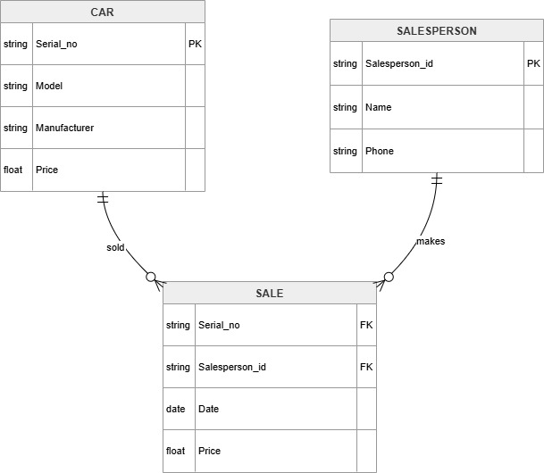

# Lab: Relational Data Concepts — Car Dealership Database Schema

**Estimated time:** 10 minutes

---

## Learning Objectives

After completing this lab you'll be able to evaluate your knowledge of relational database concepts and the Entity-Relationship (ER) Diagram. You'll also improve your understanding of terms related to relational models like entity, attribute, and keys.

| Objective | Description |
|:----------|:------------|
| **Evaluate knowledge** | Apply relational database concepts to a real-world schema |
| **Understand terminology** | Master terms like entity, attribute, primary key, and foreign key |
| **Analyze relationships** | Identify how tables relate to each other through foreign keys |

---

## Concepts Covered in this Lab

| Concept | Definition | Database Equivalent |
|:--------|:-----------|:-------------------|
| **Entity** | A person, place, object, or event about which data is stored | Table |
| **Attribute** | A property or characteristic of an entity | Column |
| **Primary Key** | A unique identifier for each row in a table | Column(s) with unique values |
| **Foreign Key** | A field in one table that refers to the primary key of another table | Column that creates a relationship |
| **Entity-Relationship (ER) Diagram** | A diagram that shows entities (tables), attributes (columns), and the relationships between them | Visual representation of database structure |

---

## Schema Diagram for the Car Dealership Relational Database

The Car Dealership database is designed to keep track of automobile sales in a car dealership.

### Database Schema Overview

```

┌─────────────────────────────────────────────────────────────────────────────┐
│                           CAR DEALERSHIP DATABASE                            │
├─────────────────────────────────────────────────────────────────────────────┤
│                                                                             │
│  ┌─────────────────┐      ┌─────────────────┐      ┌─────────────────────┐ │
│  │       CAR       │      │      SALE       │      │    SALESPERSON      │ │
│  ├─────────────────┤      ├─────────────────┤      ├─────────────────────┤ │
│  │ ╔═════════════╗ │      │ ╔═════════════╗ │      │ ╔══════════════════╗ │ │
│  │ ║ Serial_no (PK)║ │◄────│ ║ Serial_no (FK)║ │      │ ║ Salesperson_id(PK)║ │ │
│  │ ╚═════════════╝ │      │ ╚═════════════╝ │      │ ╚══════════════════╝ │ │
│  │ Model          │      │ Date           │      │ Name                │ │
│  │ Manufacturer   │      │ Price          │      │ Phone               │ │
│  │ Price          │      │ ╔═════════════╗ │      │                     │ │
│  └─────────────────┘      │ ║Salesperson_id│ │      └─────────────────────┘ │
│                           │ ║    (FK)      │ │                              │
│                           │ ╚═════════════╝ │                              │
│                           └─────────────────┘                              │
│                                                                             │
│  PK = Primary Key                                                          │
│  FK = Foreign Key                                                          │
│  ◄──── = Relationship                                                      │
└─────────────────────────────────────────────────────────────────────────────┘

```



### Tables and Their Attributes

| Table (Entity) | Attributes (Columns) |
|:---------------|:---------------------|
| **CAR** | Serial_no (PK), Model, Manufacturer, Price |
| **SALE** | Serial_no (FK), Date, Price, Salesperson_id (FK) |
| **SALESPERSON** | Salesperson_id (PK), Name, Phone |

---

## Relational Instance of SALE

The following is an example relational instance (sample data) of the SALE table:

| Serial_no (FK) | Date | Price | Salesperson_id (FK) |
|:---------------|:-----|:------|:--------------------|
| 1001 | 2024-01-15 | 35000.00 | 501 |
| 1002 | 2024-01-20 | 28000.00 | 502 |
| 1003 | 2024-02-05 | 42000.00 | 501 |
| 1004 | 2024-02-18 | 31000.00 | 503 |
| 1005 | 2024-03-01 | 39500.00 | 502 |

---

## Exercise: Analyze the Car Dealership Database Schema

Now let us go through some questions based on the above database schema of Car Dealership and relational instance of SALE.

---

### Question 1

**How many relations does the Car Dealership database schema contain?**

<details>
<summary>💡 Hint</summary>

A relation is also the mathematical term for a table. Count the number of tables in the schema diagram.
</details>

<details>
<summary>✅ Answer</summary>

**3**

The Car Dealership database schema contains the following 3 relations (tables):
- CAR
- SALE
- SALESPERSON
</details>

---

### Question 2

**How many columns does the relation CAR contain?**

<details>
<summary>💡 Hint</summary>

A relation is also the mathematical term for a table. A table is a combination of rows and columns. The columns are the attributes, or fields.
</details>

<details>
<summary>✅ Answer</summary>

**4**

The relation CAR contains the following 4 columns (attributes):
- Serial_no
- Model
- Manufacturer
- Price
</details>

---

### Question 3

**How many rows does the relation SALE contain?**

<details>
<summary>💡 Hint</summary>

A relation is also the mathematical term for a table. A table is a combination of rows and columns. The rows are the tuples (records).
</details>

<details>
<summary>✅ Answer</summary>

**5**

The relational instance of SALE shows 5 rows of sample data.
</details>

---

### Question 4

**Identify the attributes of the relation SALESPERSON.**

<details>
<summary>💡 Hint</summary>

A Relational Schema specifies the relation name and type of each of the columns, which are the attributes.
</details>

<details>
<summary>✅ Answer</summary>

**Salesperson_id, Name, Phone**

The relation SALESPERSON contains the following 3 attributes:
- Salesperson_id
- Name
- Phone
</details>

---

### Question 5

**Identify which relations of the Car Dealership database have primary keys. Name the primary keys if they exist.**

<details>
<summary>💡 Hint</summary>

A primary key is a column or group of columns that uniquely identify every row in a relation/table. A table cannot have more than one primary key.

The symbol representing a primary key may look like: **PK** or a key icon 🔑
</details>

<details>
<summary>✅ Answer</summary>

The relations **CAR** and **SALESPERSON** have primary keys.

| Table | Primary Key |
|:------|:------------|
| **CAR** | Serial_no |
| **SALESPERSON** | Salesperson_id |

**Note:** The SALE table does NOT have a primary key in this schema (or uses a composite key not shown).
</details>

---

### Question 6

**Which table(s) in the Car Dealership database include foreign keys? Identify the foreign keys and describe the table and column they reference.**

<details>
<summary>💡 Hint</summary>

A foreign key is a column that establishes a relationship between two relations/tables. It acts as a cross-reference between two tables as it points to the primary key of another table.

A table can have multiple foreign keys referencing primary keys of other tables.

The symbol representing a foreign key may look like: **FK** or a chain link icon 🔗
</details>

<details>
<summary>✅ Answer</summary>

The relation **SALE** has foreign keys.

| Foreign Key | References | Relationship |
|:------------|:-----------|:-------------|
| **Serial_no** | Primary key of CAR table | Links SALE to CAR (which car was sold) |
| **Salesperson_id** | Primary key of SALESPERSON table | Links SALE to SALESPERSON (which salesperson made the sale) |

**Visual Representation:**
```

SALE.Serial_no ──────► CAR.Serial_no (PK)
SALE.Salesperson_id ──► SALESPERSON.Salesperson_id (PK)

```

These foreign keys create cross-references between the three tables, establishing the relationships that define the database schema.
</details>

---

## Summary Table

| Concept | Definition | Example from Car Dealership |
|:--------|:-----------|:---------------------------|
| **Entity** | A table that stores data about a person, place, object, or event | CAR, SALE, SALESPERSON |
| **Attribute** | A column that describes a property of an entity | Serial_no, Model, Name, Price |
| **Primary Key** | Uniquely identifies each row in a table | Serial_no (CAR), Salesperson_id (SALESPERSON) |
| **Foreign Key** | References a primary key in another table | Serial_no (SALE references CAR), Salesperson_id (SALE references SALESPERSON) |
| **Tuple** | A single row/record in a table | Each row in the SALE instance |
| **Relation** | Another term for a table | CAR, SALE, SALESPERSON |

---

## ER Diagram Representation

```

┌─────────────┐         ┌─────────────┐         ┌─────────────────┐
│     CAR     │         │    SALE     │         │  SALESPERSON    │
├─────────────┤         ├─────────────┤         ├─────────────────┤
│ ╔═════════╗ │         │ ╔═════════╗ │         │ ╔═══════════════╗│
│ ║Serial_no║ │◄───────│ ║Serial_no║ │         │ ║Salesperson_id ║│
│ ╚═════════╝ │         │ ╚═════════╝ │         │ ╚═══════════════╝│
│ Model       │         │ Date        │         │ Name             │
│ Manufacturer│         │ Price       │         │ Phone            │
│ Price       │         │ ╔═════════╗ │         │                  │
└─────────────┘         │ ║Salesper-║ │         └──────────────────┘
                        │ ║son_id   ║ │
                        │ ╚═════════╝ │
                        └─────────────┘

Legend:
╔══════╗ = Primary Key
╔══════╗ (in child table) = Foreign Key
◄─────── = Relationship

```

---

## Key Takeaways

| Concept | Key Point |
|:--------|:----------|
| **Entity = Table** | Each entity in an ER diagram becomes a table in the database |
| **Attribute = Column** | Each attribute becomes a column with a specific data type |
| **Primary Key** | Every table should have a primary key to uniquely identify rows |
| **Foreign Key** | Creates relationships between tables by referencing primary keys |
| **Relationship** | Defined by foreign key columns that point to primary keys in other tables |
| **Cardinality** | The nature of relationships (one-to-one, one-to-many, many-to-many) |

---

## Practice Questions

### Question 1
What would be a good primary key for the SALE table if it doesn't have one?

<details>
<summary>✅ Answer</summary>

A composite primary key combining `Serial_no` and `Date` (assuming a car cannot be sold twice on the same day), or adding a new `Sale_ID` column as a surrogate key.
</details>

---

### Question 2
What type of relationship exists between CAR and SALE?

<details>
<summary>✅ Answer</summary>

**One-to-many** relationship. One car can appear in multiple sales records (if sold multiple times or test drives recorded), but each sale record references exactly one car.
</details>

---

### Question 3
What type of relationship exists between SALESPERSON and SALE?

<details>
<summary>✅ Answer</summary>

**One-to-many** relationship. One salesperson can make many sales, but each sale is made by exactly one salesperson.
</details>

---

## Congratulations!

You have successfully completed the **Relational Data Concepts** lab. You now understand:

- How to identify entities (tables) in a database schema
- How to identify attributes (columns) of each entity
- The purpose and function of primary keys
- The purpose and function of foreign keys
- How foreign keys create relationships between tables
- How to read and interpret an Entity-Relationship (ER) Diagram

These concepts are fundamental to understanding relational database design and are essential for working with any SQL-based database system.

---


*Last updated: April 2026*

