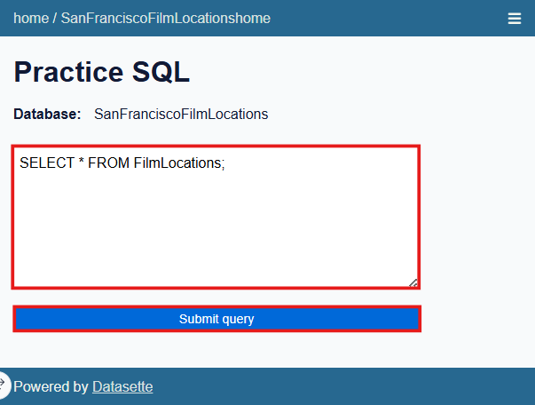
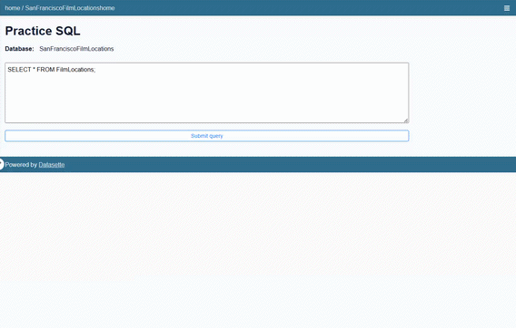
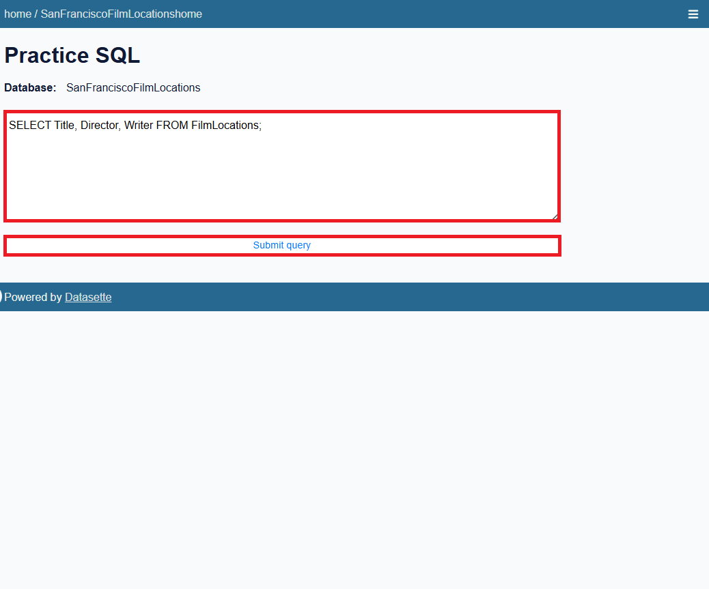
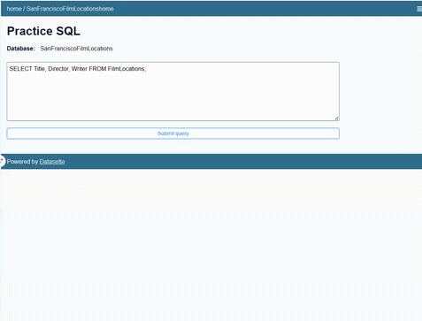
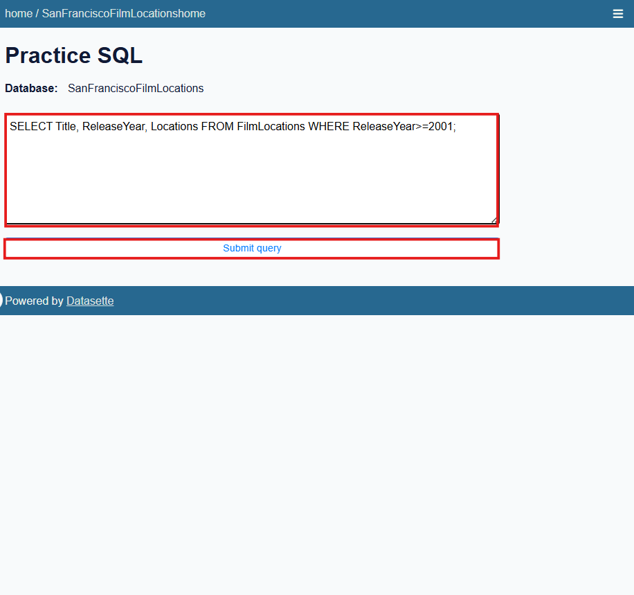
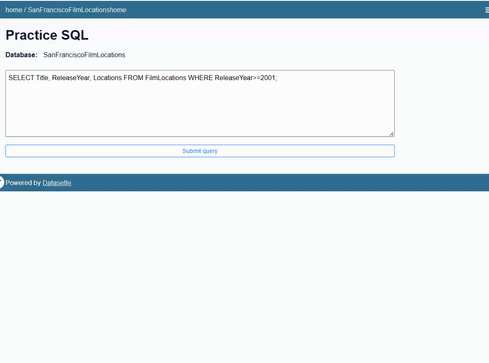
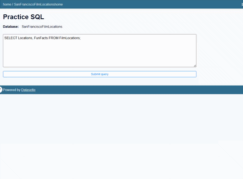

# Lab: Simple SELECT Statements — Querying the San Francisco Film Locations Database

**Estimated time:** 20 minutes

---

## Learning Objectives

After completing this lab you'll be able to use the SELECT statement, one of the most commonly used statements in SQL (Structured Query Language), to query and retrieve data from a database.

| Objective                       | Description                                                         |
| :------------------------------ | :------------------------------------------------------------------ |
| **Query a database**      | Write and execute SQL queries against a database                    |
| **Retrieve data records** | Select data from one or more tables according to specified criteria |

---

## Concepts Covered

### SELECT Statement Syntax

```sql
SELECT column1, column2, ...
FROM table_name
WHERE condition;
```

### Keywords / Clauses Explained

| Clause           | Purpose                                                                                                                                                     |
| :--------------- | :---------------------------------------------------------------------------------------------------------------------------------------------------------- |
| **SELECT** | Specifies which columns to retrieve from the database                                                                                                       |
| **FROM**   | Specifies from which table to get the data. The clause can include optional JOIN subclauses to specify the rules for joining tables                         |
| **WHERE**  | [Optional Clause] Specifies which rows to retrieve based on conditions                                                                                      |
| **;**      | Semicolon at the end of each SQL statement separates one statement from another, allowing multiple statements to be executed in the same call to the server |

### Why Use a Semicolon?

Some database systems require a semicolon at the end of each SQL statement for execution. It is a standard way to separate one SQL statement from another, which allows more than one SQL statement to be executed in the same call to the server. It is good practice to use a semicolon at the end of each SQL statement.

---

## Tools Needed

**Datasette**, a no-charge open-source multi-tool for exploring and publishing data, accessible through your web browser.

**Database:** San Francisco Film Locations dataset (Public Domain Dedication and License)

---

## Introduction to Lab Environment

### Software Used in this Lab

In this lab, you will use **Datasette**, an open source tool for exploring and publishing data. You can visit the [Datasette GitHub repository](https://github.com/simonw/datasette) for more information.

### Working with Datasette

The Datasette tool offers a platform to input and execute SQL queries. By clicking the **Submit query** button, you can execute the SQL query.

### Database Used in this Lab

The database used in this lab comes from the following dataset source: **Film Locations in San Francisco** under a **PDDL: Public Domain Dedication and License**.

---

## Exploring the Database

Let us first explore the **FilmLocations** database using the Datasette tool:

### Step 1: Run the Initial Query

1. If the first statement listed below is not already in the Datasette textbox, copy the code below by clicking on the copy button and then paste it into the textbox of the Datasette tool using `Ctrl+V` or right-click and choose **Paste**

```sql
SELECT * FROM FilmLocations;
```

2. Click **Submit Query**
3. Now you can scroll down the table and explore all the columns and rows of the `FilmLocations` table to get an overall idea of the table contents

![FilmLocations table preview]



### Column Attribute Descriptions

| Column                      | Description                                          |
| :-------------------------- | :--------------------------------------------------- |
| **Title**             | Titles of the films                                  |
| **ReleaseYear**       | Time of public release of the films                  |
| **Locations**         | Locations of San Francisco where the films were shot |
| **FunFacts**          | Funny facts about the filming locations              |
| **ProductionCompany** | Companies who produced the films                     |
| **Distributor**       | Companies who distributed the films                  |
| **Director**          | People who directed the films                        |
| **Writer**            | People who wrote the films                           |
| **Actor1**            | Person 1 who acted in the films                      |
| **Actor2**            | Person 2 who acted in the films                      |
| **Actor3**            | Person 3 who acted in the films                      |

---

## Exercise 1: Basic SELECT Queries

In this exercise, you will go through some examples of using SELECT queries to retrieve data from the FilmLocations table.

### Task A: Example Exercises on SELECT

Let us go through some examples of SELECT related queries:

---

#### Example 1: Retrieve All Columns

**Problem:** Retrieve all columns from the "FilmLocations" table.

**Solution:**

```sql
SELECT * FROM FilmLocations;
```

1. Copy the solution code above
2. Paste it into the Datasette textbox
3. Click **Submit Query**

**Expected Output:**

```
All columns and rows from the FilmLocations table
```

![SELECT all columns result]



---

#### Example 2: Retrieve Specific Columns

**Problem:** Retrieve the names of all films along with their release years.

**Solution:**

```sql
SELECT Title, ReleaseYear FROM FilmLocations;
```

1. Copy the solution code above
2. Paste it into the Datasette textbox
3. Click **Submit Query**

**Expected Output:**

```
Title                    | ReleaseYear
-------------------------|------------
[film titles]            | [release years]
```

![SELECT specific columns result]





---

#### Example 3: SELECT with WHERE Clause

**Problem:** Retrieve the names of all films released in the 21st century and onwards (release years after 2001 including 2001), along with filming locations and release years.

**Solution:**

```sql
SELECT Title, ReleaseYear, Locations 
FROM FilmLocations 
WHERE ReleaseYear >= 2001;
```

1. Copy the solution code above
2. Paste it into the Datasette textbox
3. Click **Submit Query**

**Expected Output:**

```
Title                    | ReleaseYear | Locations
-------------------------|-------------|------------------
[film titles from 2001+] | [year]      | [filming location]
```

![SELECT with WHERE clause result]





---

### Task B: Practice Exercises on SELECT

Now, let's practice creating and running some SELECT queries.

---

#### Problem 1

**Problem:** Retrieve the fun facts and filming locations of all films.

<details>
<summary>💡 Hint</summary>

Use `SELECT` with the `FunFacts` and `Locations` columns from the `FilmLocations` table.

</details>

<details>
<summary>✅ Solution</summary>

```sql
SELECT FunFacts, Locations FROM FilmLocations;
```

</details>

<details>
<summary>📤 Output</summary>

```
FunFacts                                          | Locations
--------------------------------------------------|-------------------
[funny facts about filming]                       | [filming location]
```

</details>




---

#### Problem 2

**Problem:** Retrieve the names of all films released in the 20th century and before (release years before 2000 including 2000), along with filming locations and release years.

<details>
<summary>💡 Hint</summary>

Use `SELECT` with `Title`, `ReleaseYear`, and `Locations`. Use a `WHERE` clause with `ReleaseYear <= 2000`.

</details>

<details>
<summary>✅ Solution</summary>

```sql
SELECT Title, ReleaseYear, Locations 
FROM FilmLocations 
WHERE ReleaseYear <= 2000;
```

</details>

<details>
<summary>📤 Output</summary>

```
Title                    | ReleaseYear | Locations
-------------------------|-------------|------------------
[films from 2000 and earlier] | [year] | [filming location]
```

</details>

---

#### Problem 3

**Problem:** Retrieve the names, production company names, filming locations, and release years of the films which are not written by James Cameron.

<details>
<summary>💡 Hint</summary>

Use `SELECT` with `Title`, `ProductionCompany`, `Locations`, and `ReleaseYear`. Use a `WHERE` clause with `Writer != "James Cameron"` or `Writer <> "James Cameron"`.

</details>

<details>
<summary>✅ Solution</summary>

```sql
SELECT Title, ProductionCompany, Locations, ReleaseYear 
FROM FilmLocations 
WHERE Writer != "James Cameron";
```

</details>

<details>
<summary>📤 Output</summary>

```
Title        | ProductionCompany | Locations | ReleaseYear
-------------|-------------------|-----------|-------------
[film title] | [company name]    | [location]| [year]
```

</details>

---

## Exercise 2: Take Screenshots

1. Take a screenshot showing one of your SELECT queries and its result
2. Save the file as `SQL_SELECT_Query.png`

---

## Lab Completion Checklist

| Task                                                        | Completed |
| :---------------------------------------------------------- | :-------- |
| Explored the FilmLocations table with `SELECT *`          | ☐        |
| Retrieved specific columns with `SELECT column1, column2` | ☐        |
| Used `WHERE` clause to filter results by year             | ☐        |
| Solved SELECT practice exercises (3 problems)               | ☐        |
| Took screenshot of SELECT query                             | ☐        |

---

## Screenshot Checklist

| Screenshot   | File Name                | Description                                             |
| :----------- | :----------------------- | :------------------------------------------------------ |
| SELECT Query | `SQL_SELECT_Query.png` | SELECT query with WHERE clause showing filtered results |

---

## Troubleshooting Tips

| Issue                              | Solution                                                                                        |
| :--------------------------------- | :---------------------------------------------------------------------------------------------- |
| **Query returns no results** | Check for typos in column names or string values (SQL is case-sensitive for string comparisons) |
| **Column name not found**    | Verify column names match the table schema exactly                                              |
| **String comparison fails**  | Use double quotes for string literals in Datasette:`WHERE Writer="James Cameron"`             |
| **Incorrect results**        | Check your `WHERE` condition logic (e.g., `>=` vs `>`, `<=` vs `<`)                   |
| **Syntax error**             | Ensure each column name is separated by commas and no trailing comma after the last column      |

---

## Common SELECT Patterns

| Pattern                | Purpose                         | Example                                          |
| :--------------------- | :------------------------------ | :----------------------------------------------- |
| `SELECT *`           | Retrieve all columns            | `SELECT * FROM FilmLocations`                  |
| `SELECT col1, col2`  | Retrieve specific columns       | `SELECT Title, ReleaseYear FROM FilmLocations` |
| `WHERE col = value`  | Filter by equality              | `WHERE Writer="James Cameron"`                 |
| `WHERE col != value` | Filter by inequality            | `WHERE Writer != "James Cameron"`              |
| `WHERE col > value`  | Filter by greater than          | `WHERE ReleaseYear > 2000`                     |
| `WHERE col >= value` | Filter by greater than or equal | `WHERE ReleaseYear >= 2001`                    |
| `WHERE col < value`  | Filter by less than             | `WHERE ReleaseYear < 2000`                     |
| `WHERE col <= value` | Filter by less than or equal    | `WHERE ReleaseYear <= 2000`                    |

---

## Key Takeaways

| Concept                        | Description                                                                            |
| :----------------------------- | :------------------------------------------------------------------------------------- |
| **SELECT**               | The most fundamental SQL statement for retrieving data from databases                  |
| **FROM**                 | Specifies which table to query                                                         |
| **WHERE**                | Filters rows based on conditions; only rows that satisfy the condition are returned    |
| **Column selection**     | List specific columns after SELECT to retrieve only needed data, improving performance |
| **SELECT \***            | Retrieves all columns; useful for exploration but avoid in production                  |
| **String comparison**    | Use double quotes `"` around string values in Datasette                              |
| **Comparison operators** | `=`, `!=`, `>`, `<`, `>=`, `<=` for filtering numeric and date values      |

---

## Summary

In this hands-on lab, you have:

| Activity                                                          | Completed |
| :---------------------------------------------------------------- | :-------- |
| Explored the FilmLocations database using Datasette               | ✓        |
| Used `SELECT *` to retrieve all columns from a table            | ✓        |
| Used `SELECT column1, column2` to retrieve specific columns     | ✓        |
| Used `WHERE` clause with comparison operators to filter results | ✓        |
| Filtered films by release year using `>=` and `<=` operators  | ✓        |
| Filtered films by writer using `!=` operator                    | ✓        |
| Solved SELECT practice exercises                                  | ✓        |
| Took screenshots of SELECT queries for documentation              | ✓        |

---

## Congratulations!

You have successfully completed the **Simple SELECT Statements — Querying the San Francisco Film Locations Database** lab. You now know how to:

- Write basic SELECT statements to retrieve data from a database
- Select specific columns rather than retrieving all columns
- Use the WHERE clause to filter results based on conditions
- Use comparison operators (`=`, `!=`, `>`, `<`, `>=`, `<=`) in WHERE clauses
- Query string, numeric, and date columns with appropriate syntax

These skills are fundamental to working with databases and form the foundation for more advanced SQL queries involving multiple tables, aggregations, and subqueries.

---

*Last updated: January 2026*
