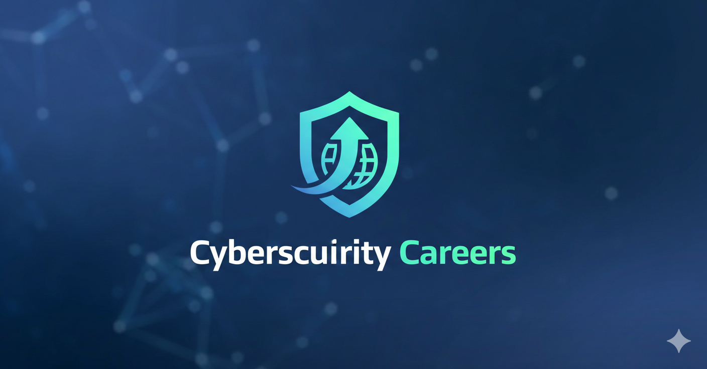

# Comprehensive Guide to Cybersecurity Careers

## Introduction

After reading this article, you will be able to:

- Distinguish between Cybersecurity and Information Security
- Summarize the cybersecurity market definition
- Analyze the impact of cybersecurity attacks
- Describe the current cybersecurity landscape
- Identify entry-level, mid-level, and advanced-level career paths in cybersecurity with corresponding salaries, responsibilities, and daily tasks

In today's digital-driven world, establishing cybersecurity is essential to protecting sensitive information and maintaining a secure business environment. As cyber threats continue to evolve exponentially, so do the career opportunities for professionals looking to enter or advance in this dynamic and critically important field. The cybersecurity workforce has become the frontline defense in an era where digital assets represent the core value of most modern organizations.

---

## Section 1: Foundational Concepts

### Cybersecurity Compared to Information Security

Cybersecurity and information security are related concepts that are often used interchangeably in casual conversation, but they have distinguishing features that every professional in the field should understand.

**Cybersecurity** focuses specifically on safeguarding computer systems, networks, and digital assets from cyber threats such as hacking, malware, ransomware, and unauthorized access. It encompasses the technical measures and tools used to protect data in its digital form as it travels through networks or resides on devices. Cybersecurity professionals deploy safety measures such as firewalls, encryption protocols, intrusion detection systems, and endpoint protection platforms to defend against cyber-attacks originating from the digital realm.

> **Example in Practice:** When a multinational corporation implements a next-generation firewall at all network perimeter points, deploys endpoint detection and response software on every employee laptop, and uses encrypted VPN connections for remote workers, these are cybersecurity measures specifically protecting digital assets from network-based threats.

**Information security** is a broader discipline that encompasses protecting all forms of information, regardless of their format—whether physical or digital, in transit or at rest. Information security includes not only the technical aspects of cybersecurity but also organizational policies, procedures, and practices that ensure the confidentiality, integrity, and availability of information (often referred to as the CIA triad). Security measures in this domain include data classification frameworks, access control policies, employee security awareness training, physical security controls, and comprehensive incident response plans that address both digital and physical breaches.

> **Example in Practice:** Consider a law firm handling sensitive client documents. Information security encompasses the physical security of paper files in locked cabinets (physical control), the policy requiring attorneys to clean their desks before leaving (administrative control), the biometric access system for the file room (physical technical control), and the encrypted database storing digital copies (cybersecurity technical control). The cybersecurity measures protect the digital copies, while information security ensures comprehensive protection of all information forms.

The critical distinction to remember is that **cybersecurity is a subset of information security**, explicitly addressing the protection of digital assets in cyberspace while information security covers the entire spectrum of information protection across all media and formats.

---

### Cybersecurity Market Definition and Projections

According to the market definition in Cybersecurity - Worldwide:

> "Cybersecurity is the process that provides and maintains confidentiality, integrity, availability, and privacy. This includes measures to prevent and respond to all cybercrimes, such as digital attacks and disruptions, to protect computer systems, networks, programs, and data (e.g., personal assets, important files, industrial and governmental information). The market for Cybersecurity includes revenues generated by the two key products, namely Cyber Solution and Security Services."

The financial scale of this market reflects its critical importance to the global economy:

> "Revenue in the cybersecurity market is projected to reach **$162 billion in 2023**."

> "Revenue is expected to show an annual growth rate of **9.63%** , resulting in a market volume of **$256 billion by 2028**."

**Source:** [Statista - Cybersecurity - Worldwide](https://www.statista.com/outlook/tmo/cybersecurity/worldwide)

> **Market Growth Example:** The exponential increase in cloud adoption following the COVID-19 pandemic has driven tremendous growth in the cloud security segment. Companies like Zscaler, Palo Alto Networks, and CrowdStrike have seen their valuations soar as organizations rush to secure their distributed workforces and cloud-hosted applications. This market expansion has created thousands of new cybersecurity positions across all experience levels.

---

### Impact of Cybersecurity Attacks

The surge in cyberattacks is causing economic damage worth trillions of dollars annually, paradoxically creating a potential market opportunity of **$2 trillion** for cybersecurity technology and service providers who can effectively address these threats. Digital crime continues its upward trajectory alongside the growth of the digital economy, with projections indicating annual damage reaching nearly **$10.5 trillion by 2025**. Despite organizations increasing their cybersecurity expenditure to approximately $150 billion in 2021, the scale and sophistication of the threat landscape suggest these investments remain inadequate relative to the risks.

Recent industry surveys reveal alarming trends: the volume of threats detected in 2022 was double that of 2021, with 80% of threat groups and over 40% of malware strains detected in 2021 being previously unknown. This rapid evolution of threats means that current commercial solutions often fail to fully address customer requirements, creating a significant gap between market demand and available security solutions.

> **Real-World Impact Example:** The 2017 NotPetya attack, initially targeting Ukrainian organizations, rapidly spread globally causing over $10 billion in damages. Shipping giant Maersk was forced to rebuild its entire IT infrastructure from a single surviving domain controller in Nigeria. This single attack demonstrated how cyber incidents can paralyze global supply chains, destroy corporate IT assets, and require months of recovery effort. The attack's success stemmed from sophisticated malware that exploited vulnerabilities traditional security solutions failed to address, perfectly illustrating the gap between available solutions and actual threats.

**Source:** [McKinsey - New survey reveals $2 trillion market opportunity for cybersecurity technology and service providers](https://www.mckinsey.com/capabilities/risk-and-resilience/our-insights/cybersecurity/new-survey-reveals-2-trillion-dollar-market-opportunity-for-cybersecurity-technology-and-service-providers)

---

### The Evolving Cybersecurity Landscape

The cybersecurity landscape is advancing at an unprecedented pace, driven by three primary forces: emerging technologies, increasingly rigid regulatory requirements, and the escalating sophistication of threats. Global regulatory programs such as the European Union's General Data Protection Regulation (GDPR), California's Consumer Privacy Act (CCPA), and industry-specific standards like HIPAA for healthcare and PCI-DSS for payment card processing enforce rigorous cybersecurity standards. These requirements cascade down through supply chains, with small and mid-sized businesses (SMBs) increasingly required to demonstrate vendor compliance to win and retain enterprise clients.

Organizations are responding to these challenges by leveraging advanced technologies, particularly artificial intelligence and machine learning, to achieve visibility across massive log volumes and detect cyber threats in real-time. Security Information and Event Management (SIEM) platforms now incorporate user and entity behavior analytics (UEBA) to identify anomalous activities that might indicate a compromised account or insider threat.

> **AI in Action Example:** A major bank processes over 100 million transactions daily. Their AI-powered security platform continuously analyzes this data stream, establishing behavioral baselines for each account. When the system detects a series of small test transactions from a corporate account followed by a large wire transfer to an unfamiliar destination—all occurring at 3 AM when the account isn't normally used—it automatically blocks the transaction, alerts the incident response team, and initiates step-up authentication for the account. This real-time detection and response would be impossible for human analysts alone given the data volume.

However, a global talent shortage in cybersecurity, significantly aggravated by the explosion in digital threats during the COVID-19 pandemic, has increased organizational dependency on third-party service providers. Managed Security Service Providers (MSSPs) and consultants now play essential roles in many organizations' security postures, with enterprises allocating substantial percentages of their security budgets to outsourced services. This talent gap, combined with intensifying security and privacy concerns across all business scales and sectors, creates unprecedented opportunities for cybersecurity professionals at every career stage.

**Source:** [McKinsey - New survey reveals $2 trillion market opportunity for cybersecurity technology and service providers](https://www.mckinsey.com/capabilities/risk-and-resilience/our-insights/cybersecurity/new-survey-reveals-2-trillion-dollar-market-opportunity-for-cybersecurity-technology-and-service-providers)

---

## Section 2: Entry-Level Cybersecurity Careers

The following chart outlines entry-level career opportunities in the cybersecurity field. These positions typically require 0-3 years of experience and provide the foundational knowledge and skills necessary for advancement in the profession.

**Note:** The provided salary information is based on US data and can vary significantly depending on factors such as geographic location, company size and industry, educational background, professional certifications, and specific technical skills.

| Entry-Level Career | Similar Job Titles | Salary Information (US) | Core Responsibilities | Daily Work Example |
|:---|:---|:---|:---|:---|
| **Cybersecurity Specialist** | IT Security Specialist | **Range:** $45,510 - $142,500 | Monitor systems for security threats | A specialist at a regional hospital begins their shift reviewing overnight alerts from the intrusion detection system. They find three failed login attempts from an unfamiliar IP address targeting a radiology workstation, investigate whether this represents a scanning attempt or misconfigured application, block the IP address at the firewall, and document the incident in the ticketing system. Afternoon hours are spent deploying critical security patches to 200 workstations and updating the antivirus definitions across the organization's server fleet. The day concludes with research on a newly discovered ransomware variant targeting healthcare organizations, preparing a brief for tomorrow's team meeting. |
| | Information Security Specialist | | Investigate security breaches | |
| | IT Security Analyst | | Apply security measures to prevent attacks | |
| | Network Security Specialist | **Median:** $93,519 | Continuously learn about evolving threats | |
| | Security Operations Center (SOC) Analyst | | Document security incidents and responses | |
| **Cybercrime Analyst** | Digital Forensics Analyst | **Range:** $25,500 - $152,000 | Identify patterns in cybercrime activities | Following detection of a data breach, a cybercrime analyst arrives at the scene to begin investigation. They create forensic images of affected servers using write-blockers to preserve evidence integrity, analyze memory dumps to identify the attacker's tools and techniques, recover deleted files containing malware samples, and meticulously document every action in a chain-of-custody log. They identify that the attacker gained entry through a phishing email and establish the timeline of intrusion: initial access occurred 72 hours ago, with lateral movement beginning 48 hours ago, and data exfiltration completing just 6 hours before discovery. The analyst prepares a preliminary report for law enforcement and provides recommendations to the incident response team for containment. |
| | Cyber Forensic Examiner | | Foresee potential attacks based on trends | |
| | Security Investigator | | Support development of defense strategies | |
| | Computer Forensic Specialist | **Median:** $107,295 | Collect and preserve digital evidence | |
| | Digital Crime Investigator | | Report findings to stakeholders and law enforcement | |
| **Intrusion and Incident Analyst** | Incident Response Analyst | **Range:** $36,212 - $130,499 | Identify and respond to security breaches | A mid-sized e-commerce company experiences a security incident. The intrusion analyst receives the alert and immediately begins investigation, confirming that a phishing email successfully tricked a finance department employee into revealing their credentials. Within minutes, the analyst resets the compromised account, terminates all active sessions, and isolates the affected workstation from the network to prevent further attacker movement. They then conduct deeper investigation, analyzing authentication logs to trace the attacker's actions, discovering they accessed three files containing customer information before being locked out. The analyst coordinates with the finance team to identify any unauthorized transactions, works with IT to restore the workstation from a pre-infection backup, and drafts new email filtering rules to block similar phishing attempts in the future. |
| | Cybersecurity Incident Handler | | Locate breach sources and assess damage | |
| | Threat Response Specialist | | Develop and implement containment strategies | |
| | Security Operations Analyst | **Median:** $93,488 | Investigate intrusion causes | |
| | Incident Coordinator | | Participate in post-incident recovery | |
| **IT Auditor** | IT Audit Associate | **Range:** $30,804 - $147,492 | Examine IT systems for compliance | A manufacturing company preparing for ISO 27001 certification engages an IT auditor to assess their readiness. The auditor begins by reviewing the company's information security policies, comparing them against ISO requirements and identifying gaps in documentation. They then conduct technical testing, attempting to access restricted systems using credentials from terminated employees (finding three accounts still active), reviewing firewall rule sets for excessive permissions, and examining access logs for anomalies. The auditor interviews system administrators about their change management processes and observes physical security controls at the data center. The engagement culminates in a detailed report documenting findings, prioritizing risks, and providing specific remediation recommendations for achieving certification. |
| | IT Internal Auditor | | Ensure compliance with laws and standards | |
| | Compliance Auditor | | Identify security risks and weaknesses | |
| | Information Systems Auditor | **Median:** $89,953 | Recommend security improvements | |
| | Audit and Assurance Associate | | Conduct regular security audits | |

---

## Section 3: Mid-Level Cybersecurity Careers

The following chart outlines mid-level career opportunities in the cybersecurity field. These positions typically require 3-7 years of experience and involve greater responsibility, technical depth, and often team leadership or project management components.

| Mid-Level Career | Similar Job Titles | Salary Information (US) | Core Responsibilities | Daily Work Example |
|:---|:---|:---|:---|:---|
| **Cybersecurity Analyst** | Information Security Analyst | **Range:** $45,510 - $142,500 | Monitor networks and systems for breaches | A cybersecurity analyst at a financial services firm starts each day by reviewing the previous night's SIEM alerts, prioritizing the 15 critical alerts requiring immediate investigation. They discover that a marketing department workstation has been communicating with a known command-and-control server and immediately isolate the system, begin memory analysis to identify the malware, and trace the infection vector to a malicious advertisement on a legitimate website. After containing the threat, the analyst updates the organization's web filtering policy to block the malicious domain, creates indicators of compromise (IOCs) for the threat hunting team, and prepares a detailed incident report for the security manager. The afternoon involves participating in a vulnerability assessment of a new web application scheduled for launch, running automated scans and manually verifying findings before the development team begins remediation. |
| | Security Analyst | | Investigate security incidents | |
| | IT Security Analyst | | Implement security standards and protocols | |
| | Threat Analyst | **Median:** Information security analyst: $112,000 | Conduct regular system audits | |
| | Vulnerability Management Analyst | | Document security findings and recommendations | |
| **Cybersecurity Consultant** | Security Consultant | **Range:** $57,200 - $188,489 | Perform comprehensive security audits | A regional bank engages a cybersecurity consultant to assess their security posture following industry peer breaches. The consultant arrives on Monday and begins by interviewing the CISO, IT director, and compliance officer to understand current security practices and business constraints. Tuesday involves technical assessment: reviewing firewall configurations, attempting to penetrate external-facing applications, and conducting a wireless security assessment of the bank's branches. Wednesday is dedicated to policy review, examining incident response plans, business continuity documentation, and employee training materials. Thursday includes running a simulated phishing campaign against 200 employees to assess security awareness. Friday, the consultant synthesizes findings into a comprehensive report, presenting to the board of directors with prioritized recommendations including implementing multi-factor authentication for all remote access, segmenting the branch networks from core banking systems, and adopting a managed detection and response service to address staffing limitations. |
| | Information Security Consultant | | Identify vulnerabilities and improvement areas | |
| | Security Advisor | | Design and implement security strategies | |
| | Cloud Security Consultant | **Median:** Security consultant: $112,000 | Provide training on best practices | |
| | IT Security Specialist | | Support incident response efforts | |
| **Penetration and Vulnerability Tester** | Penetration Tester | **Range:** $90,000 - $169,500 | Identify and exploit system vulnerabilities | A penetration testing team is engaged by a healthcare technology company to assess their patient portal application before launch. The lead tester begins with reconnaissance, gathering information about the application's technology stack and mapping its attack surface. They then systematically test for common vulnerabilities: attempting SQL injection in search fields, testing file upload functionality for unrestricted upload flaws, and probing authentication mechanisms for weaknesses. They successfully exploit a cross-site scripting vulnerability in the patient messaging feature, demonstrating how an attacker could steal session cookies and impersonate legitimate users. The tester meticulously documents each finding with proof-of-concept code, screenshots, and step-by-step reproduction instructions. The engagement concludes with a debrief session where the tester explains each vulnerability to the development team, prioritizes them by business risk, and provides specific code-level remediation guidance. They also conduct a knowledge transfer session on secure coding practices to prevent similar vulnerabilities in future development. |
| | Vulnerability Analyst | | Conduct ethical, controlled security testing | |
| | Ethical Hacker | | Document testing processes and findings | |
| | Security Assessment Specialist | **Median:** Penetration tester: $122,000 | Recommend robust security measures | |
| | Red Team Member | | Collaborate with IT teams on remediation | |

---

## Section 4: Advanced-Level Cybersecurity Careers

The following chart outlines advanced-level career opportunities in the cybersecurity field. These positions typically require 7-15+ years of experience and involve strategic leadership, program management, enterprise architecture, and significant organizational influence.

| Advanced-Level Career | Similar Job Titles | Salary Information (US) | Core Responsibilities | Daily Work Example |
|:---|:---|:---|:---|:---|
| **Cybersecurity Manager** | Information Security Manager | **Range:** $44,000 - $192,000 | Oversee all aspects of cybersecurity program | A cybersecurity manager at a growing technology company begins their week by reviewing the previous week's security metrics: incidents detected, mean time to respond, patch compliance percentages, and vulnerability remediation timelines. They conduct the weekly team stand-up meeting, reviewing priorities with their staff of eight security professionals, assigning responsibilities for the week's projects, and addressing any resource constraints or blockers. The manager then meets with the HR director to discuss the security awareness training program, reviewing phishing simulation results from the previous quarter and planning targeted training for departments with higher-than-average click rates. Afternoon meetings include a project status review with the IT director regarding the upcoming SIEM migration and a budget planning session with the CFO to justify additional headcount for the next fiscal year. The manager ends the day reviewing and approving security exception requests, evaluating whether proposed deviations from standard security policies present acceptable risk to the organization. |
| | Information System Security Officer | | Develop and maintain security protocols | |
| | Security Program Manager | | Lead team of cybersecurity professionals | |
| | IT Security Director (mid-size organization) | **Median:** $140,000 | Ensure compliance with privacy regulations | |
| | Security Operations Manager | | Conduct post-incident analysis | |
| | | | Stay current with cybersecurity trends | |
| **Chief Information Security Officer (CISO)** | VP of Information Security | **Range:** $20,500 - $285,500 | Establish enterprise security vision and strategy | A CISO at a Fortune 500 manufacturing company starts their day with the executive leadership team, briefing the CEO and board members on the security implications of a recently announced acquisition. They explain the cybersecurity due diligence findings, the integration risks, and the proposed budget for bringing the acquired company's security posture up to corporate standards. Following this, the CISO meets with the legal department and outside counsel to review a data breach notification letter required by recent GDPR compliance findings, ensuring the communication appropriately balances legal requirements, customer impact, and brand reputation considerations. The afternoon includes a strategy session with the security architecture team, reviewing the proposed zero-trust architecture roadmap and making decisions about multi-year technology investments. The CISO concludes the day by recording a video message for all employees, celebrating the successful completion of the annual security awareness training by 95% of the workforce and reinforcing the company's security culture priorities for the coming quarter. |
| | Chief Information Officer (in some organizations) | | Protect digital information and IT assets | |
| | Director of Information Security | | Assess and mitigate enterprise risks | |
| | Head of Cybersecurity | **Median:** $180,000 | Implement advanced security technologies | |
| | Security Executive | | Promote security-aware organizational culture | |
| | | | Interface with regulators and partners | |
| **Cybersecurity Engineer** | Security Engineer | **Range:** $13,000 - $169,500 | Design and implement robust security systems | A cybersecurity engineer at a cloud services provider is tasked with designing a secure architecture for a new multi-tenant SaaS product. They begin by reviewing the product requirements and threat modeling the application, identifying potential attack vectors and trust boundaries. Using this analysis, they design a network segmentation strategy that isolates customer data and specify firewall rules and web application firewall configurations to protect the application perimeter. The engineer then configures the cloud security posture management tools to monitor for misconfigurations and implements infrastructure-as-code security scanning to prevent insecure deployments. They spend the afternoon conducting a proof of concept for a new secrets management solution, evaluating three competing products against technical requirements and operational criteria. The week concludes with knowledge transfer sessions, documenting the security architecture for the operations team and training developers on using the new secrets management system securely. |
| | Information Security Engineer | | Develop secure networks and application architectures | |
| | Network Security Engineer | | Integrate cybersecurity measures | |
| | Cloud Security Engineer | **Median:** Security engineer: $130,000 | Conduct rigorous security testing | |
| | Security Systems Engineer | | Stay current with evolving threats | |
| | | | Educate staff on technical security aspects | |
| **Cybersecurity Architect** | Security Architect | **Range:** $24,500 - $206,500 | Design overarching security architecture | A cybersecurity architect at a global financial institution is leading the design of a new security architecture for the company's migration to a hybrid cloud model. They begin by developing a comprehensive security framework that defines how various security components will interact: identity and access management, data protection, network security, and security monitoring across on-premises and cloud environments. The architect creates detailed architecture diagrams and documentation, specifying security controls for each layer and defining the security requirements for cloud service providers. They conduct workshops with application development teams to understand their cloud migration plans and ensure security requirements are integrated from the start. The architect evaluates emerging technologies, recommending a cloud access security broker (CASB) solution to provide visibility and control over sanctioned and unsanctioned cloud applications. They present their recommendations to the architecture review board, addressing questions about implementation complexity, operational impact, and alignment with regulatory requirements. The role requires continuous research, with the architect dedicating time each week to studying new threats, technologies, and industry best practices to evolve the security architecture accordingly. |
| | Information Security Architect | | Set strategic direction for security initiatives | |
| | Security Solutions Architect | | Develop enterprise security policies and standards | |
| | Enterprise Security Architect | **Median:** Security architect: $155,000 | Ensure regulatory compliance | |
| | Cloud Security Architect | | Oversee security system implementation | |
| | | | Conduct regular security audits | |

---

## Section 5: Career Progression and Professional Development

### Typical Career Pathways

Cybersecurity professionals often follow progressive career paths, though the field offers tremendous flexibility for specialization or diversification. A typical progression might include:

1. **Entry-Level (0-3 years):** Cybersecurity Specialist, IT Auditor, SOC Analyst
2. **Mid-Level (3-7 years):** Cybersecurity Analyst, Penetration Tester, Security Consultant
3. **Advanced-Level (7-15+ years):** Security Architect, Cybersecurity Manager, CISO

### Essential Certifications by Career Stage

**Entry-Level Certifications:**
- CompTIA Security+
- CompTIA Network+
- Certified Ethical Hacker (CEH)
- GIAC Security Essentials (GSEC)

**Mid-Level Certifications:**
- Certified Information Systems Security Professional (CISSP)
- Certified Information Security Manager (CISM)
- Certified Information Systems Auditor (CISA)
- Offensive Security Certified Professional (OSCP)

**Advanced-Level Certifications:**
- Certified Information Security Manager (CISM)
- Certified Information Systems Security Professional (CISSP)
- Certified Cloud Security Professional (CCSP)
- GIAC Security Expert (GSE)

### Continuing Education Requirements

Most cybersecurity certifications require continuing professional education (CPE) credits to maintain active status, ensuring professionals stay current with the rapidly evolving threat landscape and technological advances. Professionals typically earn these credits through conferences, training courses, publishing research, teaching, and hands-on lab work.

---

## Summary

In this comprehensive guide, you have learned:

**Foundational Concepts:**
- **Cybersecurity** focuses specifically on safeguarding computer systems, networks, and digital assets from cyber threats originating in the digital realm.
- **Information security** is a broader discipline encompassing both technical cybersecurity measures and organizational policies, procedures, and practices that protect all forms of information.
- **Cybersecurity is a subset of information security**, addressing digital assets specifically while information security covers the entire spectrum of information protection.

**Market Context:**
- The cybersecurity market generates revenue through **Cyber Solutions and Security Services**, with projected growth from **$162 billion in 2023 to $256 billion by 2028**.
- Cyberattacks cause trillions in annual damages, creating a **$2 trillion market opportunity** for security providers.
- Organizations increasingly leverage **artificial intelligence and machine learning** to detect threats at scale and address the global cybersecurity talent shortage.

**Career Pathways:**

*Entry-Level Roles (0-3 years experience):*
- **Cybersecurity Specialist** - Maintains IT infrastructure security
- **Cybercrime Analyst** - Investigates digital crimes and preserves evidence
- **Intrusion and Incident Analyst** - Responds to security breaches
- **IT Auditor** - Ensures compliance with laws and standards

*Mid-Level Roles (3-7 years experience):*
- **Cybersecurity Analyst** - Monitors systems and investigates incidents
- **Cybersecurity Consultant** - Advises organizations on security improvements
- **Penetration and Vulnerability Tester** - Identifies and ethically exploits vulnerabilities

*Advanced-Level Roles (7-15+ years experience):*
- **Cybersecurity Manager** - Oversees security programs and teams
- **Chief Information Security Officer (CISO)** - Sets enterprise security vision and strategy
- **Cybersecurity Engineer** - Designs and implements security systems
- **Cybersecurity Architect** - Creates comprehensive security frameworks

The cybersecurity field offers diverse opportunities for professionals at all career stages, with strong job growth projected, competitive salaries, and the intrinsic reward of protecting critical digital assets in an increasingly connected world.
```

This guide provides a comprehensive overview of cybersecurity concepts, market trends, and career pathways, serving as a valuable resource for professionals and aspiring cybersecurity experts.