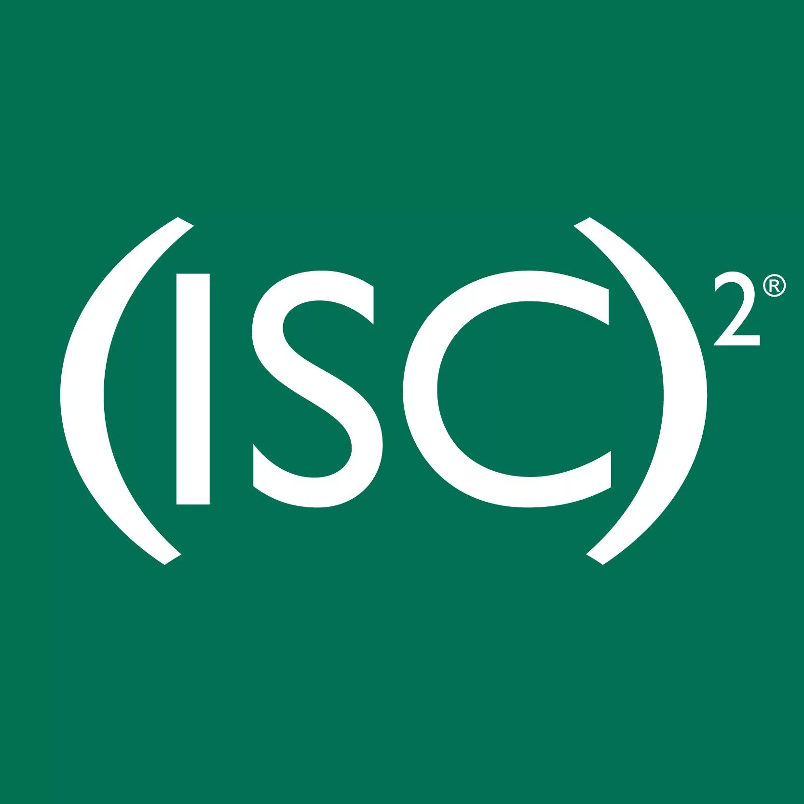

# ISC2 Certifications for Cybersecurity Professionals

## Introduction to ISC2

The International Information System Security Certification Consortium, commonly known as ISC2, is a globally renowned non-profit organization that offers several highly regarded certifications in the field of cybersecurity. With a membership of over 600,000 certified professionals worldwide, ISC2 is recognized as one of the leading authorities in cybersecurity certification and professional development.

**Website:** [https://www.isc2.org](https://www.isc2.org)

---

## Why ISC2 Certifications Matter

| Benefit                                           | Description                                                                                                                                                                |
| :------------------------------------------------ | :------------------------------------------------------------------------------------------------------------------------------------------------------------------------- |
| **Globally Recognized Gold Standard**       | ISC2 certifications, particularly the CISSP, are widely regarded as the gold standard in cybersecurity, recognized by employers, governments, and organizations worldwide. |
| **Comprehensive Knowledge Validation**      | ISC2 certifications validate deep, comprehensive knowledge across security domains, ensuring certified professionals have mastered the breadth of cybersecurity.           |
| **Ethical Commitment**                      | All ISC2 certification holders must adhere to the ISC2 Code of Ethics, demonstrating commitment to ethical practice in cybersecurity.                                      |
| **Government and Military Recognition**     | ISC2 certifications meet DoD 8570/8140 requirements and are specified in numerous government and military positions globally.                                              |
| **Professional Community**                  | ISC2 certified professionals join a global community of security experts, with access to continuing education, networking, and professional development resources.         |
| **Continuing Professional Education (CPE)** | Maintaining certification requires ongoing learning, ensuring certified professionals stay current with evolving threats and technologies.                                 |

---

## ISC2 Certification Pathways

ISC2 offers certifications targeting different career stages and specializations:

| Certification   | Level        | Focus Area                                 |
| :-------------- | :----------- | :----------------------------------------- |
| **CC**    | Entry-Level  | Foundational cybersecurity concepts        |
| **SSCP**  | Practitioner | IT infrastructure security implementation  |
| **CISSP** | Advanced     | Comprehensive security program management  |
| **CCSP**  | Specialized  | Cloud security architecture and operations |
| **CSSLP** | Specialized  | Secure software development lifecycle      |
| **CGRC**  | Specialized  | Governance, risk, and compliance           |

---

## ISC2 Certifications for Cybersecurity Professionals

### CC (Certified in Cybersecurity)

| Aspect                               | Details                                                                                                                                                                                                                                                                                                                                                                                                                                                   |
| :----------------------------------- | :-------------------------------------------------------------------------------------------------------------------------------------------------------------------------------------------------------------------------------------------------------------------------------------------------------------------------------------------------------------------------------------------------------------------------------------------------------- |
| **Description**                | The CC credential is an entry-level certification that validates a professional's knowledge and capabilities within the realm of cybersecurity. It verifies an individual's ability to understand and effectively manage various cybersecurity threats, risks, and potential attacks. This certification focuses on cybersecurity concepts such as cybersecurity principles, network security, application security, systems security, and data security. |
| **Target Audience**            | Professionals seeking to enter the cybersecurity field; individuals transitioning from other IT roles; students and recent graduates; career changers with no prior security experience.                                                                                                                                                                                                                                                                  |
| **Exam Code**                  | ISC2 CC                                                                                                                                                                                                                                                                                                                                                                                                                                                   |
| **Key Domains**                | • Security Principles (confidentiality, integrity, availability)`<br>`• Incident Response, Business Continuity, and Disaster Recovery`<br>`• Access Controls Concepts`<br>`• Network Security`<br>`• Security Operations                                                                                                                                                                                                                     |
| **Experience Requirement**     | None—entry-level certification                                                                                                                                                                                                                                                                                                                                                                                                                           |
| **Relevance to Cybersecurity** | Provides foundational knowledge for those new to cybersecurity, establishing baseline understanding of core concepts before pursuing more advanced certifications.                                                                                                                                                                                                                                                                                        |
| **Ideal For**                  | Career changers, recent graduates, IT professionals transitioning to security, anyone starting their cybersecurity journey                                                                                                                                                                                                                                                                                                                                |
| **Typical Career Stage**       | Entry-level (0-2 years experience)                                                                                                                                                                                                                                                                                                                                                                                                                        |

> **Why CC Matters:** Not everyone entering cybersecurity comes from a technical background. CC provides a structured introduction to security concepts, ensuring newcomers understand fundamentals before moving to practitioner-level certifications. It's ISC2's pathway for building the next generation of security professionals.

---

### SSCP (Systems Security Certified Practitioner)

| Aspect                               | Details                                                                                                                                                                                                                                                                                                                                        |
| :----------------------------------- | :--------------------------------------------------------------------------------------------------------------------------------------------------------------------------------------------------------------------------------------------------------------------------------------------------------------------------------------------- |
| **Description**                | The SSCP validates an individual's proficiency in implementing, monitoring, and administering IT infrastructure. The certification focuses on various system security concepts, including access controls, administration, auditing and monitoring, risk, response and recovery, cryptography, data communication, and malicious code/malware. |
| **Target Audience**            | IT administrators, managers, and network security professionals looking to enhance their credentials; hands-on practitioners responsible for day-to-day security operations.                                                                                                                                                                   |
| **Exam Code**                  | SSCP                                                                                                                                                                                                                                                                                                                                           |
| **Key Domains**                | • Security Operations and Administration`<br>`• Access Controls`<br>`• Risk Identification, Monitoring, and Analysis`<br>`• Incident Response and Recovery`<br>`• Cryptography`<br>`• Network and Communications Security`<br>`• Systems and Application Security                                                           |
| **Experience Requirement**     | At least one year of cumulative paid work experience in one or more of the seven domains. A bachelor's or master's degree in cybersecurity or a related field can satisfy one year of experience.                                                                                                                                              |
| **Relevance to Cybersecurity** | SSCP focuses on the practitioner's perspective—the people who implement and operate security controls day-to-day. It validates hands-on technical skills rather than just theoretical knowledge.                                                                                                                                              |
| **Ideal For**                  | Security administrators, system administrators, network administrators, security analysts, security consultants, IT managers with security responsibilities                                                                                                                                                                                    |
| **Typical Career Stage**       | Early to mid-level (1-4 years experience)                                                                                                                                                                                                                                                                                                      |

> **Why SSCP Matters:** While CISSP is often seen as the goal for security professionals, SSCP is equally valuable for those who work on the front lines—implementing controls, managing systems, and responding to incidents. It validates that practitioners know not just what to do, but how to do it.

---

### CISSP (Certified Information Systems Security Professional)

| Aspect                               | Details                                                                                                                                                                                                                                                                                                                                                                                                                                                                                                                                                                                                                                                |
| :----------------------------------- | :----------------------------------------------------------------------------------------------------------------------------------------------------------------------------------------------------------------------------------------------------------------------------------------------------------------------------------------------------------------------------------------------------------------------------------------------------------------------------------------------------------------------------------------------------------------------------------------------------------------------------------------------------- |
| **Description**                | The CISSP verifies an individual's comprehensive knowledge in designing, implementing, and managing a top-notch cybersecurity program. The exam covers eight domains of IT security, including security and risk management, asset security, security engineering, communications and network security, identity and access management, security assessment and testing, security operations, and software development security. The CISSP certification is a gold-standard credential, highly valued by IT professionals aiming to establish their cybersecurity sector expertise and employers seeking skilled and certified security professionals. |
| **Target Audience**            | Experienced security practitioners, managers, and executives; those responsible for developing and managing security programs; professionals seeking to validate comprehensive security knowledge.                                                                                                                                                                                                                                                                                                                                                                                                                                                     |
| **Exam Code**                  | CISSP                                                                                                                                                                                                                                                                                                                                                                                                                                                                                                                                                                                                                                                  |
| **Key Domains (CBK)**          | • Domain 1: Security and Risk Management`<br>`• Domain 2: Asset Security`<br>`• Domain 3: Security Architecture and Engineering`<br>`• Domain 4: Communication and Network Security`<br>`• Domain 5: Identity and Access Management (IAM)`<br>`• Domain 6: Security Assessment and Testing`<br>`• Domain 7: Security Operations`<br>`• Domain 8: Software Development Security                                                                                                                                                                                                                                                   |
| **Experience Requirement**     | Minimum of five years of cumulative paid work experience in two or more of the eight domains. A four-year college degree or additional approved credential can waive one year of experience.                                                                                                                                                                                                                                                                                                                                                                                                                                                           |
| **Relevance to Cybersecurity** | CISSP is the most comprehensive security certification, covering the entire breadth of security knowledge. It's designed for experienced professionals who need to understand not just individual technical controls, but how all security elements work together in a program.                                                                                                                                                                                                                                                                                                                                                                        |
| **Ideal For**                  | Security consultants, security managers, security architects, security analysts, CISOs, IT directors, anyone responsible for security program development and management                                                                                                                                                                                                                                                                                                                                                                                                                                                                               |
| **Typical Career Stage**       | Advanced (5+ years experience)                                                                                                                                                                                                                                                                                                                                                                                                                                                                                                                                                                                                                         |

> **Why CISSP Is the Gold Standard:** CISSP is often called the "gold standard" because it validates that a professional has both deep technical knowledge and broad understanding of how security integrates with business. The "CBK" (Common Body of Knowledge) covers everything from risk management to software security, ensuring certified professionals can address security holistically. Many organizations require CISSP for senior security positions, and it's specified in numerous government and military roles.

---

### CCSP (Certified Cloud Security Professional)

| Aspect                               | Details                                                                                                                                                                                                                                                                                                                                                                                                |
| :----------------------------------- | :----------------------------------------------------------------------------------------------------------------------------------------------------------------------------------------------------------------------------------------------------------------------------------------------------------------------------------------------------------------------------------------------------- |
| **Description**                | The CCSP is a globally recognized credential that validates a professional's expertise in cloud security. The certification encompasses many topics, including cloud architecture, design, operations, and service orchestration. Its rigorous curriculum ensures that a CCSP-certified professional demonstrates a deep understanding of the intricacies of securing and managing cloud environments. |
| **Target Audience**            | Professionals who apply best practices to cloud security architecture, design, and operations; those responsible for securing cloud environments.                                                                                                                                                                                                                                                      |
| **Exam Code**                  | CCSP                                                                                                                                                                                                                                                                                                                                                                                                   |
| **Key Domains**                | • Cloud Concepts, Architecture, and Design`<br>`• Cloud Data Security`<br>`• Cloud Platform and Infrastructure Security`<br>`• Cloud Application Security`<br>`• Cloud Security Operations`<br>`• Legal, Risk, and Compliance                                                                                                                                                          |
| **Experience Requirement**     | Minimum of five years of cumulative paid work experience in IT, with three years in information security and one year in one or more of the six domains. CISSP holders can use their existing experience toward the requirement.                                                                                                                                                                       |
| **Relevance to Cybersecurity** | As organizations increasingly migrate to the cloud, specialized cloud security knowledge becomes essential. CCSP validates that professionals understand the unique security challenges of cloud environments and how to address them.                                                                                                                                                                 |
| **Ideal For**                  | Cloud security architects, cloud engineers, security architects, enterprise architects, security consultants focusing on cloud, cloud administrators                                                                                                                                                                                                                                                   |
| **Typical Career Stage**       | Advanced (5+ years experience, with cloud specialization)                                                                                                                                                                                                                                                                                                                                              |

> **Why CCSP Matters:** Cloud security differs fundamentally from traditional on-premises security. The shared responsibility model, cloud-specific threats, and unique architectural considerations require specialized knowledge. CCSP validates that professionals understand these nuances and can secure cloud environments effectively.

---

### CSSLP (Certified Secure Software Lifecycle Professional)

| Aspect                               | Details                                                                                                                                                                                                                                                                                                                                    |
| :----------------------------------- | :----------------------------------------------------------------------------------------------------------------------------------------------------------------------------------------------------------------------------------------------------------------------------------------------------------------------------------------- |
| **Description**                | The CSSLP validates an individual's proficiency in incorporating security practices into the software development lifecycle (SDLC). This includes understanding and applying security in software requirements, design, implementation, testing phases, as well as software acceptance, deployment, operations, maintenance, and disposal. |
| **Target Audience**            | Software developers, engineers, architects, and security professionals involved in the SDLC; those responsible for building security into applications from the start.                                                                                                                                                                     |
| **Exam Code**                  | CSSLP                                                                                                                                                                                                                                                                                                                                      |
| **Key Domains**                | • Secure Software Concepts`<br>`• Secure Software Requirements`<br>`• Secure Software Design`<br>`• Secure Software Implementation/Coding`<br>`• Secure Software Testing`<br>`• Software Acceptance, Deployment, Operations, Maintenance, and Disposal`<br>`• Secure Software Supply Chain                              |
| **Experience Requirement**     | Minimum of four years of cumulative paid work experience in one or more of the seven domains. A four-year degree in computer science or related field can waive one year of experience.                                                                                                                                                    |
| **Relevance to Cybersecurity** | With application vulnerabilities consistently ranking among the top security risks, building security into software development is critical. CSSLP validates that professionals understand how to integrate security throughout the entire development lifecycle, not just as an afterthought.                                             |
| **Ideal For**                  | Software developers, software engineers, DevOps engineers, DevSecOps professionals, application security specialists, software architects                                                                                                                                                                                                  |
| **Typical Career Stage**       | Mid to advanced (4+ years experience)                                                                                                                                                                                                                                                                                                      |

> **Why CSSLP Matters:** Most security breaches exploit application vulnerabilities. CSSLP-certified professionals understand how to prevent these vulnerabilities by building security into every phase of development—from requirements gathering through deployment and maintenance. They bridge the gap between development and security teams.

---

### CGRC (Certified in Governance of Enterprise IT Risk and Compliance)

| Aspect                               | Details                                                                                                                                                                                                                                                                                                                                          |
| :----------------------------------- | :----------------------------------------------------------------------------------------------------------------------------------------------------------------------------------------------------------------------------------------------------------------------------------------------------------------------------------------------- |
| **Description**                | The CGRC validates an individual's proficiency in understanding and managing enterprise IT risk and compliance governance. The certification focuses on evaluating and mitigating IT risk, ensuring compliance with applicable laws, regulations, and policies, and aligning IT risk management with the organization's overall risk management. |
| **Target Audience**            | IT professionals involved in risk and compliance management, auditing, and governance; those responsible for ensuring IT operations align with regulatory requirements.                                                                                                                                                                          |
| **Exam Code**                  | CGRC (formerly CAP)                                                                                                                                                                                                                                                                                                                              |
| **Key Domains**                | • Understanding Enterprise Governance`<br>`• Understanding Legal and Regulatory Requirements`<br>`• Understanding Risk Management Concepts`<br>`• Understanding Third-Party Relationships`<br>`• Understanding IT Operations and Controls                                                                                           |
| **Experience Requirement**     | Minimum of two years of cumulative paid work experience in one or more of the domains.                                                                                                                                                                                                                                                           |
| **Relevance to Cybersecurity** | Governance, risk, and compliance are critical components of any mature security program. CGRC validates that professionals understand how to manage IT risk in the context of enterprise governance and regulatory requirements.                                                                                                                 |
| **Ideal For**                  | Risk managers, compliance officers, IT auditors, security consultants, governance professionals, information security officers                                                                                                                                                                                                                   |
| **Typical Career Stage**       | Mid to advanced (2+ years experience)                                                                                                                                                                                                                                                                                                            |

> **Why CGRC Matters:** Security isn't just about technical controls—it's about managing risk in alignment with business objectives and regulatory requirements. CGRC-certified professionals understand how to balance security needs with business goals, ensuring compliance while enabling business operations.

---

## ISC2 Certification Comparison

| Certification   | Level        | Experience Required           | Primary Focus                              | Target Roles                               |
| :-------------- | :----------- | :---------------------------- | :----------------------------------------- | :----------------------------------------- |
| **CC**    | Entry        | None                          | Foundational security concepts             | Career starters, career changers           |
| **SSCP**  | Practitioner | 1 year                        | Implementing and operating security        | Security administrators, analysts          |
| **CISSP** | Advanced     | 5 years                       | Designing and managing security programs   | Security managers, architects, consultants |
| **CCSP**  | Specialized  | 5 years (3 security, 1 cloud) | Cloud security architecture and operations | Cloud security professionals               |
| **CSSLP** | Specialized  | 4 years                       | Secure software development lifecycle      | Developers, app sec professionals          |
| **CGRC**  | Specialized  | 2 years                       | Governance, risk, and compliance           | Risk managers, compliance officers         |

---

## Experience Requirements and Waivers

ISC2 certifications have specific experience requirements that can be satisfied through various pathways:

| Certification   | Base Experience                  | Waiver Options                                                                                                                                                                          |
| :-------------- | :------------------------------- | :-------------------------------------------------------------------------------------------------------------------------------------------------------------------------------------- |
| **CC**    | None                             | N/A                                                                                                                                                                                     |
| **SSCP**  | 1 year in one or more domains    | Bachelor's or master's degree in cybersecurity or related field (waives 1 year)                                                                                                         |
| **CISSP** | 5 years in two or more domains   | • 4-year degree or approved credential (waives 1 year)`<br>`• Master's degree in cybersecurity (waives additional year?)`<br>`• Prior certification (SSCP, CCSP, etc.) may apply |
| **CCSP**  | 5 years IT (3 security, 1 cloud) | • CISSP holder meets all requirements`<br>`• Additional certifications may apply                                                                                                    |
| **CSSLP** | 4 years in one or more domains   | 4-year degree in computer science or related field (waives 1 year)                                                                                                                      |
| **CGRC**  | 2 years in one or more domains   | Degree or prior certification may apply                                                                                                                                                 |

---

## The ISC2 Code of Ethics

All ISC2 certification holders must commit to and abide by the ISC2 Code of Ethics:

**Canons:**

- Protect society, the common good, necessary public trust and confidence, and the infrastructure
- Act honorably, honestly, justly, responsibly, and legally
- Provide diligent and competent service to principals
- Advance and protect the profession

This ethical commitment distinguishes ISC2 certified professionals and reinforces the trust placed in them by employers, clients, and the public.

---

## Continuing Professional Education (CPE)

All ISC2 certifications require ongoing education to maintain active status:

| Certification   | Annual CPE Requirement | 3-Year Cycle Total |
| :-------------- | :--------------------- | :----------------- |
| **CC**    | 30                     | 90                 |
| **SSCP**  | 30                     | 90                 |
| **CISSP** | 40                     | 120                |
| **CCSP**  | 40                     | 120                |
| **CSSLP** | 30                     | 90                 |
| **CGRC**  | 30                     | 90                 |

**CPE Activities:**

- Attending conferences and training sessions
- Completing online courses and webinars
- Publishing articles or white papers
- Presenting at industry events
- Participating in ISC2 chapter activities
- Authoring or reviewing certification exam items
- Teaching cybersecurity courses

---

## Exam Information Summary

| Certification   | Exam Code | Questions | Duration | Typical Cost (USD) |
| :-------------- | :-------- | :-------- | :------- | :----------------- |
| **CC**    | CC        | 100       | 2 hours  | $199               |
| **SSCP**  | SSCP      | 125       | 3 hours  | $249               |
| **CISSP** | CISSP     | 100-150   | 3 hours  | $749               |
| **CCSP**  | CCSP      | 125       | 3 hours  | $599               |
| **CSSLP** | CSSLP     | 125       | 3 hours  | $599               |
| **CGRC**  | CGRC      | 125       | 3 hours  | $599               |

*Note: Prices are approximate and may vary by region and testing center. CISSP uses Computerized Adaptive Testing (CAT) format.*

---

## Certification Pathways and Combinations

### Recommended Progression

```
Entry Level          Practitioner          Advanced/Specialized
     |                     |                        |
     v                     v                        v
    CC ──────────────→    SSCP  ──────────────→    CISSP
     |                     |                        |
     |                     |                        ├──→ CCSP
     |                     |                        ├──→ CSSLP
     |                     |                        └──→ CGRC
     |                     |
     └─────────────→ Direct Entry to CISSP (with 5 years experience)
```

### Common Certification Combinations

| Combination             | Target Roles                                             |
| :---------------------- | :------------------------------------------------------- |
| **CISSP + CCSP**  | Cloud security leadership, enterprise security architect |
| **CISSP + CSSLP** | Application security leadership, DevSecOps management    |
| **CISSP + CGRC**  | Risk management leadership, CISO, compliance officer     |
| **SSCP + CCSP**   | Cloud security practitioner, cloud operations            |
| **SSCP + CSSLP**  | Application security practitioner, secure development    |

---

## Industry Recognition and Compliance

| Framework/Regulation         | Relevance                                                                                        |
| :--------------------------- | :----------------------------------------------------------------------------------------------- |
| **DoD 8570/8140**      | CISSP, CSSLP, and CGRC meet Department of Defense directive requirements for various positions   |
| **ISO/IEC 17024**      | ISC2 certifications are accredited under this international standard for personnel certification |
| **Federal Government** | CISSP is specified in numerous federal job postings and contract requirements                    |
| **Global Recognition** | ISC2 certifications are recognized by governments and organizations worldwide                    |
| **ANSI Accreditation** | ISC2 is accredited by the American National Standards Institute                                  |

---

## Choosing the Right ISC2 Certification

### Decision Factors

| If You...                                        | Consider...                |
| :----------------------------------------------- | :------------------------- |
| Are new to cybersecurity                         | CC                         |
| Have 1-4 years experience in IT operations       | SSCP                       |
| Have 5+ years experience across security domains | CISSP                      |
| Specialize in cloud security                     | CCSP (with or after CISSP) |
| Work in software development                     | CSSLP                      |
| Focus on risk and compliance                     | CGRC                       |

### By Target Role

| Target Role                       | Recommended Certifications       |
| :-------------------------------- | :------------------------------- |
| Entry-level security professional | CC                               |
| Security Administrator / Analyst  | SSCP, (CISSP as career advances) |
| Security Manager                  | CISSP                            |
| Security Consultant               | CISSP, CCSP (if cloud-focused)   |
| Security Architect                | CISSP, CCSP (if cloud-focused)   |
| Cloud Security Professional       | CCSP, CISSP                      |
| Application Security Professional | CSSLP, CISSP                     |
| Risk / Compliance Professional    | CGRC, CISSP                      |
| CISO / Security Executive         | CISSP                            |

---

## Summary

| Certification   | Level        | Primary Focus                | Key Benefit                            |
| :-------------- | :----------- | :--------------------------- | :------------------------------------- |
| **CC**    | Entry        | Foundational concepts        | Entry point for security careers       |
| **SSCP**  | Practitioner | Security implementation      | Validates hands-on technical skills    |
| **CISSP** | Advanced     | Security program management  | Gold standard; comprehensive knowledge |
| **CCSP**  | Specialized  | Cloud security               | Validates cloud security expertise     |
| **CSSLP** | Specialized  | Secure development           | Builds security into SDLC              |
| **CGRC**  | Specialized  | Governance, risk, compliance | Aligns security with business          |

---

## Conclusion

ISC2 certifications represent some of the most respected credentials in cybersecurity. From the entry-level CC through the gold-standard CISSP to specialized certifications like CCSP and CSSLP, ISC2 provides a comprehensive pathway for professionals at every career stage.

Key takeaways:

1. **CC** provides an accessible entry point for those new to cybersecurity
2. **SSCP** validates hands-on implementation skills for practitioners
3. **CISSP** remains the gold standard for experienced professionals
4. **CCSP**, **CSSLP**, and **CGRC** offer specialized expertise in high-demand domains
5. All certifications require adherence to the ISC2 Code of Ethics, demonstrating commitment to professional conduct
6. Continuing education ensures certified professionals stay current with evolving threats

For cybersecurity professionals seeking to validate their expertise, demonstrate commitment to the profession, and advance their careers, ISC2 certifications offer globally recognized credentials that open doors to opportunities worldwide. Whether you're just starting your journey with CC or pursuing the prestigious CISSP, ISC2 provides the validation employers trust and the knowledge professionals need to succeed.
