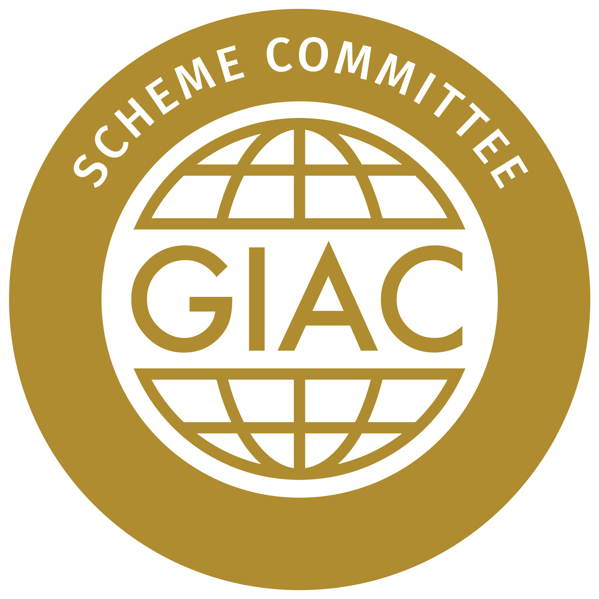
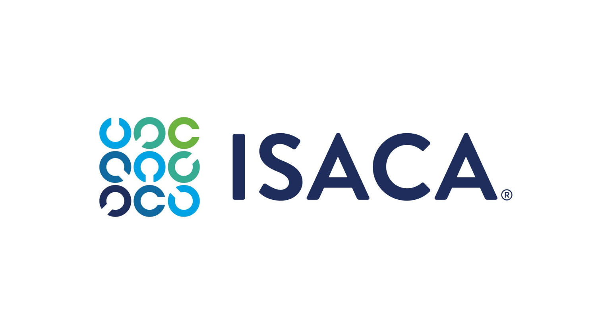
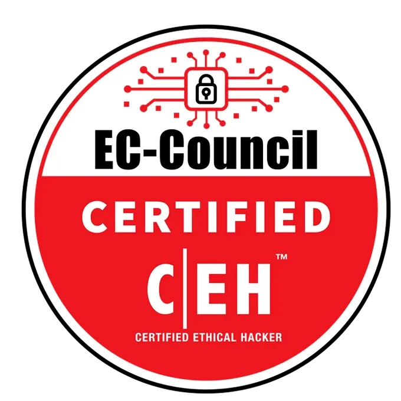

# Other Cybersecurity Certifications

## Introduction

Beyond CompTIA and ISC2, numerous other organizations offer valuable cybersecurity certifications. This article explores certifications from GIAC, ISACA, EC-Council, and industry-specific providers, helping professionals understand the landscape of credentialing options available.

---

## GIAC Certifications

The Global Information Assurance Certification (GIAC) organization offers a wide range of technical, hands-on certifications that validate practical skills in specific security domains. GIAC certifications are known for their rigor and real-world applicability.

### About GIAC

| Aspect                 | Details                                                                              |
| :--------------------- | :----------------------------------------------------------------------------------- |
| **Organization** | Global Information Assurance Certification (GIAC)                                    |
| **Focus**        | Technical, hands-on cybersecurity skills                                             |
| **Website**      | [https://www.giac.org](https://www.giac.org)                                            |
| **Key Features** | Practical exams requiring real-world skills; associated with SANS Institute training |
| **Recognition**  | Highly respected in technical security roles; often preferred for hands-on positions |

---

### GCED (GIAC Certified Enterprise Defender)

| Aspect                         | Details                                                                                                                                                                                                          |
| :----------------------------- | :--------------------------------------------------------------------------------------------------------------------------------------------------------------------------------------------------------------- |
| **Description**          | The GIAC Certified Enterprise Defender certification validates a professional's knowledge and skills in applying critical security controls, incident handling, and defense strategies in an enterprise setting. |
| **Target Audience**      | Security professionals responsible for enterprise defense; those implementing and managing security controls across large organizations.                                                                         |
| **Key Focus Areas**      | • Critical security controls implementation` `• Incident handling and response` `• Enterprise defense strategies` `• Network security monitoring` `• Threat management                  |
| **Ideal For**            | Security analysts, security engineers, incident responders, security operations center (SOC) staff, enterprise defense practitioners                                                                             |
| **Typical Career Stage** | Mid-level (2-5 years experience)                                                                                                                                                                                 |

> **Why GCED Matters:** Enterprise defense requires systematic application of security controls, not just point solutions. GCED validates that professionals understand how to implement defense-in-depth across complex enterprise environments, addressing threats at multiple layers.

---

### GCIA (GIAC Certified Intrusion Analyst)

| Aspect                         | Details                                                                                                                                                                                                                                                                                                                                      |
| :----------------------------- | :------------------------------------------------------------------------------------------------------------------------------------------------------------------------------------------------------------------------------------------------------------------------------------------------------------------------------------------- |
| **Description**          | The GIAC Certified Intrusion Analyst certification validates a professional's knowledge and skills in network and host monitoring, intrusion detection, and traffic analysis. The exam covers IDS fundamentals and network infrastructure, intrusion detection system rules, network forensics and traffic analysis, and packet engineering. |
| **Target Audience**      | Individual security analysts, system analysts, and anyone responsible for intrusion detection and network monitoring.                                                                                                                                                                                                                        |
| **Key Focus Areas**      | • IDS fundamentals and network infrastructure` `• Intrusion detection system rules` `• Network forensics and traffic analysis` `• Packet engineering and analysis` `• Attack detection and identification                                                                                                           |
| **Ideal For**            | Intrusion analysts, security analysts, network security monitors, SOC analysts, incident responders                                                                                                                                                                                                                                          |
| **Typical Career Stage** | Mid-level (2-5 years experience)                                                                                                                                                                                                                                                                                                             |

> **Why GCIA Matters:** Network intrusion detection requires deep understanding of protocols, traffic patterns, and attacker techniques. GCIA-certified analysts can identify malicious activity in network traffic, tune detection systems, and investigate intrusions effectively.

---

### GX-FA (GIAC Experienced Forensic Analyst)

| Aspect                         | Details                                                                                                                                                                                                                                                                                        |
| :----------------------------- | :--------------------------------------------------------------------------------------------------------------------------------------------------------------------------------------------------------------------------------------------------------------------------------------------- |
| **Description**          | The GIAC Experienced Forensic Analyst certification validates a professional's knowledge and skills in forensic analysis and threat hunting. Concepts covered include analyzing artifacts, examining evidence of execution, examining volatile evidence, and investigating evasion techniques. |
| **Target Audience**      | Experienced forensic analysts, digital examiners, and threat-hunting specialists seeking to validate advanced forensic capabilities.                                                                                                                                                           |
| **Key Focus Areas**      | • Analyzing digital artifacts` `• Examining evidence of execution` `• Examining volatile evidence` `• Investigating evasion techniques` `• Advanced forensic methodology                                                                                              |
| **Ideal For**            | Forensic analysts, digital forensic examiners, threat-hunting specialists, incident responders, law enforcement investigators                                                                                                                                                                  |
| **Typical Career Stage** | Advanced (5+ years experience)                                                                                                                                                                                                                                                                 |

> **Why GX-FA Matters:** Digital forensics requires specialized skills to recover and analyze evidence while maintaining chain of custody. GX-FA validates that experienced analysts can handle complex investigations, including cases involving anti-forensic techniques and advanced evasion.

---

### GX-IH (GIAC Experienced Incident Handler)

| Aspect                         | Details                                                                                                                                                                                                                                              |
| :----------------------------- | :--------------------------------------------------------------------------------------------------------------------------------------------------------------------------------------------------------------------------------------------------- |
| **Description**          | The GIAC Experienced Incident Handler certification validates a professional's incident response skills. The exam covers incident investigation, password attacks and analysis, protocol security and attacks, reconnaissance, and website security. |
| **Target Audience**      | Those looking to demonstrate their hacking and incident response skills; experienced responders seeking validation.                                                                                                                                  |
| **Key Focus Areas**      | • Incident investigation methodology` `• Password attacks and analysis` `• Protocol security and attacks` `• Reconnaissance techniques` `• Website security and web-based attacks                                           |
| **Ideal For**            | Incident responders, security analysts, threat hunters, security consultants, SOC managers                                                                                                                                                           |
| **Typical Career Stage** | Advanced (5+ years experience)                                                                                                                                                                                                                       |

> **Why GX-IH Matters:** Effective incident response requires understanding both attacker techniques and response methodologies. GX-IH validates that experienced handlers can investigate complex incidents, analyze attack vectors, and coordinate effective response.

---

### GLEG (GIAC Law of Data Security & Investigations)

| Aspect                         | Details                                                                                                                                                                                                                            |
| :----------------------------- | :--------------------------------------------------------------------------------------------------------------------------------------------------------------------------------------------------------------------------------- |
| **Description**          | The GIAC Law of Data Security & Investigations certification validates an individual's knowledge of business policies and compliance, contracts, data retention, fraud, cybersecurity investigations, and intellectual property.   |
| **Target Audience**      | Investigators, security and IT professionals, lawyers, and others familiar with cybersecurity laws and regulations who need to understand the legal aspects of security.                                                           |
| **Key Focus Areas**      | • Business policies and compliance` `• Contracts and legal agreements` `• Data retention requirements` `• Fraud investigation` `• Cybersecurity investigations` `• Intellectual property protection |
| **Ideal For**            | Security investigators, privacy officers, compliance professionals, legal professionals specializing in cybersecurity, security managers                                                                                           |
| **Typical Career Stage** | Mid to advanced (3+ years experience)                                                                                                                                                                                              |

> **Why GLEG Matters:** Cybersecurity isn't just technical—it operates within legal and regulatory frameworks. GLEG-certified professionals understand the legal implications of security decisions, investigation requirements, and compliance obligations.

---

## ISACA Certifications

ISACA (Information Systems Audit and Control Association) offers certifications focused on audit, risk, and governance, particularly valued in enterprise and compliance-focused roles.

### About ISACA

| Aspect                 | Details                                                                                                          |
| :--------------------- | :--------------------------------------------------------------------------------------------------------------- |
| **Organization** | Information Systems Audit and Control Association (ISACA)                                                        |
| **Focus**        | Audit, risk, governance, and compliance                                                                          |
| **Website**      | [https://www.isaca.org](https://www.isaca.org)                                                                      |
| **Key Features** | Globally recognized in audit and governance; strong focus on enterprise risk management                          |
| **Recognition**  | Essential for audit, compliance, and governance roles; valued in financial, government, and regulated industries |

---

### CISA (Certified Information Systems Auditor)

| Aspect                           | Details                                                                                                                                                                                                                                                                      |
| :------------------------------- | :--------------------------------------------------------------------------------------------------------------------------------------------------------------------------------------------------------------------------------------------------------------------------- |
| **Description**            | The Certified Information Systems Auditor certification validates an individual's system auditing, control, monitoring, and assessment skills. This certification covers IT governance, operations, systems acquisition, asset protection, and information systems auditing. |
| **Target Audience**        | Those looking to demonstrate their system auditing knowledge and expertise; IT auditors, security professionals responsible for compliance.                                                                                                                                  |
| **Key Focus Areas**        | • IT governance and management` `• IT operations and business resilience` `• Systems acquisition and development` `• Asset protection` `• Information systems auditing processes                                                                    |
| **Experience Requirement** | Minimum of five years of professional work experience in information systems auditing, control, or security                                                                                                                                                                  |
| **Ideal For**              | IT auditors, security auditors, compliance officers, risk professionals, security consultants                                                                                                                                                                                |
| **Typical Career Stage**   | Mid to advanced (3-5+ years experience)                                                                                                                                                                                                                                      |

> **Why CISA Matters:** CISA is the gold standard for IT auditing. It validates that professionals can assess systems, controls, and processes against established standards, identify weaknesses, and recommend improvements. Essential for compliance and audit roles.

---

### CRISC (Certified in Risk and Information Systems Control)

| Aspect                           | Details                                                                                                                                                                                                                           |
| :------------------------------- | :-------------------------------------------------------------------------------------------------------------------------------------------------------------------------------------------------------------------------------- |
| **Description**            | The Certified in Risk and Information Systems Control certification validates knowledge of risk management. Concepts include information technology, security, risk assessment, IT governance, risk response, and risk reporting. |
| **Target Audience**        | Those seeking to demonstrate their enterprise risk management knowledge; professionals responsible for identifying and managing IT risk.                                                                                          |
| **Key Focus Areas**        | • IT risk identification and assessment` `• Risk response and mitigation` `• Risk and control monitoring and reporting` `• Information systems control design and implementation` `• IT governance       |
| **Experience Requirement** | Minimum of three years of work experience in at least three of the four CRISC domains                                                                                                                                             |
| **Ideal For**              | Risk managers, security managers, IT managers, compliance officers, business continuity professionals                                                                                                                             |
| **Typical Career Stage**   | Mid to advanced (3+ years experience)                                                                                                                                                                                             |

> **Why CRISC Matters:** Organizations need professionals who can identify, assess, and manage IT risk in business terms. CRISC-certified professionals understand how to balance security needs with business objectives and communicate risk effectively to stakeholders.

---

### CDPSE (Certified Data Privacy Solutions Engineer)

| Aspect                           | Details                                                                                                                                                                                                     |
| :------------------------------- | :---------------------------------------------------------------------------------------------------------------------------------------------------------------------------------------------------------- |
| **Description**            | The Certified Data Privacy Solutions Engineer certification validates an individual's knowledge of IT data privacy measures. Concepts include privacy architecture, data lifecycle, and privacy governance. |
| **Target Audience**        | Those looking to demonstrate their expertise in building and implementing data privacy and risk mitigation solutions; privacy professionals.                                                                |
| **Key Focus Areas**        | • Privacy governance and management` `• Privacy architecture and technology` `• Data lifecycle management` `• Privacy risk mitigation` `• Privacy by design                        |
| **Experience Requirement** | Minimum of three years of work experience in at least two of the three CDPSE domains                                                                                                                        |
| **Ideal For**              | Privacy engineers, privacy analysts, data protection officers, compliance professionals, security architects                                                                                                |
| **Typical Career Stage**   | Mid to advanced (3+ years experience)                                                                                                                                                                       |

> **Why CDPSE Matters:** With increasing privacy regulations worldwide (GDPR, CCPA, etc.), organizations need professionals who can implement technical privacy controls. CDPSE validates the technical skills to build privacy into systems, not just policy knowledge.

---

## EC-Council Certifications

EC-Council is best known for its ethical hacking and offensive security certifications, though it offers a range of credentials across the security field.

### About EC-Council

| Aspect                 | Details                                                                                                |
| :--------------------- | :----------------------------------------------------------------------------------------------------- |
| **Organization** | International Council of E-Commerce Consultants (EC-Council)                                           |
| **Focus**        | Ethical hacking, penetration testing, and security operations                                          |
| **Website**      | [https://www.eccouncil.org](https://www.eccouncil.org)                                                    |
| **Key Features** | Strong focus on offensive security; hands-on practical exams; widely recognized in penetration testing |
| **Recognition**  | CEH is one of the most recognized ethical hacking certifications globally                              |

---

### CEH (Certified Ethical Hacker)

| Aspect                         | Details                                                                                                                                                                                                                                         |
| :----------------------------- | :---------------------------------------------------------------------------------------------------------------------------------------------------------------------------------------------------------------------------------------------- |
| **Description**          | The Certified Ethical Hacker certification validates an individual's knowledge of ethical hacking. Concepts include the five phases of ethical hacking: reconnaissance, scanning, gaining access, maintaining access, and covering your tracks. |
| **Target Audience**      | Those seeking to demonstrate their penetration and vulnerability testing knowledge; security professionals who need to understand attacker techniques.                                                                                          |
| **Key Focus Areas**      | • Reconnaissance (information gathering)` `• Scanning and enumeration` `• Gaining access (exploitation)` `• Maintaining access` `• Covering tracks` `• Various attack types and tools                            |
| **Ideal For**            | Penetration testers, vulnerability testers, security analysts, network security specialists, ethical hackers                                                                                                                                    |
| **Typical Career Stage** | Early to mid-level (1-4 years experience)                                                                                                                                                                                                       |

> **Why CEH Matters:** To defend against attackers, you must understand how they think and operate. CEH provides structured knowledge of attack methodologies, tools, and techniques, enabling defenders to identify and prevent attacks. It's often a prerequisite for penetration testing roles.

---

### C|CISO (Certified Chief Information Security Officer)

| Aspect                         | Details                                                                                                                                                                                                                                                  |
| :----------------------------- | :------------------------------------------------------------------------------------------------------------------------------------------------------------------------------------------------------------------------------------------------------- |
| **Description**          | The Certified Chief Information Security Officer certification validates an individual's cybersecurity leadership skills. Concepts include governance, risk compliance, operations, security controls, and audit management.                             |
| **Target Audience**      | Those looking to serve in a cybersecurity leadership role; experienced professionals transitioning to executive positions.                                                                                                                               |
| **Key Focus Areas**      | • Governance and risk management` `• Compliance and audit management` `• Security operations management` `• Security controls implementation` `• Strategic planning and leadership` `• Financial management and budgeting |
| **Ideal For**            | CISOs, security directors, security managers, aspiring security executives, IT leaders with security responsibilities                                                                                                                                    |
| **Typical Career Stage** | Advanced (7-10+ years experience, including leadership)                                                                                                                                                                                                  |

> **Why C|CISO Matters:** Technical skills alone don't prepare professionals for executive roles. C|CISO focuses on the leadership, management, and strategic skills needed to serve as a CISO—aligning security with business goals, managing budgets, leading teams, and communicating with boards.

---

## Industry-Specific Certifications

Many industries have unique security requirements addressed by specialized certifications. These credentials demonstrate expertise in sector-specific regulations, technologies, and practices.

### HCISPP (Healthcare Information Security and Privacy Practitioner)

| Aspect                          | Details                                                                                                                                                                                                                                   |
| :------------------------------ | :---------------------------------------------------------------------------------------------------------------------------------------------------------------------------------------------------------------------------------------- |
| **Offering Organization** | ISC2                                                                                                                                                                                                                                      |
| **Description**           | The Healthcare Information Security and Privacy Practitioner certification validates knowledge of implementing, managing, and assessing security controls within a healthcare setting.                                                    |
| **Key Focus Areas**       | • Healthcare industry regulations (HIPAA, HITECH)` `• Healthcare privacy and security controls` `• Electronic health records protection` `• Healthcare risk management` `• Clinical information systems security |
| **Ideal For**             | Health information managers, medical records supervisors, IT managers in healthcare, privacy officers, healthcare security professionals                                                                                                  |
| **Source**                | [https://www.isc2.org/Certifications/HCISPP](https://www.isc2.org/Certifications/HCISPP)                                                                                                                                                     |

> **Why HCISPP Matters:** Healthcare has unique regulations (HIPAA), technologies (EHRs, medical devices), and workflows. HCISPP-certified professionals understand these nuances and can implement security that protects patient data while supporting clinical operations.

---

### CERP (Certified Risk Professional)

| Aspect                          | Details                                                                                                                                                                                           |
| :------------------------------ | :------------------------------------------------------------------------------------------------------------------------------------------------------------------------------------------------ |
| **Offering Organization** | American Bankers Association (ABA)                                                                                                                                                                |
| **Description**           | The Certified Risk Professional certification is ideal for individuals looking to demonstrate their knowledge of risk management within the banking industry.                                     |
| **Key Focus Areas**       | • Banking risk management frameworks` `• Credit, market, and operational risk` `• Regulatory compliance in banking` `• Enterprise risk management` `• Banking operations |
| **Ideal For**             | Banking risk professionals, compliance officers in financial institutions, bank auditors, risk managers                                                                                           |
| **Source**                | [https://www.aba.com/training-events/certifications](https://www.aba.com/training-events/certifications)                                                                                             |

> **Why CERP Matters:** Banking faces unique risks and regulatory requirements. CERP-certified professionals understand the specific risk landscape of financial institutions and can implement controls that meet both security and regulatory expectations.

---

### CRCM (Certified Regulatory Compliance Manager)

| Aspect                          | Details                                                                                                                                                                                      |
| :------------------------------ | :------------------------------------------------------------------------------------------------------------------------------------------------------------------------------------------- |
| **Offering Organization** | American Bankers Association (ABA)                                                                                                                                                           |
| **Description**           | The Certified Regulatory Compliance Manager certification covers assessment and management of compliance risk, compliance management, monitoring, and compliance analysis and reporting.     |
| **Key Focus Areas**       | • Compliance risk assessment` `• Compliance management programs` `• Compliance monitoring and testing` `• Compliance analysis and reporting` `• Banking regulations |
| **Ideal For**             | Compliance managers in banking, regulatory compliance officers, bank auditors, risk professionals                                                                                            |
| **Source**                | [https://www.aba.com/training-events/certifications](https://www.aba.com/training-events/certifications)                                                                                        |

> **Why CRCM Matters:** Banking is one of the most heavily regulated industries. CRCM-certified professionals understand the complex web of banking regulations and can ensure their organizations maintain compliance while managing security effectively.

---

### PCIP (PCI Professional)

| Aspect                          | Details                                                                                                                                                                                                             |
| :------------------------------ | :------------------------------------------------------------------------------------------------------------------------------------------------------------------------------------------------------------------ |
| **Offering Organization** | PCI Security Standards Council                                                                                                                                                                                      |
| **Description**           | The PCI Professional certification validates an individual's knowledge of payment security. It is ideal for those looking to demonstrate their knowledge of securing a payment environment.                         |
| **Key Focus Areas**       | • Payment Card Industry Data Security Standard (PCI DSS)` `• Payment card security requirements` `• Secure payment processing` `• Cardholder data protection` `• PCI compliance assessment |
| **Ideal For**             | Payment security professionals, compliance officers in retail/finance, security professionals in e-commerce, PCI assessors                                                                                          |
| **Source**                | [https://www.pcisecuritystandards.org/program_training_and_qualification/pci_professional_qualification/](https://www.pcisecuritystandards.org/program_training_and_qualification/pci_professional_qualification/)     |

> **Why PCIP Matters:** Organizations that process payment cards must comply with PCI DSS. PCIP-certified professionals understand the standard's requirements and can help organizations implement effective payment security controls.

---

### GICSP (Global Industrial Cyber Security Professional)

| Aspect                          | Details                                                                                                                                                                                                                                                                                    |
| :------------------------------ | :----------------------------------------------------------------------------------------------------------------------------------------------------------------------------------------------------------------------------------------------------------------------------------------- |
| **Offering Organization** | GIAC                                                                                                                                                                                                                                                                                       |
| **Description**           | The Global Industrial Cyber Security Professional certification validates an individual's knowledge of securing and supporting industrial control systems. Concepts include industrial control system components, attack surfaces, control system security methods, and incident response. |
| **Key Focus Areas**       | • Industrial control system (ICS) components` `• ICS attack surfaces and threats` `• Control system security methods` `• ICS incident response` `• SCADA and PLC security                                                                                         |
| **Ideal For**             | Industrial security professionals, ICS security engineers, SCADA security specialists, critical infrastructure protectors                                                                                                                                                                  |
| **Typical Career Stage**  | Mid to advanced (3+ years ICS experience)                                                                                                                                                                                                                                                  |

> **Why GICSP Matters:** Industrial control systems (power grids, water treatment, manufacturing) have different security requirements than traditional IT. GICSP-certified professionals understand these unique environments and can protect critical infrastructure from cyber threats.

---

### GCIP (GIAC Critical Infrastructure Protection)

| Aspect                          | Details                                                                                                                                                                                                                                                                                  |
| :------------------------------ | :--------------------------------------------------------------------------------------------------------------------------------------------------------------------------------------------------------------------------------------------------------------------------------------- |
| **Offering Organization** | GIAC                                                                                                                                                                                                                                                                                     |
| **Description**           | The GIAC Critical Infrastructure Protection certification validates an individual's knowledge in implementing, supporting, and securing critical systems. This certification is ideal for cybersecurity professionals and field support personnel working with critical infrastructures. |
| **Key Focus Areas**       | • Critical infrastructure protection frameworks` `• Securing industrial control systems` `• Critical system monitoring and defense` `• Incident response in critical environments` `• Regulatory compliance for critical infrastructure                         |
| **Ideal For**             | Critical infrastructure security professionals, ICS security practitioners, field support engineers, infrastructure protectors                                                                                                                                                           |
| **Typical Career Stage**  | Mid to advanced (3+ years experience)                                                                                                                                                                                                                                                    |

> **Why GCIP Matters:** Critical infrastructure (energy, water, transportation) is increasingly targeted by nation-states and other sophisticated attackers. GCIP-certified professionals understand how to protect these vital systems from cyber threats while maintaining operational reliability.

---

## Certification Comparison Summary

| Certification     | Organization | Focus Area              | Ideal For                              |
| :---------------- | :----------- | :---------------------- | :------------------------------------- |
| **GCED**    | GIAC         | Enterprise defense      | Security analysts, engineers           |
| **GCIA**    | GIAC         | Intrusion analysis      | Intrusion analysts, SOC staff          |
| **GX-FA**   | GIAC         | Forensic analysis       | Forensic analysts, threat hunters      |
| **GX-IH**   | GIAC         | Incident handling       | Incident responders                    |
| **GLEG**    | GIAC         | Law and investigations  | Legal, compliance, investigators       |
| **CISA**    | ISACA        | IT auditing             | IT auditors, compliance officers       |
| **CRISC**   | ISACA        | Risk management         | Risk managers, security managers       |
| **CDPSE**   | ISACA        | Privacy engineering     | Privacy professionals, engineers       |
| **CEH**     | EC-Council   | Ethical hacking         | Penetration testers, security analysts |
| **C\|CISO** | EC-Council   | Security leadership     | Aspiring CISOs, security executives    |
| **HCISPP**  | ISC2         | Healthcare security     | Healthcare security professionals      |
| **CERP**    | ABA          | Banking risk            | Banking risk professionals             |
| **CRCM**    | ABA          | Banking compliance      | Banking compliance officers            |
| **PCIP**    | PCI Council  | Payment security        | Payment security professionals         |
| **GICSP**   | GIAC         | Industrial security     | ICS security professionals             |
| **GCIP**    | GIAC         | Critical infrastructure | Critical infrastructure protectors     |

---

## Choosing the Right Certification

### By Career Path

| Career Path                                        | Recommended Certifications           |
| :------------------------------------------------- | :----------------------------------- |
| **Penetration Testing / Offensive Security** | CEH, GPEN, OSCP (not covered), GX-IH |
| **Security Operations / Defense**            | GCED, GCIA, CySA+, Security+         |
| **Incident Response / Forensics**            | GX-IH, GX-FA, CHFI (not covered)     |
| **Audit and Compliance**                     | CISA, CRISC, CGEIT (not covered)     |
| **Risk Management**                          | CRISC, CGRC, CISSP                   |
| **Privacy**                                  | CDPSE, CIPP (not covered), HCISPP    |
| **Security Management / Leadership**         | C\|CISO, CISSP, CISM (not covered)   |
| **Industrial / Critical Infrastructure**     | GICSP, GCIP                          |
| **Healthcare**                               | HCISPP                               |
| **Financial Services**                       | CERP, CRCM                           |
| **Payment Security**                         | PCIP                                 |

### By Industry

| Industry                           | Relevant Certifications |
| :--------------------------------- | :---------------------- |
| **Healthcare**               | HCISPP, CISA, CISSP     |
| **Banking/Finance**          | CERP, CRCM, CISA, CRISC |
| **Retail/E-commerce**        | PCIP, CEH, CISA         |
| **Government**               | CISSP, CISA, Security+  |
| **Manufacturing/Industrial** | GICSP, GCIP, CISSP      |
| **Technology**               | CISSP, CCSP, CSSLP, CEH |

---

## Conclusion

The cybersecurity certification landscape offers diverse options beyond the well-known CompTIA and ISC2 credentials. Each certification organization brings unique strengths:

| Organization                | Strength                   | Best For                                        |
| :-------------------------- | :------------------------- | :---------------------------------------------- |
| **GIAC**              | Technical, hands-on skills | Practitioners needing deep technical validation |
| **ISACA**             | Audit, risk, governance    | Compliance, audit, and risk professionals       |
| **EC-Council**        | Offensive security         | Penetration testers and ethical hackers         |
| **Industry-Specific** | Domain expertise           | Professionals in regulated industries           |

Key takeaways:

1. **GIAC certifications** are highly technical and hands-on, ideal for practitioners who need to demonstrate deep skills in specific domains like intrusion analysis, forensics, and incident response.
2. **ISACA certifications** focus on audit, risk, and governance, essential for compliance, audit, and enterprise risk management roles.
3. **EC-Council certifications** emphasize ethical hacking and offensive security, valuable for penetration testers and those who need to understand attacker methodologies.
4. **Industry-specific certifications** provide specialized knowledge for regulated sectors like healthcare, banking, payments, and critical infrastructure.
5. **Certification strategy** should consider your career goals, industry, and role requirements—no single certification fits all paths.

By understanding the full range of certification options, professionals can select credentials that align with their career aspirations, validate their expertise, and demonstrate commitment to their chosen specialty within cybersecurity.
