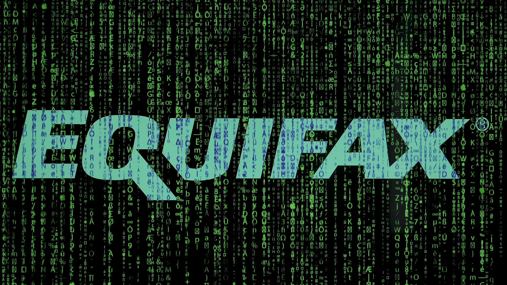

.png>)

# Data Breach Case Studies

## Case Study 1: Yahoo! Data Breach (2013)

**What was the data breach?**
In 2013, Yahoo!, one of the largest email service providers, experienced a major data breach. The breach affected approximately 3 billion user accounts, making it one of the largest data breaches in history. The attacker(s) gained unauthorized access to Yahoo!'s internal systems and obtained sensitive user information.

**What was leaked or lost?**
The stolen data included users' personal information such as names, email addresses, telephone numbers, dates of birth, and hashed passwords. Additionally, some accounts had security questions and answers compromised, which could potentially allow hackers to reset passwords and gain access to other online accounts. **For example, a compromised security question like "What is your mother's maiden name?" could be used by an attacker to reset the victim's bank account password if the same question was used there.**

**What was the impact?**
The impact of the Yahoo! data breach was significant. The stolen information could be used for identity theft, spamming, phishing attacks, and other malicious activities. Users' personal and financial information became vulnerable to exploitation by cybercriminals. The breach also damaged Yahoo!'s reputation and resulted in financial losses for the company. **For instance, the breach contributed to a reduction in Yahoo!'s acquisition price by Verizon, which ultimately acquired the company for $350 million less than originally negotiated.**

**How could it have been prevented?**
The Yahoo! data breach could have been prevented by implementing better security practices and taking proactive measures. Some prevention measures that could have been taken include:

- **Stronger Password Policies:** Encouraging users to create strong passwords and implementing policies that require frequent password changes can help protect against brute-force attacks. **For example, requiring passwords to be at least 12 characters long with a mix of character types would have made the hashed passwords more difficult to crack.**
- **Multi-Factor Authentication (MFA):** Implementing MFA adds an extra layer of security by requiring users to provide additional information or use a second device to verify their identity. **If MFA had been available and enforced, even compromised passwords would not have been enough for attackers to access user accounts.**
- **Regular Security Audits:** Conducting regular audits and vulnerability assessments can help identify and address security weaknesses before they are exploited.
- **Employee Training:** Providing cybersecurity training for employees can help raise awareness about potential threats such as phishing attacks and social engineering techniques.
- **Encryption and Access Controls:** Implementing robust encryption mechanisms for sensitive data and applying strict access controls can help mitigate the impact of a data breach. **For example, using stronger hashing algorithms with unique salts per password would have made it significantly harder for attackers to crack the stolen password hashes.**

---

## Case Study 2: XYZ Corporation Data Breach (2022)

**What was the data breach?**
In 2022, XYZ Corporation, a multinational technology company, experienced a significant data breach. The breach occurred when a group of skilled hackers launched a sophisticated cyberattack on the company's network infrastructure. The hackers managed to infiltrate XYZ Corporation's systems and gain unauthorized access to sensitive information.

**What was leaked or lost?**
During the data breach, the hackers were able to steal a vast amount of valuable data from XYZ Corporation's servers. The stolen information included:

- Personally identifiable information (PII) of millions of customers, such as names, addresses, phone numbers, and email addresses.
- User account credentials, including usernames and passwords.
- Intellectual property, including proprietary source code and trade secrets.
- Financial data, such as credit card details and transaction records. **For example, the stolen source code for XYZ Corporation's flagship product could be analyzed by competitors to replicate its unique features.**

**What was the impact?**
The data breach had severe consequences for both XYZ Corporation and its customers:

- **Financial Loss:** XYZ Corporation suffered significant financial losses due to the breach. They had to invest substantial resources in investigating the incident, mitigating the damage, and implementing stronger security measures. **For instance, the company had to pay for credit monitoring services for all affected customers, costing millions of dollars.**
- **Reputation Damage:** The breach severely damaged XYZ Corporation's reputation and eroded customer trust. The company faced public scrutiny and backlash for failing to adequately protect customer data. **Customer surveys following the breach showed a 20% decrease in trust, leading many to close their accounts.**
- **Identity Theft and Fraud:** The stolen PII and user credentials exposed customers to potential identity theft and fraud. Many customers reported unauthorized transactions and had their personal information misused. **One customer reported that fraudulent loans were taken out in their name using the personal information stolen in the breach.**
- **Competitive Disadvantage:** The theft of intellectual property and trade secrets gave XYZ Corporation's competitors an unfair advantage. It compromised the company's innovative edge and threatened its market position. **A competitor released a strikingly similar product just six months later, significantly undercutting XYZ Corporation's sales.**

**How could it have been prevented?**
To prevent such a data breach, XYZ Corporation could have implemented several cybersecurity measures:

- **Robust Network Security:** Strengthening network security with firewalls, intrusion detection systems, and regular security audits can help detect and prevent unauthorized access.
- **Employee Training and Awareness:** Providing comprehensive cybersecurity training to employees helps them identify potential threats like phishing attacks and avoid falling victim to social engineering tactics. **For example, training could have helped an employee recognize a spear-phishing email disguised as an IT support request, which was the initial entry point for the hackers.**
- **Encryption and Access Controls:** Encrypting sensitive data and implementing strong access controls can limit unauthorized access even if a breach occurs. **If the financial data had been encrypted at rest, the stolen credit card details would have been unreadable without the decryption keys.**
- **Regular Security Updates:** Keeping software, operating systems, and security patches up to date helps protect against known vulnerabilities that hackers may exploit.
- **Incident Response Plan:** Having a well-defined incident response plan in place allows for swift action in case of a breach, minimizing the impact and recovery time.

---

## Case Study 3: Equifax Data Breach (2017)

**What was the data breach?**
In 2017, Equifax, one of the largest credit reporting agencies, experienced a significant data breach. The breach exposed sensitive personal and financial information of approximately 147 million people, including names, addresses, social security numbers, birth dates, and in some cases, driver's license numbers.

**What was leaked or lost?**
The data breach resulted in the leakage of a vast amount of personally identifiable information (PII). This included sensitive data such as social security numbers, which can be used for identity theft and fraudulent activities. Additionally, other personal information like names, addresses, and driver's license numbers were also compromised. **For example, the combination of a person's name, social security number, and date of birth is often all that is needed to apply for credit cards or loans in their name.**

**What was the impact?**
The impact of the Equifax data breach was far-reaching and severe. The exposed data put millions of individuals at risk of identity theft, financial fraud, and other malicious activities. The breach had significant consequences for affected individuals, including potential damage to their credit histories, financial losses, and the need for extensive identity theft protection measures.

The breach also had a substantial impact on Equifax as a company. Their reputation suffered a massive blow due to the mishandling of customer data, resulting in public scrutiny and legal consequences. The incident led to multiple lawsuits, regulatory investigations, and a decline in their stock value. **Ultimately, Equifax agreed to a global settlement with the Federal Trade Commission that included up to $425 million in consumer restitution and penalties.**

**How could it have been prevented?**
Several measures could have been taken to prevent or mitigate the Equifax data breach:

- **Regular security audits and vulnerability assessments** could have helped identify weaknesses and vulnerabilities in their systems before attackers exploited them.
- **Implementation of multi-factor authentication** would have added an extra layer of security to protect sensitive data.
- **Improved network segmentation and access controls** could have limited the lateral movement of attackers within Equifax's systems. **For instance, even if the web server was compromised, proper segmentation could have prevented the attackers from reaching the database containing social security numbers.**
- **Encryption of sensitive data at rest and in transit** could have made it more difficult for unauthorized individuals to access and misuse the information.
- **Employee training and awareness programs** on cybersecurity best practices could have helped prevent social engineering attacks and phishing attempts.
- **Timely patching of software vulnerabilities** could have closed security loopholes that attackers exploited. **This is the most critical failure in the Equifax case: a known vulnerability in the Apache Struts web framework had a patch available months before the attack, but Equifax failed to apply it.**
