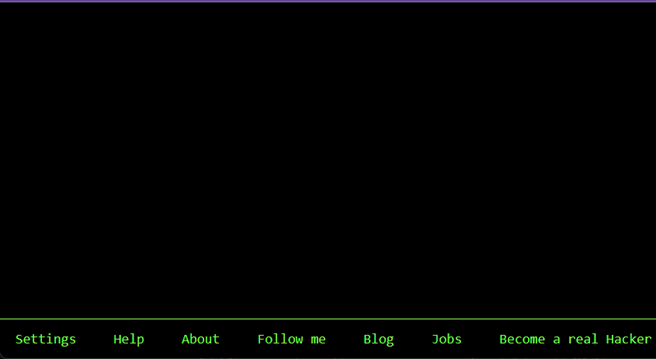

# Just for Fun - Hands-on Lab: Hacker Typer

**Estimated time needed:** 10 minutes

---

## About the Lab

**Hacker Typer** is a fun interactive site that allows anyone to look like the stereotypical hacker. It is designed for personal entertainment or to prank a friend into thinking you have successfully hacked into another system.

---

## Instructions

### Step 1: Visit the Website

1. Open your web browser
2. Navigate to: **[https://hackertyper.net/](https://hackertyper.net/)**

### Step 2: Start Typing

1. Begin typing on your keyboard
2. Notice that it doesn't matter which letters or numbers you press—impressive-looking code will fill your screen
3. The faster you type, the faster the code appears on the screen

### Step 3: Enter Full-Screen Mode

1. Press the **F11** key on your keyboard
2. This opens the program in full-screen mode, making the experience more impressive and realistic
3. To exit full-screen mode, press **F11** again

### Step 4: Trigger the Access Denied Message

1. Press the **Shift** key **three times** in rapid succession
2. A warning message will appear on screen saying: **"Access Denied"**

### Step 5: Gain Access

1. Hold down the **Left Alt** key on your keyboard
2. The screen will change to display an **"Access Granted"** message
3. It appears as if your hack has been successful!

---

## How It Works

| Element                  | Purpose                                                |
| :----------------------- | :----------------------------------------------------- |
| **Random Typing**  | Triggers pre-written code snippets to appear on screen |
| **Shift Key (3x)** | Triggers the Access Denied animation                   |
| **Left Alt Key**   | Triggers the Access Granted animation                  |
| **F11**            | Toggles full-screen mode for enhanced effect           |

---

## Tips for Best Effect

| Tip                                           | Description                                                                |
| :-------------------------------------------- | :------------------------------------------------------------------------- |
| **Type rapidly**                        | Creates illusion of intense hacking activity                               |
| **Use full-screen mode**                | Eliminates browser distractions for more realistic effect                  |
| **Practice the sequence**               | Memorize Shift x3 → Left Alt for smooth performance                       |
| **Add dramatic commentary**             | Narrate your "hacking" for friends (e.g., "I'm bypassing their firewall!") |
| **Pair with Matrix-themed screensaver** | Enhance the atmosphere                                                     |

---

## Fun Ideas

### Prank a Friend

1. Set up Hacker Typer on a computer
2. Call a friend over and tell them you need to show them something important
3. Start typing frantically
4. Trigger the Access Denied message and look concerned
5. Trigger Access Granted and celebrate your "success"

### Create a Hacking Scene

Perfect for:

- Student film projects
- Virtual backgrounds for video calls
- Social media content
- LARPing (Live Action Role Playing)

### Stress Relief

- Type aggressively to release frustration
- Watch impressive code scroll by
- Feel like a movie hacker for a few minutes

---

## Additional Features

Explore these variations of the Hacker Typer concept:

| Variant                          | URL                                     | Description                     |
| :------------------------------- | :-------------------------------------- | :------------------------------ |
| **Geocities Hacker Typer** | [hackertyper.com](https://hackertyper.com) | Original retro version          |
| **Hacker Typer Neo**       | [hackertyper.net](https://hackertyper.net) | Modern version with themes      |
| **Cyberdeck Hacker Typer** | [cyberdeck.xyz](https://cyberdeck.xyz)     | Customizable terminal aesthetic |

---

## Summary

In this fun, lighthearted lab, you have:

| Activity                               | Completed |
| :------------------------------------- | :-------- |
| Visited Hacker Typer website           | ✓        |
| Typed to generate code                 | ✓        |
| Used F11 for full-screen mode          | ✓        |
| Triggered Access Denied with Shift key | ✓        |
| Triggered Access Granted with Left Alt | ✓        |

---

<video controls src="Hacker Typer.mp4" title="Hacker Typer"></video>

## Final Thought

While Hacker Typer is purely for entertainment, it serves as a playful reminder that in the movies, hacking looks exciting and dramatic. In reality, cybersecurity professionals spend much more time analyzing logs, configuring firewalls, and updating patches than they do watching green text scroll down screens!

Enjoy the fun, and remember—real hacking (ethical hacking, of course) requires years of study and practice, not just rapid typing!

