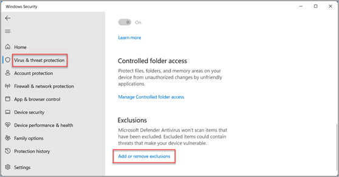

# Windows Defender Antivirus

## Introduction

This reading introduces you to the basics of security features in Windows Defender Antivirus. Configuring and managing Windows Defender Antivirus is a basic component in protecting computer systems from unauthorized access and threats.

---

## Understanding Windows Defender Antivirus

**Windows Defender Antivirus**, also known as **Microsoft Defender Antivirus**, is a robust security solution integrated into the Windows operating system. It provides real-time protection against various types of malware, including viruses, worms, and spyware. This reading focuses on understanding the functionalities, configuration, and management of Windows Defender Antivirus.

---

## Core Functions of Windows Defender Antivirus

### 1. Real-Time Protection

Windows Defender Antivirus continuously monitors system activity to detect and block threats as they occur. This proactive approach helps prevent malware from executing and infecting the system.

### 2. Scanning Capabilities

Windows Defender Antivirus offers several types of scans to ensure comprehensive protection:

| Scan Type                | Description                                                                                                                                          | Typical Duration    |
| :----------------------- | :--------------------------------------------------------------------------------------------------------------------------------------------------- | :------------------ |
| **Quick Scan**     | Scans areas of the system most likely to be targeted by malware. Includes memory scan, system files, registry entries, and common malware locations. | Fast (minutes)      |
| **Full Scan**      | Thoroughly scans the entire system for threats, including all files and running programs on all drives.                                              | Several hours       |
| **Custom Scan**    | Allows users to select specific files and folders to scan. Useful when a particular area is suspected of infection.                                  | Varies by selection |
| **Offline Scan**   | Scans the system before the operating system loads to detect and remove persistent threats that may evade standard scans.                            | Moderate            |
| **Scheduled Scan** | Configured through Task Scheduler to run regular scans at specified dates and times to maintain ongoing system health.                               | Configurable        |

#### Detailed Scan Components

**Quick Scan typically includes:**

- **Memory Scan:** Checks for active malware in your computer's memory
- **System Files:** Scans critical operating system files
- **Registry Entries:** Examines Windows Registry entries commonly used by malware to execute upon start-up
- **Common Malware Locations:** Scans directories where malware is known to reside (Windows directory, temporary files)

### 3. Exclusions

The **Exclusions** feature allows users to specify files, folders, and processes to be excluded from scans. This is useful for:

- Preventing performance issues with trusted applications
- Avoiding conflicts with legitimate software
- Excluding large files that don't require scanning

### 4. Scan Results and Actions

After a scan is completed, Windows Defender Antivirus provides detailed results accessible through the Windows Security Center. Available actions include:

| Action               | Description                                                                                                    |
| :------------------- | :------------------------------------------------------------------------------------------------------------- |
| **Quarantine** | Isolates detected threats to prevent them from harming the system while preserving them for potential analysis |
| **Remove**     | Permanently deletes detected threats from the system                                                           |
| **Allow**      | Permits certain detected items if they are known to be safe (adds them to exclusions)                          |

---

## Advanced Protection Features

### Tamper Protection

**Tamper Protection** is a feature in Windows Security that helps prevent malicious apps from changing important security settings. It protects:

- Real-time protection settings
- Cloud-delivered protection
- Security intelligence updates
- Other critical security configurations

Tamper Protection ensures that malware cannot disable security features to avoid detection.

### Automatic Sample Submission

**Automatic Sample Submission** helps protect your computer by automatically sending samples of suspicious files to Microsoft for analysis. Benefits include:

- Improved threat detection through collective intelligence
- Faster response to emerging threats
- Enhanced protection for all Windows users

Users can configure this feature based on their privacy preferences.

### Regular Updates

To ensure optimal protection, Windows Defender relies on regular updates. These include:

| Update Type                     | Description                                            |
| :------------------------------ | :----------------------------------------------------- |
| **Virus Definitions**     | Signatures used to identify known malware              |
| **Threat Intelligence**   | Information about emerging threats and attack patterns |
| **Software Improvements** | Enhancements to the antivirus engine and features      |

Updates are delivered automatically through Windows Update, ensuring systems remain protected against the latest threats.

---

## Configuration and Management

### Windows Security Center

The **Windows Security Center** serves as the central management interface for Windows Defender Antivirus. Access it by:

1. Clicking the **Start** menu
2. Selecting **Settings** (gear icon)
3. Choosing **Update & Security**
4. Selecting **Windows Security**

Alternatively, search for "Windows Security" in the taskbar search box.

### Key Configuration Areas

| Configuration Area                      | Purpose                                                     |
| :-------------------------------------- | :---------------------------------------------------------- |
| **Virus & Threat Protection**     | Manage scans, view threats, configure exclusions            |
| **Firewall & Network Protection** | Configure firewall settings for different network types     |
| **App & Browser Control**         | Manage SmartScreen settings and reputation-based protection |
| **Device Security**               | Access hardware-level security features                     |
| **Device Performance & Health**   | Monitor system health and performance                       |

---

## Best Practices

| Practice                                 | Recommendation                                                          |
| :--------------------------------------- | :---------------------------------------------------------------------- |
| **Keep Updates Enabled**           | Ensure automatic updates are turned on for continuous protection        |
| **Perform Regular Scans**          | Schedule regular full scans in addition to real-time protection         |
| **Review Scan Results**            | Periodically check quarantine and scan history                          |
| **Configure Exclusions Carefully** | Only exclude files that are absolutely necessary and trusted            |
| **Enable Tamper Protection**       | Keep this feature enabled to prevent security setting modifications     |
| **Use Multiple Scan Types**        | Combine quick scans for daily use with full scans for thorough coverage |

---

## Summary

| Feature                               | Key Function                                          |
| :------------------------------------ | :---------------------------------------------------- |
| **Real-Time Protection**        | Continuous monitoring for immediate threat detection  |
| **Quick Scan**                  | Fast scan of critical system areas                    |
| **Full Scan**                   | Comprehensive system-wide scanning                    |
| **Custom Scan**                 | Targeted scanning of specific files or folders        |
| **Offline Scan**                | Pre-OS boot scanning for persistent threats           |
| **Tamper Protection**           | Prevents unauthorized changes to security settings    |
| **Automatic Sample Submission** | Contributes to collective threat intelligence         |
| **Regular Updates**             | Maintains current protection against emerging threats |

---

## Next Steps

This reading provides you with basic information on Windows Defender Antivirus services on Windows Operating System. With this foundation, you can proceed to the hands-on labs in the course that provide you with a virtual Windows workspace to practically experience and configure these settings.

In those labs, you will:

- Navigate the Windows Security Center interface
- Configure different scan types
- Set up exclusions
- Review scan results
- Manage quarantine items
- Explore advanced protection features
