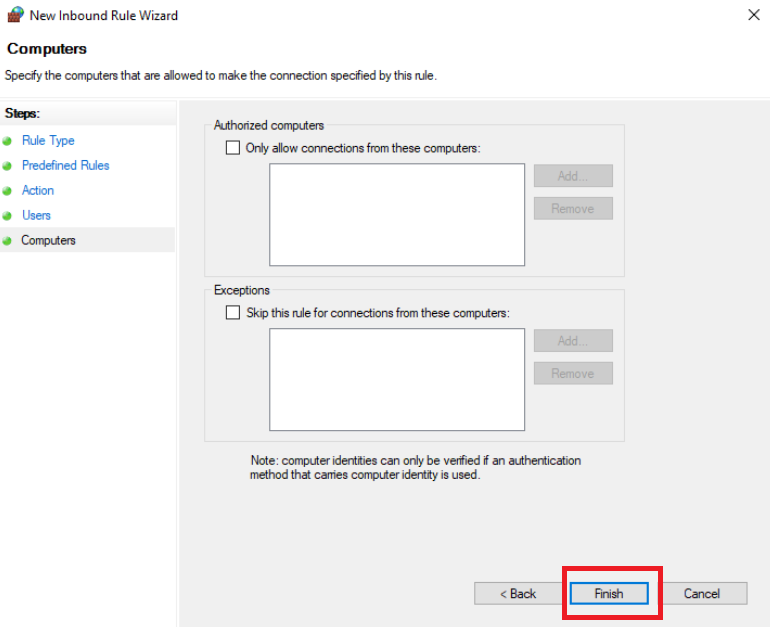

# Hands-on Lab: Create a Firewall Rule in Microsoft Windows Defender

**Estimated time needed:** 30 minutes

---

## About This Lab

This exercise will look at Windows Defender Firewall with Advanced Security. This advanced view provides more in-depth options for configuration. All Windows Firewall rules, and their details, are stored here, allowing you to edit configurations for each rule or exception.

---

## Learning Objectives

In this hands-on lab, you will:

- Use Windows Defender Firewall with Advanced Security to edit an existing firewall rule
- Enforce the following rules:
  - Allow the connection for Key Management Service on the Domain and Private network
  - Deny the connection for Key Management Service on the Public network

---

## Important Information About Lab Instructions and Solutions

In case you try to use your physical keyboard in the lab environment, it might not produce any visible results. To avoid this issue, please use the **On-Screen Keyboard** (you can find it by searching for "On-Screen Keyboard" in the search bar at the bottom of your screen). If search functionality doesn't work, you can also click on the Windows icon, scroll down to find **Windows Ease of Access**, click on it, and then select **On-Screen Keyboard**.

Microsoft Windows operating system features can vary based on the Windows edition. If completing these exercises on your machine, your navigation and solutions may differ from what's presented in this lab.

---

## Important Notices about This Lab

### About Lab Sessions

Lab sessions are **not persisted**. This means that every time you connect to this lab, a new environment is created for you. Any data or files you saved in a previous session are no longer available. To avoid losing your data, plan to complete these tasks in a single session.

### Prerequisites

- Windows 10/11 or Windows Server
- Administrator privileges on the computer
- Understanding of basic firewall concepts

---

## Introduction to Key Management Service (KMS)

**Key Management Service (KMS)** is a Microsoft technology used for volume activation of Windows and Office products within organizations. KMS allows clients to activate without connecting directly to Microsoft, making it efficient for large enterprises.

**Why control KMS access by network profile?**

| Profile           | KMS Access | Reason                                             |
| :---------------- | :--------- | :------------------------------------------------- |
| **Domain**  | Allow      | Trusted corporate network with domain controllers  |
| **Private** | Allow      | Trusted internal networks that may need activation |
| **Public**  | Deny       | Untrusted networks should not expose KMS services  |

---

## Exercise 1: Access Windows Security and Firewall Settings

In this exercise, you will navigate to the Windows Security center to access firewall configuration options.

### Step 1: Open Windows Security

1. Click the Windows **Start** button (bottom-left corner of your screen)

![Windows Start button highlighted]


1. Scroll down through the applications list or type **Windows Security** in the search bar
2. Click on **Windows Security** to open the application

![Windows Start menu with Windows Security selected]


### Step 2: Navigate to Firewall & Network Protection

1. In the Windows Security dashboard, click on **Firewall & network protection**

![Security at a glance window with Firewall & network protection highlighted]


### Step 3: Open Advanced Settings

1. In the Firewall & network protection window, click on **Advanced settings** in the left navigation pane

![Advanced settings link in left pane]


2. This opens the **Windows Defender Firewall with Advanced Security** console

![Windows Defender Firewall with Advanced Security window]


---

## Exercise 2: Understand the Advanced Security Interface

In this exercise, you will familiarize yourself with the Advanced Security console.

### Step 1: Explore the Console Layout

The console is divided into three main sections:

| Section                          | Description                                |
| :------------------------------- | :----------------------------------------- |
| **Left pane (Navigation)** | Tree view of rules and monitoring options  |
| **Center pane (Details)**  | List of rules or details for selected item |
| **Right pane (Actions)**   | Available actions for the selected item    |


### Step 2: Understand Rule Types

In the left navigation pane, you'll see several rule categories:

| Rule Type                           | Purpose                                      |
| :---------------------------------- | :------------------------------------------- |
| **Inbound Rules**             | Control traffic coming INTO your computer    |
| **Outbound Rules**            | Control traffic leaving your computer        |
| **Connection Security Rules** | IPsec rules for secure connections           |
| **Monitoring**                | View active rules and current firewall state |


### Step 3: View Inbound Rules

1. Click on **Inbound Rules** in the left pane
2. The center pane displays all inbound rules with columns showing:
   - **Name** - Rule identifier
   - **Group** - Category grouping
   - **Profile** - Which network profile applies (Domain, Private, Public)
   - **Enabled** - Whether rule is active (Yes/No)
   - **Action** - Allow or Block
   - **Override** - Rule precedence
   - **Program** - Associated program
   - **Protocol** - TCP, UDP, etc.
   - **Local Port** - Port numbers

![Inbound rules list with columns]


### Step 4: Sort and Find Rules

1. Click on the **Name** column header to sort alphabetically
2. Scroll through the list to find **Key Management Service** rules
3. Note that there may be multiple KMS-related rules (TCP and UDP, different directions)

---

## Exercise 3: Locate Key Management Service Rules

In this exercise, you will locate the existing Key Management Service firewall rules.

### Step 1: Search for KMS Rules

1. In the Inbound Rules list, scroll down to find rules starting with "Key Management Service"
2. Look for rules with names like:
   - **Key Management Service (TCP-In)**
   - **Key Management Service (UDP-In)**

![Key Management Service rules in the list]


### Step 2: Examine the Default Rule

1. Locate the **Key Management Service (TCP-In)** rule
2. Observe its current properties:
   - **Enabled:** Likely "No" (default state)
   - **Action:** "Allow" (when enabled)
   - **Profile:** All profiles (Domain, Private, Public)

![Key Management Service rule details in list]


### Step 3: Open Rule Properties

1. Double-click on the **Key Management Service (TCP-In)** rule to open its properties
2. The Properties dialog has multiple tabs with detailed configuration options

![Key Management Service (TCP-In) Properties window]

 Properties window.png>)





.png>)
---

## Exercise 4: Modify Existing Rule for Domain and Private Networks

In this exercise, you will modify the existing KMS rule to only apply to Domain and Private networks.

### Step 1: Review General Tab

1. In the Properties dialog, ensure you're on the **General** tab
2. Observe the following:
   - **Name:** Key Management Service (TCP-In)
   - **Description:** Inbound rule for Key Management Service to activate... (varies)
   - **Enabled:** Checkbox (currently unchecked)
   - **Action:** Allow the connection (selected)

![General tab showing Allow the connection selected]


### Step 2: Navigate to Advanced Tab

1. Click on the **Advanced** tab
2. This tab controls which profiles the rule applies to

![Advanced tab showing profile selection]


### Step 3: Modify Profile Settings

1. In the **Profiles** section, you'll see three checkboxes:

   - ☐ Domain
   - ☐ Private
   - ☐ Public
2. By default, all three may be checked (depending on system configuration)
3. **Uncheck** the **Public** checkbox
4. Ensure **Domain** and **Private** remain checked

![Advanced tab with Public unchecked]


### Step 4: Apply Changes

1. Click **Apply** to save the profile changes
2. Click **OK** to close the Properties dialog

### Step 5: Enable the Rule

1. Back in the main Inbound Rules list, right-click on the **Key Management Service (TCP-In)** rule
2. Select **Enable Rule** from the context menu

![Right-click menu with Enable Rule selected]


3. You should now see a green checkmark in the **Enabled** column

![Rule now showing green checkmark enabled]


---

## Exercise 5: Create a Blocking Rule for Public Networks

In this exercise, you will create a new rule that blocks KMS traffic on Public networks.

### Step 1: Copy the Existing Rule

1. Right-click on the **Key Management Service (TCP-In)** rule
2. Select **Copy** from the context menu

![Copy option in right-click menu]


### Step 2: Paste to Create a New Rule

1. Right-click anywhere in the empty space of the Inbound Rules list
2. Select **Paste** from the context menu (or press **Ctrl+V**)

![Paste option in context menu]


3. A new rule appears with the same name: **Key Management Service (TCP-In)** - now you have two identical rules

![Duplicate rule appearing in list]

### Step 3: Open the New Rule Properties

1. Double-click on the **second** Key Management Service rule (the newly created copy)
2. The Properties dialog opens for this rule

### Step 4: Change Action to Block

1. On the **General** tab, in the **Action** section:
2. Select **Block the connection**

![General tab with Block the connection selected]


3. Click **Apply** to save the action change

### Step 5: Configure Profile for Blocking Rule

1. Click on the **Advanced** tab
2. In the **Profiles** section:
   - **Uncheck** Domain
   - **Uncheck** Private
   - **Check** Public

![Advanced tab with only Public checked]


3. Click **Apply**
4. Click **OK** to close the Properties dialog

### Step 6: Enable the Blocking Rule

1. Right-click on the second Key Management Service rule
2. Select **Enable Rule** from the context menu

![Enabling the second rule]


3. The rule now shows a red circle with a line through it in the **Action** column, indicating it blocks traffic


---

## Exercise 6: Verify Rule Configuration

In this exercise, you will verify that both rules are configured correctly.

### Step 1: Review Both Rules

You should now have two Key Management Service rules with the following configurations:

| Rule                    | Action | Profile         | Status  | Icon            |
| :---------------------- | :----- | :-------------- | :------ | :-------------- |
| **Original Rule** | Allow  | Domain, Private | Enabled | Green checkmark |
| **New Rule**      | Block  | Public          | Enabled | Red circle      |

![Both rules properly configured in list]

### Step 2: Understand Rule Precedence

When multiple rules apply to the same traffic, Windows Firewall uses the following precedence:

1. **Explicit block** rules take highest priority
2. **Explicit allow** rules
3. **Default behavior** (usually block if no rule matches)

**What this means for KMS:**

| Connection Source | Which Rule Applies   | Result              |
| :---------------- | :------------------- | :------------------ |
| Domain network    | Allow rule (matches) | KMS traffic allowed |
| Private network   | Allow rule (matches) | KMS traffic allowed |
| Public network    | Block rule (matches) | KMS traffic blocked |

### Step 3: Test the Configuration (Optional)

If you have access to different network types, you could test:

1. Connect to a Domain network and verify KMS activation works
2. Connect to a Private network and verify KMS activation works
3. Connect to a Public network and verify KMS activation is blocked

**Note:** Actual KMS activation requires a KMS host; this lab focuses on rule configuration, not activation testing.

---

## Exercise 7: Create Additional Rules for UDP (Optional)

KMS can use both TCP and UDP protocols. In this optional exercise, you will configure the UDP rule similarly.

### Step 1: Locate UDP Rule

1. In the Inbound Rules list, find **Key Management Service (UDP-In)**
2. This rule may also exist for UDP-based KMS traffic

### Step 2: Configure UDP Allow Rule

1. Double-click the UDP rule
2. On Advanced tab, uncheck **Public**
3. Ensure **Domain** and **Private** remain checked
4. Click **Apply** and **OK**
5. Enable the rule (if not already enabled)

### Step 3: Create UDP Block Rule

1. Right-click the UDP rule and select **Copy**
2. Paste to create a duplicate
3. Change action to **Block the connection**
4. On Advanced tab, check only **Public**
5. Enable the rule

---

## Exercise 8: Export and Import Rules (For Reference)

In this exercise, you will learn how to export firewall rules for backup or deployment to other systems.

### Step 1: Export Rules

1. In the right **Actions** pane, click on **Export Policy...**

![Export Policy option in Actions pane]

2. Choose a location to save the policy file
3. Enter a filename (e.g., `KMS_Firewall_Rules.wfw`)
4. Click **Save**

### Step 2: View Exported File

The exported file contains all current firewall rules and can be imported on another system to replicate the configuration.

### Step 3: Import Rules (If Needed)

To import rules on another system:

1. Open Windows Defender Firewall with Advanced Security
2. In the Actions pane, click **Import Policy...**
3. Select the saved policy file
4. Click **Open**

**Warning:** Importing a policy overwrites existing rules. Use with caution.

---

## Exercise 9: Document Your Configuration

In this exercise, you will create documentation for your firewall rule configuration.

### Step 1: Create a Documentation File

Open Notepad and create a new file called **`kms-firewall-configuration.txt`** :

```
KEY MANAGEMENT SERVICE FIREWALL CONFIGURATION
=============================================
Date: [Current Date]
Configured by: [Your Name]
System: [Computer Name]

CONFIGURATION SUMMARY
---------------------
Goal: Allow KMS on Domain/Private networks, block on Public networks

RULES CONFIGURED:
-----------------

RULE 1: Allow KMS on Domain and Private
----------------------------------------
Rule Name: Key Management Service (TCP-In) - Allow
Type: Inbound
Protocol: TCP
Action: Allow
Profiles: Domain, Private
Status: Enabled
Notes: Original rule modified to exclude Public

RULE 2: Block KMS on Public
----------------------------
Rule Name: Key Management Service (TCP-In) - Block
Type: Inbound
Protocol: TCP
Action: Block
Profiles: Public
Status: Enabled
Notes: Created by copying and modifying original rule

ADDITIONAL RULES (UDP):
-----------------------
[Include if configured]

RULE PRECEDENCE NOTES:
----------------------
Block rules take priority over allow rules.
When on Public network, Block rule applies.
When on Domain/Private, Allow rule applies.

VERIFICATION STEPS:
-------------------
☐ Original rule enabled with green checkmark
☐ Original rule shows Allow action
☐ New rule enabled with red circle
☐ New rule shows Block action
☐ Only Public checked on Block rule
☐ Domain/Private checked on Allow rule

TROUBLESHOOTING:
----------------
If KMS doesn't work as expected:
1. Verify correct rule is enabled
2. Check which network profile is active
3. Review rule order and precedence
4. Check Windows Firewall logs

EXPORT INFORMATION:
-------------------
Configuration exported to: [File path]
Export date: [Date]

MAINTENANCE NOTES:
------------------
Review these rules:
- After Windows updates
- After network configuration changes
- Quarterly as part of security review
```

### Step 2: Save the File

Save the documentation file to your desktop or documents folder.

---

## Exercise 10: Clean Up (Optional)

If you want to remove the rules you created:

### Step 1: Disable or Delete Rules

1. Right-click on the blocking rule you created
2. Select **Disable Rule** to temporarily disable, or **Delete** to remove permanently

![Disable or Delete options]

3. Confirm deletion if prompted

### Step 2: Restore Original Rule

1. Locate the original Key Management Service rule
2. If you want to restore it to original settings:
   - Double-click to open properties
   - On Advanced tab, check **Public** again
   - Click Apply and OK

### Step 3: Note on Lab Environment

Remember that in this lab environment, any changes you make will be lost when you close the session. Cleanup is optional but good practice.

---

## Exercise 11: Advanced Rule Creation (Bonus)

In this bonus exercise, you will learn how to create a custom firewall rule from scratch.

### Step 1: Start New Rule Wizard

1. In the right **Actions** pane, click on **New Rule...**

![New Rule option in Actions pane]

2. The New Inbound Rule Wizard opens

### Step 2: Choose Rule Type

You have four options:

| Rule Type            | When to Use                                 |
| :------------------- | :------------------------------------------ |
| **Program**    | Control traffic for a specific application  |
| **Port**       | Control traffic for a specific TCP/UDP port |
| **Predefined** | Use built-in Windows service rules          |
| **Custom**     | Full control over all rule parameters       |

![New Rule Wizard - Rule Type selection]

### Step 3: Create a Port Rule (Example)

1. Select **Port**
2. Click **Next**

### Step 4: Specify Protocol and Port

1. Select **TCP** or **UDP**
2. Choose **Specific local ports** and enter a port number (e.g., 3389 for RDP)
3. Click **Next**

![Specify Ports screen]

### Step 5: Choose Action

1. Select **Allow the connection** or **Block the connection**
2. Click **Next**

### Step 6: Select Profile

1. Check which profiles the rule applies to (Domain, Private, Public)
2. Click **Next**

### Step 7: Name the Rule

1. Enter a **Name** for the rule
2. Optionally add a **Description**
3. Click **Finish**

The new rule appears in the Inbound Rules list and can be modified like any other rule.

---

## Summary

In this hands-on lab, you have:

| Activity                                                               | Completed |
| :--------------------------------------------------------------------- | :-------- |
| Opened Windows Security and accessed Advanced Settings                 | ✓        |
| Navigated the Windows Defender Firewall with Advanced Security console | ✓        |
| Located the Key Management Service (TCP-In) rule                       | ✓        |
| Modified the rule to allow on Domain and Private networks only         | ✓        |
| Enabled the modified rule                                              | ✓        |
| Copied and pasted to create a duplicate rule                           | ✓        |
| Configured the duplicate to block connections                          | ✓        |
| Set the duplicate rule to apply only to Public networks                | ✓        |
| Enabled the blocking rule                                              | ✓        |
| Verified both rules are properly configured                            | ✓        |
| Documented the firewall configuration                                  | ✓        |
| Learned how to create custom rules from scratch                        | ✓        |

---

<video controls src="Create a Firewall Rule in Microsoft Windows Defender.mp4" title="Create a Firewall Rule in Microsoft Windows Defender"></video>


## Key Takeaways

### Rule Configuration Summary

| Rule              | Action | Domain | Private | Public | Status  |
| :---------------- | :----- | :----- | :------ | :----- | :------ |
| Original KMS Rule | Allow  | ✓     | ✓      | ✗     | Enabled |
| New KMS Rule      | Block  | ✗     | ✗      | ✓     | Enabled |

### Important Concepts

1. **Rule Precedence:** Block rules take priority over allow rules
2. **Profile Awareness:** Rules can be applied selectively based on network trust
3. **Rule Copying:** Creating similar rules is efficient with copy/paste
4. **Documentation:** Always document firewall changes for maintenance
5. **Testing:** Verify rules work as expected in each network environment

### Best Practices for Firewall Rules

- **Use descriptive names** for easy identification
- **Document the purpose** of custom rules
- **Apply least privilege** - only allow what's necessary
- **Test rules** in each network profile
- **Regular review** - audit rules quarterly
- **Export configurations** for backup and disaster recovery

---

## Troubleshooting Tips

| Issue                                            | Possible Solution                                                 |
| :----------------------------------------------- | :---------------------------------------------------------------- |
| **Rule not taking effect**                 | Check rule order; verify profile selection matches active network |
| **Both rules appear to apply**             | Block rules take precedence; verify profile settings              |
| **Can't enable rule**                      | Ensure you have administrator privileges                          |
| **Rule missing after restart**             | Lab environment changes aren't persisted; recreate if needed      |
| **Accidentally blocked important traffic** | Disable or delete the blocking rule; check logs                   |

---

## Additional Resources

- [Microsoft Docs: Windows Defender Firewall with Advanced Security](https://docs.microsoft.com/en-us/windows/security/threat-protection/windows-firewall/windows-firewall-with-advanced-security)
- [Key Management Service (KMS) Overview](https://docs.microsoft.com/en-us/windows-server/get-started/kms-client-activation)
- [Understanding Firewall Profiles](https://docs.microsoft.com/en-us/windows/security/threat-protection/windows-firewall/understanding-the-windows-firewall-with-advanced-security-profiles)

---

## Congratulations!

You have successfully completed the **Create a Firewall Rule in Microsoft Windows Defender** lab. You now know how to:

- Navigate Windows Defender Firewall with Advanced Security
- Locate and modify existing firewall rules
- Create new rules by copying existing ones
- Configure rules for specific network profiles
- Set both Allow and Block actions appropriately
- Document firewall configurations

These advanced firewall management skills are essential for securing Windows systems in enterprise environments where granular control over network traffic is required.
