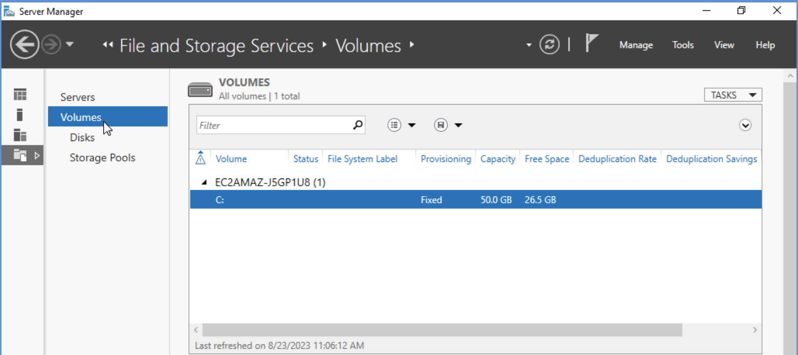

# Hands-on Lab: Exploring Microsoft Windows Server Features

**Estimated time needed:** 20 minutes

---

## Learning Objectives

After completing this lab, you will be able to:

1. Open and work with the Server Manager management console
2. Access remote, multi-server management capabilities
3. Navigate the Server Manager dashboard and its key components
4. View and understand local server properties and configuration

---

## Important Information About Lab Instructions and Solutions

In case you try to use your physical keyboard in the lab environment, it might not produce any visible results. To avoid this issue, please use the **On-Screen Keyboard** (you can find it by searching for "On-Screen Keyboard" in the search bar at the bottom of your screen). If search functionality doesn't work, you can also click on the Windows icon, scroll down to find **Windows Ease of Access**, click on it, and then select **On-Screen Keyboard**.

Microsoft Windows operating system features can vary based on the Windows edition. If completing these exercises on your machine, your navigation and solutions may differ from what's presented in this lab.

---

## About This Lab

This lab resides in a virtual environment. Any changes you make here will only last as long as the lab session is open. When you close the lab session, all configurations and changes will be lost.

---

## Exercise: Get Familiar with Windows Server Manager

In this exercise, you will learn how to open the Windows Server Manager and get familiar with a few essential things that you can do with the Windows Server.

### Step 1: Open Server Manager

1. Click the **Windows icon** (Start button) in the Windows virtual environment
2. Scroll through the applications list or look for **Server Manager** in the menu
3. Click on **Server Manager** to open the management console


### Step 2: Explore the Server Manager Dashboard

The Server Manager dashboard opens, displaying all the details of your Windows server machine. This is the central management interface for Windows Server.


**The dashboard is organized into several key sections:**

| Section                      | Purpose                                        |
| :--------------------------- | :--------------------------------------------- |
| **Welcome tiles**      | Quick access to common configuration tasks     |
| **Server summary**     | Overview of local server status and properties |
| **Roles and Features** | Summary of installed roles and features        |
| **Events**             | Recent system events and alerts                |
| **Services**           | Status of key Windows services                 |
| **Performance**        | Resource utilization metrics                   |
| **BPA results**        | Best Practices Analyzer recommendations        |

### Step 3: Review Configuration Options

From the dashboard, you can perform various management tasks:

| Task                                  | Description                                                |
| :------------------------------------ | :--------------------------------------------------------- |
| **Add roles and features**      | Install server roles (like DNS, DHCP, Web Server)          |
| **Add other servers to manage** | Connect to and manage multiple servers from one console    |
| **Create a server group**       | Organize servers into logical groups for easier management |
| **Connect to cloud services**   | Integrate with Azure or other cloud platforms              |


**Note:** As mentioned, anything you change here will only last until the lab session closes.

### Step 4: Navigate to Local Server

1. In the left navigation pane, click on **Local Server**
2. This section lists the local servers in the virtual environment


### Step 5: Examine Local Server Properties

The Local Server view displays detailed information about your server:

| Property                   | Description                           | Your Server Value             |
| :------------------------- | :------------------------------------ | :---------------------------- |
| **Computer name**    | The network name of the server        | _________________             |
| **Workgroup/Domain** | The workgroup or domain membership    | _________________             |
| **Hardware**         | Virtual or physical hardware platform | Amazon EC2 (in this lab)      |
| **Operating System** | Windows Server version                | Microsoft Windows Server 2022 |
| **RAM**              | Total installed memory                | _________________ GB          |
| **Disk space**       | Available storage capacity            | _________________ GB          |


### Step 6: Explore Local Server Configuration Tiles

The Local Server page contains several interactive tiles:

**Tile: Computer Name**

- Displays the server name and workgroup/domain
- Click to rename the server or change domain membership

**Tile: Windows Defender Firewall**

- Shows current firewall status (On/Off)
- Click to configure firewall settings

**Tile: Remote Management**

- Indicates whether remote management is enabled
- Critical for multi-server administration

**Tile: Remote Desktop**

- Shows Remote Desktop status
- Click to enable/disable remote desktop access

**Tile: Events**

- Summary of recent system events
- Click to view detailed event logs

**Tile: Services**

- Overview of running services
- Click to open Services management console


### Step 7: View Server Details (Optional)

1. Click on the **Computer name** tile
2. The System Properties window opens
3. Here you can view additional details:
   - Windows activation status
   - Processor information
   - System type (64-bit operating system)
   - Computer name/domain changes


### Step 8: Check Windows Defender Firewall Status

1. Click on the **Windows Defender Firewall** tile
2. The Windows Defender Firewall control panel opens
3. Review the firewall status for different network profiles:
   - Domain network
   - Private network
   - Public network



---

## Additional Exploration: Remote Server Management (Conceptual)

While this lab environment may only have one server, Server Manager is designed for managing multiple servers from a single console.

### How Multi-Server Management Works

1. **Add servers to manage:**
   - From the dashboard, select **Add other servers to manage**
   - You can add servers by:
     - Active Directory search
     - DNS name lookup
     - Import from a text file

![Add Servers dialog]

2. **Create server groups:**

   - Organize servers by function (e.g., Web Servers, Database Servers)
   - Apply consistent configurations to groups
3. **Monitor multiple servers:**

   - View events, performance data, and service status across all managed servers
   - Receive consolidated alerts and notifications

### Benefits of Multi-Server Management

| Benefit                                   | Description                                        |
| :---------------------------------------- | :------------------------------------------------- |
| **Centralized administration**      | Manage all servers from one console                |
| **Consistent configuration**        | Apply same settings across server groups           |
| **Improved monitoring**             | View health and performance of all servers at once |
| **Reduced administrative overhead** | Fewer logins and manual checks required            |

---

## Lab Completion Checklist

Use this checklist to ensure you've completed all lab activities:

| Task                                                                         | Completed |
| :--------------------------------------------------------------------------- | :-------- |
| Opened Server Manager from Start menu                                        | ☐        |
| Viewed the Server Manager dashboard                                          | ☐        |
| Identified the configuration options (add roles, add servers, create groups) | ☐        |
| Navigated to Local Server in left navigation                                 | ☐        |
| Located the computer name and workgroup information                          | ☐        |
| Identified the hardware platform (Amazon EC2)                                | ☐        |
| Confirmed the operating system version (Windows Server 2022)                 | ☐        |
| Located the RAM and disk space information                                   | ☐        |
| Explored at least one configuration tile (firewall, remote management, etc.) | ☐        |
| Reviewed the concept of multi-server management                              | ☐        |

---

## Review Questions

1. **What is the purpose of Server Manager in Windows Server?**

   ```
   _________________________________________________________________
   _________________________________________________________________
   ```
2. **What information can you find on the Local Server page?**

   ```
   _________________________________________________________________
   _________________________________________________________________
   ```
3. **What are three tasks you can perform from the Server Manager dashboard?**

   ```
   Task 1: _________________________________________________________
   Task 2: _________________________________________________________
   Task 3: _________________________________________________________
   ```
4. **Why might an administrator want to add other servers to manage in Server Manager?**

   ```
   _________________________________________________________________
   _________________________________________________________________
   ```
5. **In this lab environment, what will happen to any changes you make after you close the session?**

   ```
   _________________________________________________________________
   _________________________________________________________________
   ```

---

## Troubleshooting Tips

| Issue                                         | Solution                                                                                 |
| :-------------------------------------------- | :--------------------------------------------------------------------------------------- |
| **Server Manager won't open**           | Wait a few moments and try again; ensure you have administrator privileges               |
| **Keyboard not working in lab**         | Use On-Screen Keyboard: Start > Windows Ease of Access > On-Screen Keyboard              |
| **Can't find Server Manager**           | Type "Server Manager" in the taskbar search; check under Windows Administrative Tools    |
| **Local Server properties not loading** | Refresh the view by clicking Refresh in the toolbar or pressing F5                       |
| **Lab environment resets**              | Remember that this is a temporary virtual environment; complete all tasks in one session |

---

## Summary of Key Features

| Feature                          | Location        | Purpose                                     |
| :------------------------------- | :-------------- | :------------------------------------------ |
| **Dashboard**              | Main view       | Central hub for server management           |
| **Local Server**           | Left navigation | View and configure local server properties  |
| **All Servers**            | Left navigation | Manage multiple servers (if added)          |
| **Roles and Features**     | Left navigation | View installed roles; add new ones          |
| **Add roles and features** | Dashboard tile  | Launch installation wizard for server roles |
| **Add other servers**      | Dashboard tile  | Add remote servers to management console    |
| **Create server group**    | Dashboard tile  | Organize servers for easier management      |

---

## Summary

In this hands-on lab, you have:

| Activity                                                                 | Completed |
| :----------------------------------------------------------------------- | :-------- |
| Opened Server Manager from the Windows Start menu                        | ✓        |
| Explored the Server Manager dashboard                                    | ✓        |
| Identified configuration options (add roles, add servers, create groups) | ✓        |
| Navigated to the Local Server section                                    | ✓        |
| Located computer name and workgroup information                          | ✓        |
| Identified the hardware platform (Amazon EC2)                            | ✓        |
| Confirmed the operating system version (Windows Server 2022)             | ✓        |
| Located RAM and disk space information                                   | ✓        |
| Explored configuration tiles (firewall, remote management, etc.)         | ✓        |
| Reviewed the concept of multi-server management                          | ✓        |

---


<video controls src="Exploring Microsoft Windows Server Features.mp4" title="Exploring Microsoft Windows Server Features"></video>


## Key Takeaways

- **Server Manager** is the primary management console for Windows Server
- The **dashboard** provides quick access to common configuration tasks
- **Local Server** view displays essential server properties and configuration status
- Windows Server 2022 includes tools for **multi-server management** from a single console
- This lab environment is **temporary**—changes made will not persist after the session ends
- Server Manager enables administrators to **add roles and features**, **manage multiple servers**, and **monitor system health** from one interface

---

## Next Steps

After completing this introductory lab, you can explore more advanced Windows Server topics:

1. **Adding server roles** (DNS, DHCP, File Services, Web Server)
2. **Creating and managing server groups**
3. **Configuring remote management**
4. **Setting up performance monitoring**
5. **Implementing security policies through Server Manager**

---

## Additional Resources

- [Microsoft Windows Server Documentation](https://docs.microsoft.com/en-us/windows-server/)
- [Server Manager Overview](https://docs.microsoft.com/en-us/windows-server/administration/server-manager/server-manager)
- [Manage Multiple Servers with Server Manager](https://docs.microsoft.com/en-us/windows-server/administration/server-manager/manage-multiple-remote-servers-with-server-manager)

---

## Congratulations!

You have successfully completed the **Exploring Microsoft Windows Server Features** lab. You now know how to:

- Open and navigate the Server Manager management console
- Access and understand local server properties
- Identify key server configuration information
- Recognize the capabilities for remote and multi-server management

These foundational skills are essential for anyone beginning to work with Windows Server administration.
