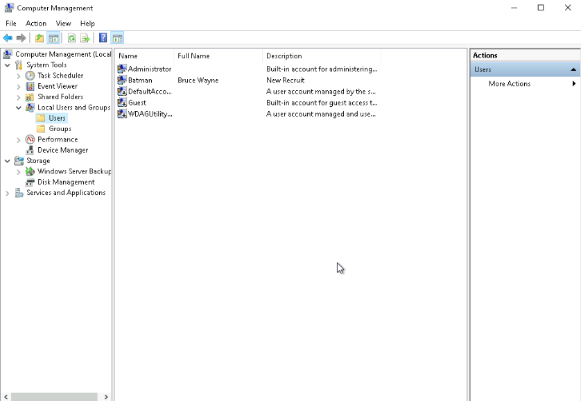
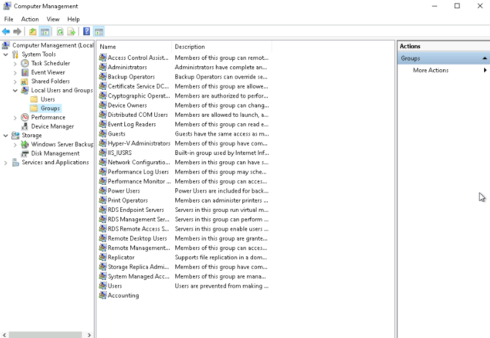
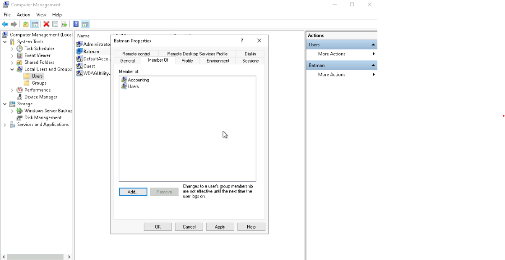
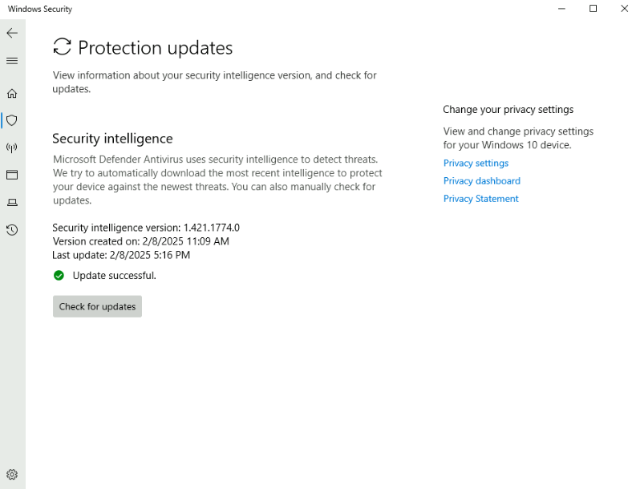
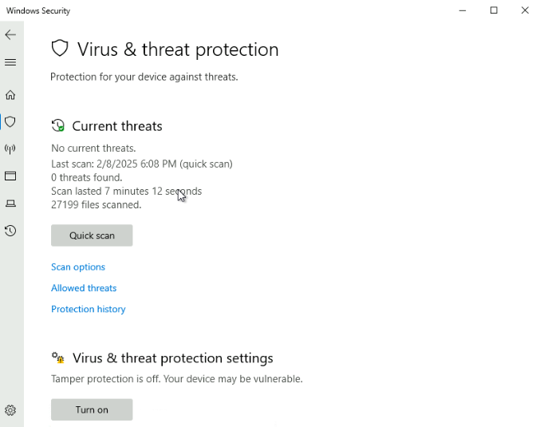
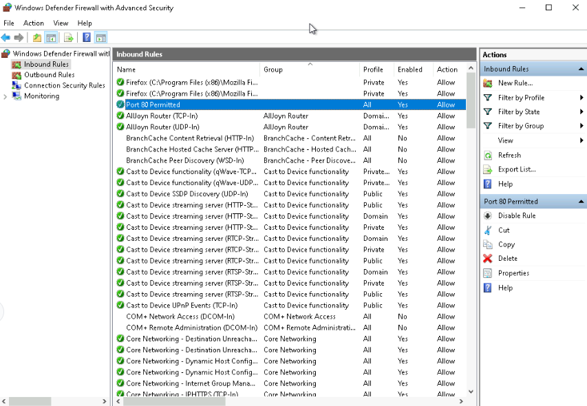

# Final Project Part 1: Windows Tasks

**Estimated time:** 20 minutes

---

## Overview

Cyber Secure Inc. recently hired you as a junior cybersecurity analyst. Other businesses contract Cyber Secure Inc. to handle their system administration and security. Your supervisor assigned you six tickets; the first three require you to work with Windows OS, and the other three require you to work with Linux.

The project has two parts. For this part, you will use the Microsoft Windows Server lab environment in Coursera, which emulates a Windows Operating System. You may use your own machine to complete these projects if you have access to these environments on your computer.

---

## Windows Tasks

1. Add a new user to a new group
2. Update and run virus and threat protection
3. Configure firewall and network protection

---

## Learning Objectives

After completing this project, you will have demonstrated your ability to:

- Create a new user and a new group using Windows Server Manager
- Add a user to a group using Windows Server Manager
- Check for updates to virus and threat protection using a Windows operating system
- Run a "Quick Scan" to verify up-to-date virus and threat protection on a Windows operating system
- Create an inbound rule that controls connections on a TCP port using Windows Defender Firewall

---

## Important Notices About This Lab

### Lab Instructions and Solutions

### Screenshots

**Windows:** You will need to take screenshots of each task as proof of your work to submit for peer review. To take a screenshot from a Windows computer, use the **Snipping Tool** by going to the Start menu and opening the Snipping Tool. Select **New**, then click and drag over the area of the screen you want to screenshot. Save the file as a `.png` file or a `.jpg` file.

**macOS:** To take a screenshot on macOS, press **Shift + Command + 4**, then click and drag over the area of the screen you want to screenshot. The file will be saved to your desktop.

### Upload

You have to upload the file in the peer review section while submitting the assignment. Select **Upload File**, browse to the file location, or drag the file icon onto the window.

---

## Ticket 1: Create a New User and Group

In this task, you will use Microsoft Windows Server Manager to create a new user and group and then add the user to the group.

### Step 1: Open Server Manager

1. Click the Windows **Start** button
2. Search for or navigate to **Server Manager**
3. Click to open Server Manager

![Server Manager dashboard]

### Step 2: Access Local Users and Groups

1. In Server Manager, click on **Tools** in the top right menu
2. Select **Computer Management** from the dropdown menu

![Tools menu with Computer Management highlighted]

3. In Computer Management, expand **Local Users and Groups** in the left navigation pane

![Computer Management with Local Users and Groups expanded]

### Step 3: Create a New User

1. Right-click on **Users** folder
2. Select **New User**

![Right-click menu with New User selected]

3. Fill in the user information:

| Field                      | Value                                         |
| :------------------------- | :-------------------------------------------- |
| **User name**        | [Your favorite cartoon character name]        |
| **Full name**        | [Same or character's full name]               |
| **Description**      | [Optional: describe the character]            |
| **Password**         | Set a secure password (e.g.,`Cartoon2026!`) |
| **Confirm password** | Same as password                              |

4. Uncheck **User must change password at next logon** (for this lab)
5. Check **Password never expires** (for this lab)
6. Click **Create**, then click **Close**

![New User dialog with information filled in]

### Step 4: Take Screenshot of New User

1. Open **Snipping Tool** (Start menu → Snipping Tool)
2. Click **New** and drag over the list showing your new user
3. Save the file as `Ticket1_NewUser.png`

**Screenshot should show:**

- Computer Management window
- Users folder selected
- Your new user listed (named after your favorite cartoon character)

![Screenshot showing newly created user]

### Step 5: Create a New Group

1. In Computer Management, right-click on **Groups** folder
2. Select **New Group**

![Right-click menu with New Group selected]

3. Fill in the group information:

| Field                 | Value                       |
| :-------------------- | :-------------------------- |
| **Group name**  | Accounting                  |
| **Description** | Accounting Department Group |

4. Click **Create**, then click **Close**

![New Group dialog with information filled in]

### Step 6: Add User to the Group

1. Double-click on the **Accounting** group to open its properties
2. Click **Add** at the bottom

![Accounting group properties with Add button highlighted]

3. In the **Enter the object names to select** field, type your user's name
4. Click **Check Names** to verify
5. Click **OK**

![Select Users dialog with user name entered]

6. Click **OK** to close the group properties

### Step 7: Verify User is in Group

1. Double-click on the **Accounting** group again
2. Verify your user appears in the members list

![Accounting group showing user as member]

### Step 8: Take Screenshot of the Group

1. Take a screenshot showing the Accounting group
2. Save the file as `Ticket1_AccountingGroup.png`

**Screenshot should show:**

- Computer Management window
- Groups folder selected
- Accounting group listed with your user as a member

---

## Ticket 2: Check for Virus and Threat Protection Updates

In this task, you will use the Windows operating system to check for virus and threat protection updates and run a "Quick Scan".

### Step 1: Open Windows Security

1. Click the Windows **Start** button
2. Type **Windows Security** and open it
3. Click on **Virus & threat protection**

![Windows Security with Virus & threat protection highlighted]

### Step 2: Check for Protection Updates

1. In Virus & threat protection, look for **Protection updates** section
2. Click on **Check for updates** (if available)

![Protection updates section with Check for updates button]

3. Wait for updates to complete

### Step 3: Take Screenshot of Protection Update Date

1. Locate the **Protection updates** section
2. Take a screenshot showing:
   - **Security intelligence version**
   - **Last update date**
3. Save the file as `Ticket2_UpdateDate.png`

**Screenshot should show:**

- Protection updates section
- Security intelligence version
- Update date/time

![Protection updates showing version and date]

### Step 4: Run a Quick Scan

1. In Virus & threat protection, click on **Quick scan**

![Quick scan button]

2. Wait for the scan to complete

### Step 5: Take Screenshot of Scan Results

1. After the scan completes, take a screenshot showing the scan results
2. Save the file as `Ticket2_ScanResults.png`

**Screenshot should show:**

- Quick scan completion message
- Scan date and time
- Number of files scanned

![Quick scan results showing completion]

---

## Ticket 3: Configure Firewall and Network Protection

In this task, you will access Windows Defender Firewall with Advanced Security to create a new inbound rule.

### Step 1: Open Windows Defender Firewall with Advanced Security

1. Open **Windows Security**
2. Click on **Firewall & network protection**
3. Click **Advanced settings**

![Firewall & network protection with Advanced settings highlighted]

### Step 2: Create a New Inbound Rule

1. In the left navigation pane, click on **Inbound Rules**
2. In the right Actions pane, click on **New Rule...**

![Windows Defender Firewall with Advanced Security showing New Rule option]

### Step 3: Select Rule Type

1. Select **Port**
2. Click **Next**

![New Inbound Rule Wizard - Rule Type selection]

### Step 4: Configure Port Settings

1. Select **TCP**
2. Select **Specific local ports**
3. Enter **80** in the field
4. Click **Next**

![Protocol and Ports selection with TCP and port 80]

### Step 5: Select Action

1. Select **Allow the connection**
2. Click **Next**

![Action selection with Allow the connection]

### Step 6: Select Profile

1. Check **Domain**
2. Check **Private**
3. Check **Public**
4. Click **Next**

![Profile selection with all three profiles checked]

### Step 7: Name the Rule

1. Enter **Port 80 Permitted** in the **Name** field
2. Optional: Add a description
3. Click **Finish**

![Rule naming with Port 80 Permitted]

### Step 8: Verify the New Rule

1. In the Inbound Rules list, scroll to find **Port 80 Permitted**
2. Verify the rule shows:
   - **Enabled** column has a green checkmark
   - **Action** column shows Allow
   - **Profile** column shows Domain, Private, Public

![Inbound Rules list showing Port 80 Permitted rule]

### Step 9: Take Screenshot of New Rule

1. Take a screenshot showing the newly created inbound rule
2. Save the file as `Ticket3_NewRule.png`

**Screenshot should show:**

- Windows Defender Firewall with Advanced Security
- Inbound Rules selected
- Port 80 Permitted rule visible with:
  - Enabled status ✓
  - Allow action
  - All three profiles listed

---

## Submission Checklist

Before submitting, ensure you have the following screenshots:

| Ticket             | Screenshot File                 | Description                                      |
| :----------------- | :------------------------------ | :----------------------------------------------- |
| **Ticket 1** | `Ticket1_NewUser.png`         | New user created (named after cartoon character) |
| **Ticket 1** | `Ticket1_AccountingGroup.png` | Accounting group with user as member             |
| **Ticket 2** | `Ticket2_UpdateDate.png`      | Protection updates with version and date         |
| **Ticket 2** | `Ticket2_ScanResults.png`     | Quick scan results with completion date          |
| **Ticket 3** | `Ticket3_NewRule.png`         | New inbound rule "Port 80 Permitted"             |

---

## Troubleshooting Tips

| Issue                                    | Solution                                                                             |
| :--------------------------------------- | :----------------------------------------------------------------------------------- |
| **Can't find Server Manager**      | Search for "Server Manager" in Start menu; may be under Windows Administrative Tools |
| **Can't find Computer Management** | In Server Manager, click Tools → Computer Management                                |
| **User creation fails**            | Ensure password meets complexity requirements; try a different password              |
| **Can't find Windows Security**    | Search for "Windows Security" in Start menu                                          |
| **Firewall options grayed out**    | You need administrator privileges; ensure you're logged in as admin                  |
| **Rule not appearing**             | Refresh the Inbound Rules list (F5)                                                  |

---

## Summary

In this final project part 1, you have demonstrated your ability to:

| Task                                            | Completed |
| :---------------------------------------------- | :-------- |
| Created a new user in Windows Server Manager    | ☐        |
| Created a new group (Accounting)                | ☐        |
| Added user to the Accounting group              | ☐        |
| Checked for virus and threat protection updates | ☐        |
| Took screenshot showing protection update date  | ☐        |
| Ran a Quick Scan                                | ☐        |
| Took screenshot showing scan completion date    | ☐        |
| Created inbound firewall rule for TCP port 80   | ☐        |
| Configured rule to allow on all profiles        | ☐        |
| Named rule "Port 80 Permitted"                  | ☐        |
| Took screenshot showing new rule                | ☐        |

---

## Next Steps

After completing this part, proceed to **Final Project Part 2: Linux Tasks** where you will:

1. Create a new user and group using Linux commands
2. Update package lists and upgrade packages
3. Check disk usage and create a directory
4. Create a new inbound rule using Linux firewall (iptables or ufw)

---

## Congratulations!

You have successfully completed **Final Project Part 1: Windows Tasks**. Your screenshots demonstrate proficiency in:

- Windows user and group management
- Windows Security (virus and threat protection)
- Windows Defender Firewall rule creation

**Don't forget to upload all 5 screenshots when submitting for peer review!**
