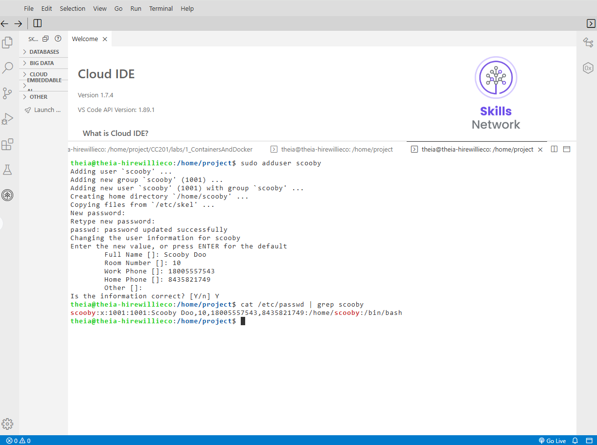
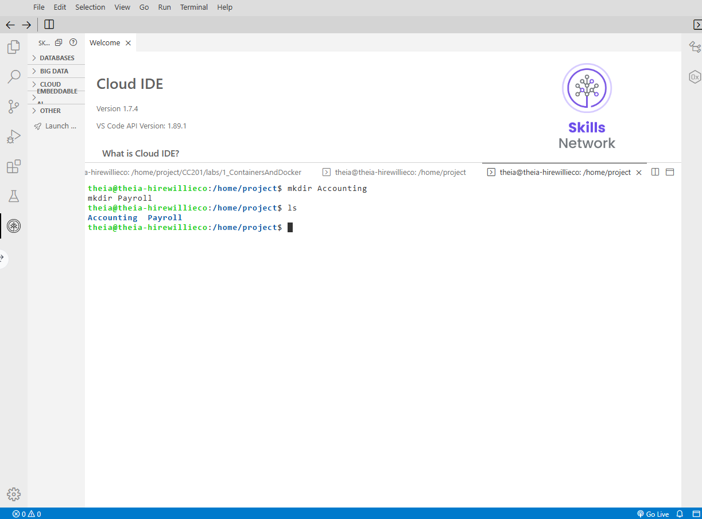
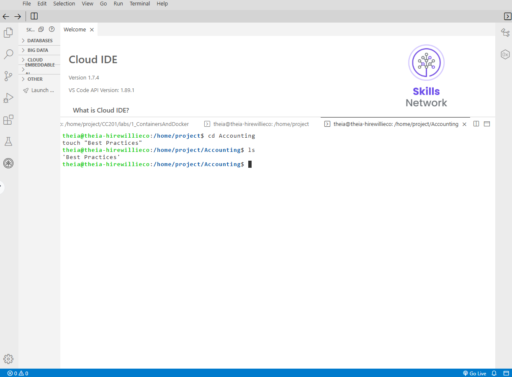
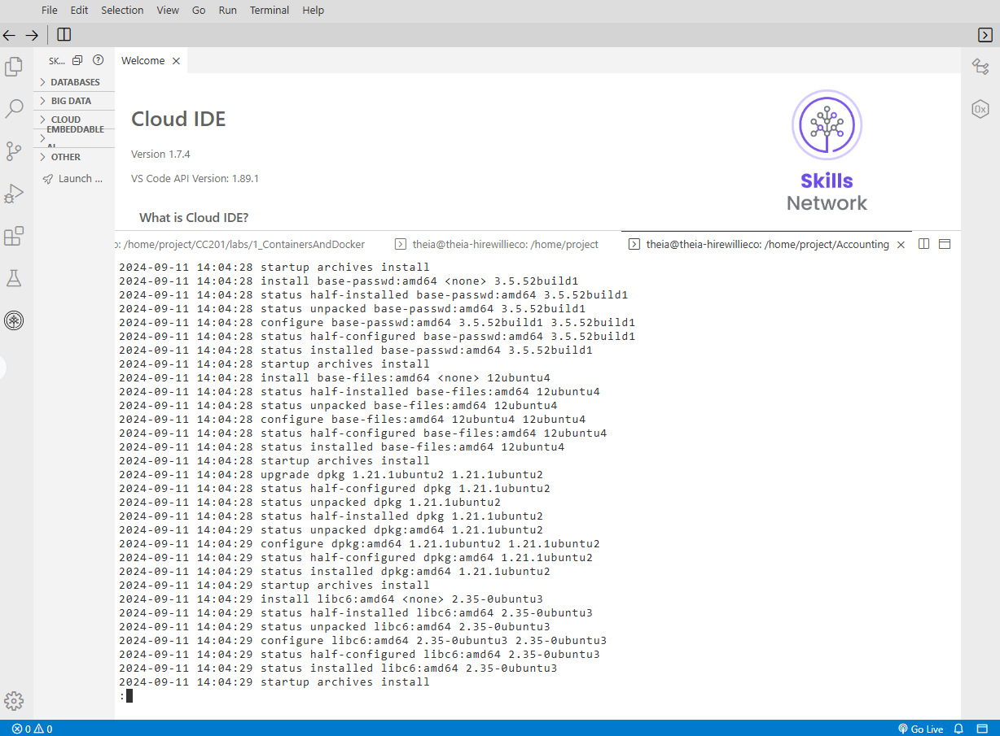

# Final Project Part 2: Linux Tasks

**Estimated time:** 20 minutes

---

## Overview

Cyber Secure Inc. recently hired you as a junior cybersecurity analyst. Other businesses contract Cyber Secure Inc. to handle their system administration and security.

Your supervisor assigned you six tickets; the first three require you to work with Windows OS, and the other three require you to work with Linux.

The project has two parts. You should have already completed part 1. For part 2, you will use the Skills Network Cloud IDE environment, providing access to a Linux terminal. You may use your machine to complete the labs if you can access Linux on your computer.

---

## Learning Objectives

After completing this project, you will have demonstrated your ability to:

- Create a new user on a Linux operating system
- Manage files and directories on a Linux operating system
- Apply system updates on a Linux operating system

---

## Linux Tasks

1. Create a new user
2. Manage files and folders
3. Apply system updates

---

## Important Notices About This Lab

### About Lab Sessions

The lab environments do **not persist** after you close them. You cannot save your data from a previous session. When you connect to this lab, the system creates a new environment. You cannot access any data or files from a previous session. **Plan to complete these tasks in a single session** to avoid losing your data.

---

## Screenshots

**Windows:** To take a screenshot from a Windows computer, use the **Snipping Tool** by going to the Start menu and opening the Snipping Tool. Select **New**, then click and drag over the area of the screen you want to screenshot. Save the file as a `.png` file or a `.jpg` file.

**macOS:** To take a screenshot on macOS, press **Shift + Command + 4**, then click and drag over the area of the screen you want to screenshot. The file will be saved to your desktop.

**Linux:** Use the built-in screenshot tool (if available) or use the **Print Screen** key.

### Upload

To upload the file, select **Upload File**, browse to the file location, or drag the file icon onto the window.

---

## Ticket 4: Create a New User

In this task, you will use the Linux terminal to create a new user named after one of your favorite cartoon characters.

### Step 1: Open a Terminal

1. Open a terminal window (if using Skills Network Cloud IDE, click **Terminal → New Terminal**)

![Terminal opened in Cloud IDE]

### Step 2: Create a New User

Use the `adduser` command to create a new user. Replace `{username}` with your favorite cartoon character name (e.g., `mickey`, `bugs`, `scooby`):

```bash
sudo adduser {username}
```

For example:

```bash
sudo adduser bugs
```

![adduser command output]

### Step 3: Set Password and Complete Information

1. You will be prompted to enter a password:

   ```
   Enter new UNIX password:
   Retype new UNIX password:
   ```

   Enter a secure password (e.g., `Cartoon2026!`)
2. You will be prompted for additional information:

   ```
   Full Name []: [Enter character name or press Enter to skip]
   Room Number []: [Press Enter to skip]
   Work Phone []: [Press Enter to skip]
   Home Phone []: [Press Enter to skip]
   Other []: [Press Enter to skip]
   ```
3. Confirm the information by typing **Y** when prompted:

   ```
   Is the information correct? [Y/n] Y
   ```

![Password and user information prompts]

### Step 4: Verify the New User Was Created

Display the newly created account using the `cat` and `grep` commands:

```bash
cat /etc/passwd | grep {username}
```

For example:

```bash
cat /etc/passwd | grep bugs
```

**Expected output:**

```
bugs:x:1001:1001:Bugs Bunny,,,:/home/bugs:/bin/bash
```

![cat /etc/passwd | grep showing new user]



### Step 5: Take Screenshot

1. Take a screenshot showing the new user account
2. Save the file as `Ticket4_NewUser.png`

**Screenshot should show:**

- Terminal window
- The command `cat /etc/passwd | grep {username}`
- The output showing the user information

---

## Ticket 5: Manage Files and Folders

In this task, you will create directories and files using Linux commands.

### Step 1: Create Folders

Create folders named `Accounting` and `Payroll`:

```bash
mkdir Accounting
mkdir Payroll
```

Or create both in one command:

```bash
mkdir Accounting Payroll
```

![mkdir commands]

### Step 2: Display the New Folders

List the contents of the current directory:

```bash
ls -l
```

Or to see the folders clearly:

```bash
ls -la
```

**Expected output:**

```
drwxr-xr-x 2 user user 4096 Mar 21 10:00 Accounting
drwxr-xr-x 2 user user 4096 Mar 21 10:00 Payroll
```

![ls -l showing Accounting and Payroll folders]



### Step 3: Take Screenshot of New Folders

1. Take a screenshot showing the Accounting and Payroll folders
2. Save the file as `Ticket5_Folders.png`

**Screenshot should show:**

- Terminal window
- `ls` command output showing both folders

### Step 4: Create a File Inside the Accounting Folder

Create a file named `Best Practices` inside the Accounting folder:

```bash
echo "Security Best Practices Document" > Accounting/Best\ Practices
```

Or using quotes for the filename with a space:

```bash
echo "Security Best Practices Document" > "Accounting/Best Practices"
```

![Creating Best Practices file]

### Step 5: Display the Contents of the Accounting Folder

List the contents of the Accounting folder:

```bash
ls -l Accounting/
```

Or to see all files including the one with spaces:

```bash
ls -la Accounting/
```

**Expected output:**

```
total 4
-rw-r--r-- 1 user user 34 Mar 21 10:05 Best Practices
```

![ls -l Accounting showing Best Practices file]


### Step 6: Display the File Contents (Optional)

To verify the file content:

```bash
cat "Accounting/Best Practices"
```

**Expected output:**

```
Security Best Practices Document
```


### Step 7: Take Screenshot

1. Take a screenshot showing the contents of the Accounting folder
2. Save the file as `Ticket5_AccountingContents.png`

**Screenshot should show:**

- Terminal window
- `ls -l Accounting/` command
- The `Best Practices` file listed


---

## Ticket 6: Apply System Updates

In this task, you will update the package lists and upgrade installed packages.

### Step 1: Check for Updates

Update the package lists using `apt update`:

```bash
sudo apt update
```

This command retrieves the latest package information from the repositories.

![sudo apt update output]

### Step 2: Install Updates

Upgrade all installed packages using `apt upgrade`:

```bash
sudo apt upgrade
```

When prompted:

```
Do you want to continue? [Y/n]
```

Type **Y** and press **Enter** to continue.

![sudo apt upgrade output]

### Step 3: Display Recent Updates Log

Use the `less` command to view the dpkg log file, which records all package installations and updates:

```bash
less /var/log/dpkg.log
```

This will open the log file in a pager. You can:

- Use **Arrow keys** to scroll up and down
- Use **Spacebar** to page down
- Use **Page Up/Page Down** keys
- Press **q** to exit

![less /var/log/dpkg.log output]



### Step 4: Identify Today's Updates

Look for entries with today's date (e.g., `Mar 21`). These entries show packages that were updated today:

```
2026-03-21 10:15:30 status installed base-files:amd64 11ubuntu5.8
2026-03-21 10:15:32 status installed openssl:amd64 1.1.1f-1ubuntu2.20
```

### Step 5: Take Screenshots

1. Take a screenshot showing some of the updates made today
2. Save the file as `Ticket6_Updates.png`

**Screenshot should show:**

- Terminal window
- `less /var/log/dpkg.log` command
- Today's date in the log entries
- Package update information

### Step 6: Exit the Log Screen

Press **q** to exit the `less` viewer and return to the command prompt.

---

## Submission Checklist

Before submitting, ensure you have the following screenshots:

| Ticket             | Screenshot File                    | Description                                            |
| :----------------- | :--------------------------------- | :----------------------------------------------------- |
| **Ticket 4** | `Ticket4_NewUser.png`            | New user created (named after cartoon character)       |
| **Ticket 5** | `Ticket5_Folders.png`            | Accounting and Payroll folders displayed               |
| **Ticket 5** | `Ticket5_AccountingContents.png` | Accounting folder contents showing Best Practices file |
| **Ticket 6** | `Ticket6_Updates.png`            | Recent updates from dpkg.log with today's date         |

---

## Complete Terminal Session Summary

Here's what your terminal session should look like after completing all tasks:

```bash
# Ticket 4: Create new user
[user@host ~]$ sudo adduser bugs
Adding user `bugs' ...
Adding new group `bugs' (1001) ...
Adding new user `bugs' (1001) with group `bugs' ...
Creating home directory `/home/bugs' ...
Copying files from `/etc/skel' ...
Enter new UNIX password: 
Retype new UNIX password: 
passwd: password updated successfully
Changing the user information for bugs
Enter the new value, or press ENTER for the default
        Full Name []: Bugs Bunny
        Room Number []: 
        Work Phone []: 
        Home Phone []: 
        Other []: 
Is the information correct? [Y/n] Y
[user@host ~]$ cat /etc/passwd | grep bugs
bugs:x:1001:1001:Bugs Bunny,,,:/home/bugs:/bin/bash

# Ticket 5: Manage files and folders
[user@host ~]$ mkdir Accounting Payroll
[user@host ~]$ ls -l
total 8
drwxr-xr-x 2 user user 4096 Mar 21 10:00 Accounting
drwxr-xr-x 2 user user 4096 Mar 21 10:00 Payroll
[user@host ~]$ echo "Security Best Practices Document" > "Accounting/Best Practices"
[user@host ~]$ ls -l Accounting/
total 4
-rw-r--r-- 1 user user 34 Mar 21 10:05 Best Practices

# Ticket 6: Apply system updates
[user@host ~]$ sudo apt update
Hit:1 http://archive.ubuntu.com/ubuntu focal InRelease
...
Reading package lists... Done

[user@host ~]$ sudo apt upgrade
Reading package lists... Done
Building dependency tree... Done
...
Do you want to continue? [Y/n] Y
...
[user@host ~]$ less /var/log/dpkg.log
```

---

## Troubleshooting Tips

| Issue                                        | Solution                                                                            |
| :------------------------------------------- | :---------------------------------------------------------------------------------- |
| **adduser: command not found**         | Use `useradd` instead: `sudo useradd -m {username}`                             |
| **Permission denied**                  | Use `sudo` before commands that require root access                               |
| **Password doesn't meet requirements** | Try a different password with uppercase, lowercase, numbers, and special characters |
| **File not found when using cat**      | Check the path:`ls Accounting/` to verify filename                                |
| **apt update fails**                   | Check internet connection; retry the command                                        |
| **Less command shows no updates**      | Scroll further; today's entries may be near the bottom                              |

---

## Summary

In this final project part 2, you have demonstrated your ability to:

| Task                                                       | Completed |
| :--------------------------------------------------------- | :-------- |
| Created a new user using `adduser`                       | ☐        |
| Set a password and completed user information              | ☐        |
| Displayed the new user with `cat /etc/passwd \| grep`     | ☐        |
| Created Accounting and Payroll folders with `mkdir`      | ☐        |
| Displayed new folders with `ls -l`                       | ☐        |
| Created a file named "Best Practices" in Accounting folder | ☐        |
| Displayed Accounting folder contents                       | ☐        |
| Updated package lists with `sudo apt update`             | ☐        |
| Upgraded packages with `sudo apt upgrade`                | ☐        |
| Displayed recent updates with `less /var/log/dpkg.log`   | ☐        |
| Exited the log screen with `q`                           | ☐        |

---

## Key Linux Commands Used

| Command                               | Purpose                               |
| :------------------------------------ | :------------------------------------ |
| `sudo adduser {username}`           | Create a new user with home directory |
| `cat /etc/passwd \| grep {username}` | Display user information              |
| `mkdir {folder1} {folder2}`         | Create directories                    |
| `ls -l`                             | List directory contents with details  |
| `echo "text" > file`                | Create a file with content            |
| `sudo apt update`                   | Update package lists                  |
| `sudo apt upgrade`                  | Upgrade installed packages            |
| `less /var/log/dpkg.log`            | View package installation log         |

---

## Congratulations!

You have successfully completed **Final Project Part 2: Linux Tasks**. Your screenshots demonstrate proficiency in:

- Linux user management
- Linux file and directory management
- Linux system updates and package management

**Don't forget to upload all screenshots when submitting for peer review!**

---

## Next Steps

After completing both parts, you should have the following screenshots ready for submission:

**Part 1 (Windows):**

- `Ticket1_NewUser.png`
- `Ticket1_AccountingGroup.png`
- `Ticket2_UpdateDate.png`
- `Ticket2_ScanResults.png`
- `Ticket3_NewRule.png`

**Part 2 (Linux):**

- `Ticket4_NewUser.png`
- `Ticket5_Folders.png`
- `Ticket5_AccountingContents.png`
- `Ticket6_Updates.png`

Submit all 9 screenshots together in the Peer Review Assignment.
