# Hands-on Lab: Creating and Editing Files in Linux

**Estimated time needed:** 30 minutes

---

## About This Lab

In this lab, you will learn essential file creation and editing skills in a Linux environment. You'll work with the **nano** text editor, which is known for being simple to use and easy to master, as well as **vi/vim**, which has many more advanced features. These fundamental skills are critical for anyone working with Linux systems.

---

## Learning Objectives

After completing this lab, you will be able to:

- Navigate to project directories using absolute and relative paths
- Use the **nano** text editor to create and edit files
- Save changes and exit the nano editor
- Run Python scripts from the command line
- Use command history and tab completion for efficiency
- Create and edit files using **vi/vim** (bonus)

---

## Important Information About Lab Instructions and Solutions

In case you try to use your physical keyboard in the lab environment, it might not produce any visible results. To avoid this issue, please use the **On-Screen Keyboard** (you can find it by searching for "On-Screen Keyboard" in the search bar at the bottom of your screen). If search functionality doesn't work, you can also click on the Windows icon, scroll down to find **Windows Ease of Access**, click on it, and then select **On-Screen Keyboard**.

---

## Important Notices about This Lab

### About Lab Sessions

Lab sessions are **not persisted**. This means that every time you connect to this lab, a new environment is created for you. Any data or files you saved in a previous session are no longer available. To avoid losing your data, plan to complete these tasks in a single session.

### Prerequisites

- Basic understanding of Linux command line
- Access to a Linux terminal (provided in lab environment)

---

## Introduction to Text Editors in Linux

Linux offers several text editors for creating and modifying files:

| Editor           | Difficulty           | Features                               | Best For                        |
| :--------------- | :------------------- | :------------------------------------- | :------------------------------ |
| **nano**   | Easy                 | Basic editing, on-screen shortcuts     | Beginners, quick edits          |
| **vi/vim** | Steep learning curve | Powerful, modal editing, plugins       | Advanced users, programmers     |
| **emacs**  | Complex              | Highly extensible, everything included | Power users, specific workflows |

In this lab, you will primarily use **nano** due to its simplicity, with an optional exercise using **vi**.

---

## Exercise 1: Navigate to the Project Directory

In this exercise, you will navigate to the project directory where you'll create your files.

### Step 1: Open Terminal

1. Open a terminal window (usually available from the application menu or by right-clicking on the desktop)
2. You should see a command prompt similar to `user@hostname:~$`

### Step 2: Navigate to the Project Directory

1. Type the following command to navigate to the project directory:

```bash
cd /home/project
```

2. Press **Enter**

**Try auto-completion:** Type `cd /home/pr` and press **TAB**. The system should auto-complete to `/home/project/`

### Step 3: Verify You're in the Correct Directory

1. Check your current directory:

```bash
pwd
```

Output should be: `/home/project`

2. List the contents:

```bash
ls
```

You should see no files (empty directory) initially.

![Terminal showing pwd and ls commands]

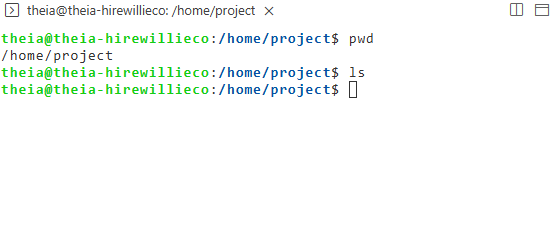

## Exercise 2: Creating and Editing a File with Nano

In this exercise, you will create a Python file using the nano text editor.

### Step 1: Launch Nano with a New File

1. Type the following command to create and open a new Python file:

```bash
nano myprogram.py
```

2. Press **Enter**

![Nano editor opening with blank file]

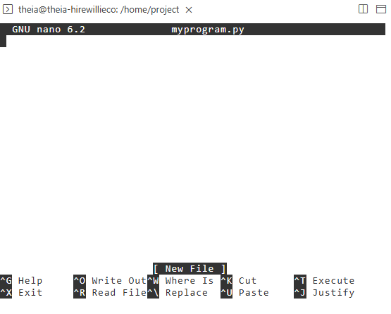

### Step 2: Understand the Nano Interface

When nano opens, you'll see:

- **Top line:** Shows the file name and editor version
- **Middle area:** Blank space for your text
- **Bottom lines:** Shortcut keys (^ represents Ctrl)

| Shortcut     | Meaning                   |
| :----------- | :------------------------ |
| **^G** | Ctrl+G - Get Help         |
| **^O** | Ctrl+O - Write Out (Save) |
| **^X** | Ctrl+X - Exit             |
| **^K** | Ctrl+K - Cut Text         |
| **^U** | Ctrl+U - Uncut Text       |

### Step 3: Add Text to the File

1. Type the following Python code exactly as shown:

```python
print('Learning Linux is fun!')
```

![Nano with text entered]

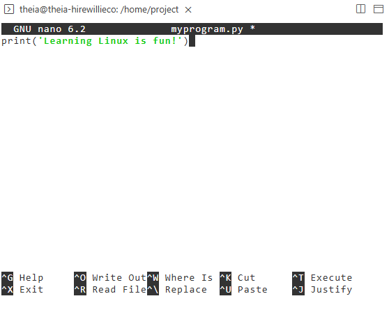

### Step 4: Save the File and Exit

1. Press **Ctrl+X** to exit nano
2. You will be prompted:

```
Save modified buffer (ANSWERING "No" WILL DESTROY CHANGES)?
 Y Yes N No ^C Cancel
```

3. Press **y** to confirm saving
4. You will be prompted to confirm the file name:

```
File Name to Write: myprogram.py
```

5. Press **Enter** to accept the default name

![Nano save prompt]

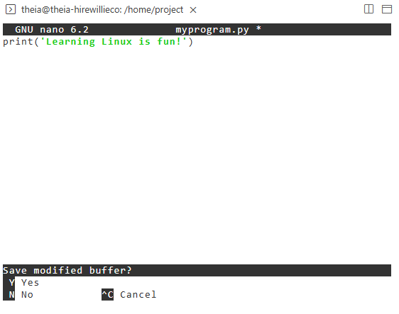

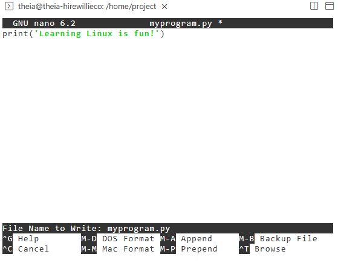

1. You should now be back at the terminal command prompt

---

## Exercise 3: Verify and Run the Python File

In this exercise, you will verify the file was created and run it using Python.

### Step 1: List Files

1. Type the following command to see the files in your directory:

```bash
ls
```

2. You should see `myprogram.py` listed

![ls command showing myprogram.py]

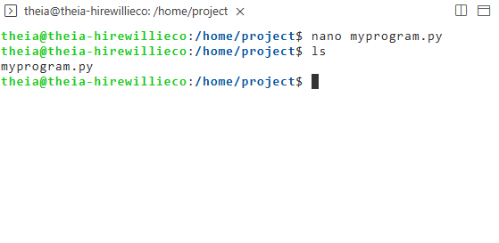

### Step 2: View File Contents (Optional)

To verify the content without opening the editor:

```bash
cat myprogram.py
```

This should display: `print('Learning Linux is fun!')`

### Step 3: Run the Python File

1. Run the Python script:

```bash
python3 myprogram.py
```

2. **Try auto-completion:** Type `python3 my` and press **TAB** - it should auto-complete to `myprogram.py`
3. Press **Enter**

**Expected output:**

```
Learning Linux is fun!
```

![Python script running with output]

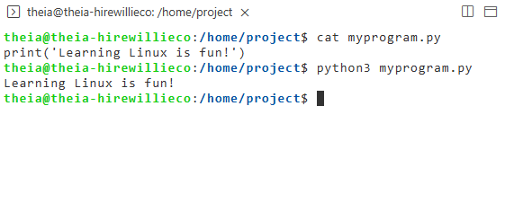

### Step 4: Troubleshooting

If you see an error like:

```
python3: command not found
```

Python3 may not be installed. Try:

```bash
python myprogram.py
```

If you see a syntax error, check for:

- Missing quotes
- Misspelled `print`
- Incorrect parentheses

---

## Exercise 4: Using Command History

In this exercise, you'll learn to use command history to save time.

### Step 1: View Command History

1. Type the following to see your recent commands:

```bash
history
```

2. You'll see a numbered list of commands you've typed

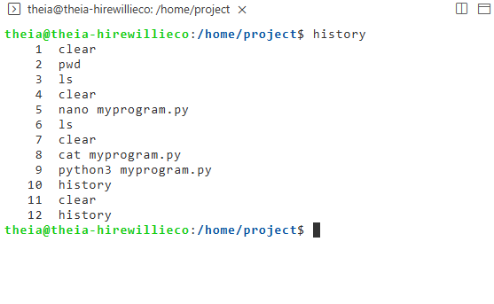

### Step 2: Use Up Arrow for Previous Commands

1. Press the **Up Arrow** key once
2. The last command you typed appears
3. Press **Up Arrow** repeatedly to cycle through older commands
4. Press **Down Arrow** to move forward through newer commands

### Step 3: Re-run a Previous Command

1. Find a command you want to re-run (like `python3 myprogram.py`)
2. When it appears, press **Enter** to run it again

### Step 4: Search Command History

1. Press **Ctrl+R** to enter reverse search mode
2. Type part of a command (e.g., `nano`)
3. The most recent matching command appears
4. Press **Ctrl+R** again to see older matches
5. Press **Enter** to run the displayed command

---

## Exercise 5: Edit the File Again

In this exercise, you will edit your Python file to add more content.

### Step 1: Open the File in Nano Again

1. Use the **Up Arrow** to find the `nano myprogram.py` command
2. Press **Enter** to open the file again

**Alternative:** Type the command manually:

```bash
nano myprogram.py
```

### Step 2: Add a Second Line

1. Move the cursor to the end of the existing line
2. Press **Enter** to create a new line
3. Type:

```python
print('My name is [Your Name]!')
```

Replace `[Your Name]` with your actual name

![Nano with two lines of text]

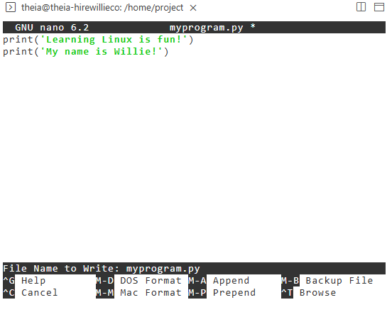

### Step 3: Save and Exit

1. Press **Ctrl+X** to exit
2. Press **y** to save changes
3. Press **Enter** to confirm the file name

### Step 4: Run the Updated Program

1. Run the program again:

```bash
python3 myprogram.py
```

**Expected output:**

```
Learning Linux is fun!
My name is [Your Name]!
```

![Updated program output]

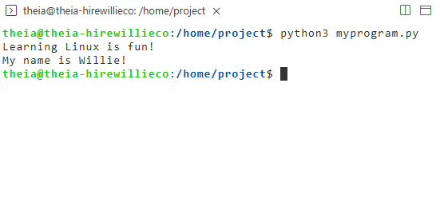

---

## Exercise 6: Create a Second File with Nano

In this exercise, you'll create another Python file to practice.

### Step 1: Create a New File

```bash
nano second_program.py
```

### Step 2: Add Content

Type the following:

```python
print('This is my second program!')
print('I am learning Linux file management.')
```

### Step 3: Save and Exit

1. Press **Ctrl+X**
2. Press **y**
3. Press **Enter**

### Step 4: Verify and Run

```bash
ls
python3 second_program.py
```

**Expected output:**

```
This is my second program!
I am learning Linux file management.
```

---

## Exercise 7: Introduction to vi/vim (Bonus Exercise)

In this exercise, you will be introduced to the vi/vim editor. Note that vim has a steeper learning curve but is very powerful.

### Step 1: Install vim (If Needed)

If vim is not installed in your environment:

```bash
sudo apt-get update
sudo apt-get install vim -y
```

When prompted with the confirmation query "Do you want to continue? [Y/n]", type **"y"** and press **Enter** to continue.

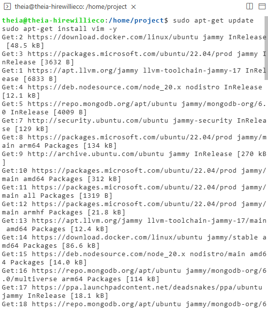

### Step 2: Create a File with vim

```bash
vim done.py
```

### Step 3: Understand vim Modes

vim has different modes:

| Mode                   | Purpose              | How to Enter             |
| :--------------------- | :------------------- | :----------------------- |
| **Normal Mode**  | Navigation, commands | Press**Esc**       |
| **Insert Mode**  | Typing text          | Press**i**         |
| **Command Mode** | Save, quit, search   | Type**:** in Normal mode |

### Step 4: Enter Insert Mode and Type

1. When vim opens, you're in Normal mode
2. Press **i** to enter Insert mode
3. Type the following:

```python
print("I am done with the lab!")
```

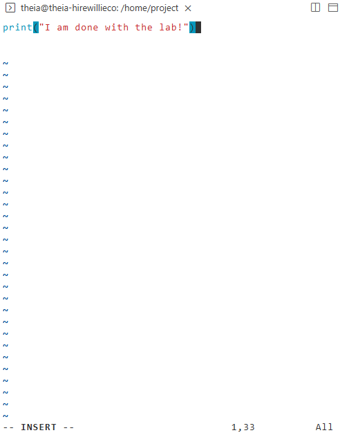

### Step 5: Save and Exit

1. Press **Esc** to return to Normal mode
2. Type **:wq** (write and quit)
3. Press **Enter**

![vim save and quit]

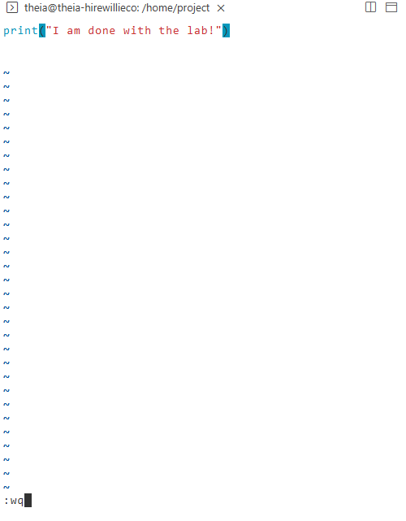

### Step 6: Verify and Run

```bash
ls
python3 done.py
```

**Expected output:**

```
I am done with the lab!
```

## Exercise 8: Basic File Management Commands

In this exercise, you'll learn additional file management commands.

### Step 1: Copy a File

```bash
cp myprogram.py myprogram_backup.py
```

### Step 2: Rename/Move a File

```bash
mv second_program.py practice_program.py
```

### Step 3: Delete a File

```bash
rm practice_program.py
```

### Step 4: Create a Directory

```bash
mkdir my_python_files
```

### Step 5: Move Files into Directory

```bash
mv myprogram.py myprogram_backup.py done.py my_python_files/
```

### Step 6: Verify the Move

```bash
ls
ls my_python_files/
```

---

## Practice Exercises

### Problem 1: Display the content of the /usr directory

**Solution:**

```bash
ls /usr
```

Or for more detailed information:

```bash
ls -la /usr
```

---

### Problem 2: Navigate to the /media directory

**Solution:**

```bash
cd /media
pwd
```

To return to the project directory:

```bash
cd /home/project
```

---

### Problem 3: Navigate to the /home/project directory and display its contents

**Solution:**

```bash
cd /home/project
ls -la
```

---

### Problem 4: Using nano, edit myprogram.py to add a new line containing "print('My name is ...')" (replace ... with your name)

**Solution:**

1. Use the Up arrow to find the nano command or type:

```bash
nano /home/project/my_python_files/myprogram.py
```

2. Add the new line:

```python
print('Learning Linux is fun!')
print('My name is John Doe')  # Replace with your name
```

3. Press **Ctrl+X**, then **y**, then **Enter**
4. Run to verify:

```bash
python3 /home/project/my_python_files/myprogram.py
```

---

### Problem 5: Using vi, create a file called "done.py" that prints "I am done with the lab!"

**Solution:**

1. Navigate to the project directory (if not already there):

```bash
cd /home/project
```

2. Create the file with vi:

```bash
vi done.py
```

3. Press **i** to enter Insert mode
4. Type:

```python
print("I am done with the lab!")
```

5. Press **Esc** to exit Insert mode
6. Type **:wq** and press **Enter**
7. Verify:

```bash
python3 done.py
```

**Hint:** If you get stuck in vi, press **Esc** to ensure you're in Normal mode, then type **:q!** to quit without saving.

---

## Summary of Commands Learned

| Command              | Purpose                 |
| :------------------- | :---------------------- |
| `cd /path`         | Change directory        |
| `pwd`              | Print working directory |
| `ls`               | List directory contents |
| `nano filename`    | Edit file with nano     |
| `cat filename`     | Display file contents   |
| `python3 filename` | Run Python script       |
| `cp source dest`   | Copy file               |
| `mv source dest`   | Move/rename file        |
| `rm filename`      | Remove file             |
| `mkdir dirname`    | Create directory        |
| `history`          | Show command history    |
| `vim filename`     | Edit file with vim      |

---

## Summary

In this hands-on lab, you have:

| Activity                                   | Completed |
| :----------------------------------------- | :-------- |
| Navigated to the /home/project directory   | ✓        |
| Used tab completion for paths and commands | ✓        |
| Created a Python file using nano           | ✓        |
| Added text to the file                     | ✓        |
| Saved changes and exited nano              | ✓        |
| Ran the Python file using python3          | ✓        |
| Used command history with arrow keys       | ✓        |
| Edited the file to add a second line       | ✓        |
| Created a second file with nano            | ✓        |
| Created a file with vim (bonus)            | ✓        |
| Used basic file management commands        | ✓        |
| Completed all practice exercises           | ✓        |

---

<video controls src="Introducing Linux Terminal.mp4" title="Introducing Linux Terminal"></video>

## Key Takeaways

- **nano is beginner-friendly** - Easy to use with on-screen shortcuts
- **Tab completion saves time** - Press TAB to complete paths and commands
- **Command history is powerful** - Use arrow keys to reuse previous commands
- **Always save before exiting** - Ctrl+X, then Y, then Enter
- **File management** - Know how to copy, move, and delete files
- **Python files** - Can be created with any text editor and run with python3
- **vim is powerful but complex** - Takes practice to learn modal editing

---

## Troubleshooting Tips

| Issue                         | Solution                                                     |
| :---------------------------- | :----------------------------------------------------------- |
| **"command not found"** | Check spelling; ensure Python is installed                   |
| **Can't save in nano**  | Check file permissions; use `ls -l` to see                 |
| **Stuck in vim**        | Press Esc, then type :q! to quit without saving              |
| **File not found**      | Use `pwd` to check your location; use `ls` to list files |
| **Permission denied**   | You may need `sudo` for system directories                 |

---

## Additional Practice Ideas

1. Create a Python script that asks for user input
2. Create a bash script that runs multiple Python files
3. Practice navigating the entire Linux filesystem
4. Learn more vim commands (`:help` in vim)
5. Create a project directory structure for organizing code

---

## Congratulations!

You have successfully completed the **Creating and Editing Files in Linux** lab. You now have hands-on experience with:

- Navigating the Linux filesystem
- Creating and editing files with nano
- Running Python scripts
- Using command history and tab completion
- Basic file management operations
- Introduction to the vim editor

These fundamental skills are essential for anyone working with Linux systems, whether for development, system administration, or cybersecurity.
