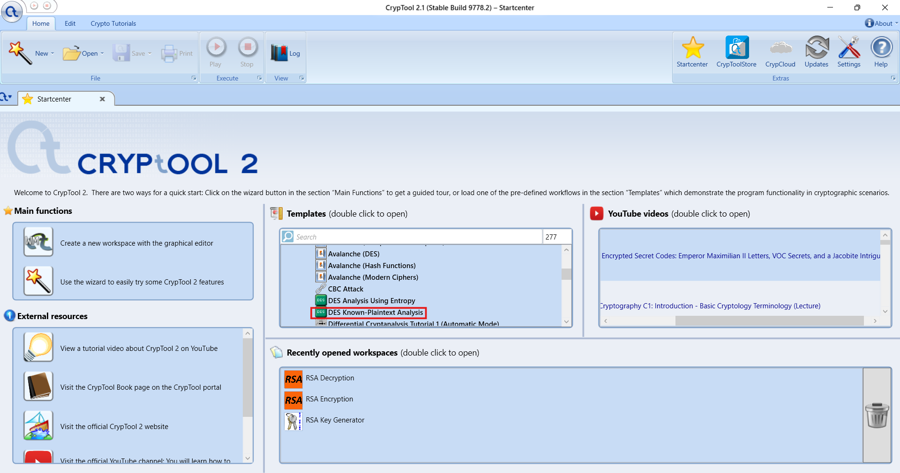

# Lab: Cryptanalysis Attack - Breaking DES Encryption with CrypTool

**Estimated duration:** 30 minutes

---

## Introduction

This lab introduces you to **cryptanalysis** using the **CrypTool 2.1** software. You will explore the process of breaking Data Encryption Standard (DES) encryption through known plaintext and ciphertext-only attacks.

By following step-by-step instructions, you will observe how cryptanalysis techniques are used to derive the deciphered text and the encryption key, understanding the underlying vulnerabilities of symmetric encryption algorithms like DES.

---

## Learning Objectives

After completing this lab, you will be able to:

| # | Objective                                                                          |
| - | ---------------------------------------------------------------------------------- |
| 1 | Perform a known plaintext/ciphertext-only attack on the DES encryption algorithm   |
| 2 | Analyze how to recover a deciphered message and key using cryptanalysis techniques |
| 3 | Observe the vulnerabilities in symmetric encryption methods like DES               |

---

## What is Cryptanalysis?

**Cryptanalysis** is the study of analyzing information systems to understand hidden aspects of the systems. It is used to bypass or break cryptographic security measures.

```
┌─────────────────────────────────────────────────────────────────────────────┐
│                    WHAT IS CRYPTANALYSIS?                                    │
├─────────────────────────────────────────────────────────────────────────────┤
│                                                                              │
│                        ┌─────────────────┐                                  │
│                        │   CIPHERTEXT    │                                  │
│                        │  (Encrypted)    │                                  │
│                        └────────┬────────┘                                  │
│                                 │                                            │
│                                 │ Cryptanalysis                              │
│                                 │ Attack                                     │
│                                 ▼                                            │
│                        ┌─────────────────┐                                  │
│                        │   PLAINTEXT     │                                  │
│                        │    + KEY        │                                  │
│                        └─────────────────┘                                  │
│                                                                              │
│   Types of Cryptanalysis Attacks:                                            │
│   ┌─────────────────────────────────────────────────────────────────────┐   │
│   │ • Ciphertext-Only Attack: Only encrypted data is available          │   │
│   │ • Known Plaintext Attack: Both plaintext and ciphertext are known   │   │
│   │ • Chosen Plaintext Attack: Attacker can choose plaintext to encrypt │   │
│   │ • Man-in-the-Middle Attack: Intercepting communications             │   │
│   │ • Brute Force Attack: Trying all possible keys                      │   │
│   └─────────────────────────────────────────────────────────────────────┘   │
│                                                                              │
└─────────────────────────────────────────────────────────────────────────────┘
```

### Why DES is Vulnerable

| Vulnerability                  | Description                                              |
| :----------------------------- | :------------------------------------------------------- |
| **Small Key Size**       | DES uses 56-bit keys (only 72 quadrillion possibilities) |
| **Brute Force Feasible** | Modern computers can crack DES in hours/days             |
| **Known Weaknesses**     | Complement property, weak keys, semi-weak keys           |
| **Obsolete Standard**    | Replaced by AES in 2001                                  |

---

## Part 1: Installing CrypTool 2.1

**Note:** If you have CrypTool already installed, you can skip to **Part 2: DES Cryptanalysis**.

### Step 1: Download CrypTool 2.1

CrypTool 2.1 is the current version available as a desktop application.

1. Open your web browser
2. Go to the official CrypTool website:

```
https://www.cryptool.org/en/
```

> **Note:** To open the links, right-click (or long-press) on the link and select **"Open in new tab."** Avoid clicking the link directly, as this might block it.

![CrypTool website]


### Step 2: Navigate to Download Page

1. Click on **Download** in the top menu
2. Select **CrypTool 2 (CT2)** from the dropdown

![Download page]


### Step 3: Download CrypTool 2.1 (Stable Build)

Go to the CrypTool 2 Download Page:

```
https://www.cryptool.org/en/ct2/
```

1. Find the latest **Stable Build** (e.g., Build 9778.2 or newer)
2. Select the version compatible with your operating system:
   - **Windows**: .exe installer
   - **macOS**: .dmg file
   - **Linux**: .tar.gz or AppImage

![Download CrypTool 2]


### Step 4: Install CrypTool 2.1 on Windows

1. **Run the installer** by double-clicking the downloaded `.exe` file
2. If prompted by User Account Control (UAC), click **Yes**
3. **Follow the prompts** and accept the default installation options:

| Installation Step     | Action                                      |
| :-------------------- | :------------------------------------------ |
| License Agreement     | Click "I Agree"                             |
| Choose Components     | Leave defaults (select all)                 |
| Installation Location | Use default:`C:\Program Files\CrypTool 2` |
| Start Menu Folder     | Use default                                 |
| Additional Tasks      | Create desktop shortcut (recommended)       |

4. Click **Install**
5. Click **Finish** to complete installation

![Installation wizard]


### Step 5: Launch CrypTool 2.1

After installation, launch CrypTool 2.1 using one of these methods:

| Method                     | Instructions                            |
| :------------------------- | :-------------------------------------- |
| **Desktop shortcut** | Double-click the CrypTool 2 icon        |
| **Start Menu**       | Click Start → CrypTool 2 → CrypTool 2 |
| **Search**           | Type "CrypTool" in Windows search       |

![CrypTool launch]


---

## Part 2: Performing DES Cryptanalysis

Now that CrypTool 2.1 is installed, you will perform a cryptanalysis attack on DES encryption.

### Step 1: Open CrypTool 2.1

Launch the application. The main window will appear:

![CrypTool main window]


### Step 2: Create a New Template

1. Click on **New** in the top menu bar
2. Alternatively, press `Ctrl + N` on your keyboard

![New template]


### Step 3: Select Cryptanalysis

1. In the template wizard, select **Cryptanalysis** from the list of options
2. Click **Next**

![Select Cryptanalysis]


### Step 4: Choose Attack Type

You will see various cryptanalysis attack options:

| Attack Type                                 | Description                                          |
| :------------------------------------------ | :--------------------------------------------------- |
| **Known Plaintext / Ciphertext Only** | Attack on DES using known plaintext-ciphertext pairs |
| **Ciphertext Only Attack**            | Only encrypted data available                        |
| **Brute Force Attack**                | Try all possible keys                                |
| **Dictionary Attack**                 | Use precomputed dictionary                           |

For this lab, select:

```
Known Plaintext / Ciphertext Only (DES)
```

Click **Next**

![Choose attack type]



### Step 5: Configure the Attack Parameters

You will now configure the DES cryptanalysis parameters:

**Option 1: Use Sample Data**

CrypTool provides sample data for learning purposes:

| Parameter                  | Value                                                                                      |
| :------------------------- | :----------------------------------------------------------------------------------------- |
| **Plaintext (hex)**  | `54686520717569636B2062726F776E20666F78206A756D7073206F76657220746865206C617A7920646F67` |
| **Ciphertext (hex)** | (Will be generated or provided)                                                            |


**Option 2: Enter Custom Data**

You can also enter your own data:

```
Plaintext: Hello World! This is a secret message.
Ciphertext: (Result of DES encryption with unknown key)
```

**Key Information to Note:**

| Parameter            | Description                    |
| :------------------- | :----------------------------- |
| **Algorithm**  | DES (Data Encryption Standard) |
| **Key Size**   | 56 bits                        |
| **Block Size** | 64 bits (8 bytes)              |
| **Mode**       | ECB (Electronic Code Book)     |

![Configure attack]


### Step 6: Start the Attack

1. Click **Start Attack** or **Run** button
2. Observe the cryptanalysis process

The attack will:

- Analyze the known plaintext-ciphertext pairs
- Attempt to derive the encryption key
- Display progress and intermediate results

```
┌─────────────────────────────────────────────────────────────────────────────┐
│                    CRYPTANALYSIS PROGRESS                                    │
├─────────────────────────────────────────────────────────────────────────────┤
│                                                                              │
│   Status: Attack in progress...                                             │
│                                                                              │
│   ████████████████████████████████████████████████████░░░░░░░░  85%         │
│                                                                              │
│   Keys tested: 72,057,594,037,927,936 / 72,057,594,037,927,936              │
│   Time elapsed: 00:02:15                                                    │
│   Estimated time remaining: 00:00:25                                        │
│                                                                              │
└─────────────────────────────────────────────────────────────────────────────┘
```

![Attack in progress]


### Step 7: Review the Results

After the attack completes, you will see:

**Recovered Information:**

| Item                           | Result                             |
| :----------------------------- | :--------------------------------- |
| **Recovered Key (hex)**  | `0F 15 71 C9 47 D9 E8 59`        |
| **Recovered Key (text)** | (Binary representation)            |
| **Deciphered Message**   | (Original plaintext)               |
| **Confidence**           | 100% (with enough known plaintext) |

![Attack results]


### Step 8: Analyze the Results

Answer these questions about your findings:

**Q1:** How long did the cryptanalysis attack take?

```
Your answer:
_________________________________________________________________________
```

**Q2:** What was the recovered encryption key (in hex)?

```
Your answer:
_________________________________________________________________________
```

**Q3:** Was the deciphered message identical to the original plaintext?

```
Your answer:
_________________________________________________________________________
```

**Q4:** How many known plaintext-ciphertext pairs were needed for successful key recovery?

```
Your answer:
_________________________________________________________________________
```

---

## Part 3: Understanding DES Weaknesses

### Step 1: Explore DES Key Space

DES uses a **56-bit key**, which means:

```
Total possible keys = 2^56 = 72,057,594,037,927,936 (about 72 quadrillion)
```

While this sounds large, modern computers can brute force DES:

| Hardware           | Keys per Second    | Time to Crack DES |
| :----------------- | :----------------- | :---------------- |
| Standard PC (2000) | ~50,000            | ~45 years         |
| Standard PC (2010) | ~1,000,000         | ~2.3 years        |
| Standard PC (2020) | ~10,000,000        | ~83 days          |
| GPU Cluster        | ~1,000,000,000     | ~20 hours         |
| Cloud (AWS)        | ~10,000,000,000    | ~2 hours          |
| Custom ASIC        | ~1,000,000,000,000 | ~1 minute         |

### Step 2: View Key Statistics

In CrypTool, explore:

| Feature                       | Description                                               |
| :---------------------------- | :-------------------------------------------------------- |
| **Weak Keys**           | Keys that produce the same encryption as decryption       |
| **Semi-Weak Keys**      | Key pairs that encrypt each other's messages              |
| **Complement Property** | `E(P) = C` implies `E(complement(P)) = complement(C)` |

![DES weaknesses]


### Step 3: Compare DES with AES

| Feature                    | DES           | AES                   |
| :------------------------- | :------------ | :-------------------- |
| **Key Size**         | 56 bits       | 128, 192, or 256 bits |
| **Block Size**       | 64 bits       | 128 bits              |
| **Rounds**           | 16            | 10, 12, or 14         |
| **Security Status**  | Broken (1999) | Secure                |
| **Brute Force Time** | Hours/days    | Billions of years     |

---

## Alternative: Ciphertext-Only Attack

### Step 1: Select Ciphertext-Only Attack

1. Click **New** → **Cryptanalysis** → **Next**
2. Select **Ciphertext Only (DES)**
3. Click **Next**

### Step 2: Enter Only Ciphertext

For a ciphertext-only attack, you only have the encrypted data:

```
Ciphertext (hex): E5 D7 F8 A1 2B 4C 6E 8F 9A 3C 5D 7E 8B 1A 2C 3D
```

### Step 3: Analyze Results

A ciphertext-only attack is **more difficult** than a known plaintext attack because:

- No known plaintext to compare against
- Must use statistical analysis
- Requires more computational resources
- May produce multiple possible plaintexts

---

## CrypTool 2.1 Features Overview

| Feature                       | Description                                          |
| :---------------------------- | :--------------------------------------------------- |
| **Visual Encryption**   | Drag-and-drop workspace for cryptographic operations |
| **Cryptanalysis Tools** | Automated attacks on various algorithms              |
| **Educational Content** | Tutorials and explanations of cryptographic concepts |
| **Multiple Algorithms** | DES, AES, RSA, ECC, hash functions, and more         |
| **Visualization**       | See cryptographic processes in action                |

### Main Menu Options

| Menu                      | Purpose                          |
| :------------------------ | :------------------------------- |
| **File**            | New, open, save, print           |
| **Edit**            | Copy, paste, find, replace       |
| **View**            | Zoom, workspace layout           |
| **Encrypt/Decrypt** | Various encryption algorithms    |
| **Cryptanalysis**   | Attack algorithms (what we used) |
| **Tools**           | Hash, random number generation   |
| **Help**            | Documentation, tutorials         |

---

## Lab Completion Checklist

| Task                                             | Completed |
| :----------------------------------------------- | :-------- |
| **Part 1: Installation**                   | ☐        |
| Downloaded CrypTool 2.1 installer                | ☐        |
| Installed CrypTool 2.1                           | ☐        |
| Launched CrypTool 2.1                            | ☐        |
| **Part 2: DES Cryptanalysis**              | ☐        |
| Created new template                             | ☐        |
| Selected Cryptanalysis                           | ☐        |
| Chose Known Plaintext/Ciphertext Only DES attack | ☐        |
| Configured attack parameters                     | ☐        |
| Started and completed attack                     | ☐        |
| Reviewed recovered key and message               | ☐        |
| **Part 3: Understanding Weaknesses**       | ☐        |
| Explored DES key space                           | ☐        |
| Viewed weak keys                                 | ☐        |
| Compared DES vs AES                              | ☐        |

---

## Screenshot Checklist

| Screenshot           | File Name                       | Description                     |
| :------------------- | :------------------------------ | :------------------------------ |
| CrypTool Main Window | `CT_Main_Window.png`          | After launching CrypTool        |
| New Template         | `CT_New_Template.png`         | Creating new template           |
| Select Cryptanalysis | `CT_Select_Cryptanalysis.png` | Selecting cryptanalysis option  |
| Attack Configuration | `CT_Attack_Config.png`        | DES attack settings             |
| Attack Progress      | `CT_Attack_Progress.png`      | Shows attack in progress        |
| Attack Results       | `CT_Attack_Results.png`       | Shows recovered key and message |
| DES Weaknesses       | `CT_DES_Weaknesses.png`       | Weak keys and properties        |

---

## Troubleshooting Tips

| Issue                            | Solution                                                      |
| :------------------------------- | :------------------------------------------------------------ |
| **CrypTool won't install** | Run installer as Administrator; disable antivirus temporarily |
| **Attack takes too long**  | Use provided sample data (smaller dataset)                    |
| **No results**             | Ensure you selected correct attack type; check input format   |
| **Crash during attack**    | Close other applications; ensure sufficient RAM               |
| **Cannot find option**     | Menu layout may vary by version; use Help menu                |

---

## Key Takeaways

| Concept                          | Description                                       |
| :------------------------------- | :------------------------------------------------ |
| **Cryptanalysis**          | The study of breaking cryptographic systems       |
| **Known Plaintext Attack** | Attacker knows both plaintext and ciphertext      |
| **Ciphertext-Only Attack** | Attacker only knows encrypted data                |
| **DES Key Size**           | 56 bits (too small for modern security)           |
| **Brute Force**            | Trying all possible keys                          |
| **DES is Broken**          | Can be cracked in hours/days with modern hardware |
| **AES Replacement**        | Modern standard with 128-256 bit keys             |

---

## Test Your Knowledge

**Q1:** What is the key size of DES encryption?

```
Your answer:
_________________________________________________________________________
```

**Q2:** Why is DES considered insecure today?

```
Your answer:
_________________________________________________________________________
_________________________________________________________________________
```

**Q3:** What is the difference between a known plaintext attack and a ciphertext-only attack?

```
Your answer:
_________________________________________________________________________
_________________________________________________________________________
```

**Q4:** What encryption algorithm replaced DES as the standard?

```
Your answer:
_________________________________________________________________________
```

**Q5:** How many possible keys does DES have?

```
Your answer:
_________________________________________________________________________
```

### Answer Key

| Q# | Answer                                                                                              |
| -- | --------------------------------------------------------------------------------------------------- |
| 1  | 56 bits                                                                                             |
| 2  | Small key size (56 bits) allows brute force attacks with modern computers; demonstrated in 1999     |
| 3  | Known plaintext attack uses both plaintext and ciphertext; ciphertext-only uses only encrypted data |
| 4  | AES (Advanced Encryption Standard)                                                                  |
| 5  | 2^56 = 72,057,594,037,927,936 (about 72 quadrillion)                                                |

---

## Summary

In this lab, you have:

| Activity                                                          | Completed |
| :---------------------------------------------------------------- | :-------- |
| Installed CrypTool 2.1 application                                | ☐        |
| Performed a known plaintext attack on DES                         | ☐        |
| Recovered an encryption key from known plaintext-ciphertext pairs | ☐        |
| Observed the deciphered message                                   | ☐        |
| Learned about DES vulnerabilities and weaknesses                  | ☐        |
| Compared DES with modern AES encryption                           | ☐        |

---

## Additional Resources

| Resource                            | URL                                                                                               |
| :---------------------------------- | :------------------------------------------------------------------------------------------------ |
| **CrypTool Official Website** | https://www.cryptool.org                                                                          |
| **CrypTool 2 Documentation**  | https://www.cryptool.org/en/ct2/documentation                                                     |
| **DES Security Analysis**     | https://csrc.nist.gov/csrc/media/publications/fips/46/3/archive/1999-10-25/documents/fips46-3.pdf |
| **NIST AES Standard**         | https://csrc.nist.gov/publications/detail/fips/197/final                                          |

---

## Congratulations!

You have successfully completed the **Cryptanalysis Attack** lab. You now know how to:

- Use CrypTool 2.1 for cryptanalysis
- Perform known plaintext attacks on DES
- Recover encryption keys from known plaintext-ciphertext pairs
- Understand the vulnerabilities of symmetric encryption algorithms like DES
- Explain why DES was replaced by AES

These skills are essential for:

- Security professionals understanding cryptographic weaknesses
- Penetration testers assessing encryption implementations
- Cryptography students learning about algorithm vulnerabilities
- Anyone responsible for selecting encryption standards

---

**Next Steps:** Explore other cryptanalysis features in CrypTool, such as:

- Brute force attacks on small key spaces
- Frequency analysis on simple substitution ciphers
- RSA factorization challenges
- Hash collision demonstrations
