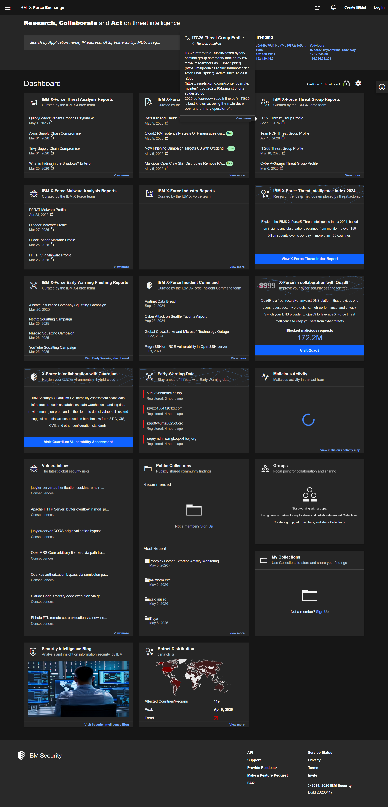
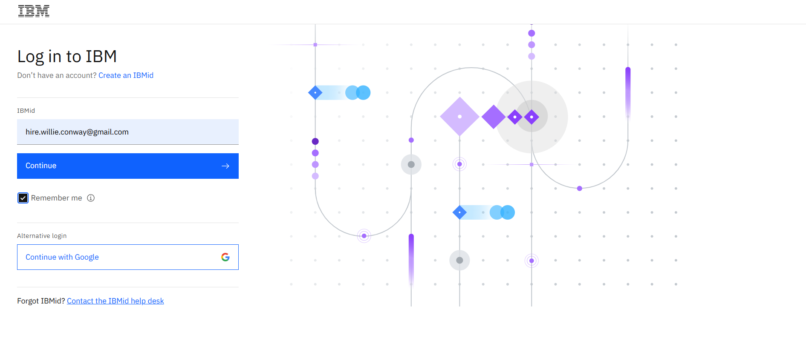
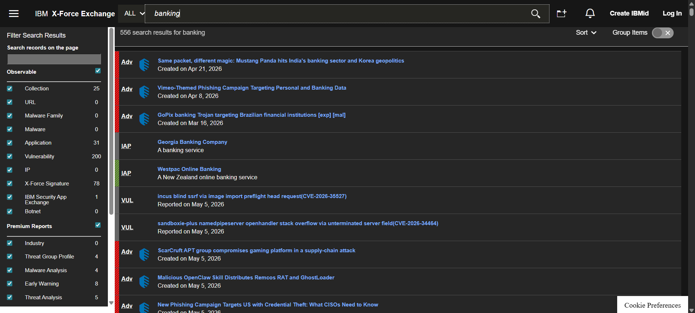
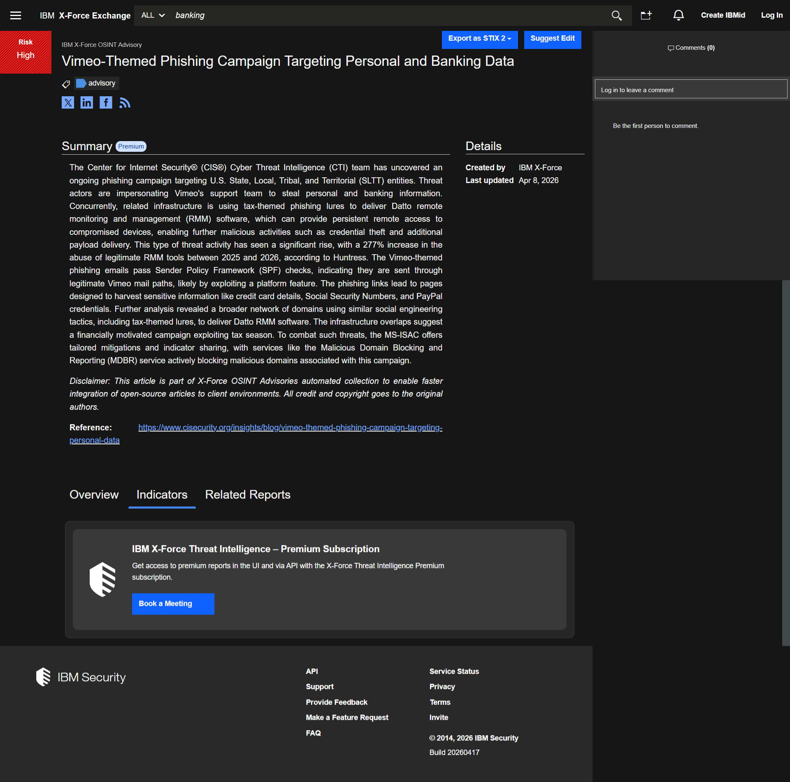
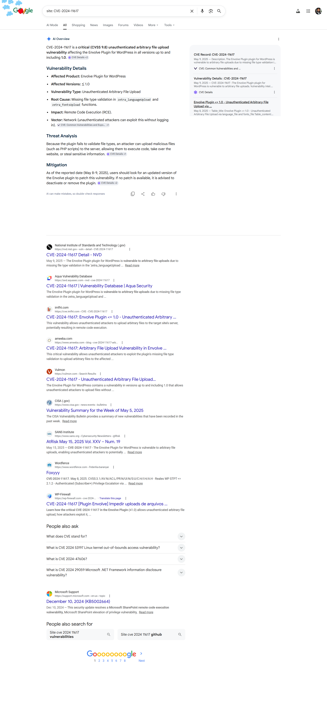
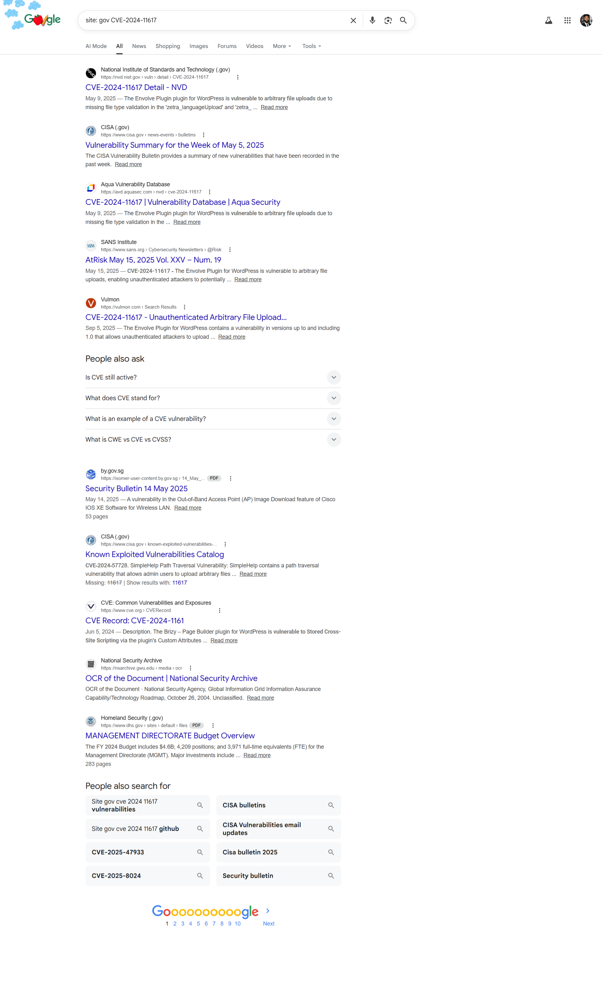
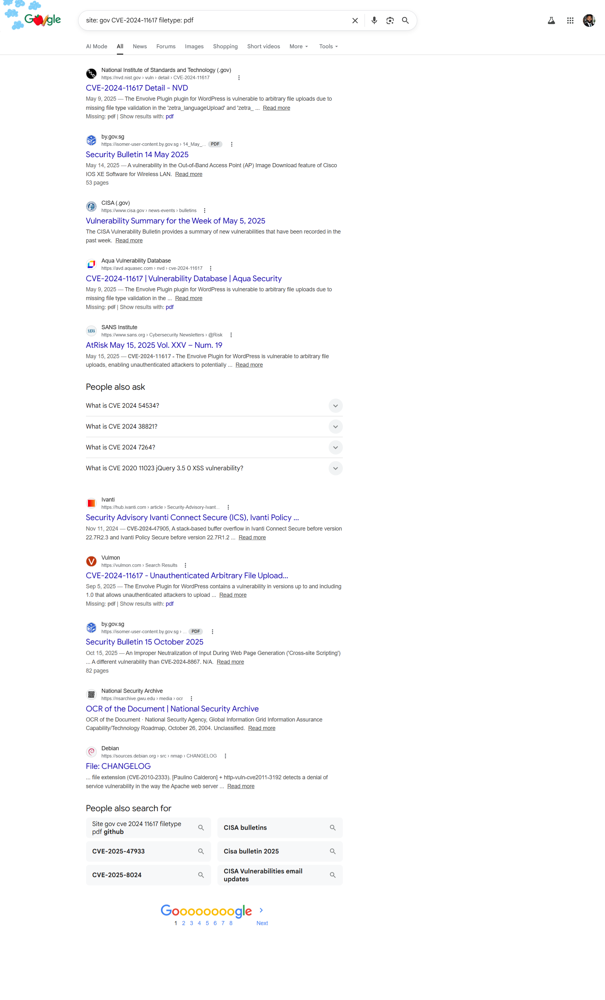

# Final Project: Part 1 - Perform Vulnerability Analysis and Penetration Testing

**Estimated time needed:** 30 minutes

---

## Introduction

In this final project, you will demonstrate your ability to protect SecureBank from vulnerabilities and enhance its security posture.

**Part 1** will consist of three tasks:

| Task             | Description                                                 |
| :--------------- | :---------------------------------------------------------- |
| **Task 1** | Identifying a vulnerability using IBM X-Force Exchange      |
| **Task 2** | Investigating the chosen vulnerability using Google Dorking |
| **Task 3** | Creating a penetration testing plan                         |

You will first provide screenshots that identify a vulnerability using IBM X-Force Exchange and investigate it further using Google Dorking. Next, you will make decisions that influence the outcome of the penetration testing plan.

---

## Refresh Your Knowledge

Before starting on the project or while doing the project, you can refresh your knowledge by referring to the following lessons:

| Module             | Lesson                               |
| :----------------- | :----------------------------------- |
| Module 1, Lesson 1 | Penetration Testing: Planning Phase  |
| Module 1, Lesson 2 | Penetration Testing: Discovery Phase |
| Module 2, Lesson 1 | Penetration Testing: Attack Phase    |
| Module 3, Lesson 2 | Penetration Testing Reporting        |
| Module 4, Lesson 1 | Threat Hunting and Intelligence      |

---

## Project Scenario

Imagine you've recently been hired as an **ethical hacker** by **SecureBank**, a mid-sized financial institution known for its rapidly growing digital services.

In the wake of recent incidents in the banking sector, the management has become increasingly anxious about potential vulnerabilities in SecureBank's online banking platform. Preliminary investigations have highlighted weak security measures.

To address these risks, the bank has tasked you with **identifying vulnerabilities** and **investigating potential threats**.

---

## Setting Up the System

Before you begin, you must have the following:

| Requirement                   | Description                                            |
| :---------------------------- | :----------------------------------------------------- |
| **Web browser**         | For accessing IBM X-Force Exchange and Google          |
| **Screenshot tool**     | Such as Snipping Tool, Greenshot, or built-in OS tools |
| **Internet connection** | For searching and accessing resources                  |

---

## Guidelines for Screenshots

Follow these guidelines for capturing screenshots:

| Guideline                              | Description                                                         |
| :------------------------------------- | :------------------------------------------------------------------ |
| **Use a screenshot application** | Such as Snipping Tool, Greenshot, or Print Screen                   |
| **Capture clearly**              | Ensure the result of your activity is clearly visible               |
| **Set high resolution**          | Set your system display resolution to the highest available setting |
| **CVE number visible**           | Ensure all CVE numbers are readable                                 |
| **Upload correctly**             | Upload each screenshot to the specified area on the platform        |

---

## Task 1: Identify a Vulnerability Using IBM X-Force Exchange

Your first task will be to identify any vulnerabilities that might expose the bank's systems to cyber threats. You will use **IBM X-Force Exchange** to gather threat intelligence.

### Step-by-Step Instructions

#### Step 1: Navigate to IBM X-Force Exchange

Visit the IBM X-Force Exchange website:

```
https://exchange.xforce.ibmcloud.com/
```

![IBM X-Force Exchange homepage]



#### Step 2: Log In or Use Guest Access

**Note:** You would have created a login for IBM X-Force Exchange when you worked on the corresponding lab earlier in the course.

- If you have an account, click **Log in** and enter your credentials
- Or click **Enter as Guest** for limited access

![X-Force Login]



#### Step 3: Search for Recent Vulnerabilities

Use the search bar to find a recent vulnerability that has been assigned a Common Vulnerabilities and Exposures (CVE) number.

**Example search terms:**

| Search Term               | Purpose                               |
| :------------------------ | :------------------------------------ |
| `CVE-2024`              | Find vulnerabilities from 2024        |
| `CVE-2025`              | Find recent vulnerabilities           |
| `banking`               | Find financial sector vulnerabilities |
| `authentication bypass` | Find specific vulnerability types     |

![X-Force Search]



#### Step 4: Select a Vulnerability

Choose a vulnerability with a severity level that would concern a bank.

**Example vulnerabilities from IBM X-Force Exchange :**

| CVE Number     | Description                             | CVSS Score | Severity |
| :------------- | :-------------------------------------- | :--------- | :------- |
| CVE-2024-11937 | Premium Addons for Elementor Stored XSS | 6.4        | Medium   |
| CVE-2024-11267 | JSP Store Locator SQL Injection         | 8.8        | High     |
| CVE-2024-11617 | Envolve Plugin File Upload              | 9.8        | Critical |
| CVE-2024-11167 | Improper Access Control in LibreChat    | 9.4        | Critical |

**For this project, you can use:** `CVE-2024-11617` (Critical severity - unauthenticated file upload vulnerability)

#### Step 5: Review Vulnerability Details

Click on the CVE to view detailed information including:

- **Description** - What the vulnerability does
- **CVSS Score** - Severity rating
- **Attack Vector** - How it can be exploited
- **Affected Products** - Which systems are vulnerable
- **Remediation** - How to fix it

![X-Force Vulnerability Details]



### Task 1 Submission

**Submission required:** Capture a screenshot of the recently identified vulnerability. Ensure that the **CVE number is clearly visible**.

```
┌─────────────────────────────────────────────────────────────────────────────┐
│                    TASK 1 SUBMISSION CHECKLIST                              │
├─────────────────────────────────────────────────────────────────────────────┤
│                                                                              │
│  ☐  Screenshot shows IBM X-Force Exchange interface                         │
│  ☐  Screenshot shows a valid CVE number (e.g., CVE-2024-XXXXX)              │
│  ☐  CVE number is clearly readable                                          │
│  ☐  Vulnerability description or details are visible                        │
│                                                                              │
└─────────────────────────────────────────────────────────────────────────────┘
```

**Selected CVE for this project:** `CVE-2024-11617`

---

## Task 2: Investigate the Selected Vulnerability Using Google Dorking Commands

Your second task will be to further investigate the identified vulnerability using **Google Dorking** commands. You will use specific search queries to uncover any exposed or publicly available sensitive information that could potentially compromise the bank's systems.

### Step 1: Use the "site" Command

Find information specific to your CVE number using the `site:` operator.

**Command format:**

```
site: CVE-2024-XXXXX
```

**Example for this project:**

```
site: CVE-2024-11617
```

**What this does:** Searches for web pages that contain your specific CVE number.

![Google Dorking - site command]



**What to look for:**

- Security advisory pages
- Vendor announcements
- Technical write-ups about the vulnerability
- Proof-of-concept exploit code

### Step 2: Refine Search to .gov Websites

Refine the "site" command to limit results to **government websites** (`.gov` domain), which often contain authoritative security information.

**Command format:**

```
site: gov CVE-2024-XXXXX
```

**Example for this project:**

```
site: gov CVE-2024-11617
```

![Google Dorking - site gov command]



**What to look for:**

- CISA (Cybersecurity and Infrastructure Security Agency) advisories
- NIST (National Institute of Standards and Technology) information
- Government security bulletins

### Step 3: Find PDF Reports

Use the `filetype:` command to find **PDF formatted reports** related to the selected vulnerability on government websites.

**Command format:**

```
site: gov CVE-2024-XXXXX filetype: pdf
```

**Example for this project:**

```
site: gov CVE-2024-11617 filetype: pdf
```

![Google Dorking - site gov filetype pdf]



**What to look for:**

- Official security assessment reports
- Vulnerability analysis documents
- Remediation guides

### Task 2 Submission

**Submissions required:**

| Step             | Submission Requirement                                                                                                                          |
| :--------------- | :---------------------------------------------------------------------------------------------------------------------------------------------- |
| **Step 1** | Screenshot displaying the correct Google Dorking search command and results relating to the selected vulnerability, with the CVE number visible |
| **Step 2** | Screenshot displaying the correct Google Dorking search command, CVE number, and .gov sites visible                                             |
| **Step 3** | Screenshot displaying the correct Google Dorking search command, CVE number, .gov site, and PDF file visible                                    |

```
┌─────────────────────────────────────────────────────────────────────────────┐
│                    TASK 2 SUBMISSION CHECKLIST                              │
├─────────────────────────────────────────────────────────────────────────────┤
│                                                                              │
│  STEP 1 - site command:                                                     │
│  ☐  Screenshot shows "site: CVE-2024-XXXXX" in search bar                  │
│  ☐  Screenshot shows search results with CVE number                         │
│                                                                              │
│  STEP 2 - site gov:                                                         │
│  ☐  Screenshot shows "site: gov CVE-2024-XXXXX" in search bar              │
│  ☐  Screenshot shows .gov domains in results                                │
│                                                                              │
│  STEP 3 - site gov filetype pdf:                                            │
│  ☐  Screenshot shows "site: gov CVE-2024-XXXXX filetype: pdf"              │
│  ☐  Screenshot shows .gov domain and PDF file identified                    │
│                                                                              │
└─────────────────────────────────────────────────────────────────────────────┘
```

---

## Task 3: Create a Penetration Testing Plan

### Scenario

SecureBank's management wants you to conduct a **penetration test on their network**. Once you have identified the vulnerabilities, you will need to create a penetration testing plan. This plan will outline your strategy for simulating cyberattacks to test the network's defenses and detect weak points.

In this task, you will **make decisions** that will affect the outcome of the penetration test.

This task consists of **six steps**, each with three options. You need to select the correct option based on the scenarios and provide a **justification** (1–2 lines) for your selection.

---

### Step 1: Defining the Scope

**Scenario:** You are in a meeting with SecureBank's IT team to discuss the penetration test. The team includes the IT manager, the network administrator, and a security officer. They provide you with an overview of their infrastructure, which includes external web applications, internal databases, and a mix of on-premises and cloud-based services.

**Question:** What should you include in the scope?

| Option | Answer                                                      |
| :----- | :---------------------------------------------------------- |
| A      | Include all systems, networks, and applications             |
| B      | Focus only on the external-facing systems and applications  |
| C      | Include only the internal network and critical applications |

**Correct Answer:** **A - Include all systems, networks, and applications**

**Justification:**
A well-defined penetration testing scope must align with business objectives and cover all relevant assets that could impact operations . Since SecureBank's infrastructure includes external web apps, internal databases, and hybrid cloud services, leaving any component out could miss critical vulnerabilities that attackers could exploit . A comprehensive scope ensures the test reflects real-world attack paths that may chain external vulnerabilities to internal systems.

---

### Step 2: Prioritizing Objectives

**Scenario:** You are required to define the primary objectives of the penetration test. The IT team has expressed concerns about recent phishing attacks and regulatory compliance requirements.

**Question:** Which objective should be prioritized for the penetration test based on the IT team's concerns?

| Option | Answer                                      |
| :----- | :------------------------------------------ |
| A      | Identify all possible vulnerabilities       |
| B      | Test incident response capabilities         |
| C      | Focus on compliance with industry standards |

**Correct Answer:** **C - Focus on compliance with industry standards**

**Justification:**
As a financial institution, SecureBank operates under strict regulatory frameworks like GLBA, PCI DSS, and FFIEC that mandate specific security testing requirements. The IT team explicitly raised concerns about regulatory compliance, making this the top priority . While finding all vulnerabilities is valuable, meeting compliance standards addresses both legal obligations and the specific concerns raised by the team, providing a defensible security baseline.

---

### Step 3: Rules of Engagement

**Scenario:** You have to establish the rules of engagement for the penetration test. However, the IT team is concerned about potential disruptions to business operations.

**Question:** What approach will you take to minimize disruptions while conducting the penetration test?

| Option | Answer                                                             |
| :----- | :----------------------------------------------------------------- |
| A      | Notify staff that the test will be conducted during business hours |
| B      | Notify staff that the test will be conducted after business hours  |
| C      | Conduct the test without notifying the IT team                     |

**Correct Answer:** **B - Notify staff that the test will be conducted after business hours**

**Justification:**
NIST SP 800-115 emphasizes that clear rules of engagement are essential to prevent unintended operational disruptions . For a financial institution like SecureBank, testing during business hours risks impacting customer transactions and critical banking services. Conducting tests after business hours—with proper notification to the IT team—maintains operational integrity while still providing a realistic assessment window . Testing without notification would be both unethical and potentially illegal.

---

### Step 4: Information Gathering Approach

**Scenario:** You begin the Discovery phase to gather information about the target systems. However, the IT team has provided you with limited information about their network topology.

**Question:** Which approach will be most effective for gathering information?

| Option | Answer                                               |
| :----- | :--------------------------------------------------- |
| A      | Use automated tools like Nmap and Nessus             |
| B      | Use manual techniques like social engineering        |
| C      | Use a combination of automated and manual techniques |

**Correct Answer:** **C - Use a combination of automated and manual techniques**

**Justification:**
The NIST penetration testing framework recommends a balanced approach that combines automated scanning with manual analysis . While automated tools like Nmap and Nessus efficiently identify open ports and known vulnerabilities , they miss business logic flaws and complex attack paths that manual testing uncovers. Using both approaches—automated for breadth, manual for depth—provides the most comprehensive discovery given limited initial information about the network topology.

---

### Step 5: Vulnerability Exploitation Strategy

**Scenario:** You have identified several vulnerabilities and are ready to exploit them. The vulnerabilities include an outdated web server, weak passwords, and an unpatched database.

**Question:** Which approach will you take to exploit the identified vulnerabilities?

| Option | Answer                                                  |
| :----- | :------------------------------------------------------ |
| A      | Exploit the easiest vulnerabilities first               |
| B      | Exploit the highest severity vulnerabilities first      |
| C      | Exploit a mix of high-severity and easy vulnerabilities |

**Correct Answer:** **B - Exploit the highest severity vulnerabilities first**

**Justification:**
Risk-based vulnerability management prioritizes vulnerabilities with the highest potential business impact, not just those that are easiest to exploit . High-severity vulnerabilities—such as an unpatched database or outdated web server—pose the greatest immediate risk to SecureBank's sensitive financial data. Following NIST guidance on exploitation likelihood (using frameworks like EPSS and KEV), testers should target the most severe vulnerabilities first to demonstrate the worst-case impact to stakeholders .

---

### Step 6: Reporting Findings

**Scenario:** You now have to compile your findings and provide recommendations. Your audience includes technical staff and the executive leadership.

**Question:** What is the most effective way to present your findings?

| Option | Answer                                                      |
| :----- | :---------------------------------------------------------- |
| A      | Create a detailed technical report                          |
| B      | Create a high-level executive summary                       |
| C      | Create a detailed technical report and an executive summary |

**Correct Answer:** **C - Create a detailed technical report and an executive summary**

**Justification:**
Effective penetration testing reporting requires communicating with multiple audiences . The executive leadership needs a high-level summary of business risks, compliance impact, and strategic recommendations—not technical jargon. The technical staff (IT, security engineers) requires detailed findings including exploit evidence, affected systems, and step-by-step remediation instructions. Providing both formats ensures each audience receives actionable information without overwhelming non-technical stakeholders .

---

## Task 3 Answer Summary Table

| Step             | Question                                       | Correct Answer                                                                  | Justification Summary                                                                                            |
| :--------------- | :--------------------------------------------- | :------------------------------------------------------------------------------ | :--------------------------------------------------------------------------------------------------------------- |
| **Step 1** | What should you include in the scope?          | **A** - Include all systems, networks, and applications                   | Comprehensive coverage ensures no critical asset is missed; reflects real-world attack chaining                  |
| **Step 2** | Which objective should be prioritized?         | **C** - Focus on compliance with industry standards                       | Financial institution must meet GLBA, PCI DSS, FFIEC requirements; IT team explicitly raised compliance concerns |
| **Step 3** | How to minimize disruptions?                   | **B** - Notify staff that the test will be conducted after business hours | Avoids impacting customer transactions; maintains operational integrity                                          |
| **Step 4** | Most effective information gathering approach? | **C** - Use a combination of automated and manual techniques              | Automated tools provide breadth; manual testing finds business logic flaws                                       |
| **Step 5** | Which vulnerabilities to exploit first?        | **B** - Exploit the highest severity vulnerabilities first                | Risk-based prioritization shows worst-case business impact                                                       |
| **Step 6** | Most effective way to present findings?        | **C** - Create a detailed technical report and an executive summary       | Both audiences need appropriate level of detail                                                                  |

---

## Review Criteria

Your grade will be based on the following distribution:

| Task                     | Submission Required                                                         | Points |
| :----------------------- | :-------------------------------------------------------------------------- | :----- |
| **Task 1**         | Screenshot from IBM X-Force Exchange with visible CVE number                | 20%    |
| **Task 2, Step 1** | Screenshot with correct Google Dorking command and CVE number               | 15%    |
| **Task 2, Step 2** | Screenshot with `site: gov` command, CVE, and .gov sites visible          | 15%    |
| **Task 2, Step 3** | Screenshot with `site: gov filetype: pdf` command, CVE, .gov, PDF visible | 15%    |
| **Task 3**         | Six correct answers with justifications (one per step)                      | 35%    |

---

## NIST Penetration Testing Framework Reference

The National Institute of Standards and Technology (NIST) SP 800-115 outlines a structured four-phase approach to penetration testing :

```
┌─────────────────────────────────────────────────────────────────────────────┐
│                    NIST PENETRATION TESTING FRAMEWORK                       │
│                         (SP 800-115)                                        │
├─────────────────────────────────────────────────────────────────────────────┤
│                                                                              │
│   PHASE 1: PLANNING                                                         │
│   ├── Define scope and objectives                                           │
│   ├── Establish rules of engagement                                         │
│   └── Obtain legal authorization                                            │
│                                                                              │
│   PHASE 2: DISCOVERY                                                        │
│   ├── Information gathering (OSINT)                                         │
│   ├── Network scanning (Nmap, Zenmap)                                       │
│   └── Vulnerability analysis                                                │
│                                                                              │
│   PHASE 3: ATTACK                                                           │
│   ├── Gain access                                                           │
│   ├── Escalate privileges                                                   │
│   ├── Compromise data                                                       │
│   └── Maintain persistence (if authorized)                                  │
│                                                                              │
│   PHASE 4: REPORTING                                                        │
│   ├── Summarize findings                                                    │
│   ├── Provide technical details                                             │
│   ├── Deliver executive summary                                             │
│   └── Recommend remediation                                                 │
│                                                                              │
└─────────────────────────────────────────────────────────────────────────────┘
```

---

## Vulnerability Prioritization Framework

Understanding how to prioritize vulnerabilities is critical for Task 3, Step 5. Security professionals use multiple frameworks to determine which vulnerabilities pose the greatest risk :

| Framework                 | What It Measures                                    | How to Use                                                    |
| :------------------------ | :-------------------------------------------------- | :------------------------------------------------------------ |
| **CVSS Score**      | Technical severity (0-10)                           | Initial triage, but not sufficient alone                      |
| **EPSS**            | Probability of exploitation within 30 days (0-100%) | Prioritize vulnerabilities with high exploitation likelihood  |
| **KEV Catalog**     | Confirmed active exploitation in the wild           | **Highest priority** - patch immediately if on KEV list |
| **Business Impact** | Potential damage to organization                    | Consider asset criticality and data sensitivity               |

**Key Insight:** A vulnerability with CVSS 7.5 (High) but on the KEV list should be prioritized over a CVSS 9.8 (Critical) with no known exploits .

---

## Submission Checklist

Before submitting your project, ensure to complete **Part 2** as well. Check your submissions thoroughly, and ensure they are ready for review.

### Task 1 Checklist

| Item                                          | Status |
| :-------------------------------------------- | :----- |
| Screenshot captured from IBM X-Force Exchange | ☐     |
| CVE number clearly visible                    | ☐     |
| Vulnerability details visible                 | ☐     |
| File named appropriately and uploaded         | ☐     |

### Task 2 Checklist

| Step             | Item                                                        | Status |
| :--------------- | :---------------------------------------------------------- | :----- |
| **Step 1** | Screenshot shows `site: CVE-2024-XXXXX` command           | ☐     |
| **Step 1** | Search results show CVE number                              | ☐     |
| **Step 2** | Screenshot shows `site: gov CVE-2024-XXXXX` command       | ☐     |
| **Step 2** | .gov domains visible in results                             | ☐     |
| **Step 3** | Screenshot shows `site: gov CVE-2024-XXXXX filetype: pdf` | ☐     |
| **Step 3** | PDF file and .gov domain visible                            | ☐     |

### Task 3 Checklist

| Step             | Item                                 | Status |
| :--------------- | :----------------------------------- | :----- |
| **Step 1** | Correct answer selected (A, B, or C) | ☐     |
| **Step 1** | Justification provided (1-2 lines)   | ☐     |
| **Step 2** | Correct answer selected              | ☐     |
| **Step 2** | Justification provided               | ☐     |
| **Step 3** | Correct answer selected              | ☐     |
| **Step 3** | Justification provided               | ☐     |
| **Step 4** | Correct answer selected              | ☐     |
| **Step 4** | Justification provided               | ☐     |
| **Step 5** | Correct answer selected              | ☐     |
| **Step 5** | Justification provided               | ☐     |
| **Step 6** | Correct answer selected              | ☐     |
| **Step 6** | Justification provided               | ☐     |

---

## Common Mistakes to Avoid

| Mistake                                         | Why It's Wrong                                                   | Correction                                  |
| :---------------------------------------------- | :--------------------------------------------------------------- | :------------------------------------------ |
| **Incomplete scope**                      | Missing internal or cloud assets creates false sense of security | Include ALL systems in scope                |
| **Testing during business hours**         | Risks disrupting customer banking services                       | Schedule tests after hours                  |
| **Automated tools only**                  | Misses business logic flaws and complex attack paths             | Combine automated AND manual testing        |
| **Exploiting easy vulnerabilities first** | Doesn't demonstrate real business risk                           | Prioritize by severity and exploitability   |
| **Single report format**                  | Technical team needs details; executives need summary            | Create BOTH technical and executive reports |

---

## Key Takeaways

| Concept                             | Description                                                        |
| :---------------------------------- | :----------------------------------------------------------------- |
| **IBM X-Force Exchange**      | Threat intelligence platform for vulnerability research            |
| **CVE Number**                | Unique identifier for publicly known cybersecurity vulnerabilities |
| **Google Dorking**            | Using advanced search operators to find exposed information        |
| **Penetration Testing Scope** | Defines what systems, networks, and applications will be tested    |
| **Rules of Engagement**       | Boundaries and constraints for the penetration test                |
| **Discovery Phase**           | Information gathering and vulnerability identification             |
| **Attack Phase**              | Active exploitation of identified vulnerabilities                  |
| **Risk-Based Prioritization** | Using CVSS, EPSS, and KEV to rank vulnerabilities                  |
| **Dual Reporting**            | Technical reports for IT staff; executive summaries for leadership |

---

## Additional Resources

| Resource                          | URL                                                          |
| :-------------------------------- | :----------------------------------------------------------- |
| **IBM X-Force Exchange**    | https://exchange.xforce.ibmcloud.com                         |
| **NIST SP 800-115**         | https://csrc.nist.gov/publications/detail/sp/800-115/final   |
| **CISA KEV Catalog**        | https://www.cisa.gov/known-exploited-vulnerabilities-catalog |
| **FIRST EPSS**              | https://www.first.org/epss                                   |
| **Google Search Operators** | https://support.google.com/websearch/answer/2466433          |

---

## Congratulations!

You have successfully completed **Final Project: Part 1 - Perform Vulnerability Analysis and Penetration Testing**. You have demonstrated the ability to:

- Identify vulnerabilities using IBM X-Force Exchange
- Investigate vulnerabilities using Google Dorking commands
- Create a comprehensive penetration testing plan
- Make risk-based decisions for scope, objectives, rules of engagement, discovery methods, exploitation strategy, and reporting

These skills are essential for:

- Ethical hackers and penetration testers
- Security analysts and threat hunters
- Security consultants
- Anyone pursuing security certifications (CompTIA Pentest+, CEH, OSCP)
