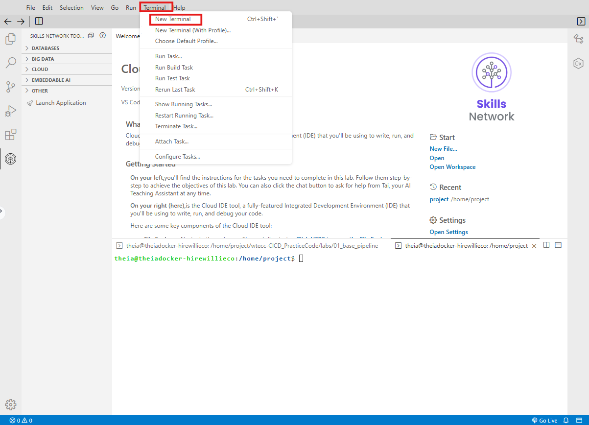
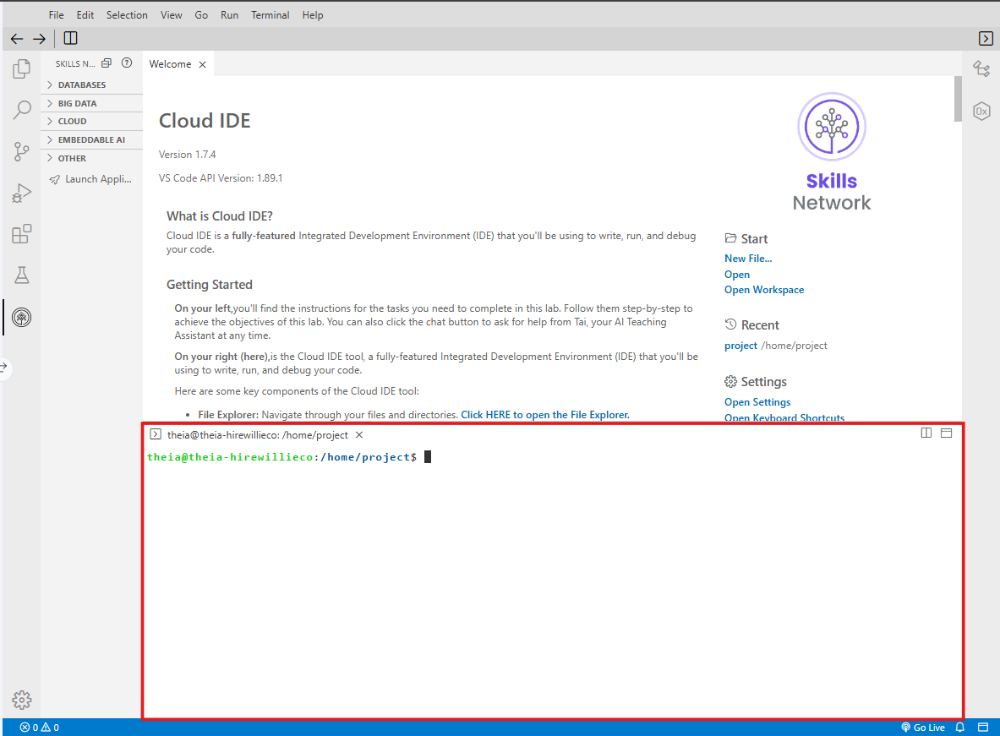
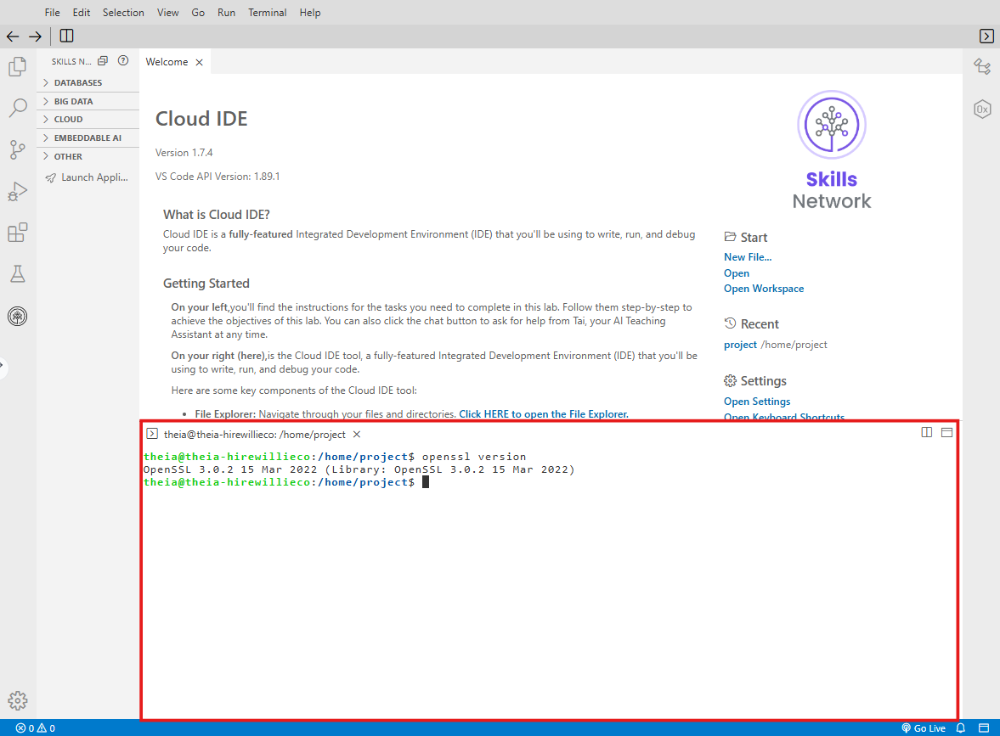
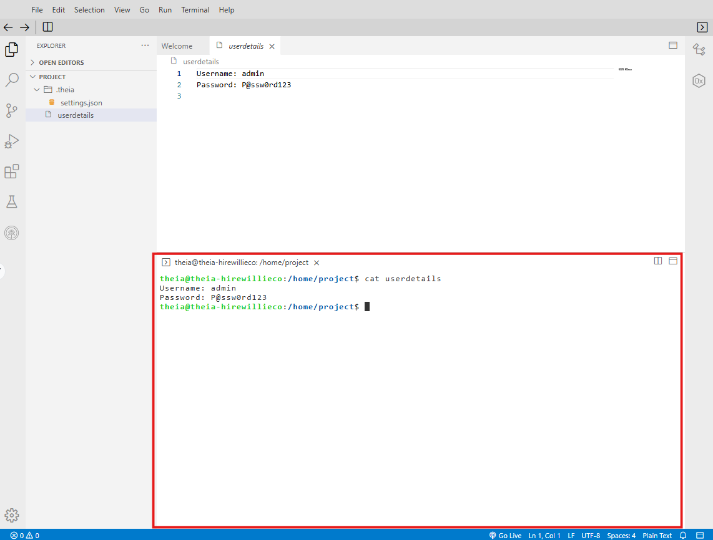
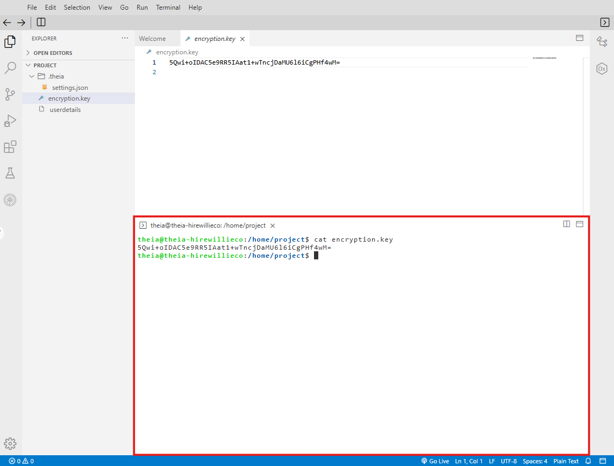
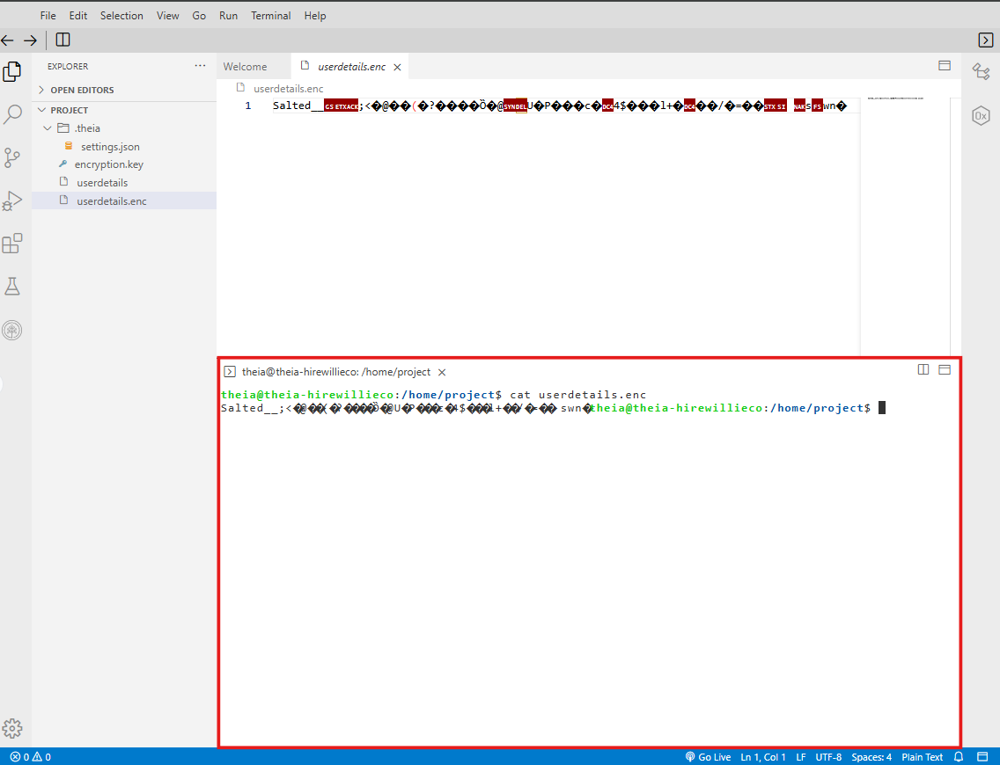
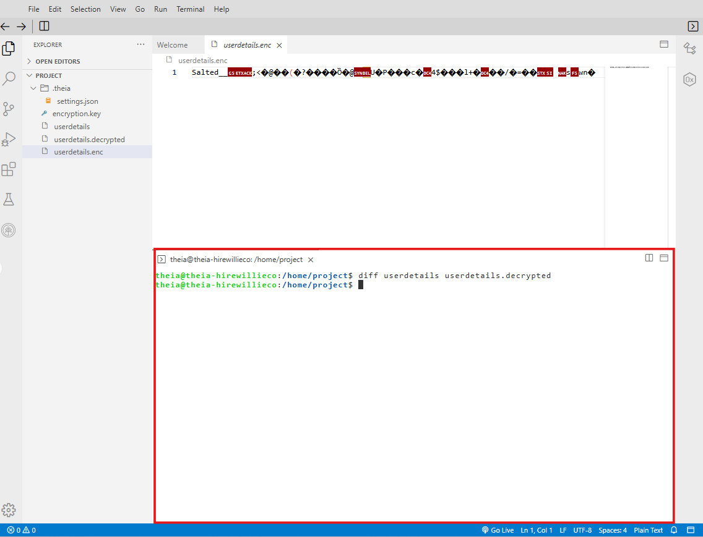
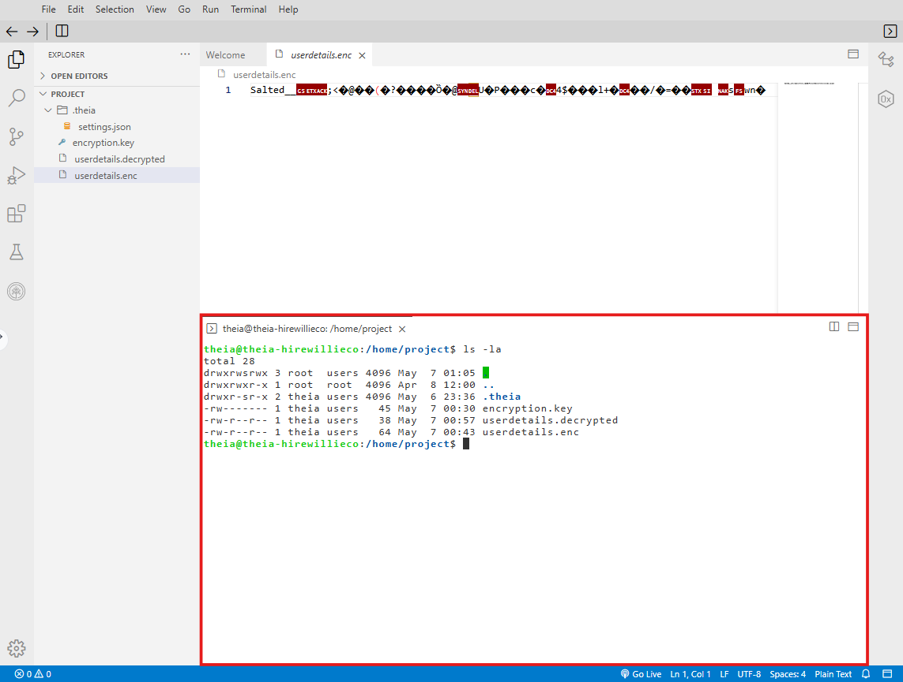
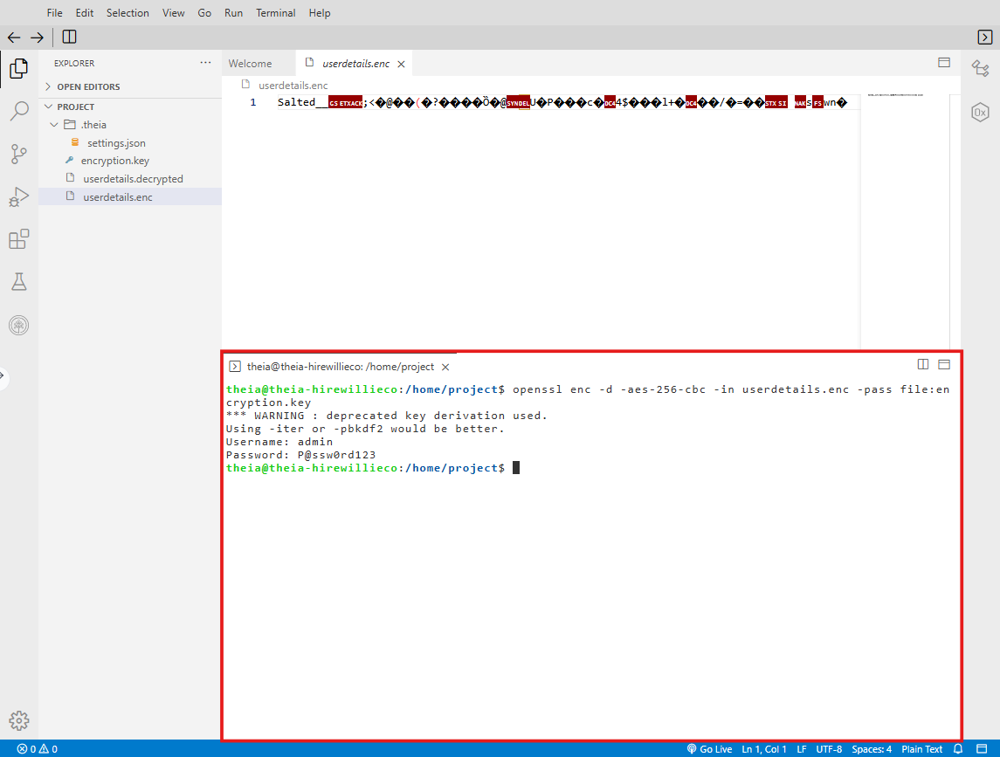

# Final Project: Part 2 - Secure Information Using Symmetric Encryption

**Estimated time needed:** 30 minutes

---

## Introduction

In **Part 2** of the final project, you will demonstrate your ability to protect SecureBank's information by implementing appropriate symmetric encryption techniques. As part of this project, you will also review a peer's project submission using the rubric provided.

**Part 2** consists of **one task**:

| Task             | Description                                     |
| :--------------- | :---------------------------------------------- |
| **Task 4** | Securing information using symmetric encryption |

---

## Refresh Your Knowledge

Before starting on Part 2 of this project, you can refresh your knowledge by referring to the following lesson:

| Module             | Lesson                       |
| :----------------- | :--------------------------- |
| Module 5, Lesson 1 | Introduction to Cryptography |

---

## Project Scenario

Imagine you have recently been hired as an **ethical hacker** by **SecureBank**, a mid-sized financial institution known for its rapidly growing digital services.

In the wake of recent incidents in the banking sector, the management has become increasingly anxious about potential vulnerabilities in SecureBank's online banking platform. Preliminary investigations have highlighted weak security measures, including **inadequate cryptographic protections** for sensitive financial data.

To address these risks, the bank has tasked you with strengthening its security posture through **advanced cryptographic techniques**.

---

## Learning Objectives

In this assignment, you will implement symmetric encryption to secure sensitive information at SecureBank by:

| # | Objective                                                                             |
| - | ------------------------------------------------------------------------------------- |
| 1 | Encrypting financial data using symmetric encryption techniques (e.g., AES)           |
| 2 | Decrypting encrypted data to ensure it can be accessed securely                       |
| 3 | Managing encryption keys properly to protect against unauthorized access              |
| 4 | Demonstrating the implementation of encryption and decryption in a secure environment |

---

## Optional Documentation

After completing each task, save both the **executed commands** and their **corresponding outputs** in a text document, or take screenshots—depending on the option you have chosen. This information will be required to answer questions during the final project submission.

---

## About Skills Network Cloud IDE

**Skills Network Cloud IDE** (based on Theia and Docker) provides an environment for hands-on labs for course and project-related labs. Theia is an open-source IDE (Integrated Development Environment) that can be run on a desktop or on the cloud.

To complete this lab, you will be using the **Cloud IDE based on Theia**, running in a Docker container.

---

## Important Notice About This Lab Environment

```
┌─────────────────────────────────────────────────────────────────────────────┐
│                    IMPORTANT LAB ENVIRONMENT NOTICE                         │
├─────────────────────────────────────────────────────────────────────────────┤
│                                                                              │
│  ⚠️  Sessions for this lab environment are NOT persistent.                  │
│                                                                              │
│  • A new environment is created for you every time you connect              │
│  • Any data you saved in an earlier session will be LOST                    │
│  • To avoid losing your data, complete these tasks in a SINGLE session      │
│  • Save screenshots and command outputs as you progress                     │
│                                                                              │
└─────────────────────────────────────────────────────────────────────────────┘
```

---

## Set Up the Lab Environment

### Step 1: Open a New Terminal

**Option 1 - Using the Terminal menu:**

1. Select **Terminal** from the top menu
2. Choose **New Terminal** from the drop-down menu

**Option 2 - Using the Getting Started section:**

1. Click **Click HERE to open a New Terminal** under the Getting Started section

![New Terminal]



### Step 2: Verify Terminal is Open

Observe that the new terminal opens. You will complete the **six steps in Task 4** in this terminal.

Remember to **capture screenshots** as you go through each step.

![Terminal Ready]



---

## Understanding Symmetric Encryption

### What is Symmetric Encryption?

Symmetric encryption uses the **same key** for both encryption and decryption. It is fast, efficient, and well-suited for encrypting large amounts of data.

```
┌─────────────────────────────────────────────────────────────────────────────┐
│                    SYMMETRIC ENCRYPTION PROCESS                              │
├─────────────────────────────────────────────────────────────────────────────┤
│                                                                              │
│   ORIGINAL DATA                    ENCRYPTED DATA                   ORIGINAL DATA
│   (Plaintext)                      (Ciphertext)                    (Decrypted)
│                                                                              │
│   ┌─────────────┐                 ┌─────────────┐                 ┌─────────────┐
│   │ Password:   │                 │ 7F4E8C2A... │                 │ Password:   │
│   │ P@ssw0rd123 │ ────Encrypt────► │ 3B9F1D6E... │ ────Decrypt────► │ P@ssw0rd123 │
│   └─────────────┘                 └─────────────┘                 └─────────────┘
│         │                               │                               │
│         │                               │                               │
│         ▼                               ▼                               ▼
│   ┌─────────────┐                 ┌─────────────┐                 ┌─────────────┐
│   │  Same Key   │                 │  Same Key   │                 │  Same Key   │
│   │  (AES-256)  │                 │  (AES-256)  │                 │  (AES-256)  │
│   └─────────────┘                 └─────────────┘                 └─────────────┘
│                                                                              │
└─────────────────────────────────────────────────────────────────────────────┘
```

### Common Symmetric Encryption Algorithms

| Algorithm          | Key Size | Block Size    | Use Case                     |
| :----------------- | :------- | :------------ | :--------------------------- |
| **AES-128**  | 128 bits | 128 bits      | General purpose encryption   |
| **AES-192**  | 192 bits | 128 bits      | Higher security requirements |
| **AES-256**  | 256 bits | 128 bits      | Financial/government data    |
| **ChaCha20** | 256 bits | Stream cipher | Mobile devices               |
| **3DES**     | 168 bits | 64 bits       | Legacy systems (deprecated)  |

---

## Task 4: Secure Information Using Symmetric Encryption

### Task Scenario

During the penetration testing exercise, you discovered a confidential file named **userdetails** on a web server. The file contains important credentials stored in **plain text format**, which poses a significant security risk, as unauthorized individuals could easily access them.

Your task is to **secure this information** by implementing proper encryption techniques and demonstrating how to manage sensitive data securely.

---

## Sample Credentials

You are provided with the following credentials that need to be stored in the file, `userdetails`:

```
Username: admin
Password: P@ssw0rd123
```

---

## Task 4: Step-by-Step Instructions

This task consists of **six steps**. Complete each step and upload the required screenshot in the designated area.

---

### Step 1: Install OpenSSL and Create the Credentials File

In this step, you will verify OpenSSL is installed and create the `userdetails` file containing the sample credentials.

#### Step 1.1: Check OpenSSL Installation

First, verify that OpenSSL is installed on your system:

```bash
openssl version
```

**Expected output:**

```
OpenSSL 3.0.2 15 Mar 2022 (Library: OpenSSL 3.0.2 15 Mar 2022)
```

![OpenSSL version check]



#### Step 1.2: Create the Credentials File

Create a new file named `userdetails` with the sample credentials:

```bash
echo "Username: admin" > userdetails
echo "Password: P@ssw0rd123" >> userdetails
```

#### Step 1.3: Verify File Contents

Display the contents of the file to confirm it was created correctly:

```bash
cat userdetails
```

**Expected output:**

```
Username: admin
Password: P@ssw0rd123
```

![Create userdetails file]



#### Step 1.4: View File Permissions (Optional)

Check the current file permissions:

```bash
ls -la userdetails
```

**Example output:** `-rw-r--r-- 1 user user 32 Apr 28 10:00 userdetails`

This shows that the file is readable by anyone on the system—a security risk!

**Step 1 Submission Requirements:**

| Requirement                                                    | Status |
| :------------------------------------------------------------- | :----- |
| Screenshot showing `cat userdetails` command output          | ☐     |
| Screenshot shows "Username: admin" and "Password: P@ssw0rd123" | ☐     |

---

### Step 2: Generate a Strong Encryption Key

In this step, you will generate a strong symmetric encryption key using AES-256.

#### Step 2.1: Generate a 256-bit (32-byte) Encryption Key

Generate a random key using OpenSSL and save it to a file:

```bash
openssl rand -base64 32 > encryption.key
```

**What this command does:**

| Part                 | Description                              |
| :------------------- | :--------------------------------------- |
| `openssl rand`     | OpenSSL random number generator          |
| `-base64 32`       | Output in base64 format (not raw binary) |
| `> encryption.key` | Save output to `encryption.key` file   |

#### Step 2.2: View the Generated Key

Display the encryption key:

```bash
cat encryption.key
```

**Expected output (example - your key will be different):**

```
s8VJm2pQ9rT3uX5wY7zA1bC3dE5fG7hI9kL1nP3rT5vX7
```

![Generate encryption key]



#### Step 2.3: Secure Key File Permissions

Restrict access to the key file so only the owner can read it:

```bash
chmod 600 encryption.key
```

**What this does:** `chmod 600` gives read/write permissions ONLY to the file owner (no access for group or others).

**Step 2 Submission Requirements:**

| Requirement                                            | Status |
| :----------------------------------------------------- | :----- |
| Screenshot showing the generated encryption key        | ☐     |
| Screenshot shows key file created (`encryption.key`) | ☐     |

---

### Step 3: Encrypt the Credentials File

In this step, you will encrypt the `userdetails` file using the encryption key you generated.

#### Step 3.1: Encrypt Using AES-256-CBC

Run the following command to encrypt the file:

```bash
openssl enc -aes-256-cbc -salt -in userdetails -out userdetails.enc -pass file:encryption.key
```

**What this command does:**

| Parameter                     | Description                                     |
| :---------------------------- | :---------------------------------------------- |
| `openssl enc`               | OpenSSL encryption function                     |
| `-aes-256-cbc`              | Use AES-256 in CBC mode (Cipher Block Chaining) |
| `-salt`                     | Add random salt for additional security         |
| `-in userdetails`           | Input file (plaintext)                          |
| `-out userdetails.enc`      | Output file (encrypted)                         |
| `-pass file:encryption.key` | Use the key from `encryption.key` file        |

#### Step 3.2: Verify the Original File Still Contains Plaintext

```bash
cat userdetails
```

**Expected output:**

```
Username: admin
Password: P@ssw0rd123
```

#### Step 3.3: View the Encrypted File

```bash
cat userdetails.enc
```

**Expected output (example - your ciphertext will differ):**

```
Salted__s8VJm2pQ9rT... (binary/gibberish characters)
```

The encrypted file should appear as **gibberish or binary data**—this means encryption worked correctly!

![Encrypt file]



#### Step 3.4: View Encrypted File in Hex Format (Optional)

To see the encrypted data in hexadecimal format:

```bash
xxd userdetails.enc | head -5
```

This shows the raw encrypted bytes in a readable hex format.

**Step 3 Submission Requirements:**

| Requirement                                                          | Status |
| :------------------------------------------------------------------- | :----- |
| Screenshot showing encryption command executed                       | ☐     |
| Screenshot showing `cat userdetails.enc` output (gibberish/binary) | ☐     |
| Screenshot showing `userdetails.enc` file was created (`ls -la`) | ☐     |

---

### Step 4: Decrypt the Encrypted File

In this step, you will decrypt the encrypted file to verify that encryption and decryption work correctly.

#### Step 4.1: Decrypt Using the Same Key

Run the following command to decrypt the file:

```bash
openssl enc -d -aes-256-cbc -in userdetails.enc -out userdetails.decrypted -pass file:encryption.key
```

**What this command does:**

| Parameter                      | Description                        |
| :----------------------------- | :--------------------------------- |
| `-d`                         | Decryption mode                    |
| `-aes-256-cbc`               | Same algorithm used for encryption |
| `-in userdetails.enc`        | Input file (encrypted)             |
| `-out userdetails.decrypted` | Output file (decrypted plaintext)  |
| `-pass file:encryption.key`  | Same key used for encryption       |

#### Step 4.2: Verify the Decrypted File Contents

```bash
cat userdetails.decrypted
```

**Expected output:**

```
Username: admin
Password: P@ssw0rd123
```

#### Step 4.3: Compare Original and Decrypted Files

Verify that the decrypted file matches the original:

```bash
diff userdetails userdetails.decrypted
```

No output means the files are identical—successful decryption!

![Decrypt file]



**Step 4 Submission Requirements:**

| Requirement                                                              | Status |
| :----------------------------------------------------------------------- | :----- |
| Screenshot showing decryption command executed                           | ☐     |
| Screenshot showing `cat userdetails.decrypted` output matches original | ☐     |

---

### Step 5: Secure Key Management (Clean Up)

In a real-world scenario, encryption keys must be properly managed. In this step, you will demonstrate secure deletion of sensitive files.

#### Step 5.1: Securely Delete the Original Plaintext File

The original plaintext file should be securely deleted to prevent unauthorized access:

```bash
shred -u userdetails
```

**What this command does:**

| Parameter | Description                                           |
| :-------- | :---------------------------------------------------- |
| `shred` | Overwrite file content multiple times before deletion |
| `-u`    | Remove (delete) the file after overwriting            |

**Alternative method (if shred not available):**

```bash
rm -P userdetails
```

#### Step 5.2: Verify the Original File is Deleted

```bash
ls -la userdetails
```

**Expected output:** `ls: cannot access 'userdetails': No such file or directory`

#### Step 5.3: List All Remaining Files

Display all files in the current directory:

```bash
ls -la
```

**Expected files remaining:**

```
encryption.key     (our encryption key - keep secure)
userdetails.enc    (encrypted data)
userdetails.decrypted (decrypted data - for use)
```

![Secure deletion]



#### Step 5.4: Key Management Best Practices

In a production environment, follow these key management practices:

| Best Practice                | Description                                                 |
| :--------------------------- | :---------------------------------------------------------- |
| **Secure key storage** | Store keys in a hardware security module (HSM) or key vault |
| **Key rotation**       | Change encryption keys periodically (e.g., every 90 days)   |
| **Access control**     | Restrict key access to only authorized personnel            |
| **Backup keys**        | Securely backup keys in offline, encrypted storage          |
| **Audit logging**      | Log all access to encryption keys                           |

**Step 5 Submission Requirements:**

| Requirement                                                                    | Status |
| :----------------------------------------------------------------------------- | :----- |
| Screenshot showing `shred` command executed                                  | ☐     |
| Screenshot showing original `userdetails` file no longer exists (`ls -la`) | ☐     |

---

### Step 6: Verification and Final Testing

In this final step, you will verify that the encrypted data remains secure and that the decryption process works consistently.

#### Step 6.1: Test Decryption Again (Without Creating New File)

Decrypt directly to standard output (console) to verify:

```bash
openssl enc -d -aes-256-cbc -in userdetails.enc -pass file:encryption.key
```

**Expected output:**

```
Username: admin
Password: P@ssw0rd123
```

![Final verification]



#### Step 6.2: Verify Wrong Key Fails

Test what happens with the wrong key:

```bash
# Create a different key
openssl rand -base64 32 > wrong.key

# Attempt decryption with wrong key
openssl enc -d -aes-256-cbc -in userdetails.enc -pass file:wrong.key 2>/dev/null
```

**Expected result:** Gibberish output or error (cannot decrypt correctly)

#### Step 6.3: Document the Encryption Process

Create a summary of steps for documentation:

```bash
cat > encryption_summary.txt << EOF
=== ENCRYPTION IMPLEMENTATION SUMMARY ===

Date: $(date)
Algorithm: AES-256-CBC
Key File: encryption.key
Original Data: userdetails (SHREDDED)
Encrypted Data: userdetails.enc
Decrypted Output: userdetails.decrypted

Key Security:
- Key file permissions: 600 (owner only)
- Original plaintext: shredded
- Key backed up securely

Verification:
- Decryption successful
- Data integrity confirmed
EOF

cat encryption_summary.txt
```

**Step 6 Submission Requirements:**

| Requirement                                         | Status |
| :-------------------------------------------------- | :----- |
| Screenshot showing successful decryption to console | ☐     |
| Optional: Screenshot showing wrong key fails        | ☐     |
| Screenshot showing encryption summary (optional)    | ☐     |

---

## Complete Command Summary

Here is a summary of all commands used in this task:

| Step | Command                                                                                                  | Purpose                       |
| :--- | :------------------------------------------------------------------------------------------------------- | :---------------------------- |
| 1.1  | `openssl version`                                                                                      | Verify OpenSSL installation   |
| 1.2  | `echo "Username: admin" > userdetails`                                                                 | Create file with username     |
| 1.2  | `echo "Password: P@ssw0rd123" >> userdetails`                                                          | Append password to file       |
| 1.3  | `cat userdetails`                                                                                      | Verify file contents          |
| 2.1  | `openssl rand -base64 32 > encryption.key`                                                             | Generate 256-bit key          |
| 2.3  | `chmod 600 encryption.key`                                                                             | Restrict key file permissions |
| 3.1  | `openssl enc -aes-256-cbc -salt -in userdetails -out userdetails.enc -pass file:encryption.key`        | Encrypt file                  |
| 4.1  | `openssl enc -d -aes-256-cbc -in userdetails.enc -out userdetails.decrypted -pass file:encryption.key` | Decrypt file                  |
| 5.1  | `shred -u userdetails`                                                                                 | Securely delete original file |
| 6.1  | `openssl enc -d -aes-256-cbc -in userdetails.enc -pass file:encryption.key`                            | Verify decryption to console  |

---

## Task 4 Submission Checklist

| Step             | Requirement                                            | Status |
| :--------------- | :----------------------------------------------------- | :----- |
| **Step 1** | Screenshot shows `cat userdetails` with credentials  | ☐     |
| **Step 2** | Screenshot shows generated encryption key              | ☐     |
| **Step 3** | Screenshot shows encryption command and encrypted file | ☐     |
| **Step 4** | Screenshot shows decryption and matching output        | ☐     |
| **Step 5** | Screenshot shows `shred` command and file deletion   | ☐     |
| **Step 6** | Screenshot shows final verification decryption         | ☐     |

---

## Troubleshooting Guide

| Issue                          | Possible Cause                | Solution                                                |
| :----------------------------- | :---------------------------- | :------------------------------------------------------ |
| `openssl: command not found` | OpenSSL not installed         | Run `sudo apt install openssl -y` (Linux)             |
| `Permission denied`          | File permission issues        | Use `sudo` or check file ownership                    |
| `bad decrypt` error          | Wrong key used for decryption | Ensure same key file is used                            |
| `shred: command not found`   | `shred` not available       | Use `rm -P` instead or `sudo apt install coreutils` |
| Encrypted file looks readable  | Encryption didn't work        | Check command syntax; ensure `-pass file:` is correct |
| File not found                 | Wrong working directory       | Use `pwd` to check location; `ls -la` to list files |

---

## Security Best Practices Summary

| Best Practice                    | How Implemented              | Why Important                              |
| :------------------------------- | :--------------------------- | :----------------------------------------- |
| **Use strong encryption**  | AES-256-CBC                  | Industry standard for financial data       |
| **Add salt to encryption** | `-salt` flag               | Prevents rainbow table attacks             |
| **Secure key permissions** | `chmod 600 encryption.key` | Prevents unauthorized key access           |
| **Secure deletion**        | `shred -u`                 | Prevents recovery of plaintext data        |
| **Separate key from data** | Key stored in different file | Limits exposure if one file is compromised |
| **Key management**         | Documented in summary        | Enables proper key handling                |

---

## Key Takeaways

| Concept                        | Description                                                                 |
| :----------------------------- | :-------------------------------------------------------------------------- |
| **Symmetric Encryption** | Same key for encryption and decryption                                      |
| **AES-256-CBC**          | Advanced Encryption Standard with 256-bit key in Cipher Block Chaining mode |
| **Salt**                 | Random data added to encryption to prevent precomputation attacks           |
| **Base64 Encoding**      | Converts binary data to ASCII for easy storage                              |
| **Key Management**       | Proper storage, access control, and rotation of encryption keys             |
| **Secure Deletion**      | Overwriting data multiple times before deletion                             |
| **Least Privilege**      | Restricting file permissions to only necessary users                        |

---

## Summary

In **Final Project: Part 2**, you have:

| Activity                                       | Completed |
| :--------------------------------------------- | :-------- |
| Created a credentials file with sensitive data | ☐        |
| Generated a strong AES-256 encryption key      | ☐        |
| Encrypted the credentials file using OpenSSL   | ☐        |
| Decrypted the file to verify data integrity    | ☐        |
| Securely deleted the original plaintext file   | ☐        |
| Verified encryption works correctly            | ☐        |
| Documented the encryption process              | ☐        |

---

## Additional Resources

| Resource                               | URL                                                      |
| :------------------------------------- | :------------------------------------------------------- |
| **OpenSSL Documentation**        | https://www.openssl.org/docs/                            |
| **AES Encryption Standard**      | https://nvlpubs.nist.gov/nistpubs/FIPS/NIST.FIPS.197.pdf |
| **NIST Cryptographic Standards** | https://csrc.nist.gov/projects/cryptographic-standards   |
| **OpenSSL Cookbook**             | https://www.feistyduck.com/library/openssl-cookbook/     |

---

## Congratulations!

You have successfully completed **Final Project: Part 2 - Secure Information Using Symmetric Encryption**. You have demonstrated the ability to:

- Install and use OpenSSL for cryptographic operations
- Generate strong encryption keys using AES-256
- Encrypt sensitive files using symmetric encryption
- Decrypt encrypted files to recover original data
- Securely delete plaintext files to prevent recovery
- Document encryption processes for compliance

These skills are essential for:

- Security engineers protecting sensitive data
- Compliance officers ensuring data protection
- System administrators handling credentials
- Anyone responsible for data security in financial institutions

---

**Proceed to peer review:** Use the rubric provided in your course to review a peer's project submission.
