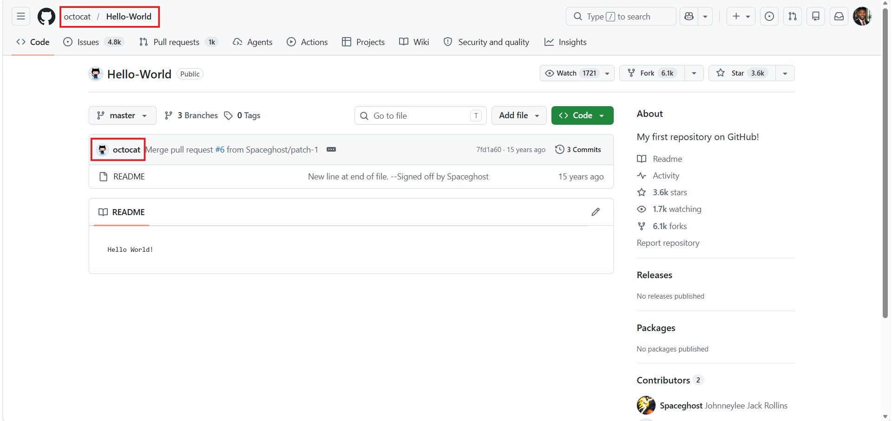
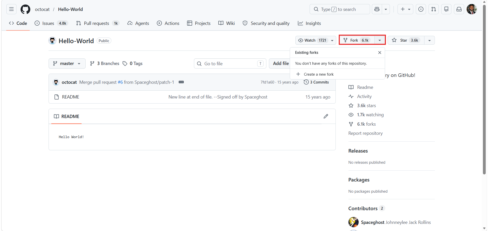
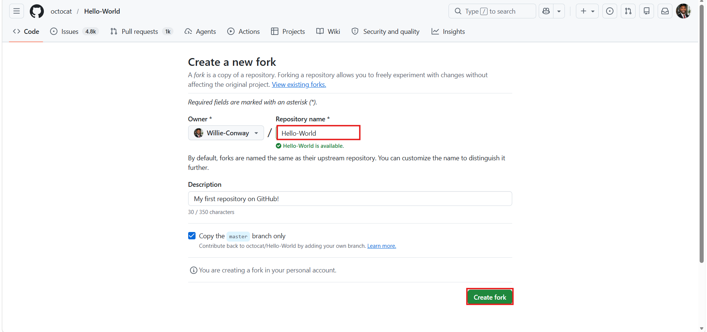
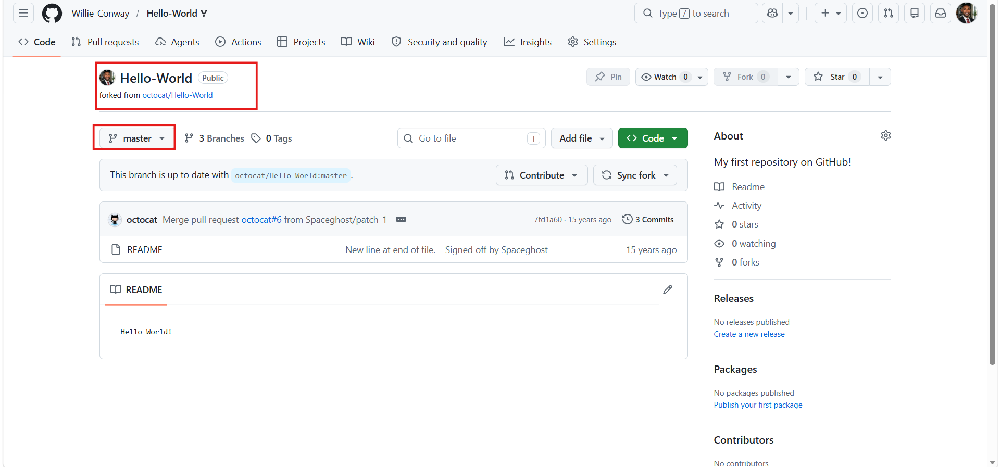

# Lab: Getting Started with GitHub (Optional)

**Estimated time needed:** 25 minutes

---

## Objectives

After completing this lab, you will be able to:

| # | Objective                                          |
| - | -------------------------------------------------- |
| 1 | Create a GitHub account                            |
| 2 | Add a private repository to your GitHub account    |
| 3 | Create and edit a file in your GitHub repository   |
| 4 | Create a new fork of an existing GitHub repository |

---

## Introduction

Welcome to the **Getting Started with GitHub** lab.

### Understanding Git vs GitHub

To understand GitHub, you should first understand **Git**:

| Concept              | Description                                           |
| :------------------- | :---------------------------------------------------- |
| **Git**        | Open-source distributed version control system        |
| **Repository** | Copy of the entire project including revision history |
| **Commit**     | Saving a change/snapshot of files                     |
| **Branch**     | Separate line of development                          |

**Git vs GitHub:**

| Tool             | Description                                          |
| :--------------- | :--------------------------------------------------- |
| **Git**    | Command-line tool for version control                |
| **GitHub** | Online hosting service for Git repositories with GUI |

### Why GitHub?

| Feature                       | Benefit                                  |
| :---------------------------- | :--------------------------------------- |
| **Graphical Interface** | Use mouse clicks instead of command line |
| **Collaboration**       | Wikis, bug tracking, pull requests       |
| **Access Control**      | Public, private, and team repositories   |
| **Integration**         | CI/CD, security scanning, deployment     |

> **Note:** This lab is a prerequisite for the next lab: **Scanning for Code Vulnerabilities with Snyk**. In that lab, you will scan the code in your GitHub repositories for vulnerabilities.

---

## What You Need

| Requirement                      | Description                      |
| :------------------------------- | :------------------------------- |
| **Web browser**            | Chrome, Firefox, Edge, or Safari |
| **Personal email account** | For account verification         |
| **Internet connection**    | To access GitHub                 |

GitHub provides everything else.

---

## Task 1: Create a GitHub Account

### Step 1: Access GitHub Sign Up

1. Open your web browser
2. Navigate to the GitHub sign-up page:

```
https://github.com/join
```

![GitHub join page]


### Step 2: Complete the Sign-Up Form

On the **Join GitHub** page, provide the requested information:

| Field                              | Instructions                                   |
| :--------------------------------- | :--------------------------------------------- |
| **Enter your email**         | Use a valid personal email address             |
| **Create a password**        | Use a strong, unique password                  |
| **Enter a username**         | Choose a unique username (will appear in URLs) |
| **Verify you are not a bot** | Complete the simple puzzle                     |
| **Email preferences**        | Select or deselect product updates             |

![GitHub sign up form]


### Step 3: Submit and Verify

1. Click **Continue**
2. Complete the puzzle to confirm you are not a bot
3. Click **Submit**

![GitHub verification]


### Step 4: Enter Launch Code

1. When prompted, check your email for the **verification code**
2. Type the code into the space provided
3. Click **Verify**

![Launch code verification]


**Email example:**

```
From: GitHub <noreply@github.com>
Subject: [GitHub] Please verify your email address

Your verification code is: 123456
```

### Step 5: Skip Personalization

1. The **Welcome to GitHub** page is displayed
2. Scroll to the end of the page
3. Select **Skip personalization**

![Skip personalization]


### Step 6: GitHub Dashboard

The **GitHub dashboard** is displayed. From here you can:

| Feature                   | Description                      |
| :------------------------ | :------------------------------- |
| **Activity feed**   | Alerts about recent activities   |
| **Repository list** | Your projects                    |
| **Issue tracking**  | Track issues related to projects |
| **Profile menu**    | Access account settings          |

![GitHub dashboard]


---

## Task 2: Create a Repository

A **repository** (or "repo") is where GitHub stores your project files and their revision history.

### Step 1: Start Repository Creation

1. Click **Create repository** on the dashboard
2. Or click the **+** icon in the top right → **New repository**

![Create repository button]


### Step 2: Configure Repository Settings

Fill out the repository information:

| Field                            | Action                                                    | Notes                          |
| :------------------------------- | :-------------------------------------------------------- | :----------------------------- |
| **Repository name**        | Type `test`                                             | Use a simple name for practice |
| **Description (optional)** | Leave blank or type "Test repository for learning GitHub" | Optional field                 |
| **Repository type**        | Select**Private**                                   | Only you can see and commit    |
| **Initialize repository**  | Select**Add a README file**                         | Creates initial README.md      |

**Repository Types Explained:**

| Type              | Who Can See                      | Who Can Commit                   | Best For                  |
| :---------------- | :------------------------------- | :------------------------------- | :------------------------ |
| **Public**  | Everyone                         | You + collaborators              | Open source projects      |
| **Private** | Only you + invited collaborators | Only you + invited collaborators | Personal/Company projects |

**About README files:**

- README.md is a Markdown file that describes your project
- It appears on your repository's home page
- Common sections: Project title, description, setup instructions, usage

![Repository creation form]


### Step 3: Create Repository

1. Click **Create repository**
2. Wait for GitHub to create your repository

![Create repository button final]


### Step 4: View Your Repository

The home page for your newly created repository is displayed. You can manage your repository's files and folders on this page.

**Repository Home Page Features:**

| Feature                     | Description               |
| :-------------------------- | :------------------------ |
| **Code tab**          | View and manage files     |
| **Issues tab**        | Track bugs and tasks      |
| **Pull requests tab** | Manage code contributions |
| **Actions tab**       | CI/CD workflows           |
| **Projects tab**      | Project management boards |
| **Wiki tab**          | Project documentation     |
| **Settings tab**      | Repository configuration  |

![Repository home page]


---

## Task 3: Create and Edit a File

### Step 1: Start Creating a New File

1. On your repository home page, click **Add File** (or the **+** button next to "Add file")
2. Select **Create new file**

![Add file button]


### Step 2: Create a Markdown File

You will create a file in **Markdown** format (`.md` extension). Markdown is a lightweight markup language for formatting text.

**File information:**

| Field               | Value                                     |
| :------------------ | :---------------------------------------- |
| **File name** | `notes.md`                              |
| **File path** | (leave blank - creates in root directory) |

**Markdown Example Content:**

```markdown
# My GitHub Learning Notes

## Today's Date: April 28, 2024

### What I learned today:

1. Created a GitHub account
2. Created a private repository called "test"
3. Learned about Git vs GitHub
4. Learned about README files

### Key Commands to Remember:

- `git status` - Check repository status
- `git add .` - Stage all changes
- `git commit -m "message"` - Commit changes
- `git push` - Upload to GitHub

### Next Steps:

- [ ] Learn about branching
- [ ] Practice pull requests
- [ ] Try forking a repository
```

![Create new file screen]


### Step 3: Commit the File

After entering your content, you need to **commit** (save) the file:

| Field                                     | Action                                        | Description                   |
| :---------------------------------------- | :-------------------------------------------- | :---------------------------- |
| **Commit message**                  | Type `Added notes.md with learning notes`   | Describes what changed        |
| **Extended description (optional)** | Leave blank                                   | More details about the change |
| **Commit branch**                   | Select `Commit directly to the main branch` | For simplicity                |

Click **Commit new file**

![Commit new file]


### Step 4: View Committed File

After committing, you will see:

- The file `notes.md` appears in your repository file list
- The README.md file is still there
- You can click on `notes.md` to view its contents

![Repository with new file]


### Step 5: Edit an Existing File

1. Click on `notes.md` to open it
2. Click the **pencil icon** (Edit) in the top right of the file view

![Edit file button]


3. Add more content to your notes:

```markdown
### More Notes - Updated:

I just learned how to edit an existing file on GitHub!

The edit workflow is:
1. Navigate to the file
2. Click the pencil icon (Edit)
3. Make changes
4. Write a commit message
5. Click "Commit changes"
```

4. Add a commit message: `Added more notes about editing files`
5. Click **Commit changes**

![Commit changes edit]


---

## Task 4: Fork an Existing Repository

**Forking** creates a personal copy of someone else's repository. Changes you make to your fork do not affect the original repository.

### Step 1: Find a Repository to Fork

For this exercise, we will fork a sample repository:

1. Navigate to the following URL (or any public repository):

```
https://github.com/octocat/Hello-World
```

Or search for "octocat/Hello-World" in GitHub.

![Octocat Hello World repo]



### Step 2: Click Fork

1. Click the **Fork** button in the top right corner of the repository page

![Fork button]



### Step 3: Configure Fork

1. The fork dialog will appear
2. Select your personal account as the destination
3. Repository name defaults to the original name (you can change it)
4. Ensure "Copy the main branch only" is selected
5. Click **Create fork**

![Fork configuration]



### Step 4: View Your Fork

After forking, you will be taken to your copy of the repository:

- Notice the repository name shows: `your-username/Hello-World`
- The fork indicator shows where it was forked from
- You have full control over this copy

![Forked repository]



### Why Fork a Repository?

| Use Case                            | Description                                            |
| :---------------------------------- | :----------------------------------------------------- |
| **Contribute to open source** | Make changes and submit a pull request to the original |
| **Experiment safely**         | Test changes without affecting the original project    |
| **Start your own version**    | Create a new project based on existing code            |
| **Learn from others**         | Explore and modify code to understand how it works     |

---

## GitHub Glossary

| Term                        | Definition                                              |
| :-------------------------- | :------------------------------------------------------ |
| **Repository (Repo)** | Storage location for project files and revision history |
| **Commit**            | A saved snapshot of changes to files                    |
| **Branch**            | An independent line of development                      |
| **Main/Master**       | The default branch of a repository                      |
| **README**            | A Markdown file describing the project                  |
| **Fork**              | A personal copy of someone else's repository            |
| **Pull Request**      | Proposing changes to be merged into another repository  |
| **Clone**             | Download a copy of a repository to your local computer  |
| **Push**              | Upload local commits to GitHub                          |
| **Pull**              | Download changes from GitHub to your local computer     |
| **Issue**             | Track bugs, tasks, or feature requests                  |
| **Markdown**          | Lightweight markup language for formatting text (.md)   |

---

## Markdown Quick Reference

| Element                 | Syntax                | Example Output      |
| :---------------------- | :-------------------- | :------------------ |
| **Heading 1**     | `# Title`           | # Title             |
| **Heading 2**     | `## Title`          | ## Title            |
| **Bold**          | `**bold text**`     | **bold text** |
| **Italic**        | `*italic text*`     | *italic text*     |
| **Bulleted list** | `- Item`            | • Item             |
| **Numbered list** | `1. Item`           | 1. Item             |
| **Code block**    | ` ```code`` `       | `code`            |
| **Inline code**   | ``code``              | `code`            |
| **Link**          | `[text](url)`       | [text](url)            |
| **Image**         | `` | [Image]             |
| **Checklist**     | `- [x] Done`        | ☑ Done             |

---

## Lab Completion Checklist

| Task                                    | Completed |
| :-------------------------------------- | :-------- |
| **Task 1: Create GitHub Account** | ☐        |
| Accessed github.com/join                | ☐        |
| Completed sign-up form                  | ☐        |
| Verified email with launch code         | ☐        |
| Skipped personalization                 | ☐        |
| Viewed GitHub dashboard                 | ☐        |
| **Task 2: Create Repository**     | ☐        |
| Clicked "Create repository"             | ☐        |
| Named repository "test"                 | ☐        |
| Selected Private                        | ☐        |
| Added README file                       | ☐        |
| Created repository                      | ☐        |
| **Task 3: Create and Edit File**  | ☐        |
| Clicked "Add file" → "Create new file" | ☐        |
| Created notes.md with content           | ☐        |
| Committed the file                      | ☐        |
| Edited notes.md                         | ☐        |
| Committed changes                       | ☐        |
| **Task 4: Fork a Repository**     | ☐        |
| Navigated to a public repository        | ☐        |
| Clicked Fork button                     | ☐        |
| Created fork in personal account        | ☐        |
| Viewed forked repository                | ☐        |

---

## Screenshot Checklist

| Screenshot         | File Name               | Description               |
| :----------------- | :---------------------- | :------------------------ |
| GitHub Dashboard   | `GH_Dashboard.png`    | After account creation    |
| Create Repository  | `GH_Create_Repo.png`  | Repository creation form  |
| Repository Home    | `GH_Repo_Home.png`    | test repository home page |
| Create File        | `GH_Create_File.png`  | Creating notes.md         |
| Commit File        | `GH_Commit_File.png`  | Commit message and button |
| File in Repository | `GH_File_In_Repo.png` | notes.md listed           |
| Edit File          | `GH_Edit_File.png`    | Editing existing file     |
| Fork Repository    | `GH_Fork_Repo.png`    | Forked repository view    |

---

## Troubleshooting Tips

| Issue                                     | Solution                                                  |
| :---------------------------------------- | :-------------------------------------------------------- |
| **Username already taken**          | Try a different username (add numbers or underscores)     |
| **Verification email not received** | Check spam folder; wait a few minutes; request new code   |
| **Cannot find "Create repository"** | Look for green button on dashboard or + icon top-right    |
| **Private option not available**    | Private repositories are free for all users; refresh page |
| **File not appearing after commit** | Refresh the page; check you committed to correct branch   |
| **Fork button not visible**         | Ensure you are viewing a repository you don't own         |
| **Cannot create fork**              | You must be logged into GitHub                            |

---

## Key Takeaways

| Concept                     | Description                                           |
| :-------------------------- | :---------------------------------------------------- |
| **Git**               | Distributed version control system (command line)     |
| **GitHub**            | Online hosting service for Git (GUI)                  |
| **Repository**        | Project storage with version history                  |
| **Private vs Public** | Private: you control access; Public: everyone can see |
| **README**            | Project documentation in Markdown                     |
| **Commit**            | Saved snapshot of changes with message                |
| **Fork**              | Personal copy of another user's repository            |

---

## Summary

In this lab, you have:

| Activity                                  | Completed |
| :---------------------------------------- | :-------- |
| Created a free GitHub account             | ☐        |
| Created a private repository named "test" | ☐        |
| Added a README file to your repository    | ☐        |
| Created a new notes.md file               | ☐        |
| Edited and committed changes to notes.md  | ☐        |
| Forked an existing public repository      | ☐        |

---

## Next Steps

After completing this lab, you are ready for the next lab:

**Scanning for Code Vulnerabilities with Snyk** - where you will scan the code in your GitHub repositories for security vulnerabilities.

---

## Additional Resources

| Resource                      | URL                                                        |
| :---------------------------- | :--------------------------------------------------------- |
| **GitHub Docs**         | https://docs.github.com                                    |
| **GitHub Skills**       | https://skills.github.com                                  |
| **Markdown Guide**      | https://www.markdownguide.org                              |
| **GitHub Learning Lab** | https://lab.github.com                                     |
| **Git Cheat Sheet**     | https://education.github.com/git-cheat-sheet-education.pdf |

---

## Congratulations!

You have successfully completed the **Getting Started with GitHub** lab. You now know how to:

- Create a GitHub account
- Create private and public repositories
- Create, edit, and commit files using the GitHub web interface
- Fork existing repositories to your account
- Use basic Markdown formatting

These skills are essential for:

- Version control and collaboration
- Open source contribution
- Managing code projects
- Preparing for security scanning tools that integrate with GitHub

---

**Author Contributions:** This lab was developed as part of the security curriculum.
**Prerequisite for:** Scanning for Code Vulnerabilities with Snyk
