# Hands-on Lab: Network Protocol Analyzers

**Estimated time needed:** 45 minutes

---

## About This Lab

In this lab, we will be using **Wireshark**. Wireshark is an open-source application that can capture and display data that reads the contents of each packet as it travels across the network.

Wireshark is the world's most popular network protocol analyzer, used by network administrators, security professionals, and developers to troubleshoot network issues, analyze security incidents, and understand network protocols.

---

## Learning Objectives

In this hands-on lab, you will:

| # | Objective                                          |
| - | -------------------------------------------------- |
| 1 | Install Wireshark on a Windows system              |
| 2 | Capture packets using Wireshark                    |
| 3 | Review and analyze capture results                 |
| 4 | Apply display filters to focus on specific traffic |
| 5 | Follow TCP streams to reconstruct conversations    |

---

## Important Notices About This Lab

### About Lab Sessions

Lab sessions are **not persisted**. This means that every time you connect to this lab, a new environment is created for you. Any data or files you saved in a previous session are no longer available. To avoid losing your data, plan to complete these tasks in a **single session**.

### About the Lab Instructions and Solutions

Microsoft Windows operating system features can vary based on the Windows edition. If completing these exercises on your machine, your navigation and solutions may differ from what's presented in this lab. The concepts remain the same across all Windows versions.

---

## What is Wireshark?

```
┌─────────────────────────────────────────────────────────────────────────────┐
│                         WHAT IS WIRESHARK?                                  │
├─────────────────────────────────────────────────────────────────────────────┤
│                                                                              │
│   Wireshark is a network packet analyzer that:                               │
│                                                                              │
│   • Captures network traffic in real-time                                   │
│   • Displays packet contents in human-readable format                       │
│   • Supports hundreds of network protocols                                  │
│   • Provides filtering capabilities to isolate specific traffic             │
│   • Allows deep packet inspection                                           │
│                                                                              │
│   Common Uses:                                                               │
│   ┌─────────────────────────────────────────────────────────────────────┐   │
│   │ ✓ Network troubleshooting                                           │   │
│   │ ✓ Security analysis and incident response                           │   │
│   │ ✓ Protocol development and debugging                                │   │
│   │ ✓ Network performance monitoring                                    │   │
│   │ ✓ Educational purposes (learning network protocols)                 │   │
│   └─────────────────────────────────────────────────────────────────────┘   │
│                                                                              │
└─────────────────────────────────────────────────────────────────────────────┘
```

### Wireshark vs Other Tools

| Tool                                 | Purpose                           | Comparison                                     |
| :----------------------------------- | :-------------------------------- | :--------------------------------------------- |
| **Wireshark**                  | Packet capture and analysis       | GUI-based, most comprehensive protocol support |
| **tcpdump**                    | Command-line packet capture       | Lightweight, CLI-only, runs on servers         |
| **TShark**                     | Command-line version of Wireshark | Scriptable, no GUI overhead                    |
| **Microsoft Message Analyzer** | Microsoft proprietary             | Discontinued, Windows-only                     |
| **SolarWinds NetFlow**         | Network traffic monitoring        | Enterprise-focused, paid tool                  |

---

## Exercise 1: Install Wireshark

In this exercise, you will download and install Wireshark on your Windows system.

### Step 1: Open Chrome Browser

1. Launch the Chrome browser (or any web browser)
2. Ensure you have an active internet connection

![Chrome browser opened]

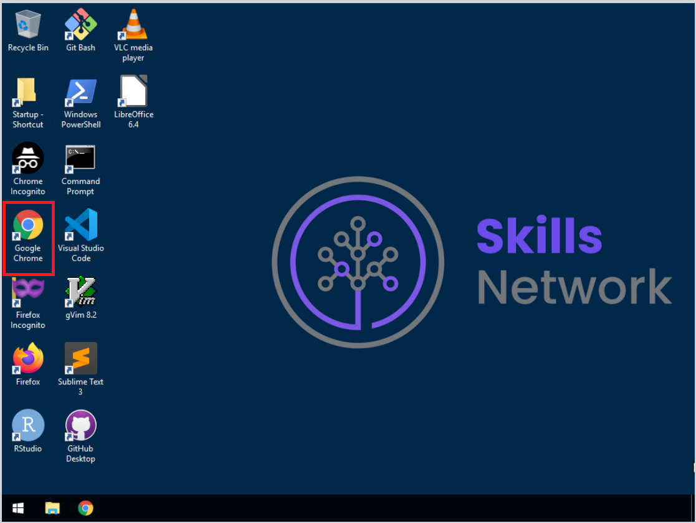

### Step 2: Navigate to wireshark.org

Type the following URL in the address bar:

```
https://www.wireshark.org
```

Press **Enter**.

![Wireshark homepage]

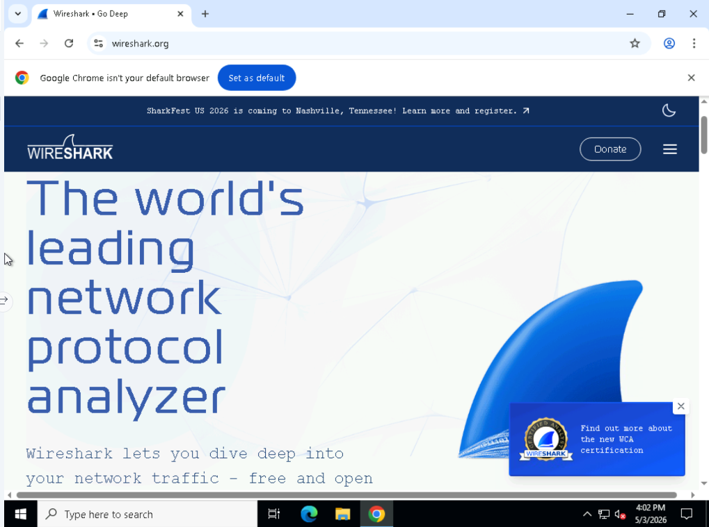

### Step 3: Click "Get Started"

1. On the Wireshark homepage, locate the **Get Started** button
2. Click **Get Started**

![Get Started button]

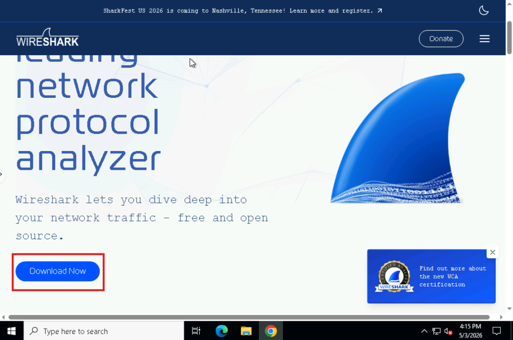

### Step 4: Download Windows Installer

1. On the download page, find the **Windows x64 Installer** link
2. Click **Windows x64 Installer**

![Windows x64 Installer]

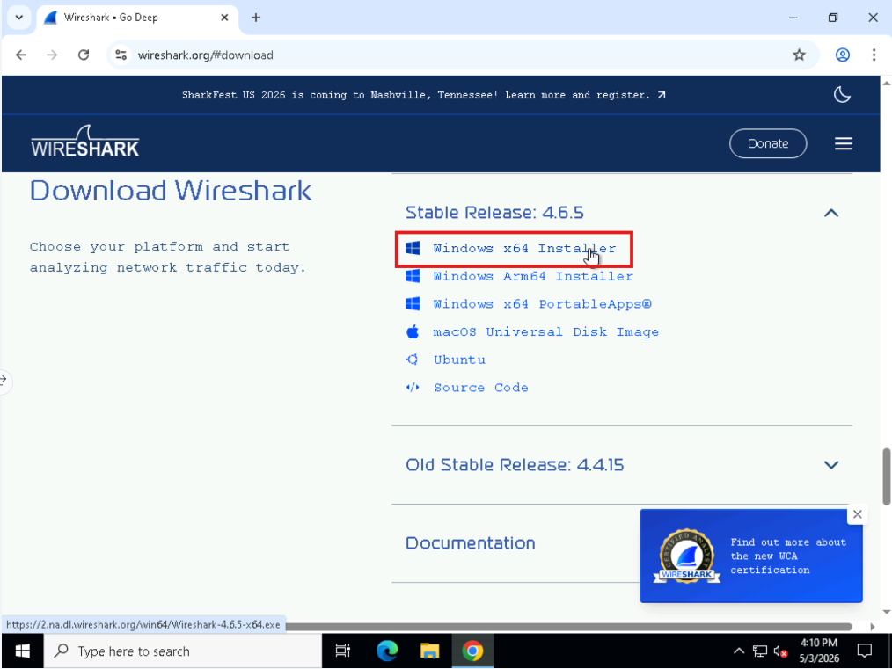

**Alternative download options:**

| Version                         | Description                                      |
| :------------------------------ | :----------------------------------------------- |
| **Windows x64 Installer** | 64-bit Windows (recommended for most modern PCs) |
| **Windows x86 Installer** | 32-bit Windows (older systems)                   |
| **macOS .dmg**            | For Apple Mac computers                          |
| **Source Code**           | For Linux/Unix compilation                       |

### Step 5: Run the Installer

1. Once the download completes, locate the installer file (e.g., `Wireshark-4.2.5-x64.exe`)
2. Double-click the installer to run it
3. If prompted by User Account Control (UAC), click **Yes**

![Run installer]

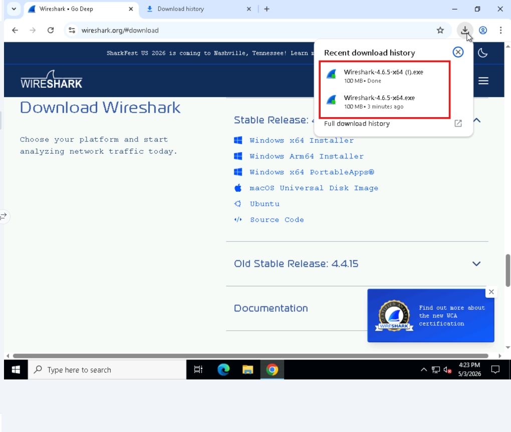

### Step 6: Complete Installation Wizard

Follow the installation wizard steps:

**Step 6.1: License Agreement**

- Click **Next** after reading the license agreement
- Select **I Agree** to accept the terms

![License agreement]

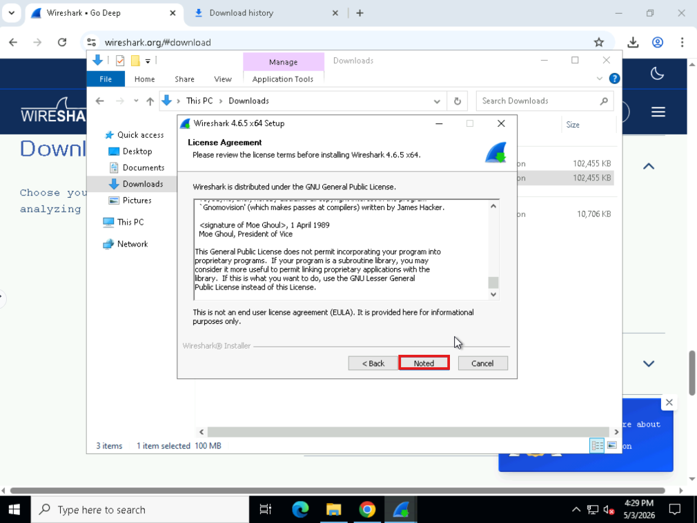

**Step 6.2: Choose Components**

- Leave default components selected
- Recommended components:
  - ☑ Wireshark (main application)
  - ☑ TShark (command-line tool)
  - ☑ Extcap plugins
  - ☑ Tools
  - ☑ User's Guide
- Click **Next**

![Choose components]

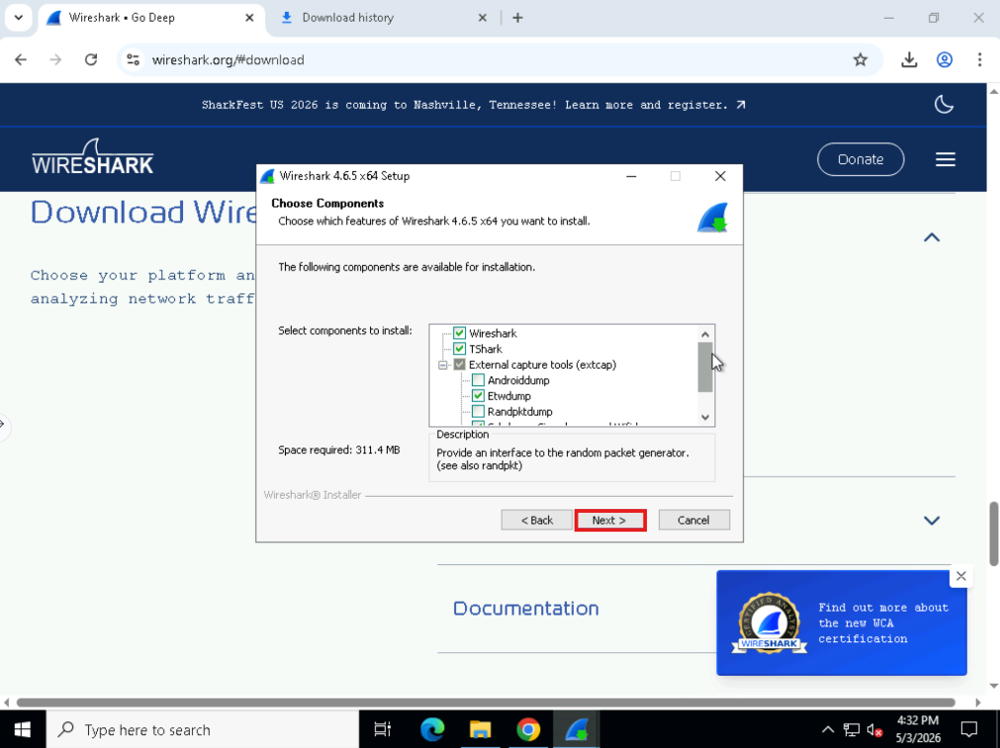

**Step 6.3: Select Additional Tasks**

- Optional: Create desktop shortcut (recommended)
- Optional: Associate file extensions with Wireshark
- Click **Next**

![Additional tasks]

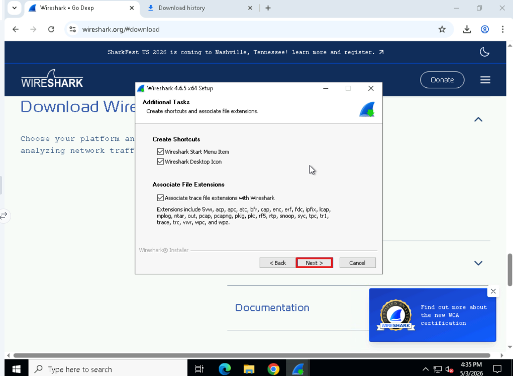

**Step 6.4: Installation Location**

- Choose installation location (default: `C:\Program Files\Wireshark`)
- Click **Next**

**Step 6.5: Install Npcap**

- You will be prompted to install **Npcap** (required for packet capture)
- Accept the Npcap license agreement
- Select **Install Npcap in WinPcap API-compatible Mode** (recommended)
- Click **Install**

![Npcap installation]

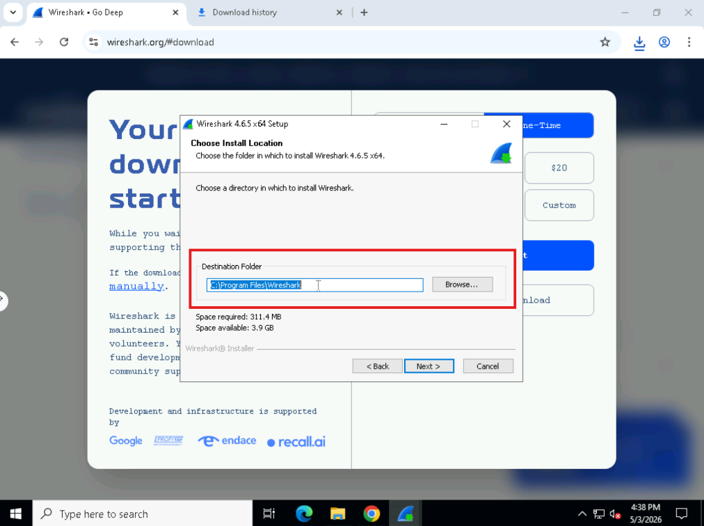

**Why Npcap is needed:** Npcap is a packet capture driver that allows Wireshark to capture raw network traffic. Without it, Wireshark can only read existing capture files, not capture live traffic.

**Step 6.6: Complete Installation**

- Click **Install** to begin the installation
- Wait for the installation to complete
- Click **Next**, then **Finish**

![Installation complete]


### Step 7: Launch Wireshark

After installation, launch Wireshark using one of these methods:

| Method                     | Instructions                                    |
| :------------------------- | :---------------------------------------------- |
| **Desktop shortcut** | Double-click the Wireshark icon on your desktop |
| **Start Menu**       | Click Start → Wireshark → Wireshark           |
| **Run command**      | Press Win+R, type `wireshark`, press Enter    |


![Launch Wireshark]

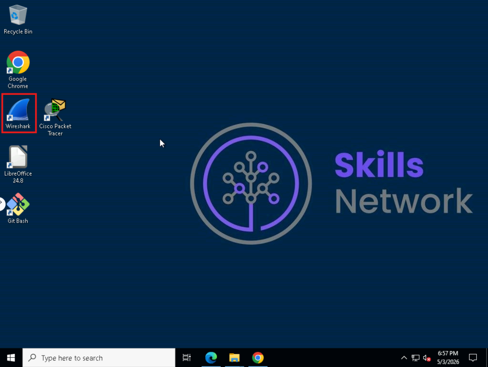

---

## Exercise 2: Capture Packets with Wireshark

In this exercise, you will capture network packets, generate traffic, and analyze the results.

### Step 1: Select Network Interface

When Wireshark launches, you will see the **Welcome Screen** with a list of available network interfaces:

```
┌─────────────────────────────────────────────────────────────────────────────┐
│                    WIRESHARK WELCOME SCREEN                                  │
├─────────────────────────────────────────────────────────────────────────────┤
│                                                                              │
│   Available Network Interfaces:                                              │
│   ┌─────────────────────────────────────────────────────────────────────┐   │
│   │ 🖧  Ethernet - Active (IP: 192.168.1.100)                           │   │
│   │ 📶 Wi-Fi - Active (IP: 192.168.1.105)                               │   │
│   │ 🔄 Bluetooth Network Connection - Disconnected                      │   │
│   │ 🔰 Localhost (loopback) - Active (IP: 127.0.0.1)                    │   │
│   └─────────────────────────────────────────────────────────────────────┘   │
│                                                                              │
│   Each interface shows a line graph of current traffic                       │
│                                                                              │
└─────────────────────────────────────────────────────────────────────────────┘
```

**Select the correct interface:**

| Interface           | When to Use                                |
| :------------------ | :----------------------------------------- |
| **Wi-Fi**     | If connected to wireless network           |
| **Ethernet**  | If connected via network cable             |
| **Localhost** | For traffic generated on your own computer |

![Select interface]

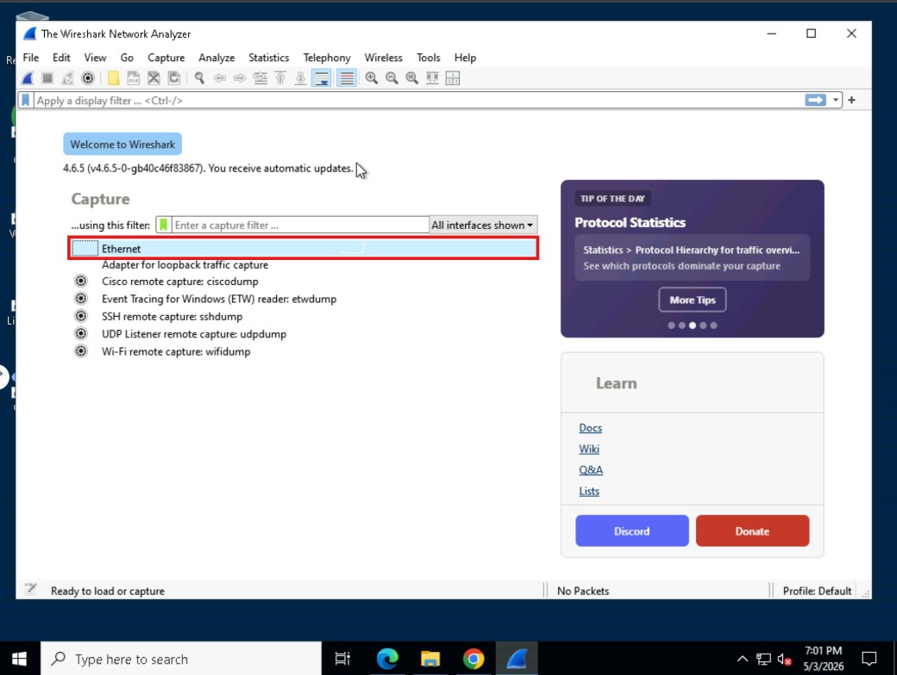

### Step 2: Start Packet Capture

1. Click on the interface you want to capture from (e.g., Wi-Fi or Ethernet)
2. Click the **Start Capturing** button (blue shark fin icon) in the top menu

![Start capture button]


### Step 3: Generate Network Traffic

While Wireshark is capturing, generate some network traffic to analyze:

**Method 1: Web Browsing**

1. Open a web browser
2. Visit a website, e.g., `https://www.google.com`

**Method 2: Command Prompt**

Open Command Prompt and run:

```cmd
ping google.com
nslookup ibm.com
```

**Method 3: Use Multiple Websites**

Visit different types of websites:

- HTTP site: `http://neverssl.com`
- HTTPS site: `https://www.ibm.com`
- Video streaming: `https://www.youtube.com`

![Generate traffic]

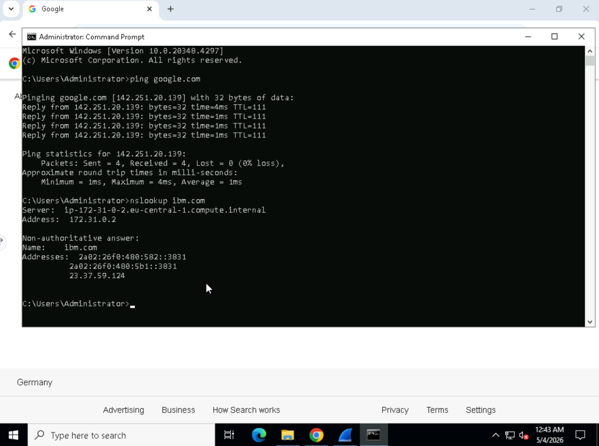

### Step 4: Stop Packet Capture

1. Generate traffic for 15-30 seconds
2. Return to Wireshark
3. Click the **Stop Capturing** button (red square icon)

![Stop capture button]

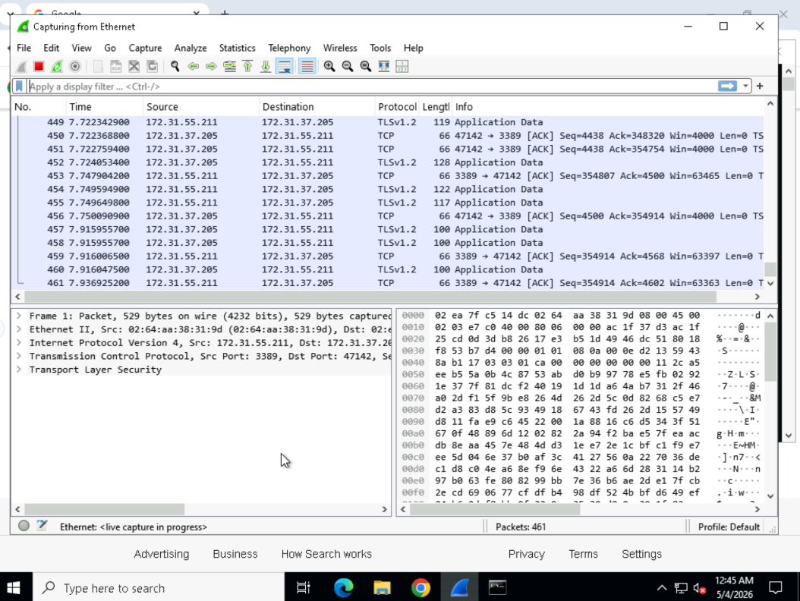

---

## Exercise 3: Review Capture Results

In this exercise, you will learn to navigate and understand the Wireshark interface.

### Step 1: Understand the Wireshark Interface

The Wireshark main window is divided into three panes:

```
┌─────────────────────────────────────────────────────────────────────────────┐
│                    WIRESHARK INTERFACE                                       │
├─────────────────────────────────────────────────────────────────────────────┤
│                                                                              │
│   [Display Filter Bar] ___________________________________ [Apply]         │
│                                                                              │
│   ┌─────────────────────────────────────────────────────────────────────┐   │
│   │                    PACKET LIST PANE                                  │   │
│   │  No.    Time        Source          Destination      Protocol Info  │   │
│   │  1     0.000000    192.168.1.100   142.250.190.46   TCP      443→  │   │
│   │  2     0.001234    142.250.190.46  192.168.1.100    TCP      443→  │   │
│   │  3     0.002456    192.168.1.100   142.250.190.46   TCP      443→  │   │
│   └─────────────────────────────────────────────────────────────────────┘   │
│                                                                              │
│   ┌─────────────────────────────────────────────────────────────────────┐   │
│   │                    PACKET DETAILS PANE                               │   │
│   │  Frame: Contains capture information                                 │   │
│   │  Ethernet II: Source/Destination MAC addresses                       │   │
│   │  Internet Protocol: Source/Destination IP addresses                  │   │
│   │  Transmission Control Protocol: Ports, Flags, Sequence Numbers      │   │
│   └─────────────────────────────────────────────────────────────────────┘   │
│                                                                              │
│   ┌─────────────────────────────────────────────────────────────────────┐   │
│   │                    PACKET BYTES PANE                                 │   │
│   │  0000  00 1a 2b 3c 4d 5e 00 1a 2b 3c 4d 5e 08 00 45 00  .;M.;M..E.  │   │
│   │  0010  00 34 00 00 40 00 40 06 00 00 c0 a8 01 64 8e fa  .4..@.@....d.. │   │
│   └─────────────────────────────────────────────────────────────────────┘   │
│                                                                              │
└─────────────────────────────────────────────────────────────────────────────┘
```

### Step 2: Understand Packet List Columns

| Column                | Information                               | Significance                      |
| :-------------------- | :---------------------------------------- | :-------------------------------- |
| **No.**         | Packet number (sequential)                | Reference for analysis            |
| **Time**        | Time since capture started                | Understand timing between packets |
| **Source**      | Source IP address                         | Where packet originated           |
| **Destination** | Destination IP address                    | Where packet is going             |
| **Protocol**    | Protocol type (TCP, UDP, HTTP, DNS, etc.) | What kind of traffic              |
| **Length**      | Packet size in bytes                      | Detect large data transfers       |
| **Info**        | Packet details summary                    | Quick identification              |

### Step 3: Examine the Three-Way Handshake

Look for the TCP three-way handshake packets:

```
No.  Time     Source          Destination     Info
1    0.000    192.168.1.100   142.250.190.46  TCP 54321 → 443 [SYN]
2    0.024    142.250.190.46  192.168.1.100   TCP 443 → 54321 [SYN, ACK]
3    0.025    192.168.1.100   142.250.190.46  TCP 54321 → 443 [ACK]
```

**What to look for:**

| Step | Packet  | Flag       | Direction        |
| :--- | :------ | :--------- | :--------------- |
| 1    | SYN     | [SYN]      | Client → Server |
| 2    | SYN-ACK | [SYN, ACK] | Server → Client |
| 3    | ACK     | [ACK]      | Client → Server |

![Three-way handshake]

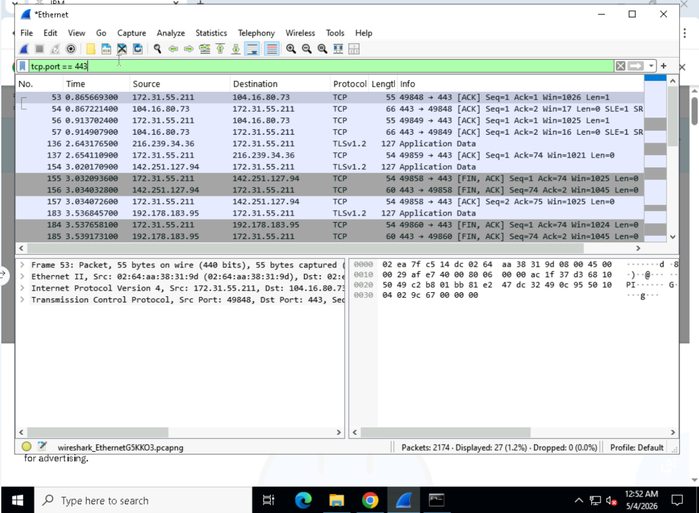

### Step 4: Expand Packet Details

1. Click on a packet in the Packet List pane
2. Expand the categories in the Packet Details pane

**Key sections to explore:**

| Section                                 | What it Shows                        |
| :-------------------------------------- | :----------------------------------- |
| **Frame**                         | Capture metadata (timestamp, length) |
| **Ethernet II**                   | MAC addresses (source/destination)   |
| **Internet Protocol**             | IP addresses, TTL, protocol          |
| **Transmission Control Protocol** | Ports, sequence numbers, flags       |
| **Hypertext Transfer Protocol**   | HTTP requests/responses              |

![Expand packet details]

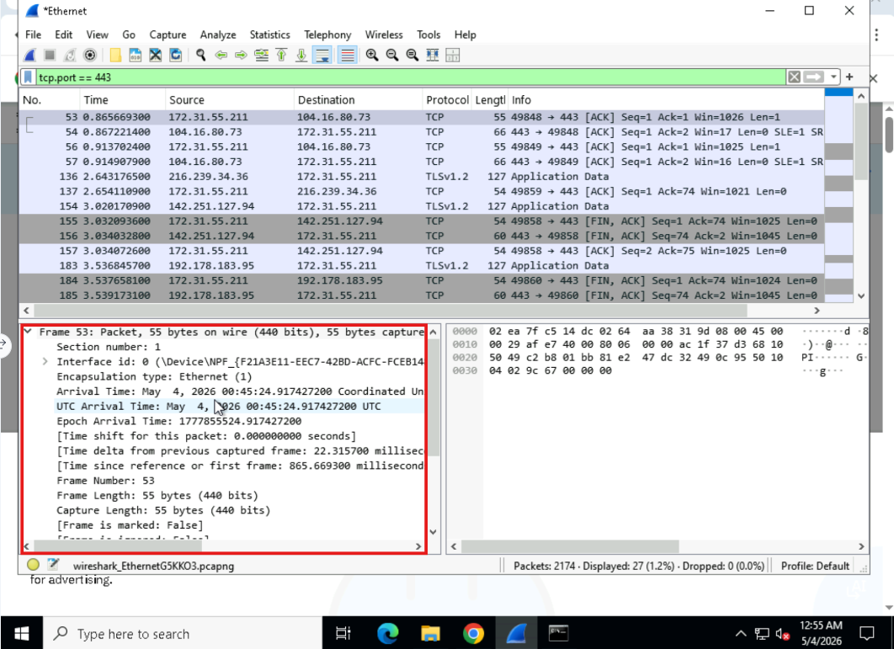

### Step 5: Examine Packet Bytes

The bottom pane shows the raw packet data in hexadecimal and ASCII:

```
0000   00 1a 2b 3c 4d 5e 00 1a 2b 3c 4d 5e 08 00 45 00   ..;M^..;M^..E.
0010   00 34 00 00 40 00 40 06 00 00 c0 a8 01 64 8e fa   .4..@.@......d..
0020   be 46 00 00 00 00 00 00 00 00 00 00 00 00 50 12   .F............P.
```

- **Left column:** Hexadecimal offset
- **Middle columns:** Hex representation of packet bytes
- **Right column:** ASCII representation (`.` = non-printable)

![Packet bytes]

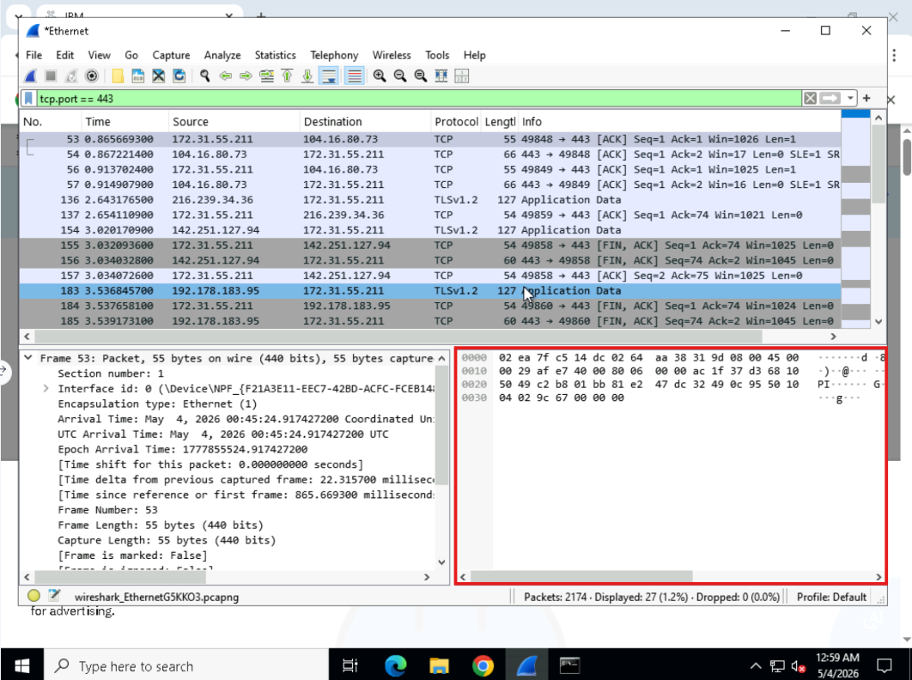

---

## Exercise 4: Apply Display Filters

In this exercise, you will learn to use display filters to focus on specific types of traffic.

### Step 1: Filter for Specific Protocols

Type the following filters in the **Display Filter** bar and press **Enter**:

| Filter   | Traffic Displayed                |
| :------- | :------------------------------- |
| `tcp`  | All TCP traffic                  |
| `udp`  | All UDP traffic                  |
| `http` | HTTP web traffic                 |
| `dns`  | DNS query/response traffic       |
| `icmp` | ICMP (ping) traffic              |
| `arp`  | ARP (address resolution) traffic |

![Filter for TCP]


### Step 2: Filter for Specific Ports

| Filter              | Traffic Displayed         |
| :------------------ | :------------------------ |
| `tcp.port == 80`  | HTTP traffic on port 80   |
| `tcp.port == 443` | HTTPS traffic on port 443 |
| `udp.port == 53`  | DNS traffic on port 53    |
| `tcp.port == 22`  | SSH traffic on port 22    |

### Step 3: Filter for Specific IP Addresses

| Filter                      | Traffic Displayed            |
| :-------------------------- | :--------------------------- |
| `ip.src == 192.168.1.100` | Traffic FROM this IP address |
| `ip.dst == 8.8.8.8`       | Traffic TO this IP address   |
| `ip.addr == 192.168.1.1`  | Traffic TO or FROM this IP   |

### Step 4: Filter for Specific Packet Content

| Filter                             | Traffic Displayed         |
| :--------------------------------- | :------------------------ |
| `http.request.method == "GET"`   | HTTP GET requests         |
| `http.response.code == 200`      | Successful HTTP responses |
| `dns.qry.name contains "google"` | DNS queries for google    |
| `tcp.flags.syn == 1`             | TCP SYN packets           |
| `tcp.flags.ack == 1`             | TCP ACK packets           |

### Step 5: Combine Filters

Use logical operators to combine filters:

| Operator         | Example                                         | Meaning              |
| :--------------- | :---------------------------------------------- | :------------------- |
| `and` / `&&` | `tcp.port == 443 and ip.src == 192.168.1.100` | Both conditions true |
| `or` / `       |                                                 | `                    |
| `not` / `!`  | `not arp`                                     | Exclude ARP traffic  |

```
┌─────────────────────────────────────────────────────────────────────────────┐
│                    DISPLAY FILTER EXAMPLES                                   │
├─────────────────────────────────────────────────────────────────────────────┤
│                                                                              │
│   # HTTP traffic from a specific IP                                         │
│   http and ip.src == 192.168.1.100                                          │
│                                                                              │
│   # HTTPS traffic NOT going to google                                       │
│   tcp.port == 443 and not dns.qry.name contains "google"                    │
│                                                                              │
│   # DNS queries for banking websites                                        │
│   dns.qry.name matches "bank\|financial"                                    │
│                                                                              │
│   # TCP SYN or FIN packets (connection start/end)                           │
│   tcp.flags.syn == 1 or tcp.flags.fin == 1                                  │
│                                                                              │
└─────────────────────────────────────────────────────────────────────────────┘
```

![Combined filters]

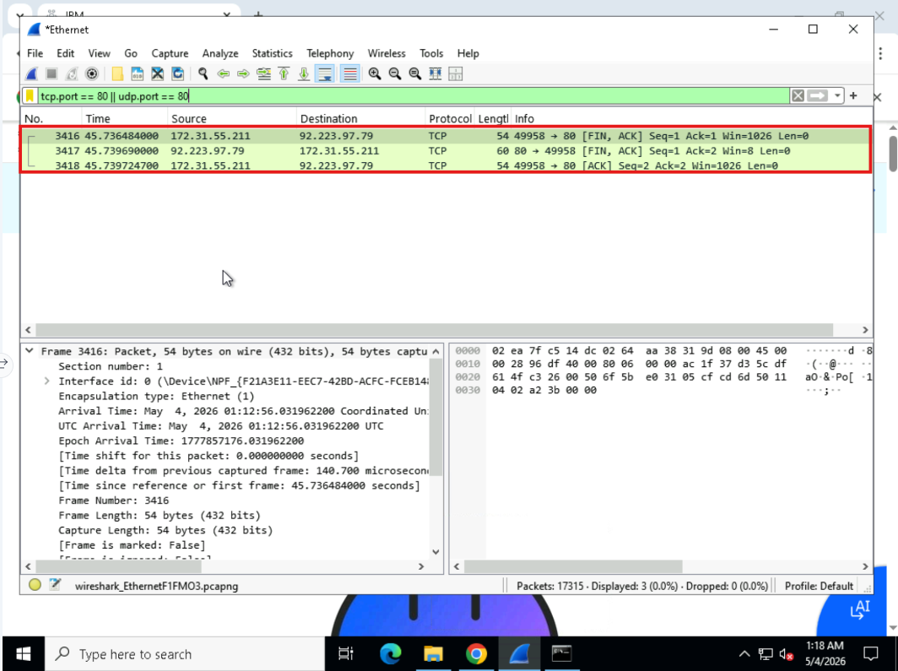

---

## Exercise 5: Colored Packets

Wireshark uses color coding to help identify different packet types:

| Color                  | Default Meaning            | Why Important                  |
| :--------------------- | :------------------------- | :----------------------------- |
| **Light Purple** | TCP traffic                | Most web traffic               |
| **Light Blue**   | UDP traffic                | DNS, streaming, VoIP           |
| **Dark Blue**    | DNS queries/responses      | Helps find domain lookups      |
| **Yellow**       | Routing protocols          | Network infrastructure traffic |
| **Red**          | TCP RST or unusual packets | Potential issues               |
| **Green**        | HTTP traffic               | Web requests/responses         |
| **Light Green**  | HTTP POST                  | Form submissions, logins       |

### How to Customize Coloring Rules

1. Click **View** → **Coloring Rules**
2. Add, remove, or modify coloring rules
3. Reorder rules (top rule wins)
4. Click **OK** to apply

![Coloring rules]

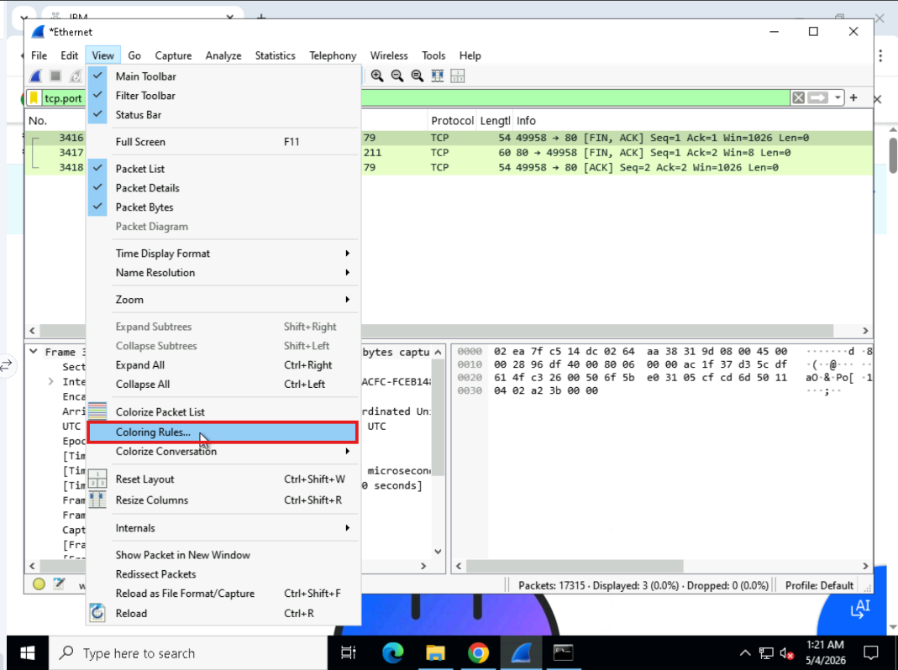

---

## Exercise 6: Follow TCP Stream

The "Follow TCP Stream" feature reconstructs an entire TCP conversation, making it easier to read application data.

### Step 1: Select a Packet

1. Find a TCP packet in a conversation you want to analyze
2. Right-click on the packet

### Step 2: Follow TCP Stream

1. Select **Follow** → **TCP Stream**

![Follow TCP Stream]

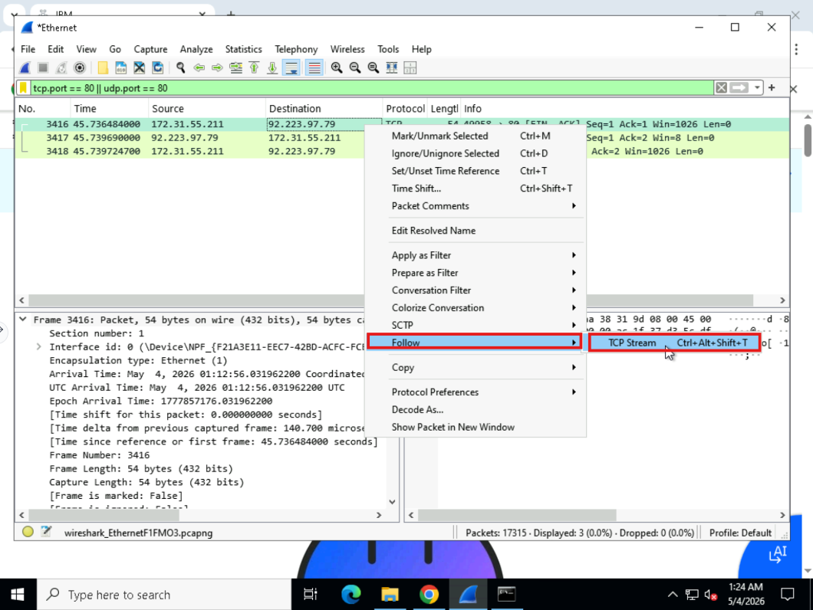

### Step 3: Analyze the Stream

The TCP Stream window opens, showing the complete conversation:

```
┌─────────────────────────────────────────────────────────────────────────────┐
│                    TCP STREAM WINDOW                                         │
├─────────────────────────────────────────────────────────────────────────────┤
│                                                                              │
│   Client Traffic (red):                                                      │
│   GET / HTTP/1.1                                                            │
│   Host: www.ibm.com                                                         │
│   User-Agent: Mozilla/5.0 ...                                               │
│   Accept: text/html,application/xhtml+xml...                                │
│                                                                              │
│   Server Traffic (blue):                                                     │
│   HTTP/1.1 200 OK                                                           │
│   Content-Type: text/html                                                   │
│   Content-Length: 12345                                                     │
│                                                                              │
│   <!DOCTYPE html><html>...</html>                                           │
│                                                                              │
├─────────────────────────────────────────────────────────────────────────────┤
│  [Entire conversation] [Client traffic: red] [Server traffic: blue]         │
│  [Print] [Save as...] [Filter out this stream] [Close]                      │
│                                                                              │
└─────────────────────────────────────────────────────────────────────────────┘
```

**What you can see:**

| Information   | How It Helps                          |
| :------------ | :------------------------------------ |
| HTTP headers  | Identify web servers and technologies |
| Credentials   | Find exposed usernames/passwords      |
| Response data | See what content was returned         |
| Errors        | Identify application problems         |

![TCP Stream window]

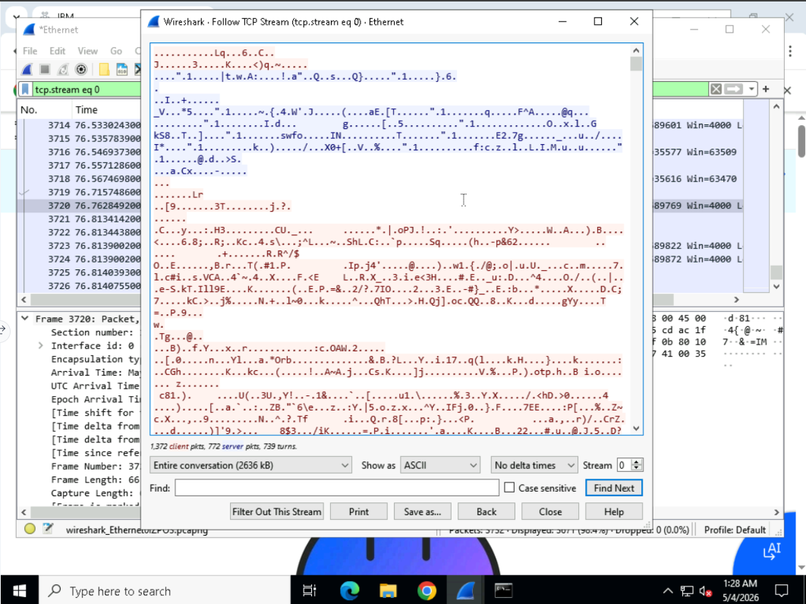

### Step 4: Close the Stream Window

Click **Close** to return to the main Wireshark window.

---

## Exercise 7: Save and Export Capture

### Step 1: Save the Capture

1. Click **File** → **Save As**
2. Choose a location (e.g., Desktop)
3. Name the file: `Network_Capture.pcapng`
4. Click **Save**

![Save capture]


### Step 2: Export Packets (Optional)

Export only displayed/filtered packets:

1. Click **File** → **Export Specified Packets**
2. Choose export range (All packets, Displayed, Selected, etc.)
3. Choose format (pcapng, pcap, csv, etc.)
4. Click **Save**

---

## Common Display Filters Quick Reference

| Category               | Filter                                                 | Description                  |
| :--------------------- | :----------------------------------------------------- | :--------------------------- |
| **Protocols**    | `tcp`, `udp`, `http`, `dns`, `icmp`, `arp` | Protocol filtering           |
| **Ports**        | `tcp.port == 80`                                     | Specific TCP port            |
|                        | `udp.port == 53`                                     | Specific UDP port            |
|                        | `tcp.port >= 1 and tcp.port <= 1024`                 | Port range                   |
| **IP Addresses** | `ip.src == 192.168.1.1`                              | Source IP                    |
|                        | `ip.dst == 8.8.8.8`                                  | Destination IP               |
|                        | `ip.addr == 10.0.0.1`                                | Either source or destination |
| **TCP Flags**    | `tcp.flags.syn == 1`                                 | SYN packets                  |
|                        | `tcp.flags.ack == 1`                                 | ACK packets                  |
|                        | `tcp.flags.fin == 1`                                 | FIN packets                  |
|                        | `tcp.flags.reset == 1`                               | RST packets                  |
| **HTTP**         | `http.request.method == "GET"`                       | HTTP GET                     |
|                        | `http.request.method == "POST"`                      | HTTP POST                    |
|                        | `http.response.code == 200`                          | HTTP 200 OK                  |
|                        | `http.response.code >= 400`                          | HTTP errors                  |
| **DNS**          | `dns.qry.name contains "google"`                     | DNS queries                  |
|                        | `dns.flags.response == 1`                            | DNS responses                |
| **Length**       | `frame.len > 1500`                                   | Large packets                |
|                        | `frame.len < 64`                                     | Small packets                |

---

## Lab Completion Checklist

| Task                                           | Completed |
| :--------------------------------------------- | :-------- |
| **Exercise 1: Install Wireshark**        | ☐        |
| Navigated to wireshark.org                     | ☐        |
| Downloaded Windows x64 Installer               | ☐        |
| Ran installer with administrator privileges    | ☐        |
| Installed Npcap driver                         | ☐        |
| Launched Wireshark successfully                | ☐        |
| **Exercise 2: Capture Packets**          | ☐        |
| Selected active network interface              | ☐        |
| Started packet capture                         | ☐        |
| Generated network traffic (web browsing, ping) | ☐        |
| Stopped packet capture                         | ☐        |
| **Exercise 3: Review Results**           | ☐        |
| Identified three panes (List, Details, Bytes)  | ☐        |
| Found TCP three-way handshake                  | ☐        |
| Expanded packet details sections               | ☐        |
| **Exercise 4: Apply Filters**            | ☐        |
| Filtered by protocol (tcp, udp, http, dns)     | ☐        |
| Filtered by port (443, 80, 53)                 | ☐        |
| Filtered by IP address                         | ☐        |
| Combined filters using and/or                  | ☐        |
| **Exercise 5: Colors**                   | ☐        |
| Identified different colored packets           | ☐        |
| Viewed coloring rules (optional)               | ☐        |
| **Exercise 6: Follow TCP Stream**        | ☐        |
| Right-clicked a TCP packet                     | ☐        |
| Selected Follow → TCP Stream                  | ☐        |
| Analyzed the conversation                      | ☐        |
| **Exercise 7: Save Capture**             | ☐        |
| Saved capture as .pcapng file                  | ☐        |

---

## Screenshot Checklist

| Screenshot            | File Name                      | Description                   |
| :-------------------- | :----------------------------- | :---------------------------- |
| Wireshark Main Window | `WS_Main_Window.png`         | After launching Wireshark     |
| Capture in Progress   | `WS_Capture_Active.png`      | Packets being captured        |
| Three-Way Handshake   | `WS_Three_Way_Handshake.png` | SYN, SYN-ACK, ACK packets     |
| Expanded Details      | `WS_Expanded_Details.png`    | TCP header expanded           |
| Display Filter        | `WS_Display_Filter.png`      | Filter applied (e.g.,`tcp`) |
| TCP Stream            | `WS_TCP_Stream.png`          | Follow TCP Stream window      |

---

## Troubleshooting Tips

| Issue                                     | Solution                                                     |
| :---------------------------------------- | :----------------------------------------------------------- |
| **No interfaces shown**             | Run Wireshark as Administrator                               |
| **No packets captured**             | Ensure you selected correct interface; generate more traffic |
| **Npcap installation fails**        | Uninstall WinPcap first; reboot before retrying              |
| **Capture stops unexpectedly**      | Check disk space; save capture file                          |
| **Filter not working**              | Check syntax; verify filter matches protocol                 |
| **Cannot find three-way handshake** | Filter `tcp.flags.syn == 1` to find SYN packets            |
| **TCP Stream shows gibberish**      | Traffic may be encrypted (HTTPS, SSH)                        |

---

## Ethical Use Reminder

```
┌─────────────────────────────────────────────────────────────────────────────┐
│                           IMPORTANT DISCLAIMER                              │
├─────────────────────────────────────────────────────────────────────────────┤
│                                                                              │
│  Wireshark captures ALL network traffic visible to your network interface.  │
│                                                                              │
│  • Only capture on networks you own or have permission to monitor           │
│  • Be aware of privacy laws when capturing traffic                          │
│  • Do not capture sensitive information (passwords, personal data)         │
│  • In corporate environments, obtain written permission before capturing    │
│                                                                              │
│  Unauthorized packet capture may violate company policies and legal         │
│  regulations. Always ensure you have proper authorization.                  │
│                                                                              │
└─────────────────────────────────────────────────────────────────────────────┘
```

---

## Key Takeaways

| Concept                       | Description                                     |
| :---------------------------- | :---------------------------------------------- |
| **Wireshark**           | Open-source network protocol analyzer           |
| **Packet Capture**      | Recording network traffic for analysis          |
| **Three Panes**         | Packet List, Packet Details, Packet Bytes       |
| **Display Filters**     | Isolate specific traffic (protocol, port, IP)   |
| **Three-Way Handshake** | SYN → SYN-ACK → ACK (TCP connection setup)    |
| **Follow TCP Stream**   | Reconstruct entire conversation                 |
| **Npcap**               | Packet capture driver required for live capture |
| **Save as .pcapng**     | Standard format for capture files               |

---

## Summary

In this hands-on lab, you have:

| Activity                                          | Completed |
| :------------------------------------------------ | :-------- |
| Installed Wireshark and Npcap                     | ✓        |
| Captured live network traffic                     | ✓        |
| Generated traffic using web browsing and ping     | ✓        |
| Identified the TCP three-way handshake            | ✓        |
| Expanded packet details to examine headers        | ✓        |
| Applied display filters (protocol, port, IP)      | ✓        |
| Followed a TCP stream to reconstruct conversation | ✓        |
| Saved the capture file for later analysis         | ✓        |

---

## Congratulations!

You have successfully completed the **Network Protocol Analyzers** lab. You now know how to:

- Download and install Wireshark on Windows
- Capture live network traffic
- Navigate the Wireshark interface
- Apply display filters to focus on specific traffic
- Identify TCP three-way handshake packets
- Expand and examine packet headers
- Follow TCP streams to reconstruct conversations
- Save and export capture files

These skills are essential for:

- Network administrators troubleshooting connectivity issues
- Security analysts investigating network-based threats
- Developers debugging network applications
- Anyone preparing for networking or security certifications
- IT professionals learning network protocols

---

## Additional Resources

| Resource                             | URL                                       |
| :----------------------------------- | :---------------------------------------- |
| **Wireshark Official Website** | https://www.wireshark.org                 |
| **Wireshark Documentation**    | https://www.wireshark.org/docs/           |
| **Display Filter Reference**   | https://www.wireshark.org/docs/dfref/     |
| **Wireshark Wiki**             | https://wiki.wireshark.org                |
| **Sample Captures**            | https://wiki.wireshark.org/SampleCaptures |
