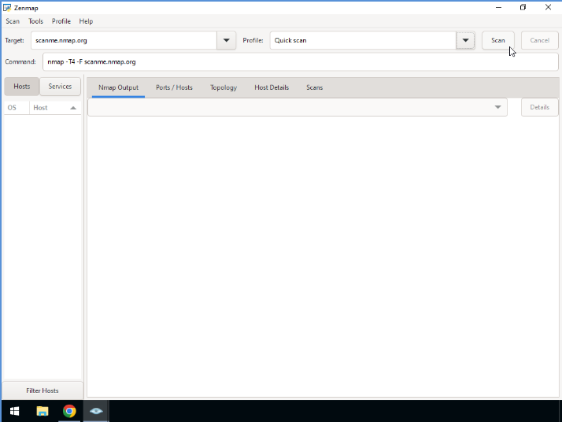
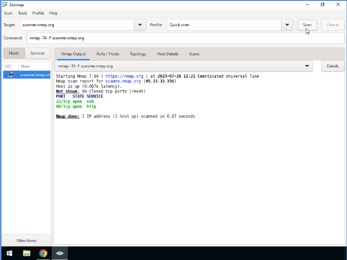

# Hands-on Lab: Scanning Network Environment with Nmap

**Estimated time needed:** 20 minutes

---

## Introduction

In this lab, you will learn how to scan a network using domain names and IP addresses with the Zenmap tool. Zenmap is the official graphical user interface (GUI) for Nmap, making it easier for beginners to learn network scanning concepts without memorizing command-line options.

**Note:** Network scanning should only be performed on systems you own or have explicit written permission to test. Unauthorized scanning may violate laws and terms of service.

---

## Learning Objectives

After completing this lab, you will be able to:

| # | Objective                                                     |
| - | ------------------------------------------------------------- |
| 1 | Use Zenmap, the GUI utility provided by Nmap                  |
| 2 | Perform a network scan based on IP address or domain name     |
| 3 | Review different scan options available in the Zenmap utility |

---

## Prerequisites

| Requirement                        | Description                                             |
| :--------------------------------- | :------------------------------------------------------ |
| **Virtual environment**      | Access to a Windows virtual machine or local Windows PC |
| **Administrator privileges** | Required for installing software                        |
| **Internet connection**      | For downloading Nmap and scanning targets               |
| **Web browser**              | For downloading the installer                           |

---

## Understanding Zenmap

### What is Zenmap?

Zenmap is the official graphical user interface (GUI) for the Nmap security scanner. It provides:

| Feature                      | Description                                   |
| :--------------------------- | :-------------------------------------------- |
| **Visual interface**   | Point-and-click scanning without command line |
| **Command reference**  | Shows underlying Nmap commands                |
| **Results viewer**     | Organizes scan results in multiple tabs       |
| **Profile management** | Save and reuse scan configurations            |
| **Topology view**      | Visual representation of network layout       |

### Zenmap vs Command-Line Nmap

| Aspect                     | Zenmap (GUI)           | Command-Line Nmap         |
| :------------------------- | :--------------------- | :------------------------ |
| **Ease of learning** | Easier for beginners   | Steeper learning curve    |
| **Speed**            | Slightly slower        | Faster                    |
| **Scripting**        | Limited                | Full automation support   |
| **Visualization**    | Built-in topology view | Requires additional tools |
| **Remote scanning**  | Less convenient        | Easy via SSH              |

---

## Task 1: Install Nmap and Zenmap

In this task, you will download and install Nmap with Zenmap on your Windows system.

### Step 1: Open a Web Browser

1. Launch any web browser in your virtual environment
2. Ensure you have an active internet connection

![Web browser opened]


### Step 2: Navigate to Nmap Download Page

1. Type the following URL in the search bar:

```
https://nmap.org/download
```

2. Press **Enter**

![Nmap download page]


### Step 3: Select Your Operating System

1. Click on the OS that you need the software for
2. This lab's instructions are based on **Windows OS**
3. The steps might vary slightly for other operating systems

**Operating System Options:**

| OS                | Download Link                                         |
| :---------------- | :---------------------------------------------------- |
| **Windows** | nmap-7.94-setup.exe                                   |
| **macOS**   | nmap-7.94.dmg                                         |
| **Linux**   | Source code or distribution packages (apt, yum, etc.) |

![Select Windows OS]


### Step 4: Download the Installer

1. Click the installation executable for Windows
2. The file will be named something like: `nmap-7.94-setup.exe`

![Download Windows installer]


### Step 5: Run the Installer

1. Once the download completes, click the `.exe` file to begin installation
2. If prompted by Windows User Account Control, click **Yes** to allow installation

**What this installs:**

| Component         | Description                                    |
| :---------------- | :--------------------------------------------- |
| **Nmap**    | Command-line network scanner                   |
| **Zenmap**  | GUI interface for Nmap                         |
| **Npcap**   | Packet capture library (required for scanning) |
| **WinPcap** | Legacy packet capture (optional)               |

![Run installer]


### Step 6: Complete Installation

1. Follow the installation wizard instructions
2. Accept the license agreement
3. Choose installation location (default recommended)
4. Select components to install (leave defaults)
5. Click **Install**

**Important Installation Options:**

| Option                            | Recommendation             |
| :-------------------------------- | :------------------------- |
| **Install Npcap**           | ✓ Checked (required)      |
| **Install WinPcap**         | Unchecked (Npcap is newer) |
| **Create desktop shortcut** | ✓ Checked (recommended)   |

![Installation wizard]


### Step 7: Launch Zenmap

1. After installation completes, click **Finish**
2. Launch Zenmap from:

| Method                     | Instructions                              |
| :------------------------- | :---------------------------------------- |
| **Desktop shortcut** | Double-click the Zenmap icon              |
| **Start Menu**       | Click Start → Nmap → Zenmap             |
| **Run command**      | Press Win+R, type `zenmap`, press Enter |

![Launch Zenmap]


---

## Task 2: Understanding the Zenmap Interface

### Step 1: Familiarize Yourself with Zenmap

When Zenmap launches, you will see the following interface sections:

```
┌─────────────────────────────────────────────────────────────────────────────┐
│                           ZENMAP INTERFACE                                   │
├─────────────────────────────────────────────────────────────────────────────┤
│  [Menu Bar]  [Toolbar]                                                       │
├─────────────────────────────────────────────────────────────────────────────┤
│  Target: [_______________]  Profile: [Normal Scan ▼]  [Scan] [Profile]     │
│  Command: nmap -T4 -A -v <target>                                           │
├─────────────────────────────────────────────────────────────────────────────┤
│  ┌─────────────┬─────────────────────────────────────────────────────────┐ │
│  │   TABS      │                     RESULTS PANE                        │ │
│  │             │                                                         │ │
│  │ • Nmap      │  Nmap Output:                                            │ │
│  │   Output    │  Starting Nmap 7.94...                                   │ │
│  │ • Ports     │  Nmap scan report for scanme.nmap.org                    │ │
│  │ • Topology  │  Host is up (0.24s latency)                              │ │
│  │ • Host      │  Not shown: 996 closed ports                             │ │
│  │   Details   │  PORT      STATE    SERVICE                              │ │
│  │ • Scans     │  22/tcp    open     ssh                                  │ │
│  │             │  80/tcp    open     http                                 │ │
│  └─────────────┴─────────────────────────────────────────────────────────┘ │
├─────────────────────────────────────────────────────────────────────────────┤
│  Hosts: 1 | Scanned in: 8.42 seconds                                        │
└─────────────────────────────────────────────────────────────────────────────┘
```

### Step 2: Zenmap Interface Components

| Component                  | Description                                 |
| :------------------------- | :------------------------------------------ |
| **Target**           | Enter the IP address or domain name to scan |
| **Profile**          | Select pre-configured scan type             |
| **Scan Button**      | Start the scan                              |
| **Command Field**    | Shows the Nmap command being executed       |
| **Nmap Output Tab**  | Raw command-line output                     |
| **Ports/Hosts Tab**  | Organized port and host information         |
| **Topology Tab**     | Visual network map                          |
| **Host Details Tab** | Detailed information about each host        |

---

## Task 3: Perform a Basic Scan

In this task, you will perform a basic scan using Zenmap.

### Step 1: Enter Target

1. In the **Target** field, enter a target to scan:

**For testing (choose one):**

| Target Type          | Example                        | Notes                         |
| :------------------- | :----------------------------- | :---------------------------- |
| Nmap test host       | `scanme.nmap.org`            | Authorized for scanning       |
| Local system         | `localhost` or `127.0.0.1` | Your own computer             |
| Local network device | `192.168.1.1`                | Your router (with permission) |

2. For this lab, enter: `scanme.nmap.org`

![Enter target]


### Step 2: Select Scan Profile

1. Click the **Profile** drop-down menu
2. Select **Intense scan**

![Select profile]


### Step 3: Review the Command

Notice the **Command** field automatically populates:

```
nmap -T4 -A -v scanme.nmap.org
```

**Command breakdown:**

| Option  | Meaning                                           |
| :------ | :------------------------------------------------ |
| `-T4` | Timing template (aggressive speed)                |
| `-A`  | Aggressive scan (OS, version, script, traceroute) |
| `-v`  | Verbose output (more details)                     |

### Step 4: Start the Scan

1. Click the **Scan** button
2. Watch the progress in the Nmap Output tab

![Scan in progress]


### Step 5: Review Scan Results

After the scan completes (1-2 minutes), review the results:

**Nmap Output Tab shows:**

```
Starting Nmap 7.94 ( https://nmap.org ) at 2024-01-15 14:30 UTC
Nmap scan report for scanme.nmap.org (45.33.32.156)
Host is up (0.24s latency).
Not shown: 996 closed tcp ports (reset)
PORT      STATE    SERVICE
22/tcp    open     ssh
80/tcp    open     http
9929/tcp  open     nping-echo
31337/tcp open     Elite

Read data files from: C:\Program Files (x86)\Nmap
Nmap done: 1 IP address (1 host up) scanned in 8.42 seconds
```

![Scan results]


---

## Task 4: Zenmap Scan Profiles

### Available Scan Profiles

Zenmap includes several pre-configured scan profiles:

| Profile                               | Command                                                                         | Use Case                                     |
| :------------------------------------ | :------------------------------------------------------------------------------ | :------------------------------------------- |
| **Intense scan**                | `-T4 -A -v`                                                                   | Comprehensive scan with version/OS detection |
| **Intense scan + UDP**          | `-sS -sU -T4 -A -v`                                                           | TCP and UDP ports                            |
| **Intense scan, all TCP ports** | `-p 1-65535 -T4 -A -v`                                                        | All 65535 TCP ports                          |
| **Intense scan, no ping**       | `-T4 -A -v -Pn`                                                               | Scan hosts that block ping                   |
| **Ping scan**                   | `-sn`                                                                         | Discover live hosts (no port scan)           |
| **Quick scan**                  | `-T4 -F`                                                                      | Fast scan of top 100 ports                   |
| **Quick scan plus**             | `-sV -T4 -O -F --version-light`                                               | Version detection on top ports               |
| **Regular scan**                | `-sT`                                                                         | TCP connect scan                             |
| **Slow comprehensive scan**     | `-sS -sU -T4 -A -v -PE -PP -PS80,443 -PA3389 -PU40125 -PY -g 53 --script all` | Most thorough scan                           |

### Try Different Profiles

**Step 1: Quick Scan**

1. Select **Quick scan** from the Profile menu
2. Notice the command changes to: `nmap -T4 -F scanme.nmap.org`
3. Click **Scan**

![Quick scan]






**Step 2: Compare Results**

Compare the following between profiles:

| Profile      | Scan Time | Number of Open Ports |
| :----------- | :-------- | :------------------- |
| Intense scan |           |                      |
| Quick scan   |           |                      |
| Ping scan    |           |                      |

---

## Task 5: Understanding Scan Results Tabs

### Step 1: Explore the Ports/Hosts Tab

Click the **Ports / Hosts** tab to see organized port information:

```
┌─────────────────────────────────────────────────────────────────────────────┐
│  PORT / HOSTS TAB                                                           │
├─────────────────────────────────────────────────────────────────────────────┤
│                                                                              │
│  Host: scanme.nmap.org (45.33.32.156)                                       │
│                                                                              │
│  PORT     STATE    SERVICE    VERSION                                        │
│  ─────────────────────────────────────────────────────────────────────────  │
│  22/tcp   open     ssh        OpenSSH 7.4                                   │
│  80/tcp   open     http       Apache httpd 2.4.6                            │
│  9929/tcp open     nping-echo (Nping echo)                                  │
│  31337/tcp open     Elite                                                    │
│                                                                              │
└─────────────────────────────────────────────────────────────────────────────┘
```

### Step 2: Explore the Topology Tab

Click the **Topology** tab to see a visual representation of the network:

- Shows connections between hosts
- Circles represent devices
- Lines represent network paths

![Topology tab]


### Step 3: Explore the Host Details Tab

Click the **Host Details** tab to see detailed information about each host:

| Section                       | Information                          |
| :---------------------------- | :----------------------------------- |
| **OS Detection**        | Operating system guessed by Nmap     |
| **Ports**               | List of all scanned ports and states |
| **Host Script Results** | Output from NSE scripts              |


### Step 4: Explore the Scans Tab

Click the **Scans** tab to:

- View previous scan history
- Compare results between scans
- Save and load scan configurations

---

## Task 6: Scan Options and Customization

### Step 1: Create a Custom Scan

1. Click **Profile** → **New Profile or Command**

![New profile]


### Step 2: Configure Profile Settings

| Tab                 | Settings                |
| :------------------ | :---------------------- |
| **Scan**      | Target, command         |
| **Timing**    | Timing template (T0-T5) |
| **Ports**     | Port ranges to scan     |
| **Scripting** | NSE scripts to run      |
| **Advanced**  | Additional options      |

### Step 3: Save Custom Profile

1. Enter a profile name (e.g., "My Custom Scan")
2. Click **Save**

### Step 4: Scan Localhost

Try scanning your own computer:

1. Target: `localhost` or `127.0.0.1`
2. Profile: **Quick scan**
3. Click **Scan**

**Expected results:** Shows ports that are open on your local system.

![Localhost scan]


---

## Task 7: Saving and Exporting Results

### Step 1: Save Scan Results

1. Click **Scan** → **Save Output**

![Save output]


2. Choose file location and name
3. Select format:

| Format                    | Extension | Best For                |
| :------------------------ | :-------- | :---------------------- |
| **Normal output**   | `.txt`  | Human-readable reports  |
| **XML output**      | `.xml`  | Programmatic processing |
| **Grepable output** | `.nmap` | Scripting               |

### Step 2: Compare Scans

1. Run two different scans on the same target
2. Click **Scans** tab
3. Select both scans
4. Click **Compare**

![Compare scans]


---

## Common Scan Targets for Practice

| Target                   | URL/IP              | Authorized             |
| :----------------------- | :------------------ | :--------------------- |
| **Nmap test host** | `scanme.nmap.org` | ✓ Yes                 |
| **Localhost**      | `127.0.0.1`       | ✓ Yes (your computer) |
| **Your router**    | `192.168.1.1`     | Only with permission   |
| **Your devices**   | Your IP addresses   | Only with permission   |

---

## Lab Completion Checklist

| Task                                          | Completed |
| :-------------------------------------------- | :-------- |
| **Task 1: Install Nmap and Zenmap**     | ☐        |
| Navigated to Nmap download page               | ☐        |
| Downloaded Windows installer                  | ☐        |
| Installed Nmap with Zenmap                    | ☐        |
| Launched Zenmap successfully                  | ☐        |
| **Task 2: Understand Zenmap Interface** | ☐        |
| Located Target field                          | ☐        |
| Located Profile drop-down                     | ☐        |
| Located Command field                         | ☐        |
| **Task 3: Perform Basic Scan**          | ☐        |
| Entered target (scanme.nmap.org)              | ☐        |
| Selected Intense scan profile                 | ☐        |
| Started and completed scan                    | ☐        |
| Reviewed results in Nmap Output tab           | ☐        |
| **Task 4: Scan Profiles**               | ☐        |
| Tried Quick scan profile                      | ☐        |
| Compared scan times                           | ☐        |
| **Task 5: Explore Results Tabs**        | ☐        |
| Viewed Ports/Hosts tab                        | ☐        |
| Viewed Topology tab                           | ☐        |
| Viewed Host Details tab                       | ☐        |
| Viewed Scans tab                              | ☐        |
| **Task 6: Scan Options**                | ☐        |
| Created custom profile                        | ☐        |
| Scanned localhost                             | ☐        |
| **Task 7: Save Results**                | ☐        |
| Saved scan output to file                     | ☐        |
| Compared scans (optional)                     | ☐        |

---

## Screenshot Checklist

| Screenshot           | File Name                     | Description                    |
| :------------------- | :---------------------------- | :----------------------------- |
| Zenmap Launch        | `Zenmap_Launch.png`         | Zenmap main window             |
| Intense Scan Results | `Zenmap_Intense_Scan.png`   | Results from intense scan      |
| Ports Tab            | `Zenmap_Ports_Tab.png`      | Ports/Hosts tab view           |
| Topology View        | `Zenmap_Topology.png`       | Network topology visualization |
| Custom Profile       | `Zenmap_Custom_Profile.png` | Creating a custom scan profile |
| Localhost Scan       | `Zenmap_Localhost.png`      | Scanning localhost results     |
| Save Results         | `Zenmap_Save_Results.png`   | Save output dialog             |

---

## Troubleshooting Tips

| Issue                                 | Solution                                                      |
| :------------------------------------ | :------------------------------------------------------------ |
| **Installation fails**          | Run installer as Administrator; disable antivirus temporarily |
| **Npcap installation error**    | Uninstall old WinPcap first; reboot before reinstalling       |
| **Scan takes too long**         | Use Quick scan profile instead of Intense scan                |
| **No results returned**         | Target may be down; try scanme.nmap.org or localhost          |
| **Zenmap crashes**              | Run as Administrator; update to latest version                |
| **Cannot find Zenmap**          | Check Start Menu under "Nmap" folder                          |
| **Scan shows "filtered" ports** | Firewall is blocking the scan; normal behavior                |

---

## Zenmap Quick Reference

```
┌─────────────────────────────────────────────────────────────────────────────┐
│                         ZENMAP QUICK REFERENCE                               │
└─────────────────────────────────────────────────────────────────────────────┘

TARGET FORMATS
─────────────────────────────────────────────────────────────────────────────
scanme.nmap.org              Single domain
192.168.1.1                  Single IP address
192.168.1.1-100              IP range
192.168.1.0/24               CIDR notation
host1.com,host2.com          Multiple targets

COMMON PROFILES
─────────────────────────────────────────────────────────────────────────────
Profile Name         | Command
────────────────────|─────────────────────────────────────────────────────
Intense scan         | nmap -T4 -A -v
Intense scan + UDP   | nmap -sS -sU -T4 -A -v
All TCP ports        | nmap -p 1-65535 -T4 -A -v
Quick scan           | nmap -T4 -F
Ping scan            | nmap -sn

RESULTS TABS
─────────────────────────────────────────────────────────────────────────────
Tab Name         | Shows
────────────────|─────────────────────────────────────────────────────────
Nmap Output      | Raw command-line output
Ports / Hosts    | Organized port list and service info
Topology         | Visual network connections
Host Details     | OS detection and detailed host info
Scans            | Scan history and comparisons

SAVING RESULTS
─────────────────────────────────────────────────────────────────────────────
.nmap     Normal output (human-readable)
.xml      XML format (machine-readable)
.gnmap    Grepable format (scripting)
```

---

## Key Takeaways

| Concept                     | Description                                 |
| :-------------------------- | :------------------------------------------ |
| **Zenmap**            | GUI interface for Nmap; great for beginners |
| **Target Field**      | Enter IP address or domain name to scan     |
| **Profile Drop-down** | Select pre-configured scan types            |
| **Command Field**     | Shows the Nmap command being executed       |
| **Scan Profiles**     | Intense, Quick, Ping, and custom profiles   |
| **Results Tabs**      | Ports, Topology, Host Details, Scans        |
| **Saving Results**    | Export as .txt, .xml, or .nmap formats      |
| **Comparison Tool**   | Compare results between different scans     |

---

## Summary

In this hands-on lab, you have:

| Activity                                              | Completed |
| :---------------------------------------------------- | :-------- |
| Downloaded and installed Nmap with Zenmap             | ✓        |
| Launched Zenmap and explored the interface            | ✓        |
| Performed an intense scan on a test target            | ✓        |
| Tried different scan profiles (Quick, Ping)           | ✓        |
| Explored results tabs (Ports, Topology, Host Details) | ✓        |
| Created a custom scan profile                         | ✓        |
| Scanned localhost to test local system                | ✓        |
| Saved and exported scan results                       | ✓        |

---

## Congratulations!

You have successfully completed the **Scanning Network Environment with Nmap** lab. You now know how to:

- Download and install Nmap with Zenmap on Windows
- Navigate the Zenmap graphical interface
- Enter targets (domain names and IP addresses)
- Select and use different scan profiles
- Interpret scan results in multiple tabs
- Create custom scan profiles
- Save and export scan results

These skills are essential for:

- Network administrators
- Security analysts
- Penetration testers (ethical)
- System administrators
- Anyone learning network security fundamentals

---

## Additional Resources

| Resource                        | URL                            |
| :------------------------------ | :----------------------------- |
| **Nmap Download Page**    | https://nmap.org/download      |
| **Zenmap Documentation**  | https://nmap.org/zenmap/       |
| **Nmap Reference Guide**  | https://nmap.org/book/         |
| **Nmap Network Scanning** | https://nmap.org/book/toc.html |
| **Official Nmap Twitter** | https://twitter.com/nmap       |
