# Lab: Port Scanning with Nmap

**Estimated time needed:** 20 minutes

---

## Introduction

In this project, you will install Nmap in Kali Linux and run port scanning to identify open ports and potential vulnerabilities on target systems. Nmap (Network Mapper) is a free and open-source network discovery and security auditing tool used by security professionals worldwide.

**Note:** Port scanning should only be performed on systems you own or have explicit written permission to test. Unauthorized scanning may violate laws and terms of service.

---

## Learning Objectives

After completing this lab, you will be able to:

| # | Objective                                            |
| - | ---------------------------------------------------- |
| 1 | Install Nmap on a Linux system (Kali Linux)          |
| 2 | Run basic port scans to discover open ports          |
| 3 | Interpret port scan results                          |
| 4 | Identify potential vulnerabilities from scan results |

---

## Prerequisites

This lab requires Docker, which is preinstalled in the Skills Network lab environment.

### Requirements Overview

| Requirement                   | Description                                    |
| :---------------------------- | :--------------------------------------------- |
| **Docker**              | Preinstalled in Skills Network lab environment |
| **Terminal access**     | Command-line interface for running commands    |
| **Internet connection** | For downloading Docker images and Nmap         |

---

## Understanding Nmap

### What is Nmap?

Nmap (Network Mapper) is a security scanner used to discover hosts and services on a computer network. It works by sending packets to target systems and analyzing the responses.

### Common Nmap Scan Types

| Scan Type                           | Command      | Description                                               |
| :---------------------------------- | :----------- | :-------------------------------------------------------- |
| **TCP SYN Scan**              | `nmap -sS` | Half-open scan; fast and stealthy (default with root)     |
| **TCP Connect Scan**          | `nmap -sT` | Full TCP connection; less stealthy (default without root) |
| **UDP Scan**                  | `nmap -sU` | Scans UDP ports (slower)                                  |
| **Service Version Detection** | `nmap -sV` | Determines service/version info                           |
| **OS Detection**              | `nmap -O`  | Identifies operating system                               |
| **Aggressive Scan**           | `nmap -A`  | Enables OS, version, script, and traceroute               |

### Common Port Scanning Options

| Option              | Description                             | Example                                  |
| :------------------ | :-------------------------------------- | :--------------------------------------- |
| `-p`              | Specify ports to scan                   | `nmap -p 80,443 scanme.nmap.org`       |
| `-p-`             | Scan all 65535 ports                    | `nmap -p- scanme.nmap.org`             |
| `--top-ports 100` | Scan top 100 ports                      | `nmap --top-ports 100 scanme.nmap.org` |
| `-F`              | Fast scan (top 100 ports)               | `nmap -F scanme.nmap.org`              |
| `-T0` to `-T5`  | Timing templates (0=slowest, 5=fastest) | `nmap -T4 scanme.nmap.org`             |
| `-oN`             | Output results to file                  | `nmap -oN results.txt scanme.nmap.org` |

---

## Exercise 1: Set Up Kali Linux Environment

In this exercise, you will download and run a Kali Linux Docker container.

### Step 1: Open a New Terminal

1. Launch a new terminal window in your lab environment

![New terminal]


### Step 2: Download the Dockerfile

In the new terminal, run the following command to obtain a Docker image of Kali Linux with all the required commands preinstalled:

```bash
curl https://cf-courses-data.s3.us.cloud-object-storage.appdomain.cloud/9yTdNwJzgw_mSVlbDLT-lw/Dockerfile > Dockerfile
```

![Download Dockerfile]

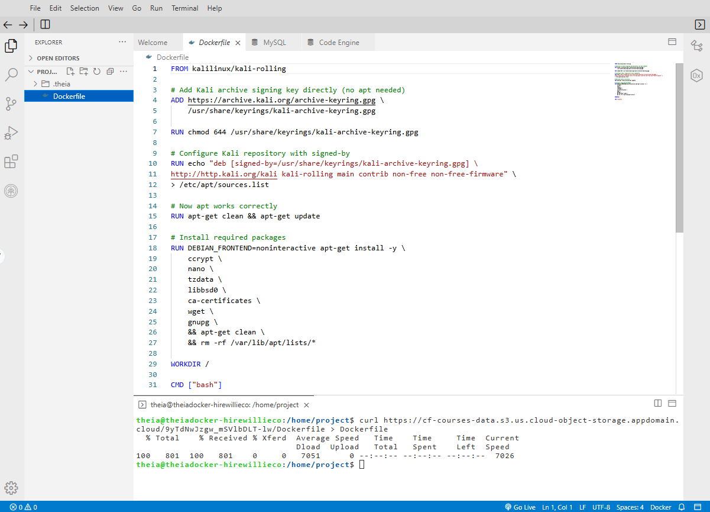

**What this does:** Downloads a pre-configured Dockerfile that contains instructions for building a Kali Linux container with Nmap and other tools.

### Step 3: Build the Docker Image

Build the Dockerfile in the current directory:

```bash
docker build . -t kalilinux
```

![Build Docker image]

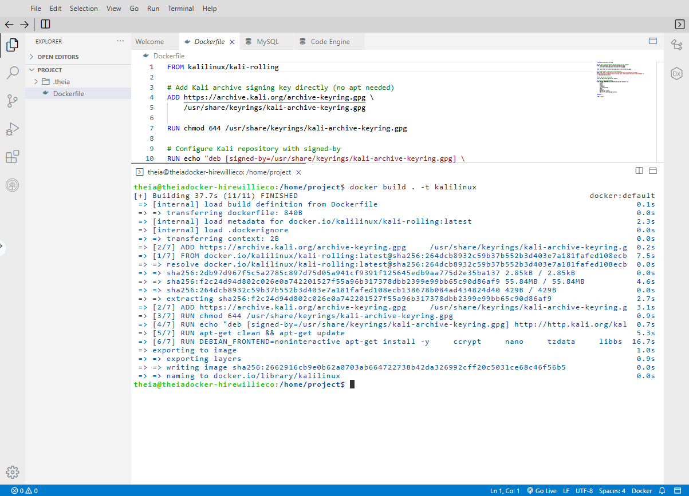

**What this does:** Creates a Docker image named `kalilinux` based on the Dockerfile you downloaded. This may take a few minutes as it downloads the base Kali Linux image.

### Step 4: Run the Kali Linux Container

Run Kali Linux from the Docker image with an interactive shell:

```bash
docker run --tty --interactive kalilinux
```

![Run Kali Linux container]

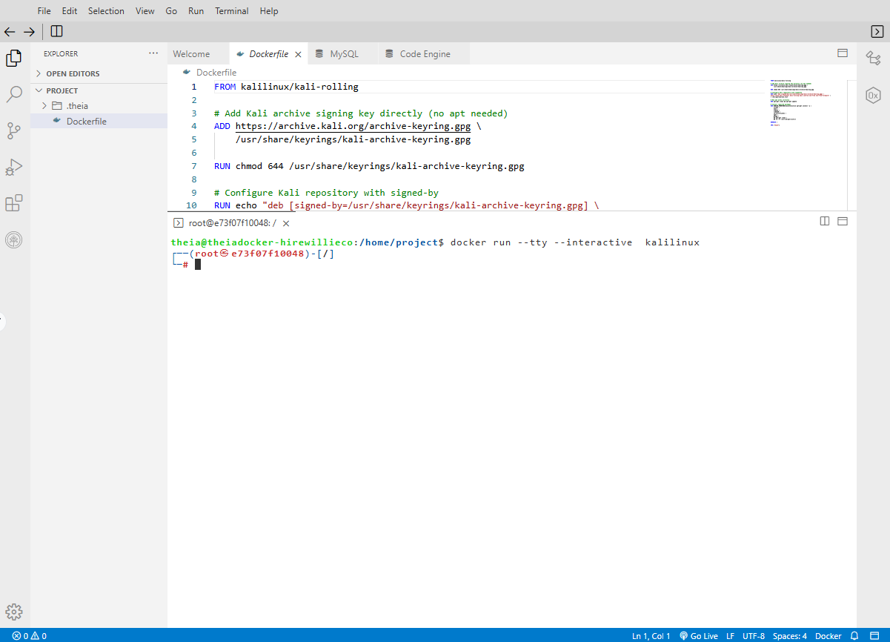

**What this does:** Starts an interactive virtual Kali Linux environment. Your terminal prompt will change to the Kali Linux shell.

```
┌─────────────────────────────────────────────────────────────────────────────┐
│                     KALI LINUX CONTAINER STARTED                            │
│                                                                              │
│   You are now inside a Kali Linux environment. Any files you create here    │
│   will exist only as long as this container is running.                     │
│                                                                              │
│   Your prompt should look similar to:                                        │
│   root@container-id:~#                                                       │
│                                                                              │
└─────────────────────────────────────────────────────────────────────────────┘
```

**Note:** Any files you create in this environment will exist only until you exit the virtual environment. When you close the container, all changes are lost.

---

## Exercise 2: Install Nmap

In this exercise, you will install Nmap inside the Kali Linux container.

### Step 1: Update Package Lists

Run the following command to update the package lists:

```bash
apt-get update
```

![apt-get update]

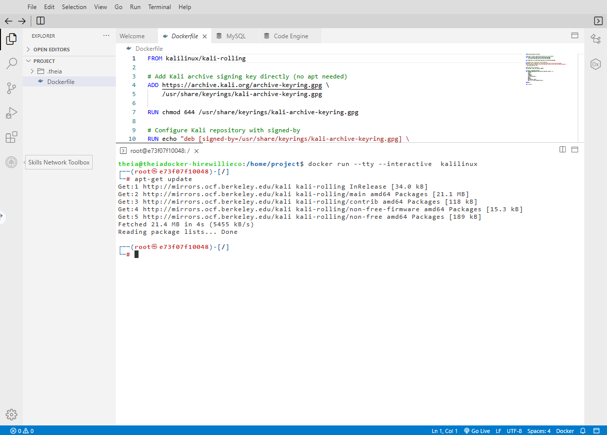

**What this does:** Updates the list of available packages and their versions from the Kali Linux repositories.

### Step 2: Install Nmap

Run the following command to install Nmap:

```bash
apt-get install -y nmap
```

![Install Nmap]

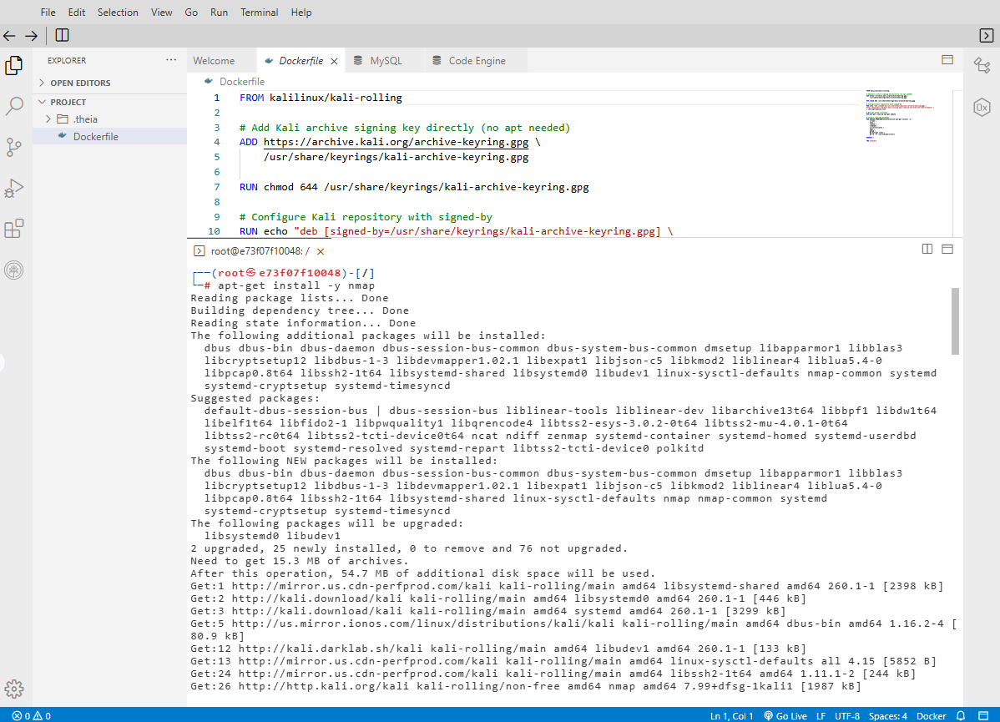

**What this does:** Downloads and installs Nmap and its dependencies. The `-y` flag automatically answers "yes" to any prompts.

The installation will take a few seconds to complete. You will see output similar to:

```
Reading package lists... Done
Building dependency tree... Done
Reading state information... Done
The following NEW packages will be installed:
  nmap
...
Setting up nmap (7.94+git20240320-1) ...
```

### Step 3: Verify Nmap Installation

Check that Nmap was installed correctly:

```bash
nmap --version
```

![Nmap version]


**Expected output:** Nmap version information (e.g., `Nmap version 7.94`)

---

## Exercise 3: Run Port Scan

In this exercise, you will run a basic port scan against a test target.

### Step 1: Scan scanme.nmap.org

Run the following command to scan `scanme.nmap.org` (Nmap's official test host):

```bash
nmap scanme.nmap.org
```

![Basic Nmap scan]

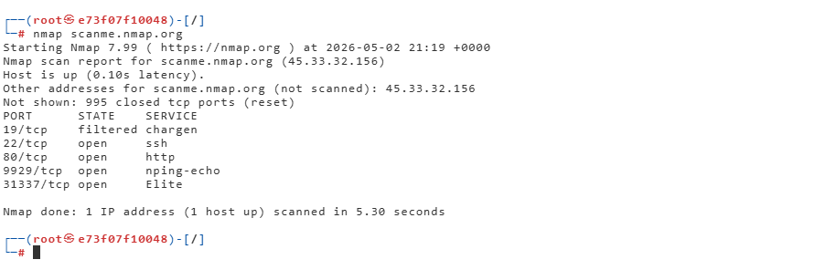

**What this does:** Performs a default SYN scan on the target, scanning the 1000 most common ports.

**About scanme.nmap.org:** This is a test server operated by Nmap developers specifically for practicing scanning techniques. It is authorized for port scanning.

### Step 2: Analyze the Results

The scan results will show open ports, services, and their states.

**Example output:**

```
Starting Nmap 7.94 ( https://nmap.org ) at 2024-01-15 14:30 UTC
Nmap scan report for scanme.nmap.org (45.33.32.156)
Host is up (0.24s latency).
Not shown: 996 closed tcp ports (reset)
PORT      STATE    SERVICE
22/tcp    open     ssh
80/tcp    open     http
9929/tcp  open     nping-echo
31337/tcp open     Elite

Nmap done: 1 IP address (1 host up) scanned in 8.42 seconds
```

### Step 3: Interpret Port States

| State                | Description                                                        | Security Implication                     |
| :------------------- | :----------------------------------------------------------------- | :--------------------------------------- |
| **open**       | A service is listening on this port                                | Potential attack vector; needs hardening |
| **closed**     | No service listening; port is reachable                            | Lower risk                               |
| **filtered**   | Firewall is blocking access; Nmap cannot determine if port is open | May indicate security controls           |
| **unfiltered** | Port is reachable but cannot determine if open or closed           | Requires further investigation           |

### Step 4: Document Your Findings

Record the results of your scan:

```
┌─────────────────────────────────────────────────────────────────────────────┐
│                          PORT SCAN RESULTS                                   │
│                       Target: scanme.nmap.org                                │
└─────────────────────────────────────────────────────────────────────────────┘

Scan Date: _________________________
Scan Command: nmap scanme.nmap.org

OPEN PORTS FOUND:
─────────────────────────────────────────────────────────────────────────────
PORT     STATE    SERVICE
_______  ______   _______
_______  ______   _______
_______  ______   _______
_______  ______   _______

CLOSED/FILTERED PORTS OF NOTE:
─────────────────────────────────────────────────────────────────────────────
PORT     STATE    SERVICE
_______  ______   _______
_______  ______   _______
_______  ______   _______
```

---

## Exercise 4: Advanced Nmap Scans

Now that you have mastered the basic scan, try these advanced scan types.

### Step 1: Scan Specific Ports

Scan only specific ports (e.g., port 22 and 80):

```bash
nmap -p 22,80 scanme.nmap.org
```

![Scan specific ports]

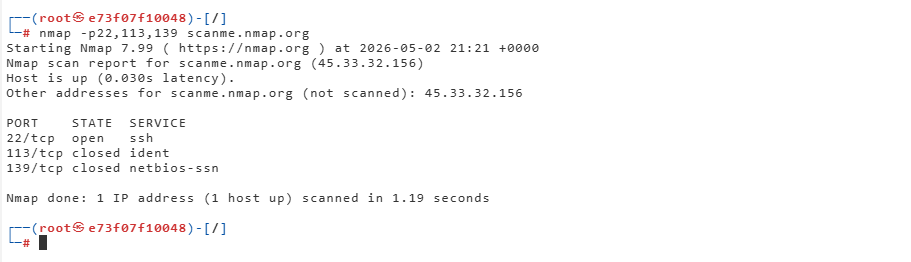

### Step 2: Service Version Detection

Detect service versions running on open ports:

```bash
nmap -sV scanme.nmap.org
```

![Service version detection]


**Why this matters:** Knowing the exact version helps identify known vulnerabilities.

### Step 3: Fast Scan (Top 100 Ports)

Perform a faster scan by checking only the top 100 ports:

```bash
nmap -F scanme.nmap.org
```

![Fast scan]

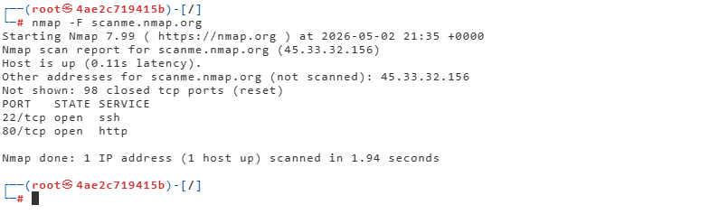

### Step 4: OS Detection

Attempt to identify the target's operating system:

```bash
nmap -O scanme.nmap.org
```

![OS detection]

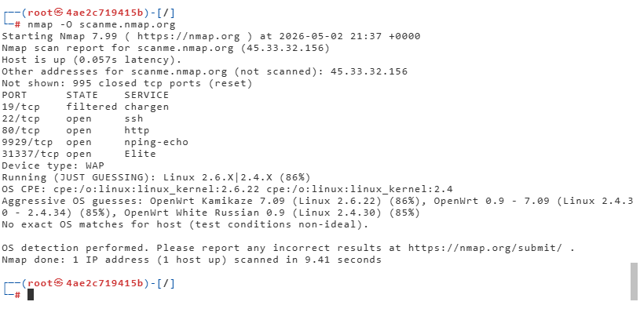

**Note:** OS detection requires root privileges and may not always be accurate.

### Step 5: Aggressive Scan

Run an aggressive scan (enables OS detection, version detection, script scanning, and traceroute):

```bash
nmap -A scanme.nmap.org
```

![Aggressive scan]

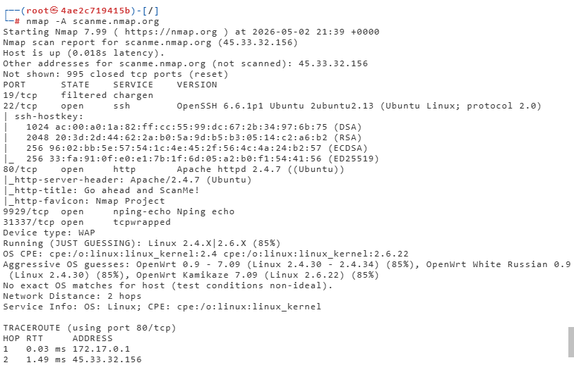

**Warning:** Aggressive scans generate more network traffic and are more likely to be detected by intrusion detection systems.

---

## Exercise 5: Understanding Scan Output

### Analyzing Scan Results

After running your scans, answer these questions:

**Q1:** How many open ports did you find on scanme.nmap.org?

```
Your answer:
_________________________________________________________________________
```

**Q2:** What services are running on the open ports? Include version numbers if available.

```
Your answer:
_________________________________________________________________________
_________________________________________________________________________
```

**Q3:** Based on the service versions, what potential vulnerabilities might exist?

```
Your answer:
_________________________________________________________________________
_________________________________________________________________________
```

**Q4:** Why is it important to know which ports are open on your systems?

```
Your answer:
_________________________________________________________________________
_________________________________________________________________________
```

---

## Common Nmap Commands Reference

| Task                                  | Command                          |
| :------------------------------------ | :------------------------------- |
| **Basic scan**                  | `nmap <target>`                |
| **Scan specific ports**         | `nmap -p 22,80,443 <target>`   |
| **Scan port range**             | `nmap -p 1-1000 <target>`      |
| **Scan all ports**              | `nmap -p- <target>`            |
| **Service version detection**   | `nmap -sV <target>`            |
| **OS detection**                | `nmap -O <target>`             |
| **Aggressive scan**             | `nmap -A <target>`             |
| **Fast scan (top 100 ports)**   | `nmap -F <target>`             |
| **UDP scan**                    | `nmap -sU <target>`            |
| **Ping sweep (discover hosts)** | `nmap -sn <network>/24`        |
| **Save output to file**         | `nmap -oN output.txt <target>` |
| **Scan with timing (faster)**   | `nmap -T4 <target>`            |
| **Script scan**                 | `nmap -sC <target>`            |

---

## Exercise 6: Clean Up (Optional)

### Step 1: Exit the Kali Linux Container

When you have finished your scan, exit the container:

```bash
exit
```

![Exit container]

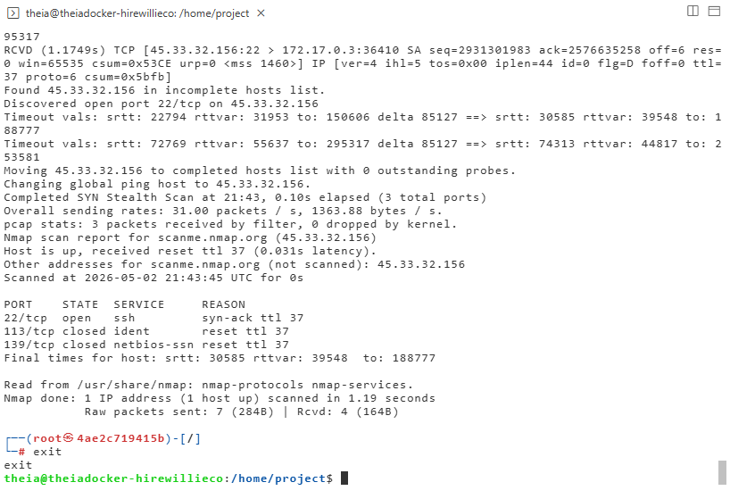

### Step 2: Remove the Container (Optional)

To remove the stopped container:

```bash
docker ps -a
docker rm <container-id>
```

---

## Ethical Use Reminder

```
┌─────────────────────────────────────────────────────────────────────────────┐
│                           IMPORTANT DISCLAIMER                              │
├─────────────────────────────────────────────────────────────────────────────┤
│                                                                              │
│  Port scanning should ONLY be performed on:                                 │
│  • Systems you own                                                          │
│  • Systems you have explicit written permission to test                     │
│  • Authorized testing targets (like scanme.nmap.org)                        │
│                                                                              │
│  Unauthorized scanning may:                                                 │
│  • Violate computer fraud laws                                              │
│  • Violate terms of service                                                 │
│  • Result in legal consequences                                             │
│  • Get your IP address blocked                                              │
│                                                                              │
│  scanme.nmap.org is provided by Nmap developers specifically for            │
│  practicing scanning techniques. This is the ONLY target you should         │
│  scan without additional permission.                                        │
│                                                                              │
└─────────────────────────────────────────────────────────────────────────────┘
```

---

## Lab Completion Checklist

| Task                                                                    | Completed |
| :---------------------------------------------------------------------- | :-------- |
| **Exercise 1: Set Up Kali Linux**                                 | ☐        |
| Opened new terminal                                                     | ☐        |
| Downloaded Dockerfile with curl                                         | ☐        |
| Built Docker image (`docker build . -t kalilinux`)                    | ☐        |
| Ran Kali Linux container (`docker run --tty --interactive kalilinux`) | ☐        |
| **Exercise 2: Install Nmap**                                      | ☐        |
| Ran `apt-get update`                                                  | ☐        |
| Ran `apt-get install -y nmap`                                         | ☐        |
| Verified installation with `nmap --version`                           | ☐        |
| **Exercise 3: Run Port Scan**                                     | ☐        |
| Ran `nmap scanme.nmap.org`                                            | ☐        |
| Analyzed and documented results                                         | ☐        |
| **Exercise 4: Advanced Scans**                                    | ☐        |
| Ran specific port scan (`-p 22,80`)                                   | ☐        |
| Ran service version detection (`-sV`)                                 | ☐        |
| Ran fast scan (`-F`)                                                  | ☐        |
| Ran OS detection (`-O`) (optional)                                    | ☐        |
| Ran aggressive scan (`-A`) (optional)                                 | ☐        |
| **Exercise 5: Understanding Results**                             | ☐        |
| Answered analysis questions                                             | ☐        |
| **Exercise 6: Clean Up**                                          | ☐        |
| Exited container with `exit`                                          | ☐        |

---

## Screenshot Checklist

| Screenshot        | File Name                      | Description                            |
| :---------------- | :----------------------------- | :------------------------------------- |
| Docker Build      | `Nmap_Docker_Build.png`      | Building the Kali Linux Docker image   |
| Container Running | `Nmap_Container_Running.png` | Kali Linux container interactive shell |
| Nmap Install      | `Nmap_Install.png`           | Installing Nmap with apt-get           |
| Nmap Version      | `Nmap_Version.png`           | Output of `nmap --version`           |
| Basic Scan        | `Nmap_Basic_Scan.png`        | Results of `nmap scanme.nmap.org`    |
| Service Detection | `Nmap_Service_Detection.png` | Results of `nmap -sV`                |
| Fast Scan         | `Nmap_Fast_Scan.png`         | Results of `nmap -F`                 |

---

## Troubleshooting Tips

| Issue                              | Solution                                                          |
| :--------------------------------- | :---------------------------------------------------------------- |
| **Docker command not found** | Ensure Docker is installed; check with `docker --version`       |
| **curl command failed**      | Check internet connection; try downloading manually               |
| **docker build fails**       | Ensure Dockerfile is in current directory (`ls` to check)       |
| **apt-get update fails**     | Check container has internet access; restart container            |
| **nmap command not found**   | Ensure installation completed successfully                        |
| **Scan takes too long**      | Use `-F` for fast scan or `-T4` for faster timing             |
| **Permission denied errors** | Run with `sudo` if needed (not typically required in container) |

---

## Key Takeaways

| Concept                           | Description                                              |
| :-------------------------------- | :------------------------------------------------------- |
| **Nmap**                    | Open-source network discovery and security auditing tool |
| **Port Scanning**           | Identifying open network ports on a target system        |
| **Open Port**               | A service is listening; potential attack vector          |
| **Service Detection (-sV)** | Identifies software and version running on open ports    |
| **OS Detection (-O)**       | Attempts to identify target operating system             |
| **Aggressive Scan (-A)**    | Enables OS, version, script, and traceroute              |
| **scanme.nmap.org**         | Authorized test target for practicing Nmap               |
| **Ethical Scanning**        | Only scan systems you own or have permission to test     |

---

## Summary

In this hands-on lab, you have:

| Activity                                                | Completed |
| :------------------------------------------------------ | :-------- |
| Set up a Kali Linux container using Docker              | ✓        |
| Installed Nmap inside the Kali Linux environment        | ✓        |
| Ran a basic port scan against an authorized test target | ✓        |
| Performed advanced scans including service detection    | ✓        |
| Analyzed and interpreted port scan results              | ✓        |
| Learned essential Nmap commands for security testing    | ✓        |

---

## Congratulations!

You have successfully completed the **Port Scanning with Nmap** lab. You now know how to:

- Set up a Kali Linux environment using Docker
- Install Nmap on a Linux system
- Run basic and advanced port scans
- Detect service versions and operating systems
- Interpret scan results
- Identify potential vulnerabilities from open ports

These skills are essential for:

- Penetration testers and ethical hackers
- Network security administrators
- System administrators
- Security analysts
- Anyone responsible for vulnerability assessment

---

## Additional Resources

| Resource                             | URL                        |
| :----------------------------------- | :------------------------- |
| **Nmap Official Website**      | https://nmap.org           |
| **Nmap Documentation**         | https://nmap.org/docs.html |
| **Nmap Network Scanning Book** | https://nmap.org/book/     |
| **scanme.nmap.org**            | https://scanme.nmap.org    |
| **Docker Documentation**       | https://docs.docker.com    |
| **Kali Linux**                 | https://www.kali.org       |
