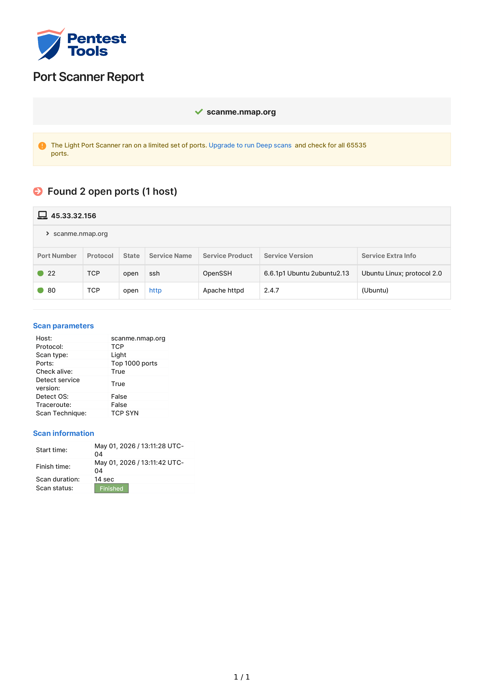
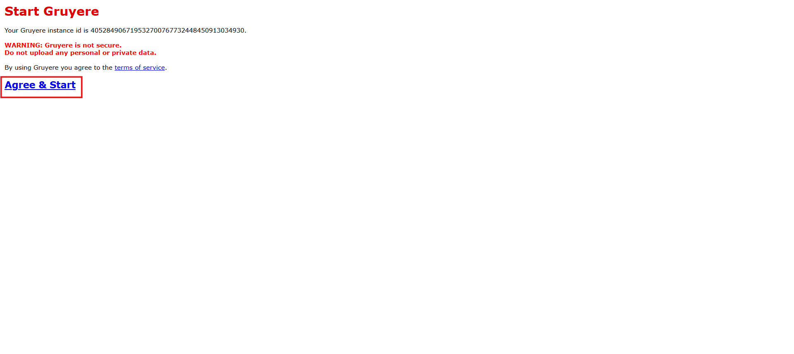
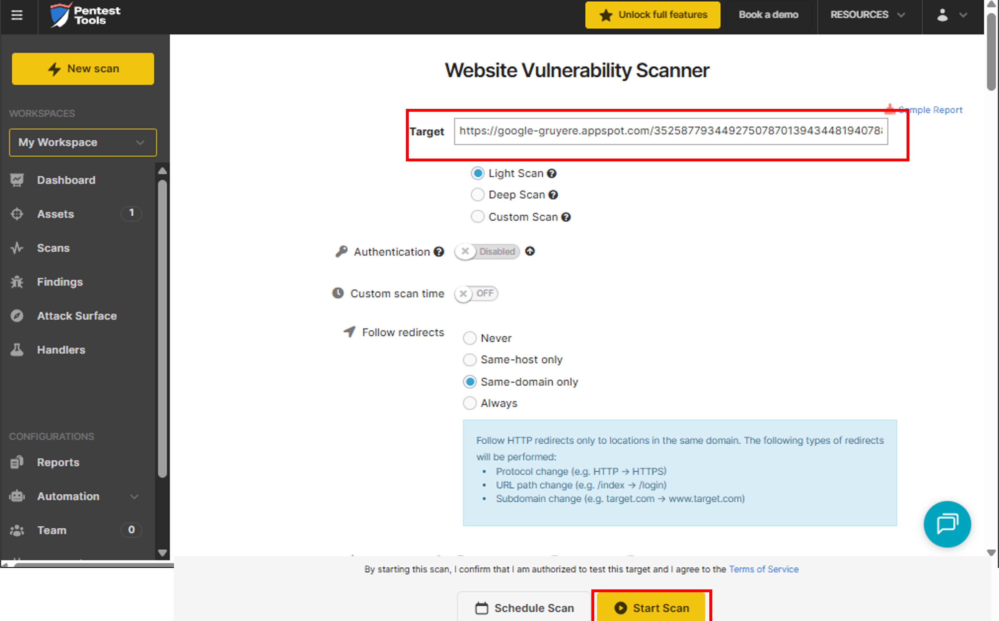
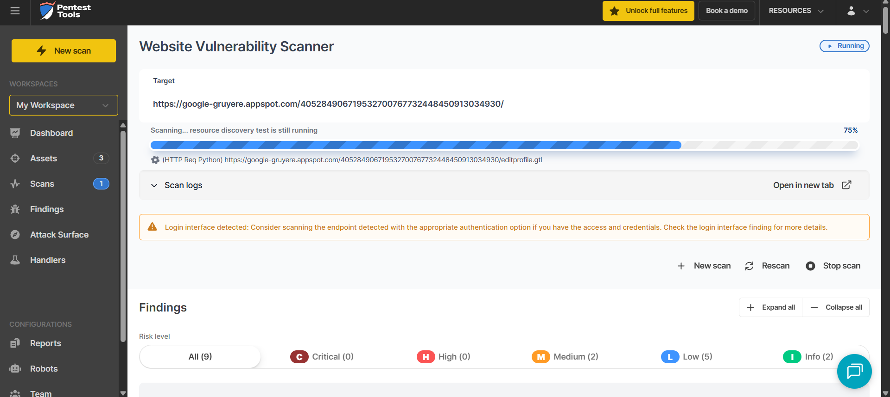
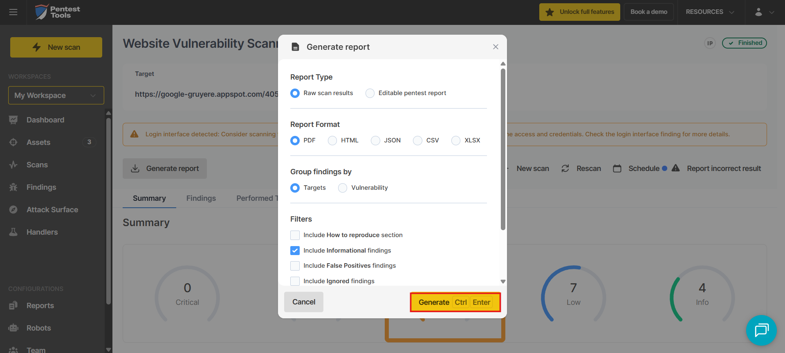
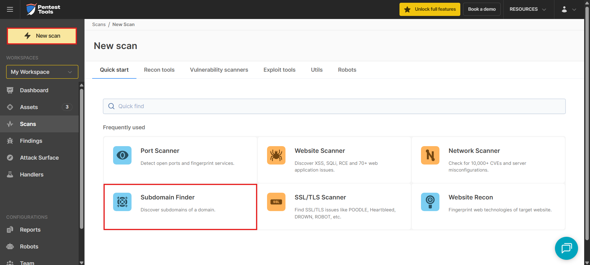
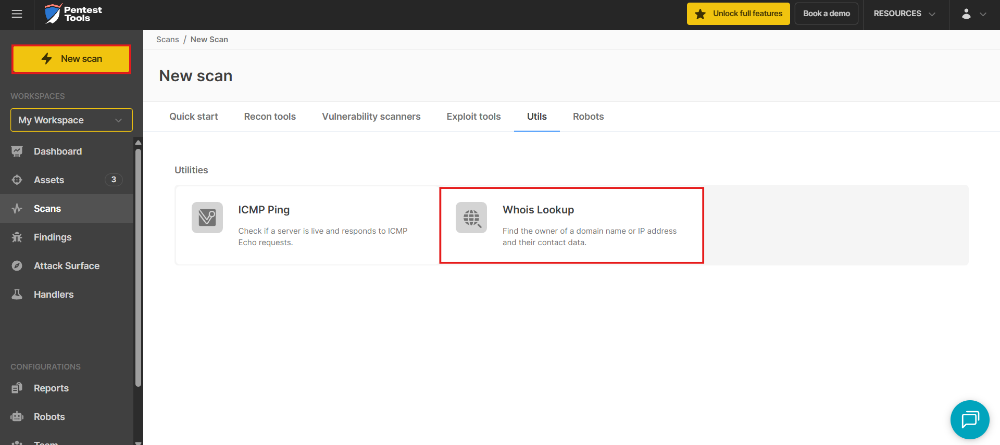

# Lab: Port Scanning with Pen-test Tools

**Estimated time needed:** 45 minutes

---

## About This Lab

In this lab, we will perform a port scan and a website scan using online penetration tools. **Pentest-tools.com** is a cloud-based penetration testing platform that provides security scanning and vulnerability assessment services. This hands-on lab will teach you how to use professional-grade security tools without installing any software on your local machine.

---

## Learning Objectives

In this hands-on lab, you will:

| # | Objective                                   |
| - | ------------------------------------------- |
| 1 | Create an account on Pentest-tools.com      |
| 2 | Perform a port scan on a target system      |
| 3 | Analyze port scan results                   |
| 4 | Perform a website vulnerability scan        |
| 5 | Interpret scan findings and recommendations |

---

## Important Notices About This Lab

### About Lab Sessions

Lab sessions are **not persisted**. This means that every time you connect to this lab, a new environment is created for you. Any data or files you saved in a previous session are no longer available. To avoid losing your data, plan to complete these tasks in a single session.

### About the Lab Instructions

The Pentest-tools.com interface may change over time. Your screens might look slightly different than what you see in the screenshots, but the core functionality should remain similar.

### Ethical Use Warning

```
┌─────────────────────────────────────────────────────────────────────────────┐
│                           IMPORTANT DISCLAIMER                              │
├─────────────────────────────────────────────────────────────────────────────┤
│                                                                              │
│  Port scanning and vulnerability scanning should ONLY be performed on:      │
│  • Systems you own                                                           │
│  • Systems you have explicit written permission to test                      │
│  • Authorized penetration testing targets                                    │
│                                                                              │
│  Scanning unauthorized systems may:                                          │
│  • Violate computer fraud laws                                               │
│  • Violate terms of service                                                  │
│  • Result in legal consequences                                              │
│  • Get your IP address blocked                                               │
│                                                                              │
│  In this lab, you will scan test targets or your own systems with           │
│  permission.                                                                 │
│                                                                              │
└─────────────────────────────────────────────────────────────────────────────┘
```

---

## Understanding Port Scanning

### What is a Port Scan?

A port scan is a technique used to identify which network ports on a system are open, closed, or filtered. Each open port represents a potential entry point or service that could be exploited if not properly secured.

| Port State               | Description                             | Security Implication                           |
| :----------------------- | :-------------------------------------- | :--------------------------------------------- |
| **Open**           | A service is listening on this port     | Potential attack vector; needs hardening       |
| **Closed**         | No service listening; port is reachable | Lower risk but may open if services start      |
| **Filtered**       | Firewall or filter is blocking access   | May hide services; indicates security controls |
| **Open\|Filtered** | Cannot determine if open or filtered    | Requires further investigation                 |

### Common Ports and Services

| Port | Protocol | Service    | Security Risk                      |
| :--- | :------- | :--------- | :--------------------------------- |
| 21   | TCP      | FTP        | Unencrypted file transfer          |
| 22   | TCP      | SSH        | Secure shell (critical to secure)  |
| 23   | TCP      | Telnet     | Unencrypted (highly insecure)      |
| 25   | TCP      | SMTP       | Email (spam relay risk)            |
| 80   | TCP      | HTTP       | Unencrypted web traffic            |
| 110  | TCP      | POP3       | Email (unencrypted)                |
| 143  | TCP      | IMAP       | Email (unencrypted)                |
| 443  | TCP      | HTTPS      | Encrypted web traffic              |
| 3389 | TCP      | RDP        | Remote desktop (high-value target) |
| 3306 | TCP      | MySQL      | Database (SQL injection risk)      |
| 5432 | TCP      | PostgreSQL | Database                           |

---

## Exercise 1: Create an Account on Pentest-tools.com

In this exercise, you will create a free account on Pentest-tools.com to access the scanning tools.

### Step 1: Navigate to Pentest-tools.com

1. Open your web browser
2. Copy and paste the following URL into the address bar:

```
https://pentest-tools.com
```

3. Press **Enter**

![Pentest-tools homepage]


### Step 2: Click Login

1. Locate the **Log in** button at the top-right corner of the page
2. Click **Log in**

![Login button]


### Step 3: Create a New Account

1. Look for **Need an account?** link
2. Click **Sign in here** (or similar link to create an account)

![Need an account link]


### Step 4: Accept Terms and Conditions

1. Select the checkbox: **I agree to the Terms of Service and Privacy Policy**
2. Enter your email address in the provided field
3. Create a password (meet the minimum requirements)

![Sign up form]


### Step 5: Complete Registration

1. Click the **Sign Up** or **Create Account** button
2. Check your email for a verification link
3. Click the verification link to activate your account
4. Log in with your new credentials

### Step 6: Navigate to the Dashboard

After logging in, you will see the Pentest-tools.com dashboard.

![Dashboard]


---

## Exercise 2: Perform a Port Scan

In this exercise, you will perform a port scan on a target system. For this lab, you will scan a test target provided by Pentest-tools.com or a system you own.

### Step 1: Start a New Scan

1. At the top of the page, click on **New Scan**

![New Scan button]


### Step 2: Select Port Scan Tool

1. From the list of available tools, find **Port Scan**
2. Click on **Port Scan** or **Start Scan**

![Port Scan selection]


### Step 3: Configure Port Scan Settings

1. In the **Target** field, enter a target to scan:

**For testing (choose one):**

| Target Type          | Example                | Notes                                  |
| :------------------- | :--------------------- | :------------------------------------- |
| Test target          | `scanme.nmap.org`    | Nmap's official test host (authorized) |
| Your own system      | Your public IP address | Only if you own it                     |
| Local network device | `192.168.1.1`        | Only with permission                   |

2. Select the **Scan Type**:

| Scan Type               | Ports Scanned   | Speed       |
| :---------------------- | :-------------- | :---------- |
| **Quick Scan**    | Top 100 ports   | Fastest     |
| **Standard Scan** | Top 1000 ports  | Recommended |
| **Full Scan**     | All 65535 ports | Slowest     |

3. (Optional) Click **Advanced Options** to customize:

   - Specific port ranges
   - TCP vs UDP scanning
   - Service detection

![Port scan configuration]


### Step 4: Start the Scan

1. Click the **Start Scan** button
2. Wait for the scan to complete (this may take 1-5 minutes depending on settings)

![Scan in progress]


### Step 5: Review Port Scan Results

After the scan completes, you will see a report similar to this:

```
┌─────────────────────────────────────────────────────────────────────────────┐
│                          PORT SCAN RESULTS                                   │
│                        Target: scanme.nmap.org                               │
└─────────────────────────────────────────────────────────────────────────────┘

OPEN PORTS FOUND:
─────────────────────────────────────────────────────────────────────────────
PORT     STATE    SERVICE     VERSION
22/tcp   open     ssh         OpenSSH 7.4
80/tcp   open     http        Apache httpd 2.4.6
443/tcp  open     https       Apache httpd 2.4.6

FILTERED PORTS:
─────────────────────────────────────────────────────────────────────────────
PORT     STATE    SERVICE
21/tcp   filtered ftp
25/tcp   filtered smtp
...

SCAN SUMMARY:
─────────────────────────────────────────────────────────────────────────────
Scan Type:     Standard Scan (Top 1000 ports)
Start Time:    2024-01-15 14:30:00
Duration:      2 minutes 15 seconds
Total Hosts:   1
Open Ports:    3
Filtered:      47
Closed:        950
```

![Port scan results]


### Step 6: Analyze the Results

Answer the following questions about your scan:

**Q1:** How many open ports were discovered?

```
Your answer:
_________________________________________________________________________
```

**Q2:** What services are running on the open ports?

```
Your answer:
_________________________________________________________________________
```

**Q3:** Are there any high-risk ports open (e.g., Telnet port 23, FTP port 21)?

```
Your answer:
_________________________________________________________________________
```

**Q4:** What recommendations would you make based on these results?

```
Your answer:
_________________________________________________________________________
_________________________________________________________________________
_________________________________________________________________________
```

### Step 7: Export Scan Results

1. Look for an **Export** or **Download** button
2. Export results as PDF or CSV for documentation

![Export results]




---

## Exercise 3: Perform a Website Scan

In this exercise, you will perform a vulnerability scan on a website. This scan checks for common web application vulnerabilities including OWASP Top 10 risks.

### Step 1: Start a New Scan

1. Click on **New Scan** at the top of the page

### Step 2: Select Website Scanner

1. From the list of available tools, find **Website Scanner** or **Web Vulnerability Scanner**
2. Click on the tool to select it

![Website scanner selection]



### Step 3: Configure Website Scan Settings

1. In the **Target URL** field, enter a website to scan:

**For testing (choose one):**

| Target              | URL                                            | Notes                        |
| :------------------ | :--------------------------------------------- | :--------------------------- |
| Test target (OWASP) | `http://testphp.vulnweb.com`                 | OWASP test site (authorized) |
| Your own website    | Your website URL                               | Only with permission         |
| Local web server    | `http://localhost` or `http://192.168.1.x` | Only if you own it           |

2. Select **Scan Type**:

| Scan Type               | Depth          | Duration       |
| :---------------------- | :------------- | :------------- |
| **Quick Scan**    | Limited pages  | ~2-5 minutes   |
| **Standard Scan** | Moderate pages | ~10-20 minutes |
| **Deep Scan**     | Full crawl     | ~30-60 minutes |

![Website scan configuration]



### Step 4: Start the Scan

1. Click **Start Scan**
2. Monitor progress from the dashboard

![Website scan progress]



### Step 5: Review Website Scan Results

After the scan completes, you will see a vulnerability report:

```
┌─────────────────────────────────────────────────────────────────────────────┐
│                      WEBSITE VULNERABILITY SCAN RESULTS                     │
│                          Target: testphp.vulnweb.com                        │
└─────────────────────────────────────────────────────────────────────────────┘

VULNERABILITY SUMMARY:
─────────────────────────────────────────────────────────────────────────────
CRITICAL:    0
HIGH:        2
MEDIUM:      5
LOW:         8
INFO:        12

DETAILED FINDINGS:
─────────────────────────────────────────────────────────────────────────────
[HIGH] SQL Injection (CWE-89)
  Location: /artists.php?artist=1
  Description: The application fails to sanitize user input in the 'artist'
               parameter, allowing SQL injection attacks.
  Recommendation: Use parameterized queries/prepared statements.
  CVSS Score: 8.6

[MEDIUM] Cross-Site Scripting (XSS) (CWE-79)
  Location: /search.php?q=<script>
  Description: User input is reflected without proper encoding.
  Recommendation: Implement output encoding and input validation.
  CVSS Score: 6.1

[MEDIUM] Missing Security Headers
  Location: Entire application
  Description: Security headers (X-Frame-Options, CSP) are missing.
  Recommendation: Implement security headers to prevent clickjacking and XSS.
  CVSS Score: 5.3

[LOW] Information Disclosure
  Location: /phpinfo.php
  Description: PHP configuration information is publicly accessible.
  Recommendation: Remove or restrict access to phpinfo.php files.
  CVSS Score: 3.7
```

![Website scan results]


### Step 6: Interpret the Findings

Answer the following questions about your website scan:

**Q5:** What is the highest severity vulnerability found?

```
Your answer:
_________________________________________________________________________
```

**Q6:** What type of vulnerability is most common in your scan results?

```
Your answer:
_________________________________________________________________________
```

**Q7:** What remediation steps are recommended for the most critical finding?

```
Your answer:
_________________________________________________________________________
_________________________________________________________________________
_________________________________________________________________________
```

**Q8:** Which OWASP Top 10 categories are represented in your findings?

```
Your answer:
_________________________________________________________________________
_________________________________________________________________________
_________________________________________________________________________
```

### Step 7: Generate a Report

1. Click **Generate Report**
2. Select report format (PDF recommended)
3. Download the report

![Generate report]



---

## Exercise 4: Additional Penetration Testing Tools

Pentest-tools.com offers many additional tools. Explore these as time permits:

### Available Tools

| Tool                        | Purpose                            | Use Case                          |
| :-------------------------- | :--------------------------------- | :-------------------------------- |
| **Subdomain Scanner** | Find subdomains of a target        | Expanded attack surface discovery |
| **DNS Lookup**        | Query DNS records                  | Information gathering             |
| **WHOIS Lookup**      | Find domain registration info      | Reconnaissance                    |
| **SSL/TLS Scanner**   | Check SSL configuration            | Certificate validation            |
| **CMS Detect**        | Identify Content Management System | Technology fingerprinting         |
| **WordPress Scanner** | Scan WP for vulnerabilities        | CMS-specific testing              |
| **XSS Scanner**       | Test for XSS vulnerabilities       | Web app testing                   |
| **SQLi Scanner**      | Test for SQL injection             | Database security testing         |

### Step 1: Try a Subdomain Scan

1. Click **New Scan**
2. Select **Subdomain Scanner**
3. Enter a target domain (e.g., `example.com`)
4. Start the scan

![Subdomain scanner]



### Step 2: Try a WHOIS Lookup

1. Click **New Scan**
2. Select **WHOIS Lookup**
3. Enter a domain name
4. Review registration information

![WHOIS lookup]



---

## Exercise 5: Understanding Scan Results

### Interpreting Port Scan Findings

| Finding                         | Implication                     | Recommended Action                             |
| :------------------------------ | :------------------------------ | :--------------------------------------------- |
| **Port 22 (SSH) open**    | Remote administration available | Use key authentication; disable password login |
| **Port 80 (HTTP) open**   | Web server running              | Redirect to HTTPS; keep patched                |
| **Port 443 (HTTPS) open** | Encrypted web traffic           | Ensure valid SSL cert; use TLS 1.2+            |
| **Port 21 (FTP) open**    | File transfer service           | Migrate to SFTP (SSH) or FTPS                  |
| **Port 23 (Telnet) open** | Unencrypted remote access       | CRITICAL - disable immediately                 |
| **Port 3389 (RDP) open**  | Remote desktop                  | Restrict access; use VPN; enable NLA           |

### Interpreting Web Scan Findings

| Vulnerability                      | Risk     | Remediation                             |
| :--------------------------------- | :------- | :-------------------------------------- |
| **SQL Injection**            | Critical | Parameterized queries, input validation |
| **XSS**                      | High     | Output encoding, CSP headers            |
| **CSRF**                     | Medium   | Anti-CSRF tokens                        |
| **Security Headers Missing** | Medium   | Add HSTS, CSP, X-Frame-Options          |
| **Info Disclosure**          | Low      | Remove sensitive files, error handling  |
| **Old Software Version**     | Varies   | Update to latest version                |

---

## Lab Completion Checklist

| Task                                     | Completed |
| :--------------------------------------- | :-------- |
| **Exercise 1: Account Creation**   | ☐        |
| Navigated to Pentest-tools.com           | ☐        |
| Created a new account                    | ☐        |
| Verified email and logged in             | ☐        |
| **Exercise 2: Port Scan**          | ☐        |
| Started a new scan                       | ☐        |
| Selected Port Scan tool                  | ☐        |
| Configured scan target (scanme.nmap.org) | ☐        |
| Started and completed port scan          | ☐        |
| Reviewed and analyzed results            | ☐        |
| Exported scan results                    | ☐        |
| **Exercise 3: Website Scan**       | ☐        |
| Selected Website Scanner                 | ☐        |
| Configured target (testphp.vulnweb.com)  | ☐        |
| Started and completed website scan       | ☐        |
| Reviewed vulnerability findings          | ☐        |
| Generated and downloaded report          | ☐        |
| **Exercise 4: Additional Tools**   | ☐        |
| Tried Subdomain Scanner (optional)       | ☐        |
| Tried WHOIS Lookup (optional)            | ☐        |
| **Documentation**                  | ☐        |
| Answered all analysis questions          | ☐        |
| Screenshots captured                     | ☐        |

---

## Screenshot Checklist

| Screenshot                 | File Name                    | Description                |
| :------------------------- | :--------------------------- | :------------------------- |
| Account Created            | `PT_Account_Created.png`   | Dashboard after login      |
| Port Scan Configuration    | `PT_Port_Scan_Config.png`  | Scan settings before start |
| Port Scan Results          | `PT_Port_Scan_Results.png` | Open ports and services    |
| Website Scan Configuration | `PT_Web_Scan_Config.png`   | Website scan settings      |
| Website Scan Results       | `PT_Web_Scan_Results.png`  | Vulnerability findings     |
| Report Export              | `PT_Report_Export.png`     | Generated report           |

---

## Troubleshooting Tips

| Issue                                             | Solution                                         |
| :------------------------------------------------ | :----------------------------------------------- |
| **Cannot create account**                   | Try different email; check spam for verification |
| **Scan takes too long**                     | Choose Quick Scan instead of Full Scan           |
| **Target not responding**                   | Target may be down; try scanme.nmap.org          |
| **Website scan reports no vulnerabilities** | Some sites are secure; try test target           |
| **Free account limitations**                | Free tier may have scan limits; use test targets |
| **Results differ from screenshots**         | Tools update; focus on understanding concepts    |

---

## Port Scanning Commands Reference (Alternative Tools)

If you want to try these techniques locally, here are equivalent commands using **Nmap** (free, open-source):

### Basic Nmap Commands

```bash
# Scan top 100 ports
nmap --top-ports 100 scanme.nmap.org

# Scan specific ports
nmap -p 22,80,443 scanme.nmap.org

# Scan port range
nmap -p 1-1000 scanme.nmap.org

# Service detection
nmap -sV scanme.nmap.org

# OS detection
nmap -O scanme.nmap.org

# Aggressive scan (OS, version, script)
nmap -A scanme.nmap.org

# Save results to file
nmap -oN scan_results.txt scanme.nmap.org
```

### Installing Nmap

| Operating System                | Command                                      |
| :------------------------------ | :------------------------------------------- |
| **Windows**               | Download from https://nmap.org/download.html |
| **Linux (Debian/Ubuntu)** | `sudo apt install nmap`                    |
| **macOS**                 | `brew install nmap`                        |

---

## Key Takeaways

| Concept                          | Description                                                     |
| :------------------------------- | :-------------------------------------------------------------- |
| **Port Scanning**          | Identifies open ports and running services on a target          |
| **Website Scanning**       | Identifies web application vulnerabilities                      |
| **Pentest-tools.com**      | Cloud-based penetration testing platform                        |
| **Open Ports**             | Potential attack vectors that need security hardening           |
| **Service Detection**      | Identifies software versions to check for known vulnerabilities |
| **Vulnerability Severity** | Critical, High, Medium, Low, Info levels                        |
| **Remediation**            | Actions to fix identified vulnerabilities                       |

---

## Summary

In this hands-on lab, you have:

| Activity                                          | Completed |
| :------------------------------------------------ | :-------- |
| Created an account on Pentest-tools.com           | ✓        |
| Performed a port scan on a test target            | ✓        |
| Analyzed port scan results (open ports, services) | ✓        |
| Performed a website vulnerability scan            | ✓        |
| Reviewed and interpreted vulnerability findings   | ✓        |
| Generated and exported scan reports               | ✓        |
| Explored additional pentesting tools              | ✓        |

---

## Congratulations!

You have successfully completed the **Port Scanning with Pen-test Tools** lab. You now know how to:

- Create an account on Pentest-tools.com
- Configure and perform port scans
- Analyze port scan results to identify open services
- Configure and perform website vulnerability scans
- Interpret vulnerability findings
- Generate professional security reports
- Understand basic Nmap commands for local scanning

These skills are essential for:

- Penetration testers and ethical hackers
- Security analysts
- System administrators
- Network security professionals
- Anyone responsible for vulnerability assessment

---

## Additional Resources

| Resource                             | URL                                                       |
| :----------------------------------- | :-------------------------------------------------------- |
| **Pentest-tools.com**          | https://pentest-tools.com                                 |
| **Nmap Official Website**      | https://nmap.org                                          |
| **OWASP Testing Guide**        | https://owasp.org/www-project-web-security-testing-guide/ |
| **Nmap Network Scanning Book** | https://nmap.org/book/                                    |
| **CVE Database**               | https://cve.mitre.org                                     |
