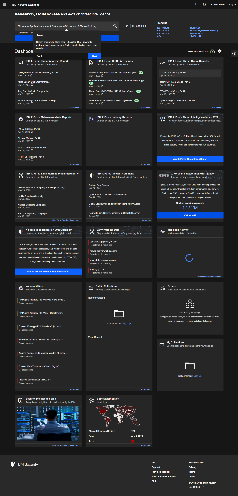
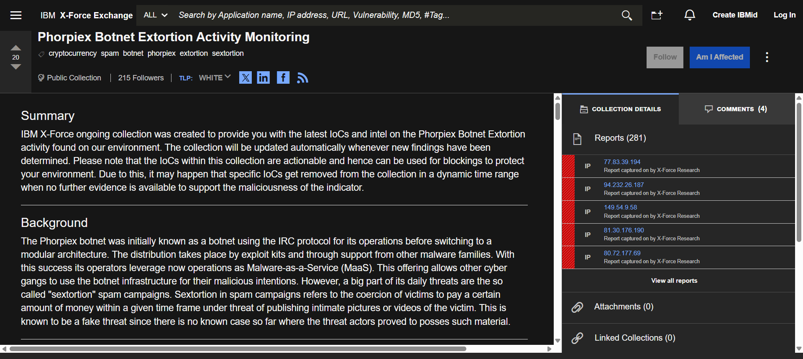
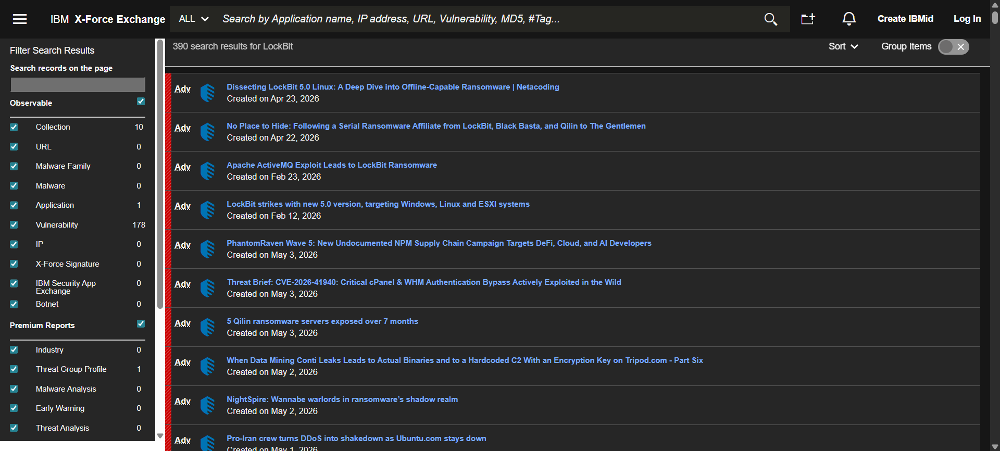
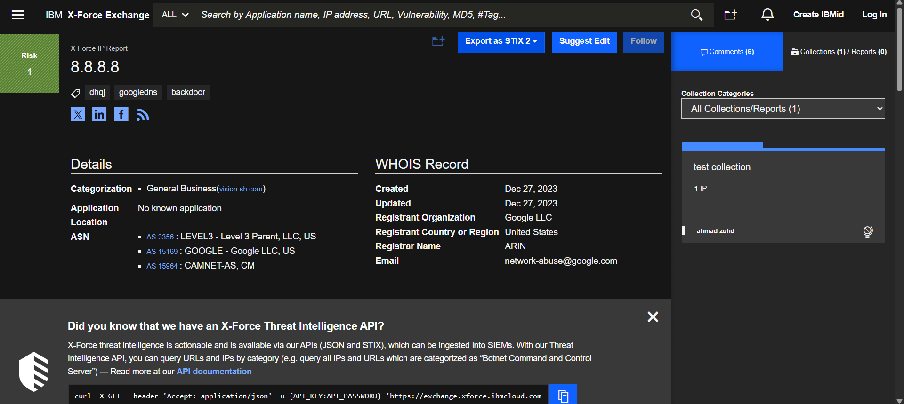
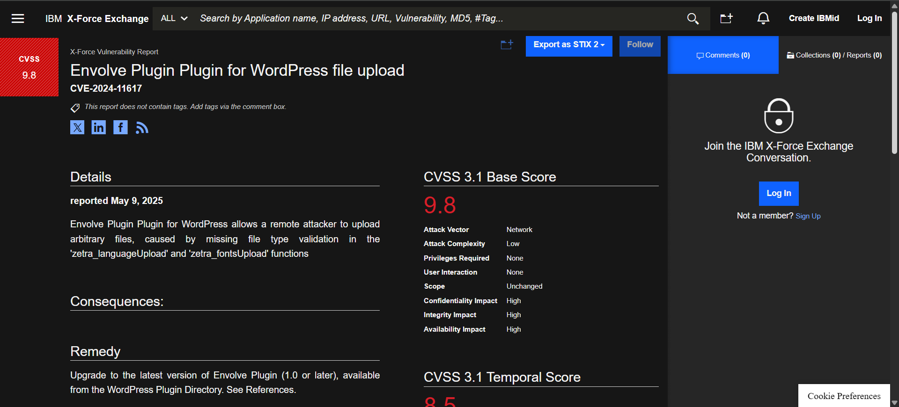
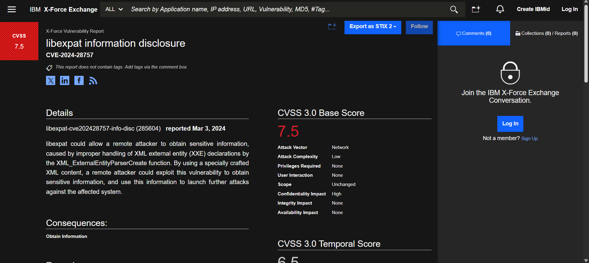

# Lab: Review X-Force Exchange Threat Reports

**Estimated time:** 15 minutes

---

## Introduction

**IBM X-Force Exchange** is a threat intelligence sharing platform. It provides insights into global security threats, access to trends, methods used by threat actors, and a vast repository of threat intelligence data.

This lab will guide you through exploring the platform, understanding the types of information available, and learning about CVE numbers.

---

## Purpose of IBM X-Force Exchange

The site provides detailed reports on:

| Threat Type               | Description                                                      |
| :------------------------ | :--------------------------------------------------------------- |
| **Vulnerabilities** | Known security flaws with CVE numbers, descriptions, and impacts |
| **Malware**         | Analysis of malicious software, behavior, and IOCs               |
| **Cyberthreats**    | Information on attack patterns, threat actors, and methods       |

These reports can be used for **understanding** and **mitigating** security threats.

---

## Learning Objectives

After completing this lab, you will be able to:

| # | Objective                                                       |
| - | --------------------------------------------------------------- |
| 1 | Explore the IBM X-Force Exchange site to understand its purpose |
| 2 | Analyze the type of information available on the platform       |
| 3 | Understand how to use threat intelligence information           |
| 4 | Explain the concept of CVE numbers                              |

---

## What is Threat Intelligence?

Threat intelligence is evidence-based knowledge about existing or emerging threats that can be used to inform security decisions.

```
┌─────────────────────────────────────────────────────────────────────────────┐
│                    THREAT INTELLIGENCE LIFECYCLE                             │
├─────────────────────────────────────────────────────────────────────────────┤
│                                                                              │
│   ┌─────────────┐    ┌─────────────┐    ┌─────────────┐    ┌─────────────┐  │
│   │  Direction  │───►│ Processing  │───►│  Analysis   │───►│ Dissemination│  │
│   │  (Collect)  │    │  (Normalize) │    │  (Evaluate) │    │  (Share)    │  │
│   └─────────────┘    └─────────────┘    └─────────────┘    └──────┬──────┘  │
│                                                                    │         │
│                                                                    ▼         │
│                                                             ┌─────────────┐  │
│                                                             │  Feedback   │  │
│                                                             │  (Improve)  │  │
│                                                             └─────────────┘  │
│                                                                              │
└─────────────────────────────────────────────────────────────────────────────┘
```

---

## Exercise 1: Navigating the Homepage

### Step 1: Visit IBM X-Force Exchange

Open your web browser and navigate to:

```
https://exchange.xforce.ibmcloud.com/
```

![X-Force Exchange homepage]



### Step 2: Explore the Homepage Sections

Take a few moments to explore the homepage. You will notice different sections:

| Section                             | Description                                    |
| :---------------------------------- | :--------------------------------------------- |
| **Threat Intelligence Index** | Overview of global threat activity             |
| **Industry Reports**          | Threat intelligence specific to industries     |
| **Collections**               | Curated sets of threat indicators              |
| **Recent Activity**           | Latest threat reports and updates              |
| **Top Indicators**            | Most frequently reported malicious IPs/domains |

![X-Force homepage sections]



### Step 3: Navigation Options

| Navigation Element        | Purpose                                      |
| :------------------------ | :------------------------------------------- |
| **Search Bar**      | Look up specific threats, CVEs, IPs, domains |
| **Dashboard**       | High-level overview of threat intelligence   |
| **Reports**         | Browse detailed threat reports               |
| **Collections**     | View curated threat intelligence sets        |
| **Indicators**      | Search for specific IOCs                     |
| **Vulnerabilities** | Browse CVE database                          |
| **Contribute**      | Submit your own threat intelligence          |

---

## Exercise 2: Searching for Information

### Step 1: Use the Search Bar

The search bar is the primary way to find specific threat intelligence. You can search for:

| Search Type              | Example                 | What You'll Find                                 |
| :----------------------- | :---------------------- | :----------------------------------------------- |
| **CVE Number**     | `CVE-2024-11617`      | Vulnerability details, affected systems, patches |
| **Malware Name**   | `Emotet`, `LockBit` | Malware analysis, IOCs, behavior                 |
| **IP Address**     | `8.8.8.8`             | Reputation, associated threats                   |
| **Domain**         | `malicious-site.com`  | Domain reputation, related threats               |
| **Hash (MD5/SHA)** | `a1b2c3...`           | File analysis, known malware                     |

### Step 2: Search for a Recent Malware

Try searching for a well-known malware:

```
LockBit
```

or

```
Emotet
```

![Malware search]



### Step 3: Search for an IP Address

Try searching for an IP address to check its reputation:

```
8.8.8.8
```

**Note:** This is Google's DNS and should show a clean reputation.

![IP search]



---

## Exercise 3: Understanding the Information

### Types of Information Available

| Report Type                           | Content                                                        | Use Case                        |
| :------------------------------------ | :------------------------------------------------------------- | :------------------------------ |
| **Threat Intelligence Reports** | Detailed analysis of specific threats, attacker methods, tools | Understanding attack techniques |
| **Vulnerability Reports**       | CVE numbers, descriptions, impacts, CVSS scores                | Prioritizing patching efforts   |
| **Malware Analysis**            | Behavior, IOCs, mitigation strategies                          | Detecting and blocking malware  |
| **Collections**                 | Curated sets of related IOCs                                   | Threat hunting                  |

### Threat Intelligence Report Components

When you open a threat report, look for:

| Component            | Description                                     |
| :------------------- | :---------------------------------------------- |
| **Summary**    | Overview of the threat                          |
| **Risk Score** | Severity rating (0-10)                          |
| **Indicators** | IPs, domains, hashes associated with the threat |
| **Tags**       | Categorization (e.g., #Ransomware #Phishing)    |
| **References** | External links and sources                      |
| **Timeline**   | When the threat was first and last seen         |

---

## Exercise 4: Exploring CVE Numbers

### What are CVE Numbers?

**CVE** stands for **Common Vulnerabilities and Exposures**. It is a list of publicly disclosed computer security flaws.

```
┌─────────────────────────────────────────────────────────────────────────────┐
│                         CVE NUMBER FORMAT                                    │
├─────────────────────────────────────────────────────────────────────────────┤
│                                                                              │
│   CVE-2024-12345                                                            │
│   │    │    │                                                               │
│   │    │    └─── Unique 5+ digit identifier for the vulnerability          │
│   │    └──────── Year the CVE was assigned                                  │
│   └───────────── CVE prefix (Common Vulnerabilities and Exposures)          │
│                                                                              │
│   Example:                                                                   │
│   • CVE-2021-44228 - Log4Shell (Apache Log4j)                               │
│   • CVE-2017-0144 - EternalBlue (SMB vulnerability)                         │
│   • CVE-2014-0160 - Heartbleed (OpenSSL)                                    │
│                                                                              │
└─────────────────────────────────────────────────────────────────────────────┘
```

### CVE Entry Components

| Component               | Description                                     |
| :---------------------- | :---------------------------------------------- |
| **CVE ID**        | Unique identifier (e.g., CVE-2024-12345)        |
| **Description**   | Brief explanation of the vulnerability          |
| **References**    | Links to advisories, patch information          |
| **Assigning CNA** | The CVE Numbering Authority that issued the CVE |

### Importance of CVE Numbers

| Benefit                   | Description                                                     |
| :------------------------ | :-------------------------------------------------------------- |
| **Standardization** | Common way to reference vulnerabilities across platforms        |
| **Communication**   | Enables security professionals to share information effectively |
| **Tracking**        | Helps organizations track which vulnerabilities affect them     |
| **Prioritization**  | CVSS scores help prioritize patching efforts                    |

---

## Exercise 5: Analyzing a CVE Report

### Step 1: Search for a CVE Number

In the top search bar, search for a specific CVE number:

```
CVE-2024-11617
```

or use a recent CVE from the news:

```
CVE-2024-28757
```

![CVE search]



### Step 2: Select a CVE Report

1. Click on a CVE report from your search results
2. Review the CVE details page

### Step 3: Identify Key Components of the Report

| Component                  | What to Look For                                              |
| :------------------------- | :------------------------------------------------------------ |
| **Description**      | What the vulnerability does and how it can be exploited       |
| **CVSS Score**       | Severity rating (Critical, High, Medium, Low)                 |
| **Attack Vector**    | How the vulnerability can be exploited (network, local, etc.) |
| **Affected Systems** | Which software/versions are vulnerable                        |
| **Remediation**      | How to fix or mitigate the vulnerability                      |
| **References**       | Links to vendor advisories, patches                           |

![CVE report details]



### Step 4: Analyze a Sample CVE Report

**Example: CVE-2024-28757 (hypothetical)**

| Field                       | Information                                                                        |
| :-------------------------- | :--------------------------------------------------------------------------------- |
| **CVE ID**            | CVE-2024-28757                                                                     |
| **Description**       | Buffer overflow vulnerability in web server component allows remote code execution |
| **CVSS Score**        | 9.8 (Critical)                                                                     |
| **Attack Vector**     | Network                                                                            |
| **Affected Versions** | Version 1.0.0 through 2.5.3                                                        |
| **Remediation**       | Upgrade to version 2.5.4 or apply vendor patch                                     |

### Step 5: Apply Critical Thinking

Think about how the information in the CVE report can be used to protect an organization's systems and data:

| Question                                                                | Your Answer |
| :---------------------------------------------------------------------- | :---------- |
| How would you identify if this vulnerability affects your organization? |             |
| What steps would you take to mitigate the risk?                         |             |
| How would you prioritize this vulnerability compared to others?         |             |

---

## X-Force Exchange Features Summary

| Feature                          | Description                                            |
| :------------------------------- | :----------------------------------------------------- |
| **Free Access**            | No subscription required for basic features            |
| **Guest Access**           | Use without creating an account                        |
| **Real-Time Intelligence** | Up-to-date threat information                          |
| **Community Driven**       | Shared intelligence from security professionals        |
| **IBM Curated Content**    | Verified threat intelligence from IBM X-Force research |
| **CVE Integration**        | Comprehensive vulnerability database                   |

---

## Key Information Icons

| Icon                 | Meaning                                    |
| :------------------- | :----------------------------------------- |
| 🔴**Critical** | CVSS 9.0-10.0 - Immediate action required  |
| 🟠**High**     | CVSS 7.0-8.9 - Prioritize investigation    |
| 🟡**Medium**   | CVSS 4.0-6.9 - Review and plan remediation |
| 🔵**Low**      | CVSS 0.1-3.9 - Monitor                     |
| ⚪**None**     | CVSS 0.0 - No risk                         |

---

## Lab Completion Checklist

| Task                                            | Completed |
| :---------------------------------------------- | :-------- |
| **Exercise 1: Navigating Homepage**       | ☐        |
| Visited X-Force Exchange website                | ☐        |
| Explored homepage sections                      | ☐        |
| Identified navigation options                   | ☐        |
| **Exercise 2: Searching for Information** | ☐        |
| Searched for a malware name                     | ☐        |
| Searched for an IP address                      | ☐        |
| **Exercise 3: Understanding Information** | ☐        |
| Identified types of available reports           | ☐        |
| Learned about report components                 | ☐        |
| **Exercise 4: Exploring CVE Numbers**     | ☐        |
| Understood CVE format                           | ☐        |
| Learned importance of CVEs                      | ☐        |
| **Exercise 5: Analyzing a CVE Report**    | ☐        |
| Searched for a CVE number                       | ☐        |
| Reviewed CVE details                            | ☐        |
| Identified key report components                | ☐        |

---

## Screenshot Checklist

| Screenshot       | File Name                     | Description                     |
| :--------------- | :---------------------------- | :------------------------------ |
| X-Force Homepage | `XForce_Homepage.png`       | Main landing page               |
| Search Results   | `XForce_Search_Results.png` | Results from malware/CVE search |
| CVE Report       | `XForce_CVE_Report.png`     | Detailed CVE analysis page      |

---

## Common X-Force Exchange Use Cases

| Use Case                           | How X-Force Helps                                    |
| :--------------------------------- | :--------------------------------------------------- |
| **Incident Response**        | Look up suspicious IPs/domains during investigations |
| **Threat Hunting**           | Search for IOCs across shared intelligence           |
| **Vulnerability Management** | Check CVE details and exploit status                 |
| **Security Monitoring**      | Enrich alerts with threat intelligence               |
| **Threat Research**          | Study malware families and attack patterns           |
| **Report Writing**           | Gather threat data for security assessments          |

---

## Troubleshooting Tips

| Issue                                 | Solution                                                |
| :------------------------------------ | :------------------------------------------------------ |
| **Website not loading**         | Check internet connection; try refreshing               |
| **Guest access not available**  | Clear browser cache; try incognito mode                 |
| **Search returning no results** | Try broader search terms; check spelling                |
| **Cannot find CVE details**     | Search by CVE number with dashes (e.g., CVE-2024-12345) |

---

## Key Takeaways

| Concept                       | Description                                                                   |
| :---------------------------- | :---------------------------------------------------------------------------- |
| **X-Force Exchange**    | IBM's collaborative threat intelligence platform                              |
| **Threat Intelligence** | Evidence-based knowledge about threats                                        |
| **CVE**                 | Common Vulnerabilities and Exposures - standardized vulnerability identifiers |
| **CVSS Score**          | Severity rating for vulnerabilities (0-10)                                    |
| **IOC**                 | Indicator of Compromise - evidence of potential attack                        |
| **Collections**         | Curated sets of threat indicators                                             |

---

## Test Your Knowledge

**Q1:** What does CVE stand for?

```
Your answer:
_________________________________________________________________________
```

**Q2:** What is the format of a CVE number?

```
Your answer:
_________________________________________________________________________
```

**Q3:** Name three types of information you can find on X-Force Exchange.

```
Your answer:
_________________________________________________________________________
```

**Q4:** What does the CVSS score indicate?

```
Your answer:
_________________________________________________________________________
```

**Q5:** How can X-Force Exchange help during an incident response?

```
Your answer:
_________________________________________________________________________
```

### Answer Key

| Q# | Answer                                                                              |
| -- | ----------------------------------------------------------------------------------- |
| 1  | Common Vulnerabilities and Exposures                                                |
| 2  | CVE-YYYY-XXXXX (Year followed by unique identifier)                                 |
| 3  | Threat reports, vulnerability reports, malware analysis, collections                |
| 4  | Severity rating of a vulnerability (0-10, higher = more severe)                     |
| 5  | By looking up suspicious IPs, domains, or hashes to determine if they are malicious |

---

## Additional Resources

| Resource                            | URL                                                                                                                   |
| :---------------------------------- | :-------------------------------------------------------------------------------------------------------------------- |
| **IBM X-Force Exchange**      | https://exchange.xforce.ibmcloud.com/                                                                                 |
| **IBM X-Force Documentation** | https://www.ibm.com/support/pages/using-ibm-x-force-exchange-xfe-portal-understand-threats-vulnerabilities-or-malware |
| **CVE Website**               | https://cve.mitre.org                                                                                                 |
| **NIST NVD**                  | https://nvd.nist.gov                                                                                                  |
| **IBM Security Intelligence** | https://securityintelligence.com/                                                                                     |

---

## Summary

In this lab, you have:

| Activity                                             | Completed |
| :--------------------------------------------------- | :-------- |
| Explored the IBM X-Force Exchange site               | ☐        |
| Learned about the purpose of threat intelligence     | ☐        |
| Searched for malware, IPs, and CVE numbers           | ☐        |
| Understood the concept and importance of CVE numbers | ☐        |
| Analyzed a CVE report and identified key components  | ☐        |
| Learned how to use threat intelligence for security  | ☐        |

---

## Congratulations!

You have successfully completed the **Review X-Force Exchange Threat Reports** lab. You now know how to:

- Navigate the IBM X-Force Exchange platform
- Search for threat intelligence in the platform
- Understand the types of information available
- Explain the purpose and format of CVE numbers
- Analyze CVE reports for vulnerability information
- Use threat intelligence to protect organizational assets

These skills are essential for:

- Security analysts investigating threats
- Incident response teams needing rapid IOC lookups
- Vulnerability management professionals
- Threat hunters and security researchers
- Organizations improving their threat intelligence capabilities
