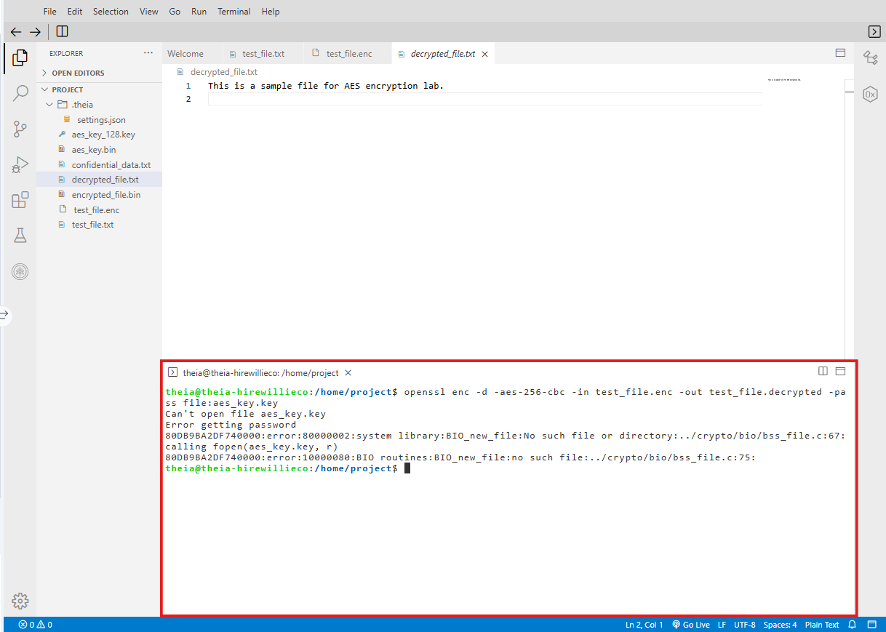

.png>)

# Lab: Symmetric Encryption Using AES

**Estimated time needed:** 30 minutes

---

## Overview

In this lab, you will learn how to use **OpenSSL** to encrypt files using the **AES (Advanced Encryption Standard)** symmetric encryption algorithm and decrypt them back to their original form. AES provides fast and secure encryption, widely used for protecting sensitive data.

AES is the current standard for symmetric encryption and is used by governments, financial institutions, and organizations worldwide to protect classified and sensitive information.

---

## Learning Objectives

After completing this lab, you will be able to:

| # | Objective                                                             |
| - | --------------------------------------------------------------------- |
| 1 | Generate a secret key for AES encryption                              |
| 2 | Encrypt files using AES encryption                                    |
| 3 | Decrypt files encrypted using AES                                     |
| 4 | Understand the difference between symmetric and asymmetric encryption |
| 5 | Use different AES modes (CBC, ECB, GCM)                               |

---

## Prerequisites (Optional)

| Requirement                  | Description                                     |
| :--------------------------- | :---------------------------------------------- |
| **Linux command line** | Familiarity with using the Linux command prompt |
| **OpenSSL**            | Preinstalled in the lab environment             |
| **Terminal access**    | For executing commands                          |

---

## What is AES Encryption?

**AES (Advanced Encryption Standard)** is a symmetric encryption algorithm, meaning the **same key** is used for both encryption and decryption.

```
┌─────────────────────────────────────────────────────────────────────────────┐
│                         AES SYMMETRIC ENCRYPTION                             │
├─────────────────────────────────────────────────────────────────────────────┤
│                                                                              │
│                      ┌─────────────────┐                                    │
│                      │   SECRET KEY    │                                    │
│                      │   (Same Key)    │                                    │
│                      └────────┬────────┘                                    │
│                               │                                             │
│              ┌────────────────┼────────────────┐                            │
│              │                 │                 │                          │
│              ▼                 ▼                 ▼                          │
│   ┌─────────────┐      ┌─────────────┐      ┌─────────────┐                │
│   │ Plaintext   │      │ Ciphertext  │      │ Plaintext   │                │
│   │ "Secret     │─────►│ 7F4E8C...   │─────►│ "Secret     │                │
│   │  Data"      │      │             │      │  Data"      │                │
│   └─────────────┘      └─────────────┘      └─────────────┘                │
│        SENDER              NETWORK              RECIPIENT                   │
│        (Encrypt)           (Secure?)           (Decrypt)                    │
│                                                                              │
└─────────────────────────────────────────────────────────────────────────────┘
```

### AES Key Sizes

| Key Size          | Bits     | Bytes    | Security Level | Use Case                |
| :---------------- | :------- | :------- | :------------- | :---------------------- |
| **AES-128** | 128 bits | 16 bytes | High           | General purpose         |
| **AES-192** | 192 bits | 24 bytes | Very High      | Government (secret)     |
| **AES-256** | 256 bits | 32 bytes | Extremely High | Government (top secret) |

### AES vs RSA

| Feature                  | AES (Symmetric)                               | RSA (Asymmetric)         |
| :----------------------- | :-------------------------------------------- | :----------------------- |
| **Number of Keys** | 1 (same for encrypt/decrypt)                  | 2 (public + private)     |
| **Speed**          | Very fast                                     | Slow                     |
| **Best For**       | Bulk data encryption                          | Key exchange, signatures |
| **Key Size**       | 128-256 bits                                  | 2048-4096 bits           |
| **Security**       | Extremely secure (when implemented correctly) | Very secure              |

---

## Initializing the Lab Environment

### Step 1: Open a New Terminal

**Method 1 - Using the Terminal menu:**

1. Click **Terminal** in the top menu
2. Select **New Terminal** from the drop-down menu

**Method 2 - Using the Getting Started section:**

1. Locate the Getting Started section
2. Click the link to open a new terminal

![Open new terminal AES]


### Step 2: Click New Terminal

After clicking **New Terminal**, a terminal window will open. You will enter all commands in this terminal.

![Terminal ready AES]


### Step 3: Verify OpenSSL Installation

Check that OpenSSL is installed and available:

```bash
openssl version
```

**Expected output:**

```
OpenSSL 3.0.2 15 Mar 2022 (Library: OpenSSL 3.0.2 15 Mar 2022)
```

![OpenSSL version AES]


---

## Step 1: Create a Test File

Before encrypting, create a sample text file to work with.

### Command

```bash
echo "This is a sample file for AES encryption lab." > test_file.txt
```

### Verify File Creation

```bash
cat test_file.txt
```

**Expected output:**

```
This is a sample file for AES encryption lab.
```

![Create test file AES]


### Create a Larger Test File (Optional)

For practice with larger files:

```bash
cat > confidential_data.txt << EOF
Customer Name: John Smith
Account Number: 1234-5678-9012-3456
SSN: XXX-XX-1234
Transaction Amount: \$10,000
Date: 2024-04-28
Approval Code: ABC-123-XYZ
EOF
```

```bash
cat confidential_data.txt
```


---

## Step 2: Generate a Secure AES Key

You can either generate a random key or use a password-based key.

### Method 1: Generate a Random AES-256 Key (32 bytes)

```bash
openssl rand -base64 32 > aes_key.key
```

**What this does:**

- `openssl rand` - Generate random data
- `-base64 32` - Output 32 bytes in base64 format
- `> aes_key.key` - Save to file

### Method 2: Generate a Random AES-128 Key (16 bytes)

```bash
openssl rand -base64 16 > aes_key_128.key
```

### View the Generated Key

```bash
cat aes_key.key
```

**Expected output (example - your key will be different):**

```
s8VJm2pQ9rT3uX5wY7zA1bC3dE5fG7hI
```

![Generate AES key]


### Method 3: Password-Based Key (Alternative)

Instead of a random key, you can derive a key from a password:

```bash
# This will prompt you for a password
openssl enc -aes-256-cbc -k mypassword -P
```


---

## Step 3: Encrypt the File Using AES

Now encrypt the test file using the AES key you generated.

### Basic AES Encryption Command

```bash
openssl enc -aes-256-cbc -salt -in test_file.txt -out test_file.enc -pass file:aes_key.key
```

### Command Breakdown

| Parameter                  | Description                          |
| :------------------------- | :----------------------------------- |
| `openssl enc`            | OpenSSL symmetric encryption command |
| `-aes-256-cbc`           | AES with 256-bit key in CBC mode     |
| `-salt`                  | Add random salt (increases security) |
| `-in test_file.txt`      | Input file (plaintext)               |
| `-out test_file.enc`     | Output file (encrypted)              |
| `-pass file:aes_key.key` | Use key from `aes_key.key` file    |


### Alternative: Direct Password Encryption (No Key File)

```bash
openssl enc -aes-256-cbc -salt -in test_file.txt -out test_file.enc -k mypassword
```

This will prompt you to enter and verify a password.


### Alternative: Base64 Encoded Output

To make the encrypted output readable (base64 encoded):

```bash
openssl enc -aes-256-cbc -a -salt -in test_file.txt -out test_file_base64.enc -pass file:aes_key.key
```

The `-a` flag tells OpenSSL to base64-encode the output.

![AES encryption]


### Verify Encrypted File

```bash
ls -la test_file*
```

**Expected output:**

```
-rw-r--r-- 1 user user  42 Apr 28 10:00 test_file.txt
-rw-r--r-- 1 user user  80 Apr 28 10:00 test_file.enc
```

Notice the encrypted file is larger due to salt and padding.


### View Encrypted Content

```bash
cat test_file.enc
```

The encrypted file will appear as **gibberish** (binary data):

```
Salt__�z�M���%t�Y...
```

![View encrypted AES]


---

## Step 4: Decrypt the Encrypted File

### Basic AES Decryption Command

```bash
openssl enc -d -aes-256-cbc -in test_file.enc -out test_file.decrypted -pass file:aes_key.key
```

### Command Breakdown

| Parameter                    | Description                        |
| :--------------------------- | :--------------------------------- |
| `-d`                       | Decryption mode                    |
| `-aes-256-cbc`             | Same algorithm used for encryption |
| `-in test_file.enc`        | Input file (encrypted)             |
| `-out test_file.decrypted` | Output file (decrypted plaintext)  |
| `-pass file:aes_key.key`   | Same key used for encryption       |


### Alternative: Decrypt Base64 Encrypted File

If you used the `-a` flag during encryption:

```bash
openssl enc -d -aes-256-cbc -a -in test_file_base64.enc -out test_file_base64.decrypted -pass file:aes_key.key
```

![AES decryption]




### Verify Decrypted Content

```bash
cat test_file.decrypted
```

**Expected output:**

```
This is a sample file for AES encryption lab.
```

![Verify decrypted AES]


### Verify Original and Decrypted Match

```bash
diff test_file.txt test_file.decrypted
```

No output means the files are identical—successful decryption!

---

## Step 5: Try Different AES Modes

AES supports different **modes of operation**. Each mode has different properties.

### CBC Mode (Cipher Block Chaining) - Default/Recommended

```bash
openssl enc -aes-256-cbc -salt -in test_file.txt -out test_file_cbc.enc -pass file:aes_key.key
```

**Characteristics:**

- Each ciphertext block depends on all previous plaintext blocks
- Requires an Initialization Vector (IV)
- Most commonly used mode

### ECB Mode (Electronic Codebook) - NOT RECOMMENDED for sensitive data

```bash
openssl enc -aes-256-ecb -salt -in test_file.txt -out test_file_ecb.enc -pass file:aes_key.key
```

**Characteristics:**

- Same plaintext block produces same ciphertext block
- Patterns can be visible in encrypted data
- **Not secure for most applications**

### GCM Mode (Galois/Counter Mode) - Authenticated Encryption

```bash
openssl enc -aes-256-gcm -salt -in test_file.txt -out test_file_gcm.enc -pass file:aes_key.key
```

**Characteristics:**

- Provides both encryption and authentication
- Detects if ciphertext has been tampered with
- Recommended for modern applications

```
┌─────────────────────────────────────────────────────────────────────────────┐
│                    AES MODES OF OPERATION                                    │
├─────────────────────────────────────────────────────────────────────────────┤
│                                                                              │
│   MODE     │ Security  │ Parallel │ Authentication │ Best Use              │
│   ─────────┼───────────┼──────────┼────────────────┼──────────────────────│
│   ECB      │ Low       │ Yes      │ No             │ Never (except legacy) │
│   CBC      │ High      │ No       │ No             │ General purpose       │
│   GCM      │ High      │ Yes      │ Yes            │ Recommended           │
│   CTR      │ High      │ Yes      │ No             │ Random access         │
│                                                                              │
└─────────────────────────────────────────────────────────────────────────────┘
```

---

## Step 6: Encrypt Multiple Files

### Create Multiple Test Files

```bash
echo "File 1: Customer data" > file1.txt
echo "File 2: Financial records" > file2.txt
echo "File 3: Employee information" > file3.txt
```


### Encrypt All .txt Files

```bash
for file in *.txt; do
    openssl enc -aes-256-cbc -salt -in "$file" -out "$file.enc" -pass file:aes_key.key
done
```

### Verify Encrypted Files

```bash
ls -la *.enc
```


---

## Step 7: Secure Key Management and Clean Up

### Securely Delete Sensitive Files

```bash
# Securely delete plaintext files
shred -u test_file.txt
shred -u test_file.decrypted

# Delete encrypted files (if no longer needed)
rm -f test_file.enc

# Keep the key file for future decryption
# Or delete it if no longer needed:
# shred -u aes_key.key
```

### List Remaining Files

```bash
ls -la
```

---

## Complete Command Summary

| Operation                           | Command                                                                                           |
| :---------------------------------- | :------------------------------------------------------------------------------------------------ |
| **Generate AES-256 key**      | `openssl rand -base64 32 > aes_key.key`                                                         |
| **Create test file**          | `echo "message" > test_file.txt`                                                                |
| **Encrypt with AES**          | `openssl enc -aes-256-cbc -salt -in test_file.txt -out test_file.enc -pass file:aes_key.key`    |
| **Decrypt with AES**          | `openssl enc -d -aes-256-cbc -in test_file.enc -out test_file.decrypted -pass file:aes_key.key` |
| **Verify decryption**         | `cat test_file.decrypted`                                                                       |
| **Base64 encrypted output**   | Add `-a` flag to encrypt command                                                                |
| **Use different mode**        | Change `-aes-256-cbc` to `-aes-256-gcm` or `-aes-256-ecb`                                   |
| **Password-based encryption** | Replace `-pass file:key` with `-k password`                                                   |

---

## Lab Completion Checklist

| Step                     | Task                                        | Completed |
| :----------------------- | :------------------------------------------ | :-------- |
| **Initialization** | Opened new terminal                         | ☐        |
| **Step 1**         | Created test file (test_file.txt)           | ☐        |
| **Step 2**         | Generated AES-256 key                       | ☐        |
| **Step 3**         | Encrypted file using AES-256-CBC            | ☐        |
| **Step 4**         | Decrypted file successfully                 | ☐        |
| **Step 5**         | Verified decrypted content matches original | ☐        |
| **Optional**       | Tried different AES modes (CBC, ECB, GCM)   | ☐        |
| **Optional**       | Encrypted multiple files                    | ☐        |
| **Cleanup**        | (Optional) Securely deleted sensitive files | ☐        |

---

## Screenshot Checklist

| Screenshot       | File Name                  | Description                        |
| :--------------- | :------------------------- | :--------------------------------- |
| Create Test File | `AES_Create_File.png`    | Test file creation and content     |
| Generate Key     | `AES_Generate_Key.png`   | AES key generation                 |
| Encrypt File     | `AES_Encrypt.png`        | Encryption command and result      |
| View Encrypted   | `AES_View_Encrypted.png` | Encrypted file content (gibberish) |
| Decrypt File     | `AES_Decrypt.png`        | Decryption command                 |
| Verify Decrypted | `AES_Verify.png`         | Decrypted content matches original |
| Different Mode   | `AES_GCM_Mode.png`       | Using GCM mode (optional)          |

---

## Troubleshooting Guide

| Issue                          | Possible Cause           | Solution                                 |
| :----------------------------- | :----------------------- | :--------------------------------------- |
| `openssl: command not found` | OpenSSL not installed    | Run `sudo apt install openssl`         |
| `bad decrypt` error          | Wrong key or password    | Ensure same key/password is used         |
| `error reading input file`   | File doesn't exist       | Check filename with `ls`               |
| `unsupported mode`           | Mode not available       | Use `aes-256-cbc` or `aes-256-gcm`   |
| `salt too short`             | Corrupted encrypted file | Re-encrypt original file                 |
| Key file not found             | Wrong path               | Use full path or check current directory |

---

## Security Best Practices

| Best Practice                 | Description                                    |
| :---------------------------- | :--------------------------------------------- |
| **Use AES-256**         | Use 256-bit keys for maximum security          |
| **Use GCM mode**        | Provides authentication (detects tampering)    |
| **Always use salt**     | Prevents rainbow table attacks                 |
| **Secure key storage**  | Store keys in secure location (HSM, key vault) |
| **Key rotation**        | Change encryption keys periodically            |
| **Secure deletion**     | Use `shred` to delete plaintext files        |
| **Never hardcode keys** | Never put keys directly in source code         |

---

## Test Your Knowledge

**Q1:** What is the key size of AES-256?

```
Your answer:
_________________________________________________________________________
```

**Q2:** Why is ECB mode not recommended for encrypting sensitive data?

```
Your answer:
_________________________________________________________________________
_________________________________________________________________________
```

**Q3:** What does the `-salt` parameter do in AES encryption?

```
Your answer:
_________________________________________________________________________
```

**Q4:** What is the difference between symmetric and asymmetric encryption?

```
Your answer:
_________________________________________________________________________
_________________________________________________________________________
```

**Q5:** Which AES mode provides both encryption and authentication?

```
Your answer:
_________________________________________________________________________
```

### Answer Key

| Q# | Answer                                                                                               |
| -- | ---------------------------------------------------------------------------------------------------- |
| 1  | 256 bits (32 bytes)                                                                                  |
| 2  | ECB mode produces the same ciphertext for identical plaintext blocks, revealing patterns in the data |
| 3  | Salt adds random data to prevent rainbow table and precomputation attacks                            |
| 4  | Symmetric uses one key for encrypt/decrypt; Asymmetric uses public/private key pair                  |
| 5  | GCM (Galois/Counter Mode)                                                                            |

---

## Key Takeaways

| Concept                        | Description                                                          |
| :----------------------------- | :------------------------------------------------------------------- |
| **AES**                  | Advanced Encryption Standard - current symmetric encryption standard |
| **Symmetric Encryption** | Same key for encryption and decryption                               |
| **AES-256**              | 256-bit key - recommended for sensitive data                         |
| **CBC Mode**             | Cipher Block Chaining - secure, widely used                          |
| **GCM Mode**             | Galois/Counter Mode - authenticated encryption (recommended)         |
| **Salt**                 | Random data added to encryption to strengthen security               |
| **Key Management**       | Proper storage and handling of encryption keys                       |

---

## Additional Resources

| Resource                               | URL                                                      |
| :------------------------------------- | :------------------------------------------------------- |
| **OpenSSL Documentation**        | https://www.openssl.org/docs/                            |
| **AES Specification (NIST)**     | https://csrc.nist.gov/publications/detail/fips/197/final |
| **NIST Recommendations for AES** | https://csrc.nist.gov/projects/block-cipher-techniques   |
| **OpenSSL Cookbook**             | https://www.feistyduck.com/library/openssl-cookbook/     |

---

## Summary

In this lab, you have:

| Activity                                          | Completed |
| :------------------------------------------------ | :-------- |
| Generated an AES-256 encryption key               | ☐        |
| Created a test file with sample data              | ☐        |
| Encrypted the file using AES-256-CBC              | ☐        |
| Decrypted the file using the same key             | ☐        |
| Verified decrypted content matches original       | ☐        |
| Learned about different AES modes (CBC, ECB, GCM) | ☐        |
| Practiced secure key management                   | ☐        |

---

## Congratulations!

You have successfully completed the **Symmetric Encryption Using AES** lab. You now know how to:

- Generate AES encryption keys
- Encrypt files using AES with OpenSSL
- Decrypt files using AES with OpenSSL
- Use different AES modes (CBC, GCM, ECB)
- Understand why AES is more secure than DES
- Apply symmetric encryption to protect sensitive data

These skills are essential for:

- Protecting sensitive files and data at rest
- Securing configuration files and credentials
- Implementing encryption in applications
- Understanding modern cryptographic standards
- Preparing for security certifications (CISSP, Security+, etc.)

---

**Next Steps:** Practice encrypting different file types (images, PDFs) and try using password-based encryption instead of key files. Then learn about hybrid encryption (AES + RSA) for secure key exchange.
