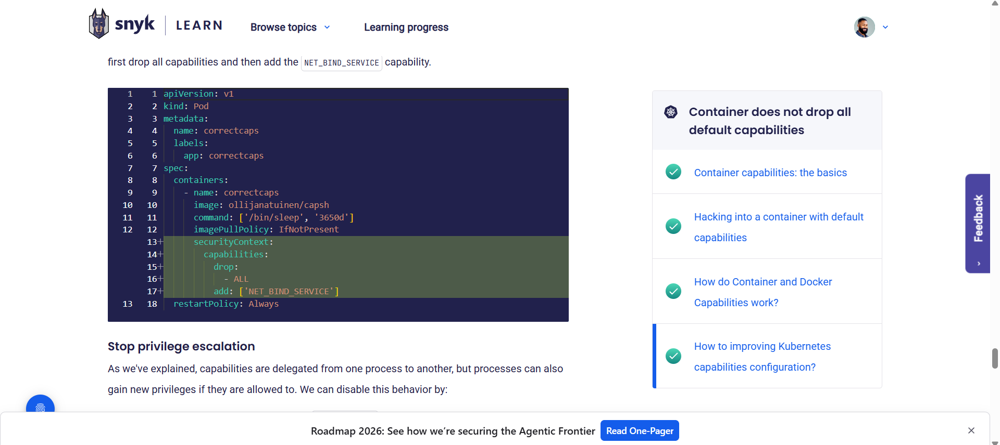
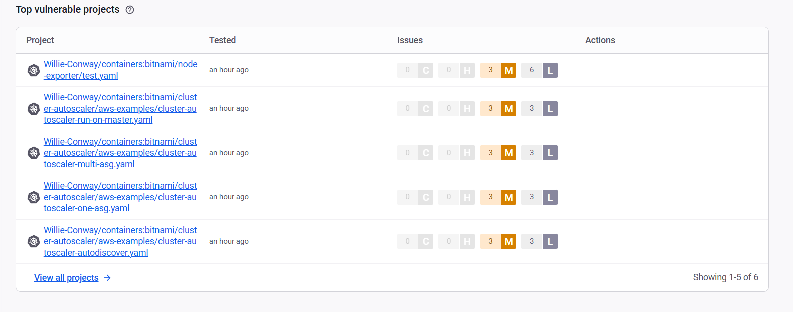

# Hands-on Lab: Using Snyk to Scan Your Code Repository

**Estimated time:** 30 minutes

---

## Introduction

In this lab, you will become familiar with **Snyk** (pronounced "Sneak") to scan your code repository for security vulnerabilities. Snyk is a developer-first security platform that helps find and fix vulnerabilities in your code, open-source dependencies, containers, and infrastructure as code.

---

## Learning Objectives

After completing this exercise, you will be able to:

| # | Objective                                            |
| - | ---------------------------------------------------- |
| 1 | Connect Snyk to your GitHub account                  |
| 2 | Perform a security scan of a code repository         |
| 3 | Analyze the code repository vulnerability report     |
| 4 | Understand the types of vulnerabilities Snyk detects |

---

## Prerequisites

You must have:

| Requirement                              | Status                        |
| :--------------------------------------- | :---------------------------- |
| **GitHub account**                 | ☐ (Create one if needed)     |
| **Public or private repositories** | ☐ (Create or fork if needed) |

### If You Don't Have a GitHub Account

Go to the GitHub sign-up link, follow the instructions, and sign up:

```
https://github.com/join
```

### If You Don't Have Repositories

You need some public or private repositories in your GitHub account. If you don't have any, create a copy of an existing public repository using **Fork**.

**Example repository to fork:**

```
https://github.com/bitnami/containers
```

**How to fork:**

1. Navigate to the repository you want to copy
2. Click the **Fork** button in the top right corner
3. Select your GitHub account as the destination
4. Wait for the fork to complete

![Fork repository]


---

## What is Snyk?

Snyk is a security platform that helps developers find and fix vulnerabilities:

```
┌─────────────────────────────────────────────────────────────────────────────┐
│                         SNYK CAPABILITIES                                    │
├─────────────────────────────────────────────────────────────────────────────┤
│                                                                              │
│   ┌─────────────────────────────────────────────────────────────────────┐   │
│   │                         SNYK PLATFORM                                │   │
│   └─────────────────────────────────────────────────────────────────────┘   │
│                                    │                                        │
│           ┌────────────────────────┼────────────────────────┐               │
│           │                        │                        │               │
│           ▼                        ▼                        ▼               │
│   ┌───────────────┐        ┌───────────────┐        ┌───────────────┐       │
│   │  Code         │        │ Open Source   │        │ Container     │       │
│   │  Scanning     │        │ Dependencies  │        │ Scanning      │       │
│   │               │        │               │        │               │       │
│   │ • SAST        │        │ • npm         │        │ • Docker      │       │
│   │ • Secrets     │        │ • pip         │        │ • Kubernetes  │       │
│   │ • IaC         │        │ • maven       │        │               │       │
│   └───────────────┘        └───────────────┘        └───────────────┘       │
│                                                                              │
└─────────────────────────────────────────────────────────────────────────────┘
```

### Why Use Snyk?

| Benefit                      | Description                                            |
| :--------------------------- | :----------------------------------------------------- |
| **Free tier**          | Free for public repositories and limited private scans |
| **Developer-friendly** | Integrates with GitHub, GitLab, Bitbucket              |
| **Actionable results** | Provides fix advice and pull requests                  |
| **Comprehensive**      | Scans code, dependencies, containers, IaC              |

---

## Part 1: Adding a Project to Snyk

Snyk has many capabilities, but we will focus on the **code repository vulnerability check** which is offered as a free service.

### Step 1: Go to Snyk Login Page

1. Open your web browser
2. Navigate to the Snyk login page:

```
https://app.snyk.io/login
```

![Snyk login page]


### Step 2: Click "Login with GitHub"

1. Click the **Login with GitHub** button
2. This will redirect you to GitHub for authentication

![Login with GitHub]


### Step 3: Authenticate with GitHub

1. If you are already logged into GitHub in your browser, proceed to the next step
2. Otherwise, log in with your GitHub credentials:

| Field                               | Action                           |
| :---------------------------------- | :------------------------------- |
| **Username or email address** | Enter your GitHub username/email |
| **Password**                  | Enter your GitHub password       |
| **Sign in**                   | Click the button                 |

![GitHub login]


### Step 4: Authorize Snyk

Provide permission and authorize Snyk to use your GitHub credentials.

**Permissions Snyk will request:**

| Permission                                  | Why Snyk Needs It                   |
| :------------------------------------------ | :---------------------------------- |
| **Read repository metadata**          | To list your repositories           |
| **Read code in public repositories**  | To scan for vulnerabilities         |
| **Read code in private repositories** | If you choose to scan private repos |
| **Read pull requests**                | To create fix PRs                   |

1. Review the permissions
2. Click **Authorize snyk** (or similar button)

![Authorize Snyk]


### Step 5: Skip Subscription (First Time Login)

The first time you log in, Snyk will ask if you want to subscribe for information on product releases and feature updates.

1. Click **No, not right now**
2. (You can always subscribe later from settings)

![Skip subscription]


---

## Part 2: Adding a Repository to Snyk

After logging in, you will see the Snyk dashboard. Now you need to add a repository to scan.

### Step 1: Import a Repository

1. On the Snyk dashboard, click **Add project** or **Import a project**

![Add project]


### Step 2: Select GitHub Integration

1. Select **GitHub** from the list of integrations
2. Snyk will display your GitHub repositories

![Select GitHub]


### Step 3: Choose a Repository to Scan

You will see a list of your GitHub repositories:

- **Public repositories** - Can be scanned for free
- **Private repositories** - Limited scans on free tier

**Select a repository to scan:**

| Repository Type                                         | Recommended         |
| :------------------------------------------------------ | :------------------ |
| The repository you forked (e.g.,`bitnami/containers`) | ✓ Recommended      |
| Any public repository you own                           | ✓ Works            |
| A private repository                                    | Use if you have one |

1. Click **Add** or check the box next to the repository
2. Click **Add selected repositories**

![Choose repository]


### Step 4: Wait for Import

Snyk will import your repository and begin scanning:

- This may take 1-3 minutes
- You will see a progress indicator

![Importing repository]


---

## Part 3: Analyzing the Scan Results

### Step 1: View the Scan Report

After the scan completes, you will see a dashboard with:

```
┌─────────────────────────────────────────────────────────────────────────────┐
│                         SNYK SCAN RESULTS                                    │
├─────────────────────────────────────────────────────────────────────────────┤
│                                                                              │
│   Repository: bitnami/containers                                            │
│   Last scan: Just now                                                        │
│                                                                              │
│   ┌─────────────────────────────────────────────────────────────────────┐   │
│   │                      VULNERABILITY SUMMARY                           │   │
│   │                                                                       │   │
│   │   Critical:  0     High:     2     Medium:   5     Low:     3        │   │
│   │                                                                       │   │
│   └─────────────────────────────────────────────────────────────────────┘   │
│                                                                              │
│   Vulnerabilities by Type:                                                   │
│   ┌─────────────────────────────────────────────────────────────────────┐   │
│   │ • Cross-site Scripting (XSS)                    Severity: High      │   │
│   │ • Improper Input Validation                      Severity: Medium    │   │
│   │ • Outdated Dependency                            Severity: High      │   │
│   │ • Information Exposure                           Severity: Medium    │   │
│   │ • Weak Cryptographic Algorithm                   Severity: Low       │   │
│   └─────────────────────────────────────────────────────────────────────┘   │
│                                                                              │
└─────────────────────────────────────────────────────────────────────────────┘
```

![Scan results]


### Step 2: Understand Severity Levels

| Severity           | Color     | Action Required         |
| :----------------- | :-------- | :---------------------- |
| **Critical** | 🔴 Red    | Fix immediately         |
| **High**     | 🟠 Orange | Fix as soon as possible |
| **Medium**   | 🟡 Yellow | Fix in next sprint      |
| **Low**      | 🔵 Blue   | Fix when convenient     |

### Step 3: Explore Individual Vulnerabilities

Click on any vulnerability to see details:

**For each vulnerability, Snyk shows:**

| Information              | Description                                     |
| :----------------------- | :---------------------------------------------- |
| **Title**          | Name of the vulnerability                       |
| **Description**    | What the vulnerability does                     |
| **CVE ID**         | Common Vulnerabilities and Exposures identifier |
| **CVSS Score**     | Severity rating (0-10)                          |
| **Affected paths** | Which files/dependencies are affected           |
| **Fix advice**     | How to fix the vulnerability                    |
| **References**     | Links to more information                       |

![Vulnerability details]


### Step 4: Review Open Source Vulnerabilities

If your repository uses dependencies (npm, pip, maven, etc.), Snyk will show:

```
┌─────────────────────────────────────────────────────────────────────────────┐
│                    OPEN SOURCE VULNERABILITIES                               │
├─────────────────────────────────────────────────────────────────────────────┤
│                                                                              │
│   Dependency          | Current Version | Vulnerable Version | Fix Version  │
│   ───────────────────┼─────────────────┼───────────────────┼──────────────│
│   lodash              | 4.17.19         | < 4.17.21         | 4.17.21       │
│   axios               | 0.21.1          | < 0.21.2          | 0.21.2        │
│   express             | 4.17.1          | < 4.17.3          | 4.17.3        │
│                                                                              │
└─────────────────────────────────────────────────────────────────────────────┘
```

---

## Part 4: Understanding Different Vulnerability Types

### Code Vulnerabilities (SAST)

Snyk scans your actual code for security issues:

| Vulnerability Type                   | Description                     |
| :----------------------------------- | :------------------------------ |
| **SQL Injection**              | Unsafe database queries         |
| **Cross-Site Scripting (XSS)** | Unsafe output encoding          |
| **Command Injection**          | Unsafe system command execution |
| **Path Traversal**             | Unsafe file access              |
| **Hardcoded Secrets**          | Passwords or keys in code       |

### Open Source Vulnerabilities (SCA)

Snyk scans your dependencies for known vulnerabilities:

| Example                | Description                     |
| :--------------------- | :------------------------------ |
| **npm packages** | JavaScript/Node.js dependencies |
| **pip packages** | Python dependencies             |
| **maven/gradle** | Java dependencies               |
| **Gem packages** | Ruby dependencies               |
| **Go modules**   | Go dependencies                 |

### Infrastructure as Code (IaC)

Snyk can scan Terraform, Kubernetes, and CloudFormation files:

| Misconfiguration                  | Risk               |
| :-------------------------------- | :----------------- |
| **Open S3 bucket**          | Data exposure      |
| **Unrestricted SSH access** | Attack vector      |
| **Missing encryption**      | Data at risk       |
| **Privileged containers**   | Container breakout |

---

## Part 5: Fixing Vulnerabilities

### Method 1: Automatic Fix via Pull Request

Snyk can automatically create pull requests to fix vulnerabilities:

1. Click on a vulnerability
2. Click **Fix this vulnerability**
3. Snyk will create a pull request with the fix

![Fix PR]



### Method 2: Manual Fix

For vulnerabilities that can't be auto-fixed:

1. Review the **Fix advice** section
2. The recommendation might include:
   - Update to a newer version
   - Change code implementation
   - Add input validation
   - Implement proper authentication

### Method 3: Ignore (if appropriate)

If a vulnerability is not applicable to your use case:

1. Click on the vulnerability
2. Click **Ignore**
3. Add a reason for ignoring
4. Set an expiration date (optional)

---

## Part 6: Snyk Dashboard Features

### Dashboard Sections

| Section                | Description                             |
| :--------------------- | :-------------------------------------- |
| **Projects**     | All your scanned repositories           |
| **Reports**      | Summary of all vulnerabilities          |
| **Settings**     | Configure Snyk for your account         |
| **Integrations** | Connect other tools (Slack, Jira, etc.) |

![Snyk dashboard]



### Connecting Additional Integrations

| Integration       | Benefit                            |
| :---------------- | :--------------------------------- |
| **Slack**   | Get vulnerability alerts in Slack  |
| **Jira**    | Create tickets for vulnerabilities |
| **Jenkins** | Scan during CI/CD pipeline         |
| **VS Code** | Scan while coding                  |

---

## Lab Completion Checklist

| Task                                          | Completed |
| :-------------------------------------------- | :-------- |
| **Part 1: Setup**                       | ☐        |
| Went to app.snyk.io/login                     | ☐        |
| Clicked "Login with GitHub"                   | ☐        |
| Authorized Snyk with GitHub                   | ☐        |
| Skipped subscription (first time)             | ☐        |
| **Part 2: Add Repository**              | ☐        |
| Clicked "Add project"                         | ☐        |
| Selected GitHub integration                   | ☐        |
| Chose a repository to scan                    | ☐        |
| Waited for import to complete                 | ☐        |
| **Part 3: Analyze Results**             | ☐        |
| Reviewed vulnerability summary                | ☐        |
| Explored individual vulnerabilities           | ☐        |
| Understood severity levels                    | ☐        |
| **Part 4: Understanding**               | ☐        |
| Identified different vulnerability types      | ☐        |
| Reviewed open source vulnerabilities (if any) | ☐        |
| **Part 5: Fixing**                      | ☐        |
| Learned how to fix via PR                     | ☐        |
| Understood manual fix options                 | ☐        |

---

## Screenshot Checklist

| Screenshot            | File Name                 | Description                   |
| :-------------------- | :------------------------ | :---------------------------- |
| Snyk Login            | `Snyk_Login.png`        | Snyk login page               |
| GitHub Auth           | `Snyk_GitHub_Auth.png`  | Authorizing Snyk              |
| Add Project           | `Snyk_Add_Project.png`  | Adding a repository           |
| Scan Results          | `Snyk_Scan_Results.png` | Vulnerability summary         |
| Vulnerability Details | `Snyk_Vuln_Details.png` | Individual vulnerability view |
| Fix PR                | `Snyk_Fix_PR.png`       | Auto-fix pull request         |

---

## Troubleshooting Tips

| Issue                                   | Solution                                                   |
| :-------------------------------------- | :--------------------------------------------------------- |
| **Snyk not showing repositories** | Ensure you authorized GitHub; check GitHub app permissions |
| **Scan taking too long**          | Large repositories take longer; wait or scan smaller repo  |
| **No vulnerabilities found**      | Repo may be secure; try scanning a different repository    |
| **Cannot scan private repos**     | Free tier has limits; use public repository instead        |
| **404 error**                     | Refresh page; ensure Snyk has proper permissions           |
| **Login loop**                    | Clear browser cookies; try incognito mode                  |

---

## Snyk Free Tier Limitations

| Feature                        | Free Tier                 | Paid Tier |
| :----------------------------- | :------------------------ | :-------- |
| **Public repositories**  | Unlimited                 | Unlimited |
| **Private repositories** | Limited (200 tests/month) | Unlimited |
| **Pull request fixes**   | Yes                       | Yes       |
| **Container scanning**   | Yes (limited)             | Yes       |
| **IaC scanning**         | Yes (limited)             | Yes       |
| **Jira integration**     | No                        | Yes       |

---

## Key Takeaways

| Concept                   | Description                                         |
| :------------------------ | :-------------------------------------------------- |
| **Snyk**            | Developer-first security platform                   |
| **SAST**            | Static Application Security Testing (code scanning) |
| **SCA**             | Software Composition Analysis (dependency scanning) |
| **Severity Levels** | Critical, High, Medium, Low                         |
| **Fix PR**          | Automatic pull request to fix vulnerabilities       |
| **Integration**     | Connects with GitHub, GitLab, Slack, Jira, etc.     |

---

## Test Your Knowledge

**Q1:** What does SNYK stand for? (Note: It's a brand name)

```
Your answer:
_________________________________________________________________________
```

**Q2:** What are the four severity levels Snyk uses?

```
Your answer:
_________________________________________________________________________
```

**Q3:** What types of vulnerabilities can Snyk detect? (Select all that apply)

☐ Code vulnerabilities (SAST)
☐ Open source dependencies (SCA)
☐ Container images
☐ Hardware vulnerabilities
☐ Infrastructure as Code (IaC)

**Q4:** How can Snyk automatically fix vulnerabilities?

```
Your answer:
_________________________________________________________________________
```

**Q5:** What is required before you can use Snyk?

```
Your answer:
_________________________________________________________________________
```

### Answer Key

| Q# | Answer                                                                                               |
| -- | ---------------------------------------------------------------------------------------------------- |
| 1  | Snyk is a brand name (not an acronym) - pronounced "Sneak"                                           |
| 2  | Critical, High, Medium, Low                                                                          |
| 3  | ☑ Code vulnerabilities, ☑ Open source dependencies, ☑ Container images, ☑ Infrastructure as Code |
| 4  | By creating pull requests with the fixes applied                                                     |
| 5  | A GitHub (or other Git) account                                                                      |

---

## Summary

In this lab, you have:

| Activity                                             | Completed |
| :--------------------------------------------------- | :-------- |
| Created a Snyk account with GitHub login             | ☐        |
| Connected Snyk to your GitHub repositories           | ☐        |
| Imported a repository for scanning                   | ☐        |
| Reviewed vulnerability scan results                  | ☐        |
| Understood severity levels and vulnerability types   | ☐        |
| Learned how to fix vulnerabilities via pull requests | ☐        |

---

## Additional Resources

| Resource                              | URL                                 |
| :------------------------------------ | :---------------------------------- |
| **Snyk Official Website**       | https://snyk.io                     |
| **Snyk Documentation**          | https://docs.snyk.io                |
| **Snyk Vulnerability Database** | https://snyk.io/vuln                |
| **Snyk GitHub Integration**     | https://github.com/marketplace/snyk |

---

## Congratulations!

You have successfully completed the **Using Snyk to Scan Your Code Repository** lab. You now know how to:

- Connect Snyk to your GitHub account
- Import repositories for security scanning
- Understand vulnerability severity levels
- Analyze scan results and identify security issues
- Use Snyk's automatic fix via pull requests

These skills are essential for:

- DevSecOps practitioners
- Security-conscious developers
- Application security engineers
- Anyone responsible for code security

---

**Next Steps:** After completing this lab, you can:

- Scan additional repositories
- Connect Snyk to your CI/CD pipeline
- Set up Snyk to monitor your repositories continuously
- Explore container scanning with Snyk
