# Hands-on Lab: Using Splunk for Security Monitoring and Analysis

**Estimated time:** 90-120 minutes

---

## Introduction

In this lab, you will become familiar with **Splunk**, a market-leading platform for unified observability and security information and event management (SIEM) . Splunk enables organizations to collect, index, and analyze machine-generated data from virtually any source, making it an essential tool for security analysts, SOC teams, and IT operations professionals .

Unlike Snyk (code scanning), Nessus (vulnerability scanning), and TheHive (incident response), Splunk focuses on **data aggregation, search, and real-time analysis**—providing the visibility needed to detect and respond to security incidents across your entire infrastructure .

---

## Learning Objectives

After completing this exercise, you will be able to:

| # | Objective                                                   |
| - | ----------------------------------------------------------- |
| 1 | Install and configure Splunk Enterprise locally or in a VM  |
| 2 | Ingest security data using the BOTS v3 dataset              |
| 3 | Write and optimize Search Processing Language (SPL) queries |
| 4 | Detect brute force attacks and other security threats       |
| 5 | Create alerts for proactive threat detection                |
| 6 | Build dashboards for security monitoring                    |

---

## Prerequisites

You must have:

| Requirement                                                         | Status                |
| :------------------------------------------------------------------ | :-------------------- |
| **Computer with 8GB+ RAM**                                    | ☐ (16GB recommended) |
| **20GB free disk space**                                      | ☐                    |
| **Virtualization software** (VMware or VirtualBox - optional) | ☐                    |
| **Splunk.com account** (free)                                 | ☐                    |
| **Modern web browser** (Chrome, Firefox, Edge)                | ☐                    |

### If You Don't Have a Splunk Account

Go to the Splunk sign-up page:

```
https://www.splunk.com/en_us/sign-up.html
```

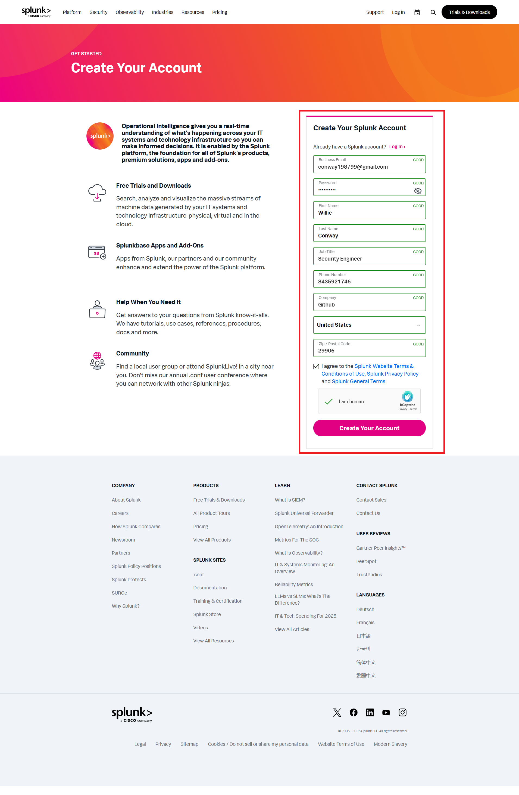

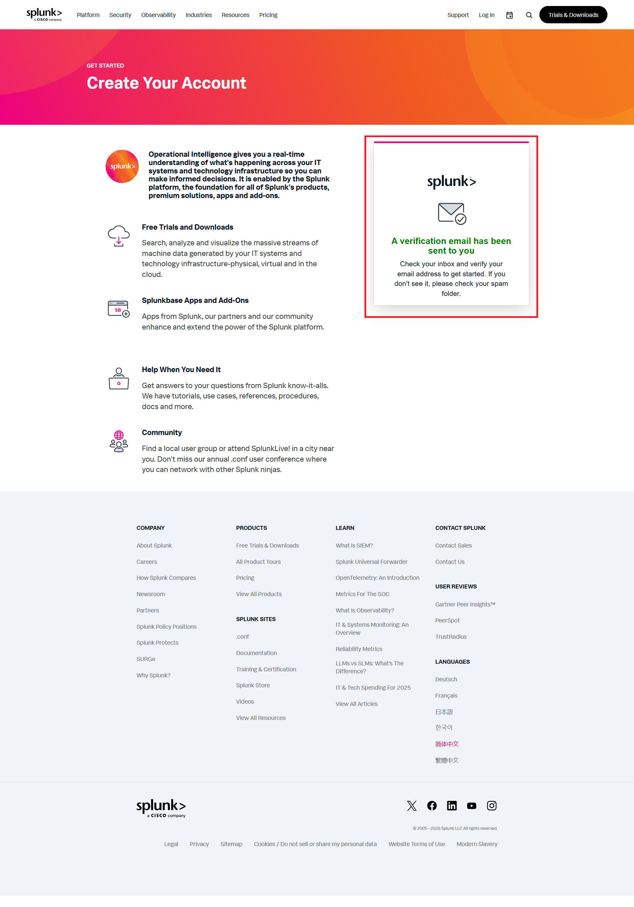

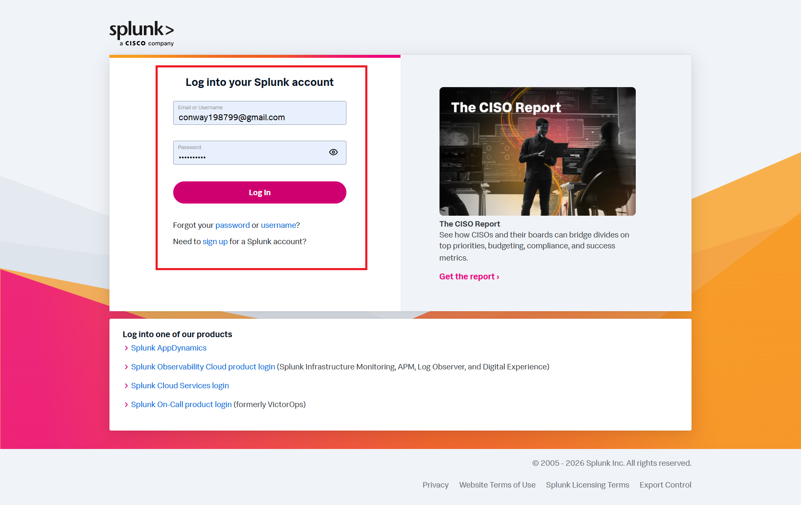

### System Requirements

| Component            | Minimum | Recommended |
| :------------------- | :------ | :---------- |
| **RAM**        | 4GB     | 8GB+        |
| **CPU**        | 2 cores | 4 cores     |
| **Disk Space** | 10GB    | 20GB+       |

---

## What is Splunk?

Splunk is a platform for searching, monitoring, and analyzing machine-generated data . It transforms unstructured log data into searchable events, enabling security teams to detect threats, investigate incidents, and create visualizations .

```
┌─────────────────────────────────────────────────────────────────────────────┐
│                         SPLUNK CAPABILITIES                                  │
├─────────────────────────────────────────────────────────────────────────────┤
│                                                                              │
│   ┌─────────────────────────────────────────────────────────────────────┐   │
│   │                         SPLUNK PLATFORM                              │   │
│   └─────────────────────────────────────────────────────────────────────┘   │
│                                    │                                        │
│           ┌────────────────────────┼────────────────────────┐               │
│           │                        │                        │               │
│           ▼                        ▼                        ▼               │
│   ┌───────────────┐        ┌───────────────┐        ┌───────────────┐       │
│   │  Data         │        │  Search &     │        │  Alerting &   │       │
│   │  Ingestion    │        │  Analysis     │        │  Reporting    │       │
│   │               │        │               │        │               │       │
│   │ • Log files   │        │ • SPL queries │        │ • Real-time   │       │
│   │ • Network     │        │ • Field       │        │   alerts      │       │
│   │ • Windows     │        │   extraction  │        │ • Dashboards  │       │
│   │ • Syslog      │        │ • Correlation │        │ • Scheduled   │       │
│   │ • API/JSON    │        │ • Statistics  │        │   reports     │       │
│   └───────────────┘        └───────────────┘        └───────────────┘       │
│                                                                              │
└─────────────────────────────────────────────────────────────────────────────┘
```

### Why Use Splunk?

| Benefit                        | Description                                       |
| :----------------------------- | :------------------------------------------------ |
| **Free tier**            | 500 MB/day free for life with a Splunk account    |
| **Developer license**    | 10 GB/day for 6 months (free with registration)   |
| **Powerful SPL**         | Search Processing Language for advanced analytics |
| **Real-time monitoring** | Detect threats as they occur                      |
| **Rich visualizations**  | Dashboards, charts, and reports                   |

---

## Part 1: Splunk Installation

### Option A: Local Installation (Recommended for Beginners)

#### Step 1: Download Splunk Enterprise

1. Navigate to the Splunk download page:

   ```
   https://www.splunk.com/en_us/download/splunk-enterprise.html
   ```
2. Select your operating system (Windows, macOS, or Linux)
3. Download the installer (.msi for Windows, .dmg for macOS, .deb/.rpm for Linux)

![Splunk Download]

*[Screenshot: Splunk Enterprise download page with OS options]*

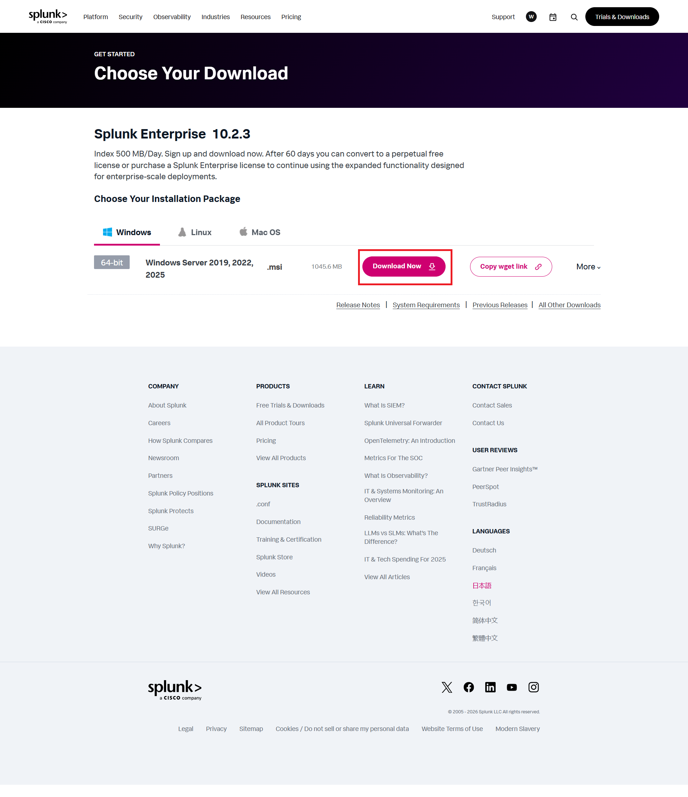

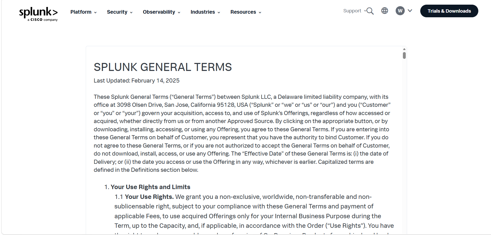


4. Try out **Splunk Developer License** and **10GB** *free-tier* for **6 months**.

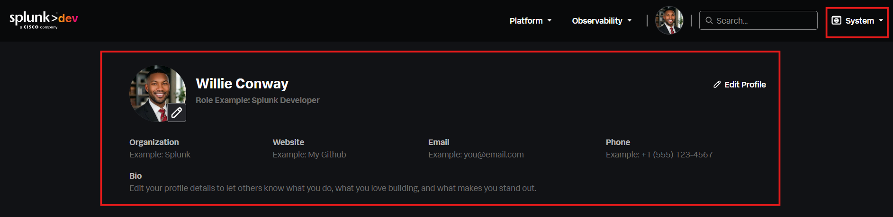

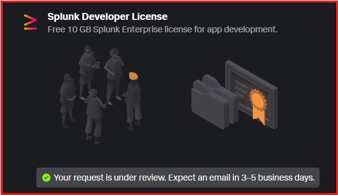

#### Step 2: Install Splunk

**Windows:**

1. Run the downloaded `.msi` file
2. Follow the installation wizard
3. Accept the license agreement
4. Choose installation directory (default: `C:\Program Files\Splunk`)

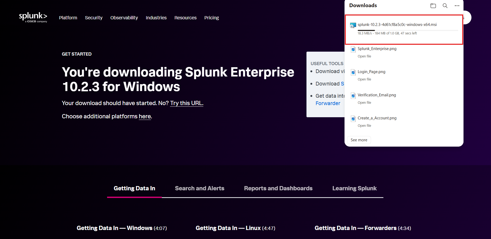

**macOS:**

1. Open the `.dmg` file
2. Drag Splunk to Applications folder

**Linux (Ubuntu/Debian):**

```bash
sudo dpkg -i splunk-9.x.x-xxxxxx-linux-2.6-amd64.deb
```

#### Step 3: Start Splunk

**Windows:**

- Navigate to Start Menu → Splunk → Start Splunk

**macOS/Linux:**

```bash
cd /opt/splunk/bin
./splunk start
```

#### Step 4: Complete Initial Setup

1. Accept the license agreement when prompted

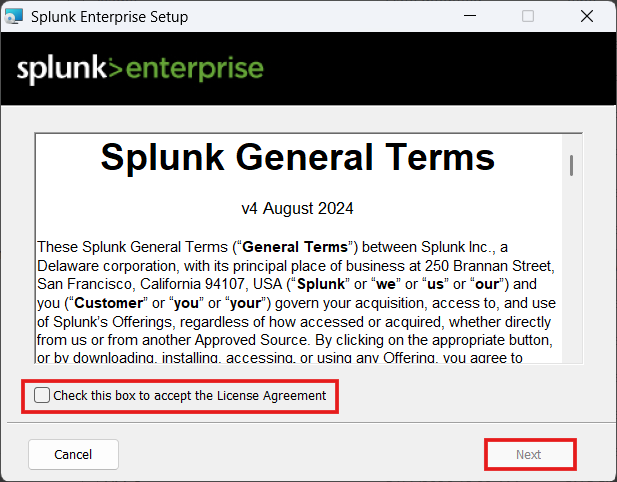

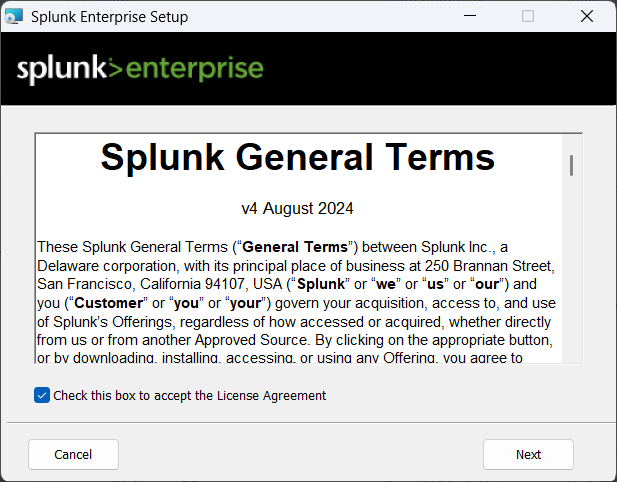

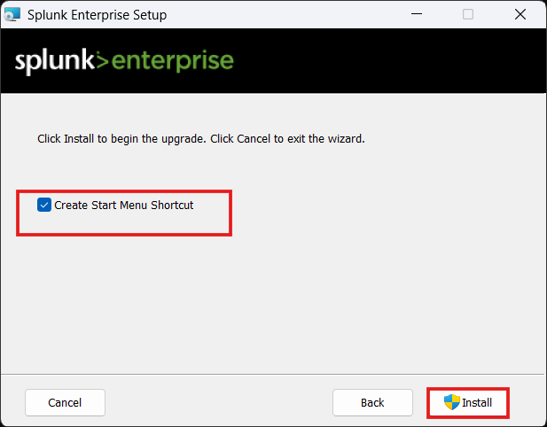

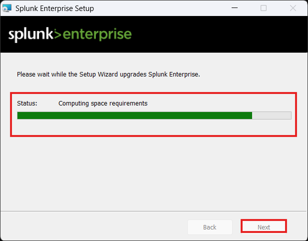

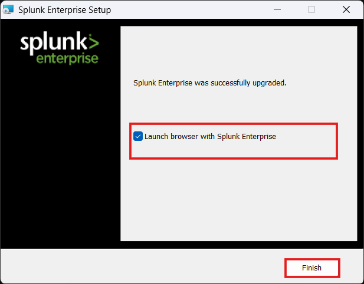

2. Create an administrator username and password

| Field              | Value                                       |
| :----------------- | :------------------------------------------ |
| **Username** | `admin`                                   |
| **Password** | Choose a strong password (min 8 characters) |

#### Step 5: Access Splunk Web Interface

1. Open your browser and navigate to:

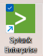

```
   http://localhost:8000
```

2. Log in with the credentials you just created

![Splunk Login]

*[Screenshot: Splunk Web login page at localhost:8000]*

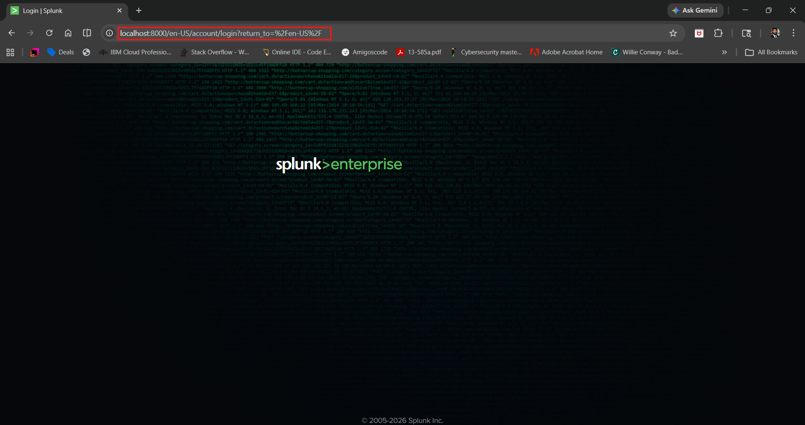

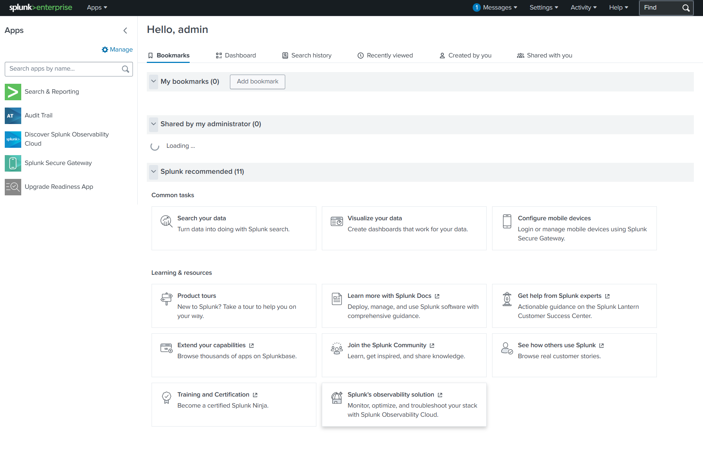

### Option B: Virtual Machine Setup (Advanced)

For a more realistic SOC environment, you can set up Splunk on a dedicated VM :

1. Create an Ubuntu Server VM in VirtualBox (4GB RAM, 20GB disk)
2. Configure network adapter as **Bridged**
3. Install Splunk Enterprise following steps above
4. Allow port 8000 through firewall:
   ```bash
   sudo ufw allow 8000
   ```
5. Access Splunk Web at `http://<VM_IP_ADDRESS>:8000`

---

## Part 2: Loading Security Data (BOTS v3 Dataset)

The BOTS (Boss of the SOC) v3 dataset is a realistic security dataset distributed by Splunk that simulates a security incident environment .

### Step 1: Download the BOTS v3 Dataset

1. Navigate to the BOTS v3 download page:

   ```
   https://github.com/splunk/botsv3
   ```

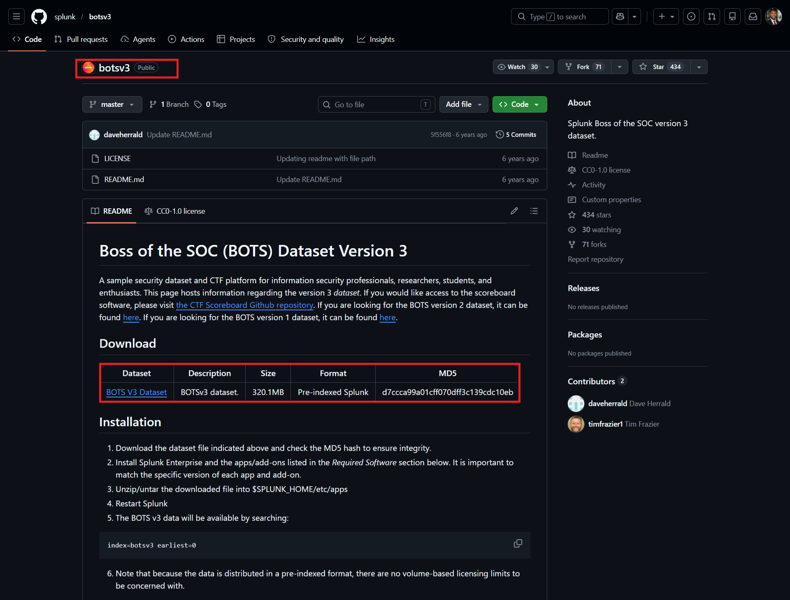

2. Download the dataset file: `botsv3_data_set.tgz`


### Step 2: Upload Data to Splunk

1. In Splunk Web, click **Settings** → **Add Data**
2. Select **Upload** as the data source
3. Drag and drop the `botsv3_data_set.tgz` file or click **Select File** to browse
4. After the file loads, click **Next**

![Add Data]

*[Screenshot: Add Data page with file upload option]*

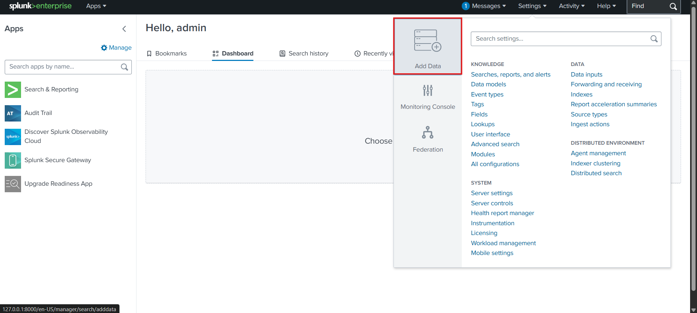

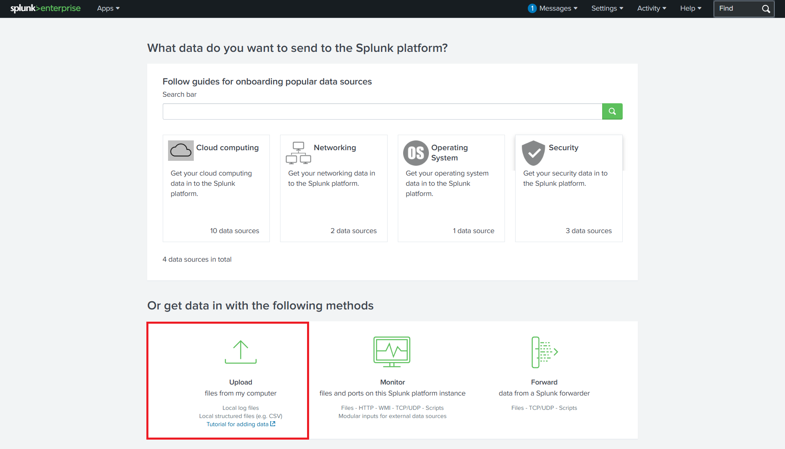

5. Review the settings (keep defaults) and click **Submit**

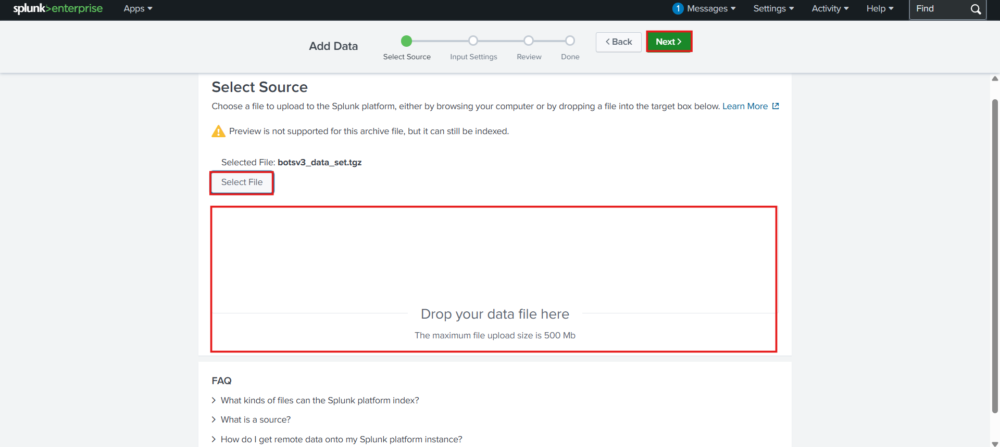

### Step 3: Create an Index for the Data

1. Go to **Settings** → **Indexes**
2. Click **New Index**
3. Fill in the details:

| Field                     | Value      |
| :------------------------ | :--------- |
| **Index Name**      | `botsv3` |
| **Index Data Type** | `Events` |

4. Click **Save**

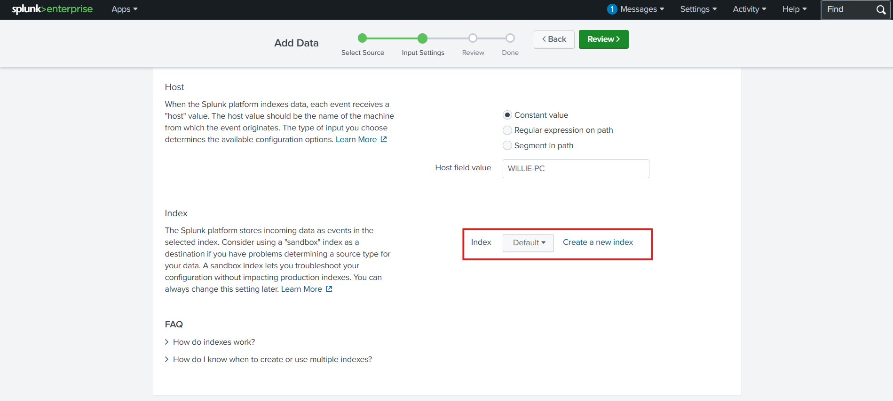

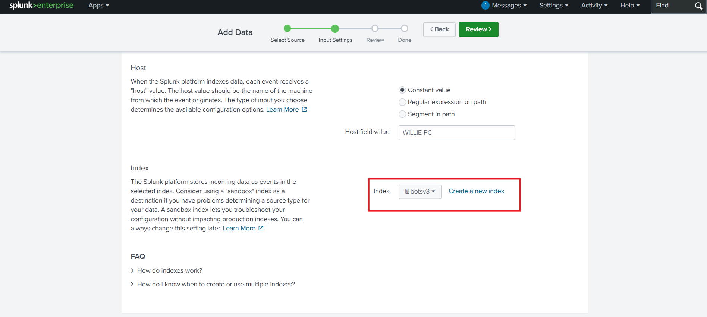

### Step 4: Verify Data Ingestion

1. Navigate to **Search & Reporting** app
2. Run the following search to verify data :

   ```
   index=botsv3
   | stats count by sourcetype
   ```
3. Set the time range to **All Time**

Expected result: Approximately 100+ sourcetypes with event counts

```
┌─────────────────────────────────────────────────────────────────────────────┐
│                    BOTS V3 DATA VERIFICATION                                │
├─────────────────────────────────────────────────────────────────────────────┤
│                                                                              │
│   sourcetype                                    count                        │
│   ───────────────────────────────────────────────────────────────────────── │
│   access_combined_wcookie                       892,341                     │
│   winEventLog:security                           245,672                     │
│   suricata:alert                                 156,890                     │
│   xmlwineventlog:microsoft-windows-sysmon/operational  98,423               │
│   stream:http                                     87,654                     │
│   ... (and more)                                                             │
│                                                                              │
└─────────────────────────────────────────────────────────────────────────────┘
```

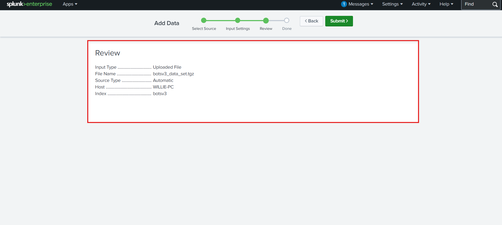


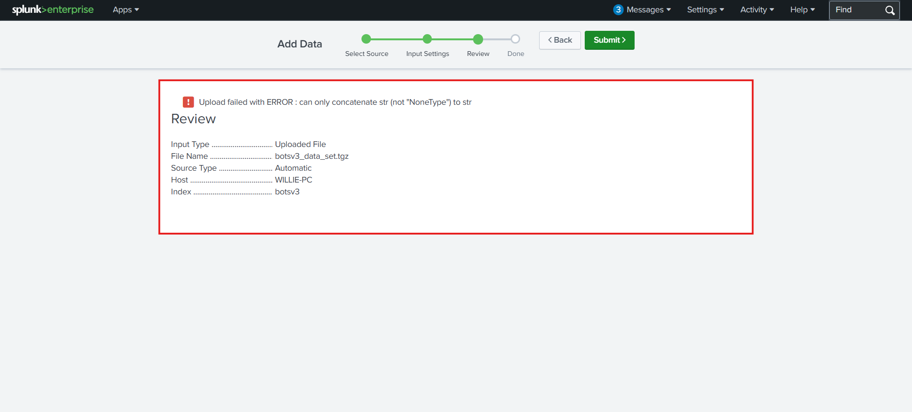

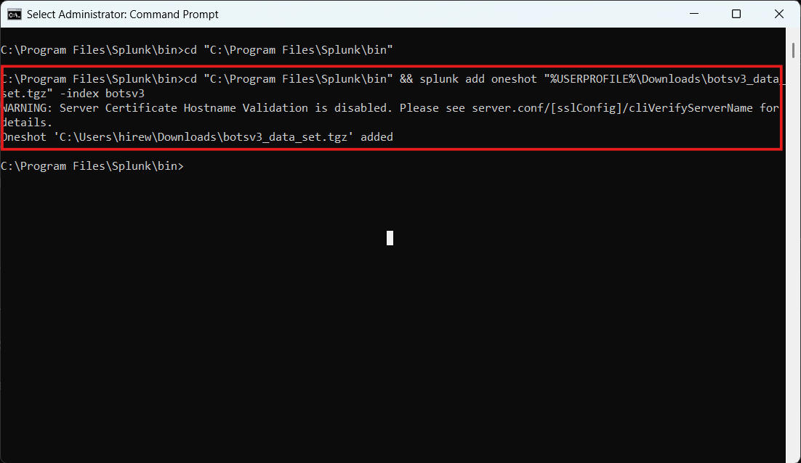

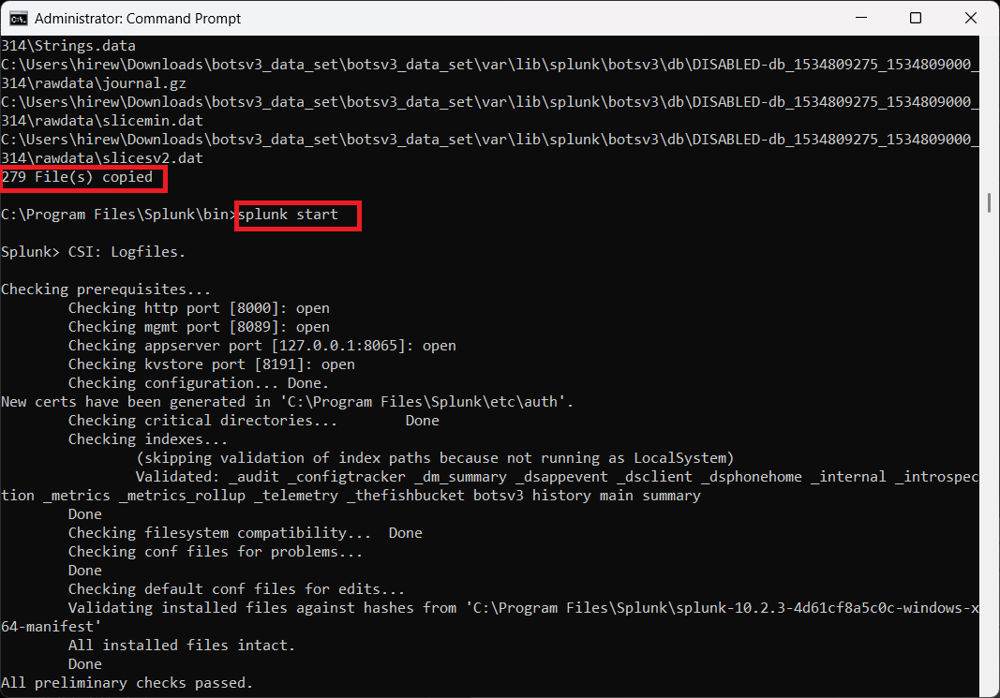

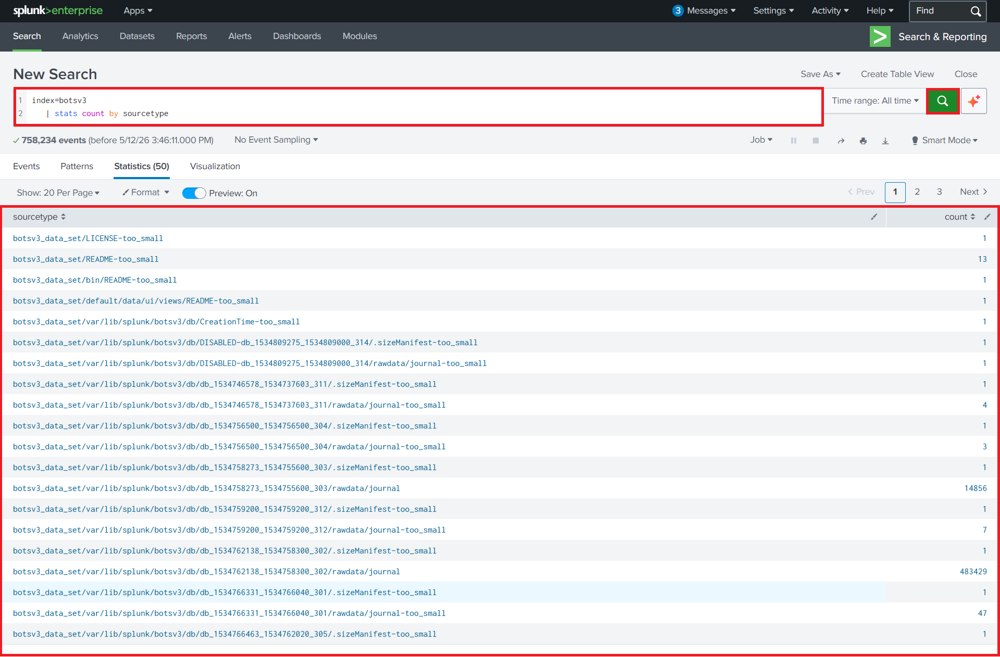

---

## Part 3: Understanding the Splunk Interface

### Splunk Web Layout

```
┌─────────────────────────────────────────────────────────────────────────────┐
│                         SPLUNK WEB INTERFACE                                 │
├─────────────────────────────────────────────────────────────────────────────┤
│                                                                              │
│   ┌─────────────────────────────────────────────────────────────────────┐   │
│   │  [Splunk Logo]    Search & Reporting    Apps ▼    Settings ▼   [User]│   │
│   └─────────────────────────────────────────────────────────────────────┘   │
│                                                                              │
│   ┌─────────────────────────────────────────────────────────────────────┐   │
│   │  Search Bar: [________________________________] [Magnifying Glass]  │   │
│   │  Time Range: [Last 24 hours ▼]                                      │   │
│   └─────────────────────────────────────────────────────────────────────┘   │
│                                                                              │
│   ┌─────────────────────────────────────────────────────────────────────┐   │
│   │  Search Results                                                      │   │
│   │                                                                       │   │
│   │  Event 1: 2024-01-15 10:30:45 - Failed login for user admin from IP  │   │
│   │  Event 2: 2024-01-15 10:30:47 - Failed login for user admin from IP  │   │
│   │  Event 3: 2024-01-15 10:30:49 - Failed login for user admin from IP  │   │
│   │                                                                       │   │
│   └─────────────────────────────────────────────────────────────────────┘   │
│                                                                              │
│   Left Sidebar:                             Right Sidebar:                  │
│   ┌───────────────┐                         ┌───────────────┐               │
│   │ Fields        │                         │ Timeline      │               │
│   │ • host        │                         │ [Graph of     │               │
│   │ • source      │                         │  events over  │               │
│   │ • sourcetype  │                         │  time]        │               │
│   └───────────────┘                         └───────────────┘               │
│                                                                              │
└─────────────────────────────────────────────────────────────────────────────┘
```

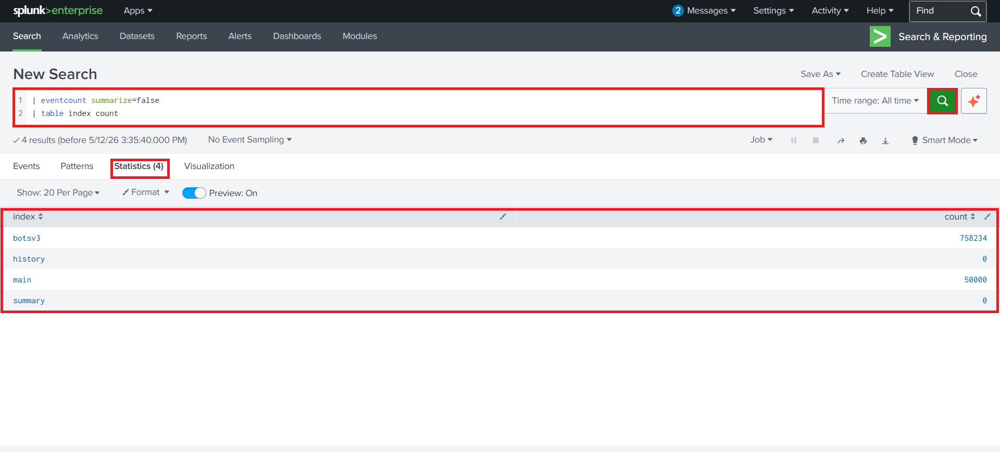

### Key Components

| Component                | Description                                            |
| :----------------------- | :----------------------------------------------------- |
| **Search Bar**     | Enter SPL queries to find and analyze data             |
| **Time Picker**    | Filter events by time range (critical for performance) |
| **Fields Sidebar** | Discover and select fields for analysis                |
| **Timeline**       | Visual representation of event distribution            |
| **Event Viewer**   | Individual log entries with timestamps                 |

---

## Part 4: Introduction to Search Processing Language (SPL)

SPL is the powerful query language that makes Splunk unique . It allows you to filter, transform, and analyze data using a pipe-forward syntax.

### Basic SPL Syntax

```
search_terms | command1 | command2 | command3
```

Each pipe (`|`) sends the output of one command to the next.

### Core SPL Commands

| Command             | Purpose                   | Example                     |
| :------------------ | :------------------------ | :-------------------------- |
| **`stats`** | Calculate statistics      | `\| stats count by user`   |
| **`table`** | Display specific fields   | `\| table src_ip, dest_ip` |
| **`top`**   | Show most frequent values | `\| top src_ip`            |
| **`where`** | Filter results            | `\| where count > 10`      |
| **`sort`**  | Order results             | `\| sort - count`          |
| **`head`**  | Limit results             | `\| head 10`               |

### Example Search Queries

**Simple search:**

```
index=botsv3 "Failed" OR "failed" OR "authentication failure"
| head 1
```

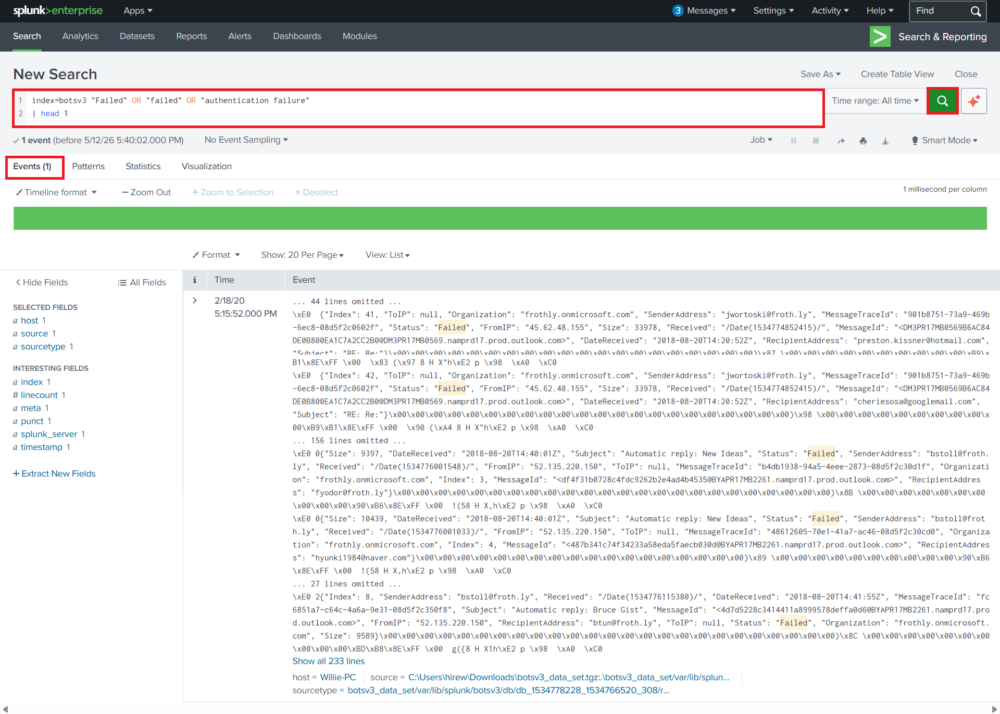

**Statistical analysis:**

```
index=botsv3 sourcetype=*journal
| stats count by ComputerName
| sort - count
| head 10
```

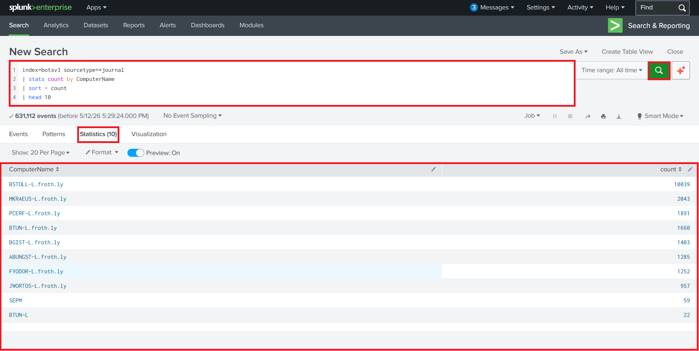

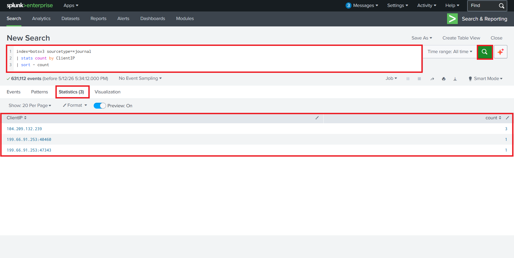

**Time-based analysis:**

```
index=botsv3 sourcetype=*journal ClientIP=*
| eval clean_ip = if(match(ClientIP, ":"), replace(ClientIP, ":\d+$", ""), ClientIP)
| stats count by clean_ip
| where count > 1
| sort - count
```

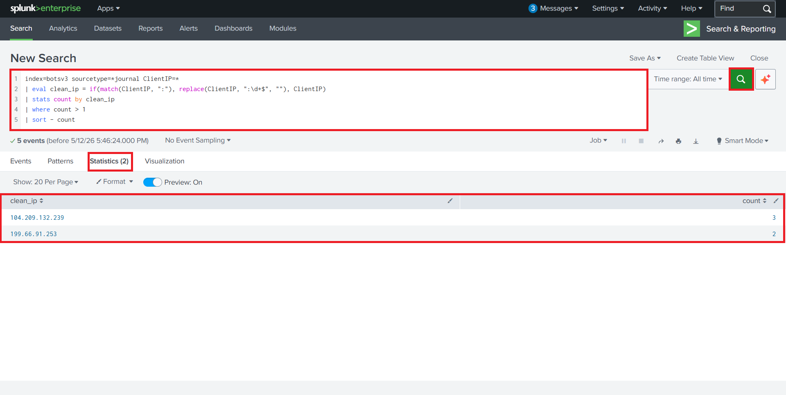

---

## Part 5: Security Use Cases with SPL

### Use Case 1: Brute Force Attack Detection

Brute force attacks involve multiple failed login attempts from a single source .

**Scenario:** Detect IP addresses with excessive failed login attempts.

**Query:**

```
index=botsv3 sourcetype=secure "Failed password"
| stats count by src_ip
| where count > 20
| sort - count
| table src_ip count
```

**What this does:**

1. Searches the `botsv3` index for `secure` sourcetype with "Failed password"
2. Counts failures by source IP address
3. Filters for IPs with more than 20 failures
4. Sorts descending and displays results

**Expected output:**

```
src_ip          count
192.168.1.45    847
10.0.0.23       312
203.0.113.89    156
```

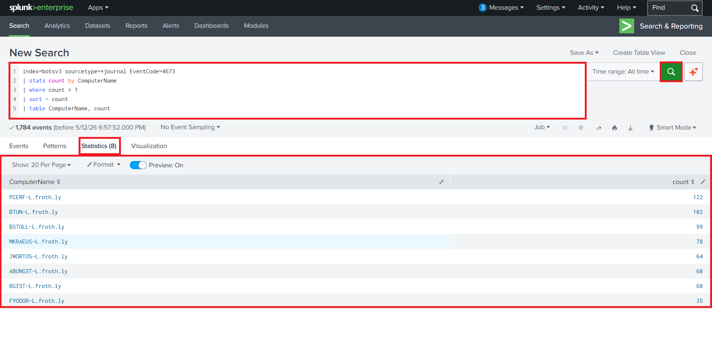

### Use Case 2: Privilege Abuse Detection

**Scenario:** This query identifies systems where sensitive privilege use (EventCode 4673) occurs frequently, which may indicate:

* Account compromise
* Privilege escalation attempts
* Malicious activity

**Query:**

```
index=botsv3 sourcetype=*journal EventCode=4673
| stats count by ComputerName
| sort - count
| table ComputerName, count
```

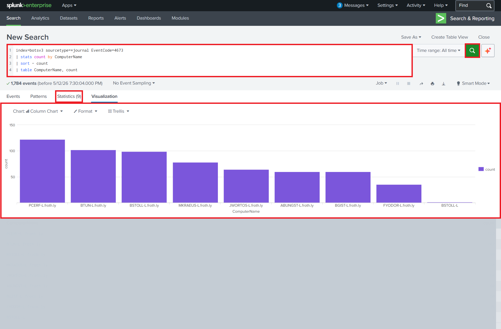

### Use Case 3: Search raw text for PowerShell

**Scenario:** Detect suspicious process creation events, such as PowerShell launching unusual commands.

**Query:**

```
index=botsv3 "powershell.exe"
| eval CommandLine = coalesce(CommandLine, Process_Command_Line)
| rex field=_raw "New Process Name:\s*(?<ProcessPath>[^\n]+)"
| table _time, ComputerName, User, ProcessPath, CommandLine
| head 50
```

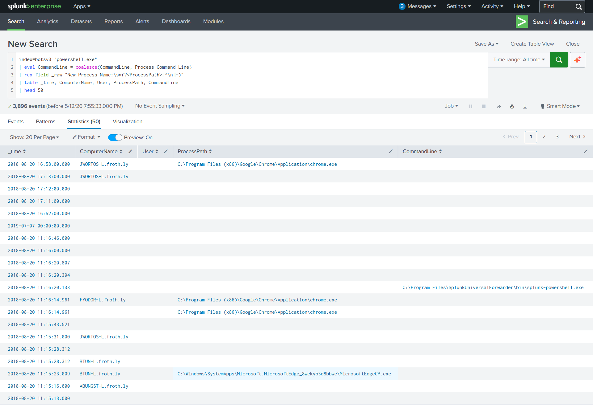

### Use Case 4: Geolocation-Based Threat Hunting

**Scenario:** Identify outbound connections to suspicious countries .

**Query:**

```
index=botsv3 "dest_ip"
| rex "dest_ip\":\"(?<ip>\d+\.\d+\.\d+\.\d+)\""
| where NOT match(ip, "192\.168\.")
| where ip!=""
| stats count by ip
| sort - count
| head 10
```

> **Note:** The `iplocation` command requires a Splunk app or configuration. If not available, skip this example.

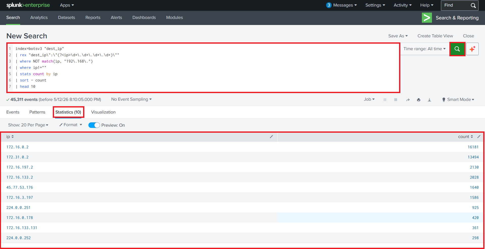

### Use Case 5: Lateral Movement Detection

**Scenario:** Detect potential lateral movement by identifying hosts with connections to many internal systems .

**Query:**

```
index=botsv3 "Account Name"
| rex "Account Name:\s*(?<Account_Name>[^\n]+)"
| stats dc(ComputerName) as systems_accessed by Account_Name
| where systems_accessed > 1
| sort - systems_accessed
| table Account_Name, systems_accessed
```


---

## Part 6: Creating Alerts

Alerts automatically notify you when specific conditions are met, enabling proactive threat detection .

### Step 1: Create a Brute Force Alert

1. Run the brute force detection query :

   ```
   index=botsv3 sourcetype=secure "Failed password"
   | stats count by src_ip
   | where count > 20
   ```
2. Click **Save As** → **Alert**
3. Configure the alert:

| Setting                     | Value                                                            |
| :-------------------------- | :--------------------------------------------------------------- |
| **Title**             | `Brute Force Attack Detected`                                  |
| **Description**       | `Alert when IP exceeds 20 failed logins`                       |
| **Time Range**        | `Last 15 minutes`                                              |
| **Run on**            | `Schedule` → `Cron Schedule: */5 * * * *` (every 5 minutes) |
| **Trigger condition** | `When number of results > 0`                                   |

4. Configure actions (choose one or more):

| Action                            | Configuration                       |
| :-------------------------------- | :---------------------------------- |
| **Email**                   | Enter recipient email addresses     |
| **Webhook**                 | Provide webhook URL for integration |
| **Add to Triggered Alerts** | (Default - enabled)                 |

5. Click **Save**

![Create Alert]

*[Screenshot: Alert configuration dialog with fields filled]*

### Step 2: View Triggered Alerts

1. Navigate to **Activities** → **Triggered Alerts**
2. All triggered alerts appear here with timestamps and results

---

## Part 7: Creating Dashboards

Dashboards provide visual, at-a-glance monitoring of security metrics .

### Step 1: Create a New Dashboard

1. Navigate to **Dashboards**
2. Click **Create New Dashboard**
3. Enter details :

| Field                 | Value                                     |
| :-------------------- | :---------------------------------------- |
| **Title**       | `Security Monitoring Dashboard`         |
| **Description** | `Real-time security metrics and alerts` |
| **Permissions** | `Private` (for lab)                     |

### Step 2: Add a Panel - Top Failed Login Sources

1. Click **Add Panel** → **New from Search**
2. Enter the SPL query :

   ```
   index=botsv3 sourcetype=secure "Failed password"
   | stats count by src_ip
   | sort - count
   | head 10
   ```
3. Choose visualization type: **Bar Chart** or **Table**
4. Add title: `Top 10 Failed Login Sources`
5. Click **Add to Dashboard**

### Step 3: Add a Panel - Login Success vs Failure Trend

1. Click **Add Panel** → **New from Search**
2. Enter the SPL query:

   ```
   index=botsv3 sourcetype=secure
   | eval outcome=if(match(_raw, "Failed password"), "Failure", "Success")
   | timechart span=1h count by outcome
   ```
3. Choose visualization type: **Line Chart**
4. Add title: `Login Activity Trend (Last 7 Days)`
5. Click **Add to Dashboard**

### Step 4: Add a Panel - Event Timeline

1. Click **Add Panel** → **New from Search**
2. Enter a simple search:

   ```
   index=botsv3
   | timechart count
   ```
3. Choose visualization type: **Area Chart**
4. Add title: `Overall Event Volume`
5. Click **Add to Dashboard**

### Step 5: Save and View Dashboard

1. Click **Save** in the top right
2. The dashboard now displays all panels with live data from your searches

```
┌─────────────────────────────────────────────────────────────────────────────┐
│                   SECURITY MONITORING DASHBOARD                              │
├─────────────────────────────────────────────────────────────────────────────┤
│                                                                              │
│   ┌─────────────────────────────────────┐ ┌─────────────────────────────┐   │
│   │ Top 10 Failed Login Sources         │ │ Login Activity Trend        │   │
│   │                                     │ │                             │   │
│   │ 192.168.1.45  ████████████ 847      │ │     ^                       │   │
│   │ 10.0.0.23     ████████ 312          │ │    / \                      │   │
│   │ 203.0.113.89  █████ 156             │ │   /   \     _____           │   │
│   │ ...                                 │ │  /     \___/     \          │   │
│   └─────────────────────────────────────┘ └─────────────────────────────┘   │
│                                                                              │
│   ┌─────────────────────────────────────────────────────────────────────┐   │
│   │ Overall Event Volume                                                 │   │
│   │                                                                       │   │
│   │         ██████████████████████████████████████████████████████████   │   │
│   │    M     T     W     T     F     S     S                             │   │
│   └─────────────────────────────────────────────────────────────────────┘   │
│                                                                              │
└─────────────────────────────────────────────────────────────────────────────┘
```

---

## Part 8: Field Extraction and Data Enrichment

### Understanding Fields

Fields are key-value pairs extracted from raw log data . Splunk automatically extracts common fields like:

- `host` - Source computer name
- `source` - File path or source type
- `sourcetype` - Format of the data
- `_time` - Event timestamp

### Using the Field Extractor

1. In Search & Reporting, run a search:

   ```
   index=botsv3 | head 100
   ```
2. Click on any event to expand it
3. Hover over text to see extraction options
4. Click **Extract Fields** to create custom field extractions using regex

### Using Lookups for Enrichment

Lookups allow you to enrich events with external data (e.g., threat intelligence feeds).

1. Save a CSV file with enrichment data (example: `threat_ips.csv`):

   ```
   ip,threat_category,confidence
   185.130.5.253,malware,high
   203.0.113.89,scanning,medium
   ```
2. Upload to Splunk: **Settings** → **Lookups** → **Lookup table files** → **Add new**
3. Create a lookup definition: **Settings** → **Lookups** → **Lookup definitions** → **Add new**
4. Use in search:

   ```
   index=botsv3 sourcetype=secure
   | lookup threat_ips.csv ip as src_ip OUTPUT threat_category, confidence
   | where threat_category="malware"
   ```

---

## Part 9: Splunk Forwarder Setup (Advanced)

For a more realistic SOC lab, you can forward Windows event logs to Splunk from a remote host .

### Step 1: Configure Splunk Server to Receive Data

1. In Splunk Web, go to **Settings** → **Forwarding and Receiving**
2. Click **Configure Receiving** → **New Receiving Port**
3. Enter port `9997` and click **Save**

### Step 2: Install Universal Forwarder on Windows Host

1. Download Splunk Universal Forwarder from the Splunk download page
2. Install with these settings :

| Setting                   | Value                            |
| :------------------------ | :------------------------------- |
| **Deployment Mode** | On-Premise Splunk                |
| **Receive Indexer** | `<Your_Splunk_Server_IP>:9997` |
| **Admin Username**  | Create one                       |
| **Admin Password**  | Create one                       |

### Step 3: Configure Inputs

1. Navigate to `C:\Program Files\SplunkUniversalForwarder\etc\apps\SplunkUniversalForwarder\local\`
2. Edit `inputs.conf` to include :

   ```
   [WinEventLog://Application]
   index=windows
   disabled=0

   [WinEventLog://Security]
   index=windows
   disabled=0

   [WinEventLog://System]
   index=windows
   disabled=0
   ```
3. Restart the Splunk Forwarder service in `services.msc`

---

## Part 10: Optimizing SPL Queries

Performance is critical when searching large datasets. Follow these best practices :

### Best Practice #1: Use Time Constraints Always

**Poor:**

```
index=botsv3 "failed"
```

**Good:**

```
index=botsv3 earliest=-24h "failed"
```

### Best Practice #2: Avoid Leading Wildcards

**Poor (very slow):**

```
index=botsv3 "*admin*"
```

**Good:**

```
index=botsv3 user="*admin"
```

### Best Practice #3: Specify Sourcetype When Possible

**Poor:**

```
index=botsv3 "failed password"
```

**Good:**

```
index=botsv3 sourcetype=secure "failed password"
```

### Best Practice #4: Use `tstats` for Summary Indexes

For large datasets, use `tstats` which reads from accelerated data :

```
| tstats count where index=botsv3 by sourcetype
```

---

## Lab Completion Checklist

| Task                                                            | Completed |
| :-------------------------------------------------------------- | :-------- |
| **Part 1: Installation**                                  | ☐        |
| Created Splunk.com account                                      | ☐        |
| Downloaded Splunk Enterprise                                    | ☐        |
| Installed Splunk successfully                                   | ☐        |
| Accessed Splunk Web at http://localhost:8000                    | ☐        |
| Completed initial setup (username/password)                     | ☐        |
| **Part 2: Data Loading**                                  | ☐        |
| Downloaded BOTS v3 dataset                                      | ☐        |
| Uploaded data via Add Data → Upload                            | ☐        |
| Created `botsv3` index                                        | ☐        |
| Verified data with `index=botsv3 \| stats count by sourcetype` | ☐        |
| **Part 3: Interface Familiarization**                     | ☐        |
| Identified search bar, time picker, and fields sidebar          | ☐        |
| **Part 4: SPL Basics**                                    | ☐        |
| Run basic searches with time filters                            | ☐        |
| Used `stats`, `table`, `top`, `sort` commands           | ☐        |
| **Part 5: Security Use Cases**                            | ☐        |
| Ran brute force detection query                                 | ☐        |
| Ran failed login analysis query                                 | ☐        |
| Ran process detection query                                     | ☐        |
| **Part 6: Alerts**                                        | ☐        |
| Created brute force alert                                       | ☐        |
| Configured alert schedule and trigger                           | ☐        |
| Verified alert creation                                         | ☐        |
| **Part 7: Dashboards**                                    | ☐        |
| Created new dashboard                                           | ☐        |
| Added 3+ panels with SPL queries                                | ☐        |
| Saved and viewed dashboard                                      | ☐        |
| **Part 8: Field Extraction**                              | ☐        |
| Extracted custom fields from events                             | ☐        |
| **Part 9: Forwarder (Optional)**                          | ☐        |
| Configured receiving port (9997)                                | ☐        |
| Installed Universal Forwarder (if applicable)                   | ☐        |

---

## Screenshot Checklist

| Screenshot                 | Description                                             |
| :------------------------- | :------------------------------------------------------ |
| `splunk_login.png`       | Splunk Web login page                                   |
| `splunk_home.png`        | Main Splunk home dashboard                              |
| `data_upload.png`        | Add Data upload page                                    |
| `bots_verification.png`  | Results of `index=botsv3 \| stats count by sourcetype` |
| `brute_force_search.png` | Brute force detection query results                     |
| `alert_config.png`       | Alert configuration screen                              |
| `dashboard.png`          | Completed security monitoring dashboard                 |

---

## Troubleshooting Tips

| Issue                                 | Solution                                                                         |
| :------------------------------------ | :------------------------------------------------------------------------------- |
| **Splunk won't start on Linux** | Run `sudo /opt/splunk/bin/splunk start`                                        |
| **Port 8000 already in use**    | Change web port in `web.conf` or stop conflicting service                      |
| **Data not appearing**          | Verify index name, time range set to "All Time"                                  |
| **Slow search performance**     | Add time constraints, specify sourcetype, avoid wildcards                        |
| **Login failed**                | Use credentials created during setup (default: admin/changeme if not changed)    |
| **BOTS data not uploading**     | Ensure file isn't corrupted; try extracting first or uploading smaller test file |

---

## Splunk Licensing

| License Type               | Daily Ingest | Cost            | Best For               |
| :------------------------- | :----------- | :-------------- | :--------------------- |
| **Free**             | 500 MB       | Free            | Learning, personal use |
| **Developer**        | 10 GB        | Free (6 months) | Full lab environment   |
| **Enterprise Trial** | 50 GB        | Free (60 days)  | Evaluation             |
| **Paid Enterprise**  | Custom       | Contact Splunk  | Production             |

To apply for a Splunk Developer License :

```
https://www.splunk.com/en_us/developer-license.html
```

---

## Key Takeaways

| Concept               | Description                                                                     |
| :-------------------- | :------------------------------------------------------------------------------ |
| **Splunk**      | Platform for searching and analyzing machine data                               |
| **SPL**         | Search Processing Language - Splunk's query language                            |
| **Index**       | Repository for stored data (like a database table)                              |
| **Source Type** | Format identifier for data (e.g.,`access_combined`, `WinEventLog:Security`) |
| **Field**       | Key-value pair extracted from events                                            |
| **Alert**       | Automated response to search conditions                                         |
| **Dashboard**   | Collection of visualizations for monitoring                                     |

---

## Real-World Application: SOC Operations

In an actual Security Operations Center (SOC), Splunk is used for :

- **Tier 1 Monitoring:** Real-time alert triage
- **Tier 2 Investigation:** Deep-dive searches on specific incidents
- **Threat Hunting:** Proactive searching for undetected threats
- **Compliance Reporting:** Scheduled reports for PCI, HIPAA, SOC2
- **Incident Response:** Timeline reconstruction and IOC hunting

```
┌─────────────────────────────────────────────────────────────────────────────┐
│                    SPLUNK IN SOC OPERATIONS                                 │
├─────────────────────────────────────────────────────────────────────────────┤
│                                                                              │
│   Data Sources → Splunk Indexing → Analysis → Action                        │
│                                                                              │
│   ┌──────────────┐      ┌──────────────┐      ┌──────────────┐              │
│   │ Firewall     │      │ Alert: Brute │      │ Block IP     │              │
│   │ IDS/IPS      │ ───► │ Force        │ ───► │ Ticket Created│             │
│   │ Windows Logs │      │ Detected     │      │ Notify Teams │              │
│   │ Linux Syslog │      └──────────────┘      └──────────────┘              │
│   │ Cloud Trail  │                                                          │
│   └──────────────┘                                                          │
│                                                                              │
└─────────────────────────────────────────────────────────────────────────────┘
```

---

## Test Your Knowledge

**Q1:** What does SPL stand for and what is its purpose?

```
Your answer:
_________________________________________________________________________
```

**Q2:** What command would you use to count events by source IP address?

```
Your answer:
_________________________________________________________________________
```

**Q3:** Why is it important to specify a time range in Splunk searches?

```
Your answer:
_________________________________________________________________________
```

**Q4:** What port does the Splunk Web interface use by default?

```
Your answer:
_________________________________________________________________________
```

**Q5:** What do the pipe characters (`|`) do in an SPL query?

```
Your answer:
_________________________________________________________________________
```

### Answer Key

| Q# | Answer                                                                                |
| -- | ------------------------------------------------------------------------------------- |
| 1  | Search Processing Language - Splunk's query language for searching and analyzing data |
| 2  | `\| stats count by src_ip`                                                           |
| 3  | To improve performance and focus analysis on relevant time periods                    |
| 4  | 8000                                                                                  |
| 5  | They send the output of one command to the next command in sequence                   |

---

## Summary

In this lab, you have:

| Activity                                              | Completed |
| :---------------------------------------------------- | :-------- |
| Installed and configured Splunk Enterprise            | ☐        |
| Loaded the BOTS v3 security dataset                   | ☐        |
| Learned SPL basics (search, stats, table, where)      | ☐        |
| Ran security use case queries (brute force detection) | ☐        |
| Created alerts for automated threat detection         | ☐        |
| Built a security monitoring dashboard                 | ☐        |

These skills are essential for:

- Security Operations Center (SOC) analysts
- Threat hunters and incident responders
- Security engineers and SIEM administrators
- Anyone responsible for log analysis and security monitoring

---

## Additional Resources

| Resource                             | URL                                                                                   |
| :----------------------------------- | :------------------------------------------------------------------------------------ |
| **Splunk Official**            | https://www.splunk.com                                                                |
| **Splunk Documentation**       | https://docs.splunk.com                                                               |
| **Splunk Developer License**   | https://www.splunk.com/en_us/developer-license.html                                   |
| **BOTS v3 Dataset**            | https://github.com/splunk/botsv3                                                      |
| **SPL Reference**              | https://docs.splunk.com/Documentation/Splunk/latest/SearchReference/WhatsInThisManual |
| **Splunk Answers (Community)** | https://community.splunk.com                                                          |

---

## Congratulations!

You have successfully completed the **Using Splunk for Security Monitoring and Analysis** lab. You now know how to:

- Install and configure Splunk Enterprise
- Ingest security data for analysis
- Write SPL queries to detect security threats
- Create alerts for automated detection
- Build dashboards for security monitoring

These skills form the foundation of modern security operations, enabling you to detect and respond to threats using industry-leading SIEM technology.
